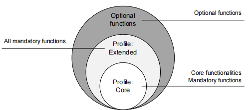
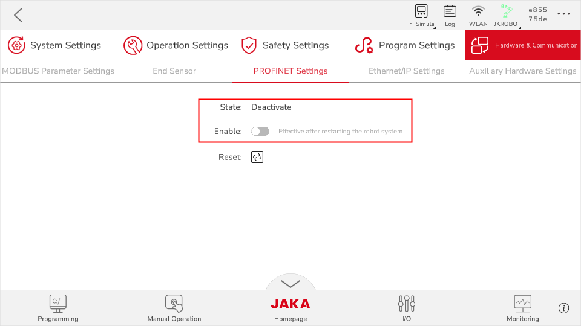
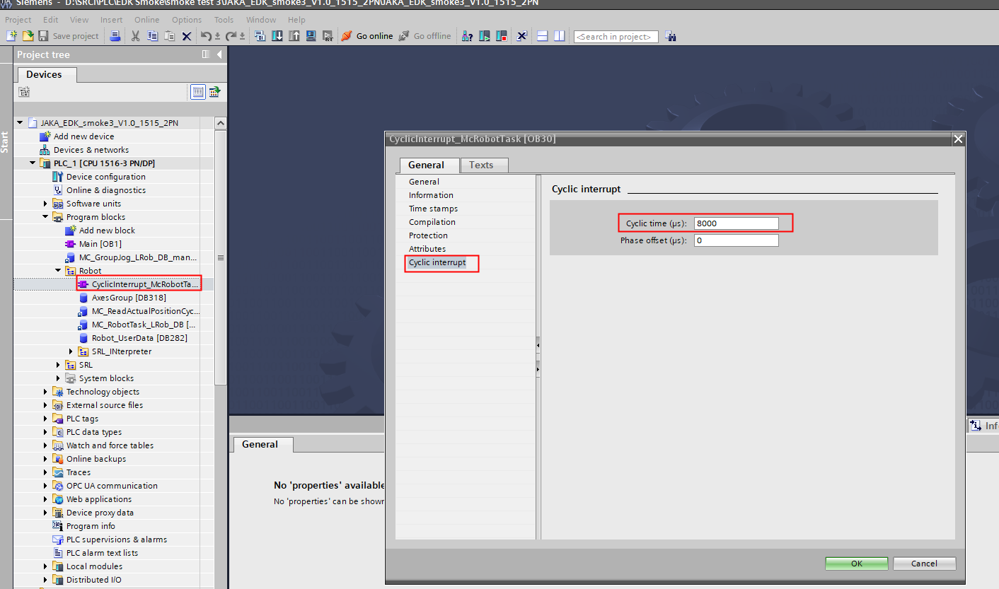

## **Abbreviation**

| Abbreviation | Description |
| ---- | ----|
| SRCI | Standard Robot Control Interface |
| JSI | JAKA SIMATIC Interface |
| SRL | SIMATIC Robot Library, a robot library in Siemens PLC that provides the function block of corresponding SRCI. |
| EDK | Easy Development Kit, a SRCI protocol parser provided by Siemens. |
| RI | Robot Interface, the status of which indicates if the SRCI communication has already been established. |
| RA | Robot Arm |
| RC | Robot Controller |
| TCP | Tool Center Point |
| TCS | Tool Coordinate System |
| UCS | User Coordinate System |
| WCS | World Coordinate System |
| WCP | Wrist Center Point |
| M/O | Mandatory/Optional |

## **Introduction**  

SRCI is the new standard interface using PLC to control robots. This interface allows users to directly program and control the robot in a PLC.

SRCI is made to standardize the use of data packets and PLC libraries, which enables users to freely switch between different robots without having to re-program.

Note:

> The supporting level of SRCI may be different based on different release version. Please read the following content carefully, and pay special attention to ***Risks*** part.

### Hardware and Software Check
- JAKA part
  - Robot Hardware: no limit（***switch on PROFINET***）
  - The PROFINET GSDML must be upgraded to ***GSDML-V2.41-JAKA-JAKARobot-20231017.xml***
  - Robot Controller: v1.7.1_25 and above (Controller vesion and SRCI Addon version must match)
  - App: v1.7.1_22 and above
  - AddOn: JSI (1.6.27) and above
- Siemens PLC part
  - PLC 1500 and above, for example: 1516-3 PN/DP
  - PLC must support PROFINET
  - PLC must install SRL library (must be authorized by Siemens)

| Controller version | AddOn version | 
| -------------      | ------------- | 
| 171.26rc           | 1.6.28 | 

### Functions Supported on Different Versions

SRCI defines 3 function groups, which contain the functions of all interfaces:
| Profile Core | Profile Extended | Profile Optional |
| ------------- | ----------------- | ---------------|
| Contains core functions of the interface Contains basic commands | Contains all mandatory commands that are not featured by Profile Core | Contains all optional functions |

> JAKA supports limited **Core**.

#### Limited Core

List below shows the functions supported by limited Core:
> The realization of Core requires the realization of some basic functions within Core. These basic functions can be regarded as the pre-steps of Core that won't be needed to be used by users, therefore they're not listed here.  
> Some functions are supported at different levels, and the illustrations of which will be listed separately. 

- `ChangeSpeedOverride`

- `EnableRobot`

- `GroupContinue`

- `GroupInterrupt`

- `GroupJog`

- `GroupReset`

- `GroupStop`

- `MoveAxesAbsolute`

- `MoveDirectAbsolute`

- `MoveLinearAbsolute`

- `ReadActualPosition`

- `ReadToolData`

- `ReadFrameData`

- `ReadLoadData`

- `ReadRobotDefaultDynamics`

- `ReadRobotReferenceDynamics`

- `ReadRobotSWLimits`

- `WriteToolData`

- `WriteFrameData`

- `WriteLoadData`

- `WriteRobotDefaultDynamics`

- `WriteRobotReferenceDynamics`

  

#### Limitations

Please read through these limitations before using JSI commands：

- For now, the OperationMode settings cannot be changed. JSI would be in OperationMode=4 (external automation) by default when run.
- When using PLC to control the robot, it would only report motion-related errors. When such error occurs, please refer to the Robot_UserData->SystemLog of the TIA software in PLC for detailed information. 
- ***Unsupported functions:***
  - ***SYNC. Information from the robot and PLC would not be automatically synchronized, thus the user need to synchronize them using a read/write function.***
  - ***ReturnToPrimary***
  - ***LogLevel***
  - ***StepMode in EnableRobot***
  - ***Part of UserData function: DelayTime, InterpreterCycleTime, Accelerating, ConstantVelocity, IsBlending***

#### Risks

Please read through these risks carefully before using JSI commands:

- When using MoveDirectAbsolute and MoveLinearAbsolute, please be careful with the ConfigMode settings in PLC. The mechanical constructions between industrial robot and cobot are different, therefore the definition of Shoulder, Elbow and Wrist may vary from the real situation. If you cannot be sure of the moving trajectory of robot after setting ConfigMode, please set as the following content before using:
  - `ConfigMode.Shoulder=1` ("*No change*")

  - `ConfigMode.Elbow=1` ("*No change*")

  - `ConfigMode.Wrist=1` ("*No change*")
- Please make sure the overall speed and command speed are in a safe and acceptable range before executing any commands.
- Using SRCI AddOn with the App simultaneously will violate the requirements of "single point control", which may lead to unexpected risks (such as unexpected robot movements or error information loss). Therefore, the SRCI AddOn and the App should not be used at the same time.
- The version of controller and SRCI AddOn must be strictly matched, otherwise there might be unexpected risks.

#### JAKA Safety IO
Work with JAKA safety IO functions to ensure operator safety. JAKA support following safety function（external safety IO）：
1. Additional emergency-stop
2. Additional protective-stop
3. Reduced mode（able to set robot TCP speed, power limit, etc. ）  

## Commands Descriptions 

> Note: 
>
> √: supported as SRCI required.  
> ×: not supported.  
> !: supported with conditions.

### ChangeSpeedOverride

- ChangeSpeedOverride may affect all move command except GroupJog and FreeDrive.
- Can be set during a movement.
- Automatically set to 5% of its speed after RI initialization. 

#### Inputs

| Parameter     | Data Type  | Unit  | M/O  | Note |
| :------- | -------- | ---- | ---- | :--- |
| Override | REAL     | [%]  | M    | √   |

### EnableRobot

- JAKA allows to Power On/Off and Enable/Disable the robot separately.
- Power On the robot before Enable; Disable the robot before Power Off.
- Enable the robot means the robot is ready to receive commands.

> Only support operationmode=4 (External Automation) 
>
> In normal conditions, the EnableRobot command takes only 5s to take effect.
>
> But in conditions like when the robot is in an emergency stop state, 5s might prolong to 20s. This is because Power On the robot is the prerequisite of Enable the robot. In normal conditions, Power On was completed by AddOn, so the user can directly Enable the robot to control. But in conditions of emergency stop, the AddOn still runs when the robot is powered off, so it won't re-power on the robot. That's why when the Enable command is send again, the robot would first power on itself (15s), then execute the Enable command (5s). 

#### Inputs

| Parameter       | Data Type  | Unit | M/O  | Note          |
| ---------- | -------- | ---- | ---- | -----------  |
| HoldToRun  | BOOL     | -    | M    | √            |
| StepMode   | USINT    | -    | M    | ! Only support0    |
| ManualStep | BOOL     | -    | O    | ×            |

#### Outputs

| Parameter    | Data Type  | Unit | M/O  | Note |
| -------       | -------- | ---- | ---- | ---- |
| Enabled       | BOOL     | -    | M    | √    |

### GroupContinue

This function can continue executing an "interrupted" move command.

### GroupInterrupt

This function interrupts all active commands and stops all joints. Yet the planned trajectory will remain, which could be resumed by GroupContinue.

JAKA supports jogging when GroupInterrupt, and ***sequence 2 may use automatically***.

GroupStop has higher priority than GroupInterrupt, which would end GroupInterrupt when called.

### GroupJog

GroupJog includes: JogFrame, JogTool and JogAxes. 

JAKA supports them all.

### GroupReset

- It deletes all messages read by ReadMessages, including errors and warnings. 
- The main scenarios:
  - controller error, like pstop (protective-stop)
  - the AddOn's SRCI malfunctions

### GroupStop

Clear the move commands for the current active sequence and empty the move command cache.

### MoveAxesAbsolute

This function commands a movement of the robot without a defined path. 

#### Inputs

| Parameter              | Data Type             | Unit | M/O  | Note                       |
| ----------------- | ------------------- | ---- | ---- | --------                  |
| JointPosition     | RobotJointPosition  | -    | M    | ！not support external axis             |
| VelocityRate      | REAL                | [%]  | M    | √                         |
| AccelerationRate  | REAL                | [%]  | M    | √                         |
| DecelerationRate  | REAL                | [%]  | O    | ×                         |
| JerkRate          | REAL                | [%]  | O    | ×                         |
| ToolNo            | USINT               | -    | M    | support 0-15, default 0: flange |
| AbortingMode      | USINT               | -    | M    | √                         |
| BlendingMode      | USINT               | -    | M    | ！refer to blending sectoin   |
| BlendingParameter | ARRAY[0..1] of REAL | -    | M    | √                         |

### MoveDirectAbsolute

This function calculates the fastest path to the target position (joint position) based on the provided Cartesian coordinates, with the target position calculated according to the ConfigMode's ConfigParameters.

#### Inputs

| Parameter             | Data Type                 | Unit | M/O  | Note                                    |
| ---------------- | ----------------------- | ---- | ---- | ---------------------------             |
| Position         | RobotCartesian Position | -    | M    | ！not support external axis                           |
| VelocityRate     | REAL                    | [%]  | M    | √                                       |
| AccelerationRate | REAL                    | [%]  | M    | √                                       |
| DecelerationRate | REAL                    | [%]  | O    | ×                                       |
| JerkRate         | REAL                    | -    | O    | ×                                       |
| ToolNo           | USINT                   | -    | M    | support 0-15, default 0: flange,  -1: current |
| FrameNo          | USINT                   | -    | M    | support 0-15, default 0: World, -1: current |
| AbortingMode     | USINT                   | -    | M    | √                                       |
| BlendingMode     | USINT                   | -    | M    | ！refer to blending sectoin                  |
| ConfigMode       | ConfigParameters        | -    | M    | ！refer to mechanical constraction sectoin                      |
| TurnMode         | USINT                   | -    | M    | ! Only support 2                                |

### MoveLinearAbsolute

This function commands an interpolated linear movement on the robot arm from the actual position of the TCP to an absolute cartesian position in the specified coordinate system.

#### Inputs

| Parameter             | Data Type                | Unit | M/O  | Note                          |
| ---------------- | ----------------------- | ---- | ---- | --------------------------- |
| Position         | RobotCartesian Position | -    | M    | ！not support external axis               |
| VelocityRate     | REAL                    | [%]  | M    | √                           |
| AccelerationRate | REAL                    | [%]  | M    | √                           |
| DecelerationRate | REAL                    | [%]  | O    | ×                           |
| JerkRate         | REAL                    | -    | O    | ×                           |
| ToolNo           | USINT                   | -    | M    | support 0-15, default 0: flange  |
| FrameNo          | USINT                   | -    | M    | support 0-15, default 0: world  |
| AbortingMode     | USINT                   | -    | M    | √                           |
| BlendingMode     | USINT                   | -    | M    | ！                          |
| ConfigMode       | ConfigParameters        | -    | M    | ！refer to mechanical constraction sectoin         |
| TurnMode         | USINT                   | -    | M    | ！ Only support 2                  |

### ReadActualPosition

This function reads the current position of the TCP relative to the currently used coordinate system.

#### Inputs

| Parameter           | Data Type  | Unit | M/O  | Note                     |
| -------------- | -------- | ---- | ---- | ----                    |
| ToolNo         | INT      | -    | M    | ！ support 0-15, -1: current |
| FrameNo        | INT      | -    | M    | ！ support 0-15, -1: current |

#### Outputs

| Parameter                | Data Type      | Unit | M/O  | Note  |
| ------------------ | ------------- | ---- | ---- | ---- |
| Position           | RobotPosition | -    | M    | √    |

### ReadFrameData

The function reads the user-defined coordinate system settings based on the FrameNumber.

#### Inputs

| Parameter           | Data Type  | Unit  | M/O  | Note                      |
| -------------- | -------- | ---- | ---- | ----                      |
| FrameNo        | INT      | -    | M    | ! support 0-15, -1: current |

### ReadLoadData

The function reads the payload data based on LoadNo.

#### Inputs

| Parameter   | Data Type  | Unit  | M/O  | Note                      |
| ------      | -------- | ---- | ---- | ----                       |
| LoadNo      | INT      | -    | M    |  ! support 1-15, -1: current  |

#### Outputs

| Parameter         | Data Type  | Unit | M/O   | Note                    |
| ------------      | -------- | ---- | ---- | ----------------------- |
| LoadData          | LoadData | -    | M    | ! support X, Y, Z and Mass |

### ReadRobotDefaultDynamics

The function reads the default values of the robot dynamics. 

#### Outputs

Return to DefaultDynamics, the structure is as follows:

| Parameter              | Data Type | Unit | M/O   | Note        |
| ---------------- | -------- | ---- | ---- | ----        |
| VelocityRate     | REAL     | [%]  | M    | √           |
| AccelerationRate | REAL     | [%]  | M    | √           |
| DecelerationRate | REAL     | [%]  | O    | ×, return -1   |
| JerkRate         | REAL     | [%]  | O    | ×, return -1   |

### ReadRobotReferenceDynamics

The function reads the references values of the robot dynamics.

#### Outputs

Return to DefaultDynamics, the structure is as follows:

| Parameter                   | Data Type | Unit     | M/O  | Note |
| --------------------- | -------- | ------- | ---- | ---- |
| VelocityReference     | REAL     | [mm/s]  | M    | √    |
| AccelerationReference | REAL     | [mm/s2] | M    | √    |
| DecelerationReference | REAL     | [mm/s2] | O    | ×    |
| JerkReference         | REAL     | [mm/s3] | O    | ×    |

### ReadRobotSWLimits

The function reads the positive and negative soft limits of the robot.

#### Outputs

Return to DefaultDynamics, the structure is as follows:

| Parameter                                                     | Data Type | Unit    | M/O  | Note  |
| ---------------------                                          | ------- | ------- | ---- | ---- |
| J1LowerLimit, J1UpperLimit ~ J6LowerLimit, J6UpperLimit  | REAL    | [mm/s]  | M    | √    |
| E1LowerLimit, E1UpperLimit ~ E6LowerLimit, E6UpperLimit  | REAL    | [mm/s]  | M    | ×    |

### ReadToolData

The function reads the configuration of the tool coordinate system based on ToolNumber.

#### Inputs

| Parameter      | Data Type   | Unit  | M/O  | Note                    |
| -------------- | --------   | ---- | ---- | ----------------------- |
| ToolNo         | USINT      | -    | M    | ! Only support 1~15          |

#### Outputs

| Parameter         | Data Type  | Unit | M/O   | Note                    |
| ------------ | -------- | ---- | ---- | ----------------------- |
| ToolData     | ToolData | -    | M    | √                       |

### WriteFrameData

This function writes the data of the user coordinate system based on FrameNo.

#### Inputs

| Parameter            | Data Type     | Unit | M/O  | Note                    |
| --------------  | --------    | ---- | ---- | -----------------------|
| FrameNo         | USINT       | -    | M    | ！Only support 1~15           |
| FrameData       |  FrameData  | -    | M    | √                       |

>referenceFrame should not be an user coordinate system which has already used referenceFrame (not 0). 

### WriteLoadData

This function writes the payload data based on LoadNo.

#### Inputs

| Parameter            | Data Type | Unit  | M/O  | Note                       |
| -------------- | -------- | ---- | ---- | -----------------------    |
| LoadNo         | USINT    | -    | M    | ! Only support 1~15               |
| LoadData       | LoadData | -    | M    | ! Only support X, Y, Z and Mass |

### WriteRobotDefaultDynamics

The function writes default values of the robot dynamics.

#### Inputs

| Parameter              | Data Type | Unit  | M/O  | Note |
| ---------------- | -------- | ---- | ---- | ---- |
| VelocityRate     | REAL     | [%]  | M    | √    |
| AccelerationRate | REAL     | [%]  | M    | √    |
| DecelerationRate | REAL     | [%]  | O    | ×    |
| JerkRate         | REAL     | [%]  | O    | ×    |

### WriteRobotReferenceDynamics

The function writes reference values of the robot dynamics. 

| Parameter              | Data Type | Unit | M/O   | Note |
| ---------------- | -------- | ---- | ---- | ---- |
| VelocityRate     | REAL     | [%]  | M    | √    |
| AccelerationRate | REAL     | [%]  | M    | √    |
| DecelerationRate | REAL     | [%]  | O    | ×    |
| JerkRate         | REAL     | [%]  | O    | ×    |

### WriteToolData

This function writes the data of the user coordinate system based on ToolNo.

#### Inputs

| Parameter      | Data Type   | Unit  | M/O  | Note                    |
| -------------- | --------   | ---- | ---- | ----------------------- |
| ToolNo         | USINT      | -    | M    | ! Only support 1~15          |
| ToolData       |  ToolData  | -    | M    | √                       |

## Implementation #
### Authorization
1. Contact Siemens local sales team for SRL license, demo, manual, etc. 
2. Contact JAKA local sales team for SRCI AddOn, demo, manual and GSDML, etc. 

### Prepare AddOn
1. Turn on the Controller PROFINET；  

1. For more AddOn information, please refer to (https://jakacobot.github.io/guide/addOn/1.1-AboutAddOn.html).
2. Install Addon Tool-Kit.
3. Install SRCI AddOn, and enable it (wait a moment to let the controller power on automatically).

### Prepare PLC
1. Initialize SD card (when download programs from the Siemens PLC to new SD card, users need to reset the SD card's memory first. Otherwise the password might be needed). 
2. Import JAKA GSDML file.
3. Configure PROFINET.  

4. Set PROFINET time (8ms).  

5. Set interrupt-loop time (8ms).  

6. When configuring SRCI data, it is essential to ensure the alignment of the data's starting address with the starting address provided by RobTask. Failure to do so may result in initialization issues.  
 

### Troubleshooting
General debug steps:
1. Check if controller version and SRCI Addon match or not.
2. Check if AddOn is running or not.
3. Check the PROFINET status（PLC must use the right JAKA GSDML）
4. Check if the PLC PROFINET data is configured right or not.
5. If the above steps still don't work, please contact JAKA technical support team（send an email to SRCI.Support@jaka.com, attaching Addon exported files）.

Follow the steps below to troubleshoot when JSI communication fails:
1. Make sure the PROFINET between JAKA and PLC is connected and functioning.
2. Make sure the PLC configuration is correct.
3. If the communication often disconnects, please check whether the switch meets the PROFINET requirement. Or directly connect the PLC with the controller.
4. If PROFINET is in normal connection, then the issue might be of the JSI.
5. If HMI simulation is needed, please set "PG/PC Interface" (contact Siemens for detailed information).

Debug steps when robot not move：
1. Check overridespeed
2. Check velocity setting of defaultDynamic and referenceDynamic
3. Check velocity parameter of command
4. Check if controller already in interrupted status

## Appendix #

### JAKA Robot Arm SEW Description

| Parameter      | Data Type | Unit  | M/O                        | Note                               |
| -------- | -------- | ---- | -------------------------- | ---------------------------------- |
| Shoulder | USINT    | -    | M (support default 0)   | support 0-use config and 1-no change   |
| Elbow    | USINT    | -    | M                          | same as above                               |
| Wrist    | USINT    | -    | M                          | same as above                               |

The configuration of collaborative robots generally differs from industrial robots, especially in that the 4-5-6 axes do not intersect at a single point. In other words, there is no traditional Wrist Center Point (WCP) as found in industrial robots. Typically, the intersection points of the 4-5 or 5-6 axes are used instead.

- shoulder  

- elbow  

- wrist  
w = sin (axis5)

### JAKA Blending:
Blending diagram： 

Supported situation for now：
- joint to joint
- joint to linear
- linear to linear
- linear to joint

To enable blending, make sure to set the parameters in usersetting.ini as below (No modifications are needed by default.): 
- MOVEJ_MOVEL_BLEND = 1
- MOVEJ_MOVEJ_BLEND = 1

When parameter is too large, the actual blending would happen according to the Mode11 (RampOverlap) in SRCI manual to blend at 100% overlap: 

