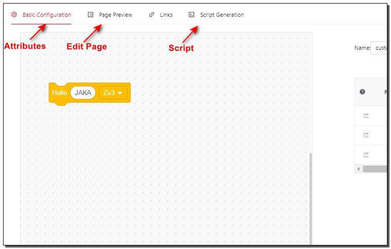

# About AddOn

**This page aims to explain the basic concepts for AddOn developers.**

::: warning Please note:
1. The AddOn mentioned in this tutorial refers to AddOn 3.0 by default.
2. AddOn 3.0 development and usage are supported on JAKA controllers > 1.7.1.x _X64 version.
3. AddOn 1.0 and 2.0 are no longer maintained and provided with development support.
:::

::: tip Tip:
This document is intended for readers who have received basic robotics training, have some basic development skills, and are familiar with JAKA's script language `JKS`.

In addition, experience with programming languages such as node-red, JavaScript, HTML5, CSS3, etc. will be helpful for users to develop and use AddOn.
:::

## What is AddOn
---
JAKA AddOn, as its name, is an add-on software provided by JAKA. It supports users in developing custom command add-on, custom service add-on, custom interface add-on, and composite add-on that includes the above types.

By using AddOn, users can significantly extend the functionality of the robot operating system or customize the existing functionalities according to their preferences.
::: tip For distinction, two terms are defined here:
* JAKA AddOn Kit: The kit package required during the development environment setup, namely jaka_addon_kit.tar.gz.
* JAKA AddOnXXX Package: A developed package with specific functionality, such as JAKA AddOn Palletizing Package, JAKA AddOn DH Gripper Package, JAKA AddOn Visual Guidance Package, JAKA AddOn Force Control Package, and so on.
<!-- Process package, third-party device adaptation package -->
:::

## Why Use AddOn
---
In typical scenarios, when a new third-party tool is connected at the end of the robot, or when performing specific processes (such as palletizing, welding, etc.) in specific usage scenarios, new commands need to be set in the programming interface.

These commands often contain complex, lengthy codes and parameters that are difficult to understand and reuse, adding extra burden to simple actions or programs. For engineers who are proficient in specific crafting processes but not well-versed in robot programming, setting commands is a challenge.

Using AddOn can de-code and greatly simplify the process of setting instructions. It omits the complex settings in the programming step and encapsulates them into a simple, clear, and easy-to-understand instruction, which is easier to operate and more conducive to re-use the programmed instructions, thus fully enhancing efficiency and productivity.

 <label>Third-party equipment control</label> 

On the other hand, the Process Package AddOn enables users to focus on the execution of specific processes rather than how the instructions are used, which has largely reduced the learning cost and difficulty of use for users.

 <label>process kit</label> 

In summary, using AddOn make it easier and more effective to collaborate with robots.

## Basic Functions of AddOn
---
As mentioned earlier, AddOn has three basic functions: developing custom command add-ons, custom service add-ons, and custom webpage add-ons.

The implementation of these functions empowers the existing systems, allowing users to customize new functions as needed or make changes and upgrades to the existing ones.

JAKA's application development team can develop official JAKA application packages, process packages, and process kits through the AddOn framework for users to download and use. The team can also assist JAKA customers in developing custom functions, services, and webpages to meet their customization needs.

JAKA partners can develop ecosystem-standard add-ons through the AddOn framework to enhance product compatibility and usability.

JAKA robot end users can develop custom commands through the AddOn framework to encapsulate and reuse commonly used commands.

## AddOn Operation Mechanism
---

* AddOn Custom Services

AddOn custom services are developed on the  node-red platform and will be run in the controller. When an AddOn is started, the controller starts the node-red process for that AddOn. The custom service can be used as an intermediate layer to provide services for custom commands and custom webpages. The relevant nodes provided in node-red can be used to query robot information, set robot parameters, and control robot motion.

* AddOn Custom Commands

A custom command block consists of three parts, attributes, edit page and script, all of which are defined in the AddOn development tool (node-red).

When the App starts, it looks for the data for the custom command block from the AddOn package. If found, the custom command block will be added into the Program-Extensions bar.

After the custom command block is inserted into the application and when the user clicks Save or Run, the App would make a request to the AddOn service, while the parameters on the command block would be send with it. The AddOn service receives the request, splices the parameters into the script of the custom command, and returns it to the App. Finally, the App inserts the script it receives.

* AddOn Custom Webpages

Custom webpages are usually deployed in a JAKA controller and are proxied through Nginx. It is also possible to deploy them on personal computers or other devices.

Custom webpages can be used not only to access AddOn custom services or services from other devices, but also to interact with the JAKA App by using JavaScript methods injected into the web page by the JAKA App.

## AddOn File Composition
---
The completed AddOnXXX package may contain various files, and below are the most common ones:

**Data File**    
An AddOn package generally contains a `flows.json` file that includes the definition of flows and nodes in node-red. The name of this file can be customized but needs to be pointed to in the configuration.

**Configuration File**    
Any type of add-on must include an `xxx_config.ini` file, i.e., [AddOn Configuration File:point_left:](./7.1-IniConfig). Only packages containing the AddOn configuration file can be installed, initialized, and run.

**Frontend Project**   
Under the AddOn directory containing custom pages, there is usually a folder for the frontend project, such as client or dist. It is recommended to use "client" as the frontend project folder.

<!-- ## Terminology Explanation -->

<!-- todo: Where should the explanation of 'hbs' terminology be placed here? -->

## Feedback
---

We appreciate your feedback!

If you find any wrong or unclear descriptions in the document, please feel free to submit [Issues](https://github.com/JakaCobot/JakaCobot.github.io/issues) in our document repository.
<!-- Provide links to the repository for the addon kit and this document -->