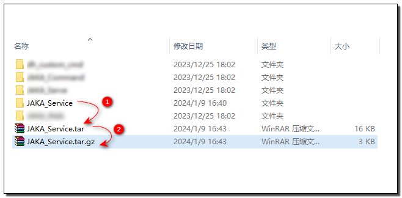
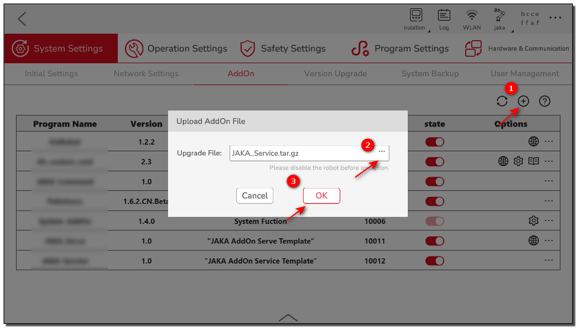
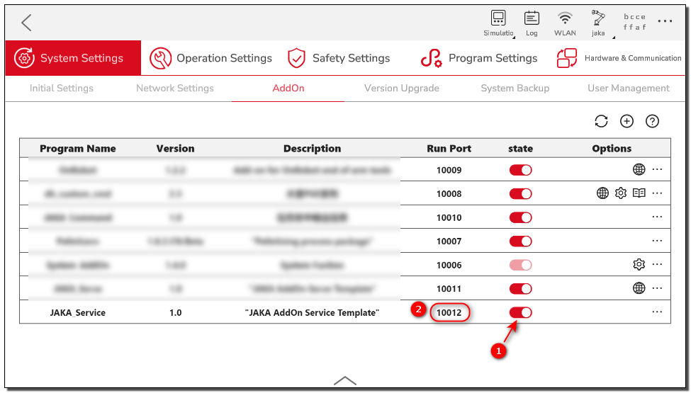
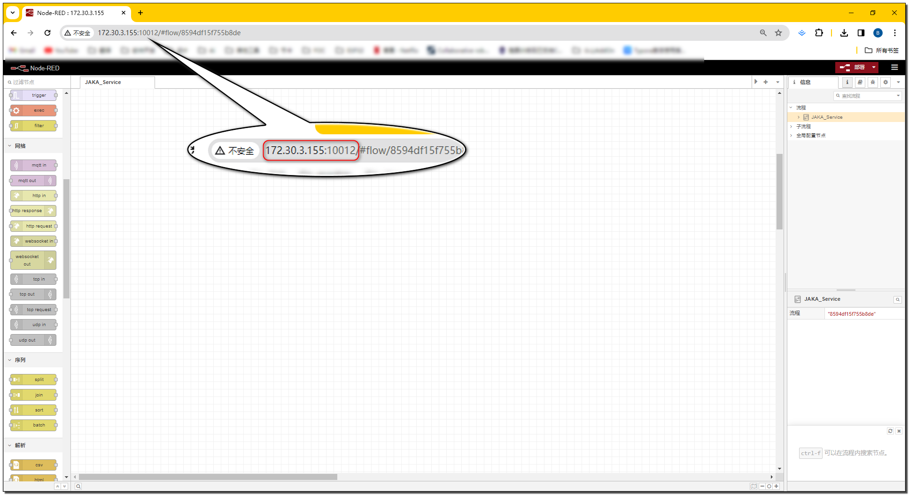

# Custom Service Development

**This page is designed to guide developers on how to develop AddOn packages with custom service functionality.**

::: tip Please note:

This chapter is an introductory tutorial with the main purpose of providing developers with a basic understanding of custom services and the fundamental development process.

If you want to learn how to develop AddOn packages with specific application features tailored to specific process scenarios, please refer to the subsequent complete case study chapters.

:::

## About Custom Services

### What is a Custom Service
A custom service is a service that performs tasks in the background, and users do not directly perceive its existence.

### Purpose of Custom Services
Custom services are responsible for handling the backend data processing and business logic that is unrelated to user interaction. When combined with Http nodes, they can interact with the frontend interface, providing services such as receiving, processing, storing, calculating, and analyzing data for custom commands, custom web pages, or other clients.

## Create AddOn Custom Service Package
In this demonstration, we will create an AddOn of the custom service type. The functionality of this AddOn is to provide a service to query the robot's power status.
::: tip Note:
The JAKA_Service mentioned below is the package name of the AddOn custom command package we are about to create.
:::

### Step One: Create AddOn Folder
First, we need to create a basic AddOn folder, which should contain a configuration file in `.ini` format and a Json file to store data.

You can create it manually from scratch or modify the AddOn template in the AddOn development kit repository under the ["*Template*"](https://github.com/JakaCobot/jaka_addon_kit) directory.

::: tip Directory Structure
|——JAKA_Service  
&emsp;&emsp;&emsp;|——AddOn.json   
&emsp;&emsp;&emsp;|——JAKA_Service_config.ini  
:::

* **AddOn.json**   
The Json file can be empty; data will be generated and written in later steps.
* **JAKA_Service_config.ini**  
 The configuration file has the following content:
    ``` ini
    [AddOnInfo]
    convention = 3.0
    name = JAKA_Service
    description = "JAKA AddOn Service Demo"
    version = 1.0
    type = 1
    portal = 10006
    url = http://localhost/myAddOnUi
    languagetype = node-red
    service = AddOn.json
    serviceenabled = 1
    ```
::: tip
For detailed explanations of configuration options, refer to: [Configuration File Explanation **[Click to Jump]** :point_left:](./7.1-IniConfig.html)
:::

### Step Two: Package & Upload
Next, we will package the folder created in step one and upload it to the controller for command block development. The packaging format should be `.tar.gz`.

In Windows, you can use tools like 7z for secondary compression.
<div align="center"></div>

Attach the AddOn in the App Manager page to upload the AddOn.

<div align="center"></div>

::: tip Summary
At this point, we have completed the initialization of the AddOn package, packaged it in the standard AddOn format, and uploaded it to the controller.
Next, we can proceed to develop the specific functionality of the AddOn.
:::

### Step Three: Develop Custom Service
1. Run the AddOn and check the port number on which the AddOn is running.

<div align="center"></div>

2. Open a browser and enter the robot's IP + port number (`IP:Portal`) to access the developer interface.

<div align="center"></div>

::: tip Summary
After the AddOn runs, the controller starts a node-red instance based on the `AddOn.json` file in the AddOn package.
We can access this node-red instance by entering the robot's IP and the current running port number of the AddOn.
:::

::: warning Please Note:
The running port of the AddOn is not fixed and can change dynamically based on the system's allocation. Therefore, every time you need to use the AddOn port number, you should check the current port number. If you need to use this port number in your code, it's best practice to retrieve it from the AddOn's configuration file, `xxx_config.ini`.
:::

3. In the left node bar under the JAKA AddOn directory, find the `Get Robot Information` node, double-click to open the edit page, set the name to "Power Status," and select "Robot Status" -> "Power Status" sequentially.

<div align="center">
<video width="1000" controls autoplay >
<source src="./img/4.2-JAKA_Service/配置获取信息节点.mp4" type="video/mp4">
</video>
</div>

::: tip 
The usage instructions for the `Get Robot Information` node can be found in the node help documentation of node-red.
:::

4. Add the `http in` node to listen for GET requests.

<div align="center">
<video width="1000" controls autoplay >
<source src="./img/4.2-JAKA_Service/添加Http监听.mp4" type="video/mp4">
</video>
</div>
   
::: tip Summary
After connecting with the `http in` node and defining the URL, we can make requests to our service through `Robot_IP:AddOn_Port/Your_URL`. However, we won't receive a response yet, so the next step is to create a response message object and return it to the request.
:::

5. Generate a response message and use the `http response` node to respond to the request.

<div align="center">
<video width="1000" controls autoplay >
<source src="./img/4.2-JAKA_Service/添加Http响应.mp4" type="video/mp4">
</video>
</div>

::: tip Note
- Initially, we are unsure of the type and data structure of the query result. You can use the `inject` node to manually trigger a query and use the `debug` node to observe the return value.
- The response can only be a string (String) or object (Object) type, so boolean values (Boolean) need to be placed inside an object before returning.
:::

## Testing

Here, we will use an API interface testing tool to test the service we just created.

<div align="center">
<video width="1000" controls autoplay >
<source src="./img/4.2-JAKA_Service/测试.mp4" type="video/mp4">
</video>
</div>

::: tip Congratulations
:tada: Now we can query the power status of the robot through our custom service!
:::