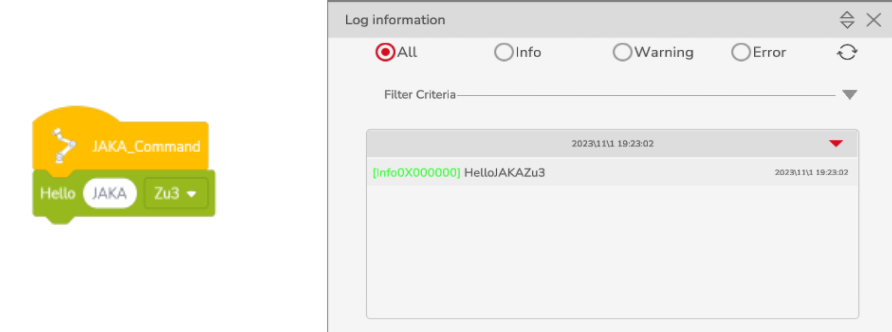
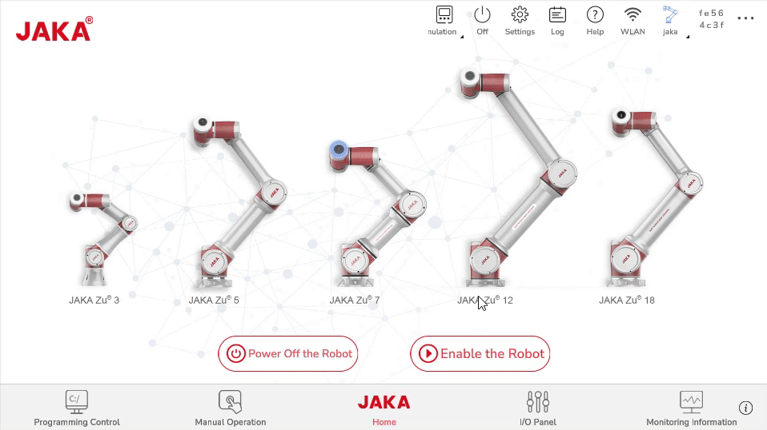

# Custom Command Basics
**Learn about the development process and fundamentals of custom command-type AddOns by creating JAKA_Command.**

## Overview
&emsp;&emsp;We will create a custom command-type AddOn that outputs different content in the App log based on the content on the command block.

<div align="center"></div>

## Creating JAKA_Command
### Step 1: Create an AddOn Package  
&emsp;&emsp;First, we need to create the basic AddOn files, including a .ini configuration file and a JSON file for data storage. You can create them manually from scratch or modify the AddOn template in the ["*Template*"](https://github.com/JakaCobot/jaka_addon_kit) directory in the AddOn development package repository. 
::: tip Directory Structure
|——JAKA_Command  
&emsp;&emsp;&emsp;|——AddOn.json   
&emsp;&emsp;&emsp;|——JAKA_Command_config.ini  
:::

* **AddOn.json**   
&emsp;&emsp;The JSON file can be empty; data will be generated in the following steps.
* **JAKA_Command_config.ini**   
&emsp;&emsp;The [configuration file](/en/guide/addOn/iniConfig.html) should contain the following:
    ``` ini
    [AddOnInfo]
    convention = 3.0
    name = JAKA_Command
    description = "Output information in the log"
    version = 1.0
    type = 1
    portal = 10006
    url = http://localhost/myAddOnUi
    languagetype = node-red
    service = AddOn.json
    serviceenabled = 1
    ```

### Step 2: Packaging & Uploading
&emsp;&emsp;Next, we will package the AddOn and upload it to the controller for command block development. The packaging format should be `.tar.gz`. On Windows, you can use tools like 7z for secondary compression.    
<div align="center"></div>
&emsp;&emsp;In the App, go to the Attached Manager page to upload the AddOn.    
<div align="center"></div>

### Step 3: Develop Custom Commands

1. **Run the AddOn and Check the Port**
   <div align="center"></div>

2. **Access the Developer Interface**
   Use `IP:Port` to access the developer interface.
   <div align="center"></div>

3. **Deploy the Customized Commands Node**
   In the left toolbar, find the `Customized Commands` node, drag it into the canvas, and click deploy.

4. **Open the Command Block Generation Tool**
   Double-click the `Customized Commands` node to open the command block generation tool page.
    <div align="center">
    <video width="1000" controls autoplay >
    <source src="../../../../resource/ch/AddOn/JAKA_Command/open_coustomer_node.mp4" type="video/mp4">
    </video>
    </div>
5. **Rename and Color the Command Block**
   Rename the command block to *hello_jaka* and set its color to green.

6. **Use Default Attributes**
   The *Basic Configuration* page defines the style and attributes of the command block. Use the default attributes without making any changes.

7. **Use Default Script**
   Define the behavior of the command block on the *Script Generation* page. Use the default script without making any changes.
   <div align="center"></div>

   - For JAKA script syntax, please refer to [JAKA Programming Script](/guide/jks.html).
   - For a more detailed usage of the `Customized Commands` node, please refer to [Custom Command Creation Node](/guide/addOn/Commands_Tool.html).

8. **Complete the HTTP Process**
   When saving custom commands in the App, the script is obtained through an HTTP GET request. Therefore, use the `http in` and `http response` nodes to complete the process.


<div align="center"></div>

:::tip Note!
The URL of the `http in` node should match the name of the custom command block!
:::

### Step 4: Running
&emsp;&emsp;After deploying the flow in Node-RED, you can use the custom command block in the App.

<div align="center"></div>


## How to Debug?

