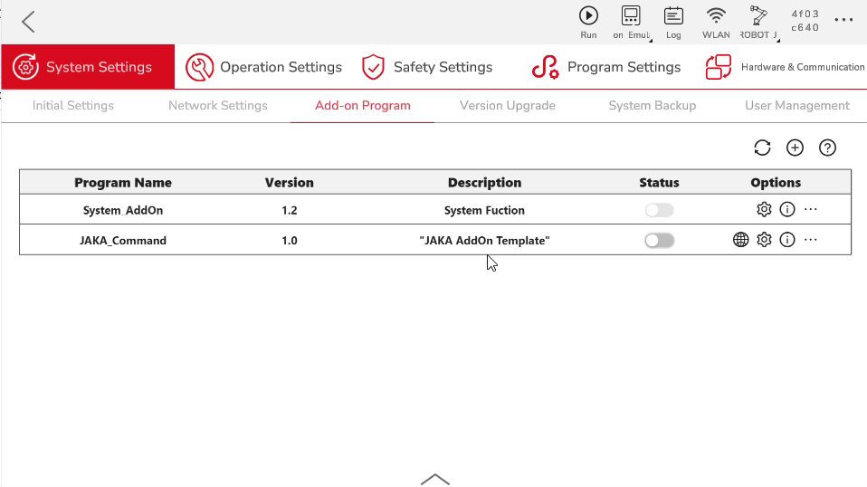
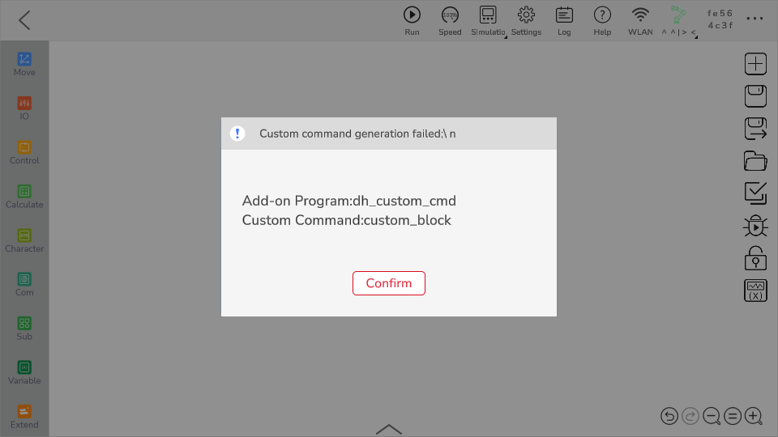
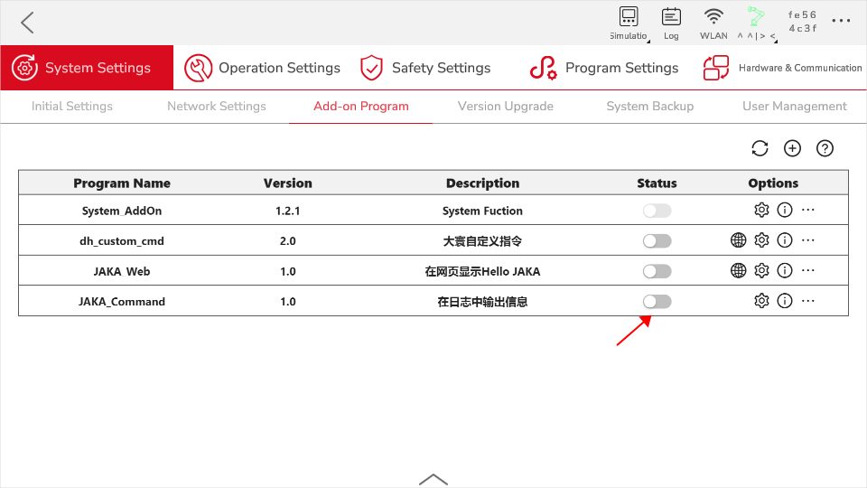
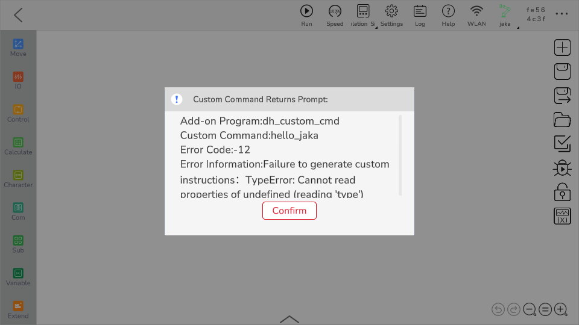

# Custom Command Development
**This page aims to guide developers on how to develop AddOn packages with custom command functionality.**

::: tip Please Note:
This chapter serves as an introductory tutorial, primarily to familiarize developers with the basic knowledge and development process of custom commands.

For information on how to develop AddOn packages with specific application functionality for specific industrial scenarios, please refer to the subsequent comprehensive case study chapters.
:::


## About Custom Commands
### What are Custom Commands

Custom commands refer to instructions developed by developers, other than the standard program instructions within the JAKA App, according to their own needs and in compliance with JAKA script rules.

### Purpose of Custom Commands

As mentioned in the introduction, when a robot's end effector is connected to a new third-party tool, or when it is used to operate specific processes in a specific work scenario, it often requires writing complex instructions and setting numerous parameters in the JAKA App programming interface. This step is complex and not easily reusable, so it is necessary to encapsulate these complex, diverse instructions and parameters into a single, straightforward, easy-to-use instruction block to save time and improve operational efficiency.


## Creating an AddOn Custom Command Package
In this demonstration, we will create an AddOn of custom command type. The function of this AddOn is to display the input and selected content from the instruction block in the App log.
<!-- todo:hbs Replace with a more descriptive image -->
<div align="center"></div>

::: tip Note:
In the following text, "JAKA_Command" refers to the package name of the AddOn custom command we are about to create.
:::

### Step One: Create AddOn Folder
First, we need to create a basic AddOn folder, which should contain a .ini format configuration file and a json file for data storage.

You can start from scratch manually, or you can modify the AddOn template under the ["*Template*"](https://github.com/JakaCobot/jaka_addon_kit) directory in the AddOn development package repository.

::: tip Directory Structure
|——JAKA_Command  
&emsp;&emsp;&emsp;|——AddOn.json   
&emsp;&emsp;&emsp;|——JAKA_Command_config.ini  
:::

* **AddOn.json**   
The json file can be empty. Data will be generated and written in the subsequent steps.
* **JAKA_Command_config.ini**  
 <!--  -->
The content of the [configuration file :point_left:](./iniConfig.html) is as follows:
    ``` ini
    [AddOnInfo]
    convention = 3.0
    name = JAKA_Command
    description = "Output information in the log"
    version = 1.0
    type = 1
    portal = 10006
    url = http://localhost/myAddOnUi
    languagetype = node-red
    service = AddOn.json
    serviceenabled = 1
    ```

### Step Two: Package & Upload
Next, we will package the folder created in Step One and upload it to the controller for command block development. The required format for packaging is `.tar.gz`.

In Windows, you can use tools like 7z for secondary compression.    
<div align="center"></div>

In the App, use the attached management page to upload the AddOn.

<div align="center"></div>

### Step Three: Develop Custom Commands

1. Run the AddOn and check the port number it is running on.

<div align="center"></div>

2. Open a browser and enter the robot's IP address and port number in the address bar, `IP:Portal`, to access the developer interface.

<div align="center"></div>

3. In the left toolbar, find the `Customized Commands` node, drag it onto the canvas, and click "Deploy".

Double-click the `Customized Commands` node to open the command block generation tool page.

<div align="center">
<video width="1000" controls autoplay >
<source src="../../../../resource/en/AddOn/JAKA_Command/open_coustomer_node.mp4" type="video/mp4">
</video>
</div>

5. In the *Basic Configuration* page, define the style and attributes of the instruction block. In this case, use the attributes provided by the example page without making any changes.
6. Change the instruction block name to *hello_jaka* and set the color to green.
7. In the *Script Generation* page, define the behavior of the instruction block. In this case, use the script provided by the example page without making any changes.

  
    <div align="center"></div>

    - The script language used here is JAKA programming script. For specific syntax, please refer to [JAKA Programming Script :point_left:](/guide/jks.html).
    <!-- - For more detailed usage of the `Customized Commands` node, please refer to [Creating Custom Commands Node](/guide/addOn/Commands_Tool.html) -->
 
8. When saving custom commands in the App, a script will be obtained via an HTTP get request. Therefore, you need to use the `http in` and `http response` nodes to complete the flow.

<div align="center"></div>

::: warning Please Note:
The URL of the `http in` node must be consistent with the name of the custom instruction block.
:::

### Step Four: Run
After deploying the flow in node-red, click the refresh button on the attached programs page. You will find the newly created instruction block in the extended instructions of the programming page in the App.

<div align="center"></div>


## Debugging
During the development process, you may encounter the following issues. Please refer to the following text for specific situations and corresponding debugging methods.

**Custom Command Generation Failed**  
When using a custom instruction block in the App programming page, clicking save may result in an error message "Custom command generation failed". This may be caused by the following reasons.

<div align="center"></div>


1. AddOn is not running  
   Solution: Find the AddOn in the attached programs page and click the run button to start the AddOn.
<div align="center"></div>

1. The URL in the `http in` node

 in node-red does not match the name of the instruction block  
   Solution: Ensure that the URL matches the name of the instruction block.
<div align="center"></div>

**Internal Server Error**  
When encountering an internal server error, it is generally due to a timeout in receiving the HTTP request in the App.

<div align="center"></div>

Solution: Check if the `http in` node in node-red is correctly connected to the `http response` node. After connecting, restart the AddOn on the App side.

::: warning
- Currently, even after reconnecting, you still need to restart the AddOn service to save the program normally. This is caused by some unknown bugs internally and will be fixed in future versions.   
- The description in the error message that instructs to restart the controller is incorrect. Restarting the AddOn is sufficient.
:::

**Attribute Matching Failed**  
<div align="center"></div>

Solution: Check if the attribute names used in the custom command in node-red match those used in the script definition.

<div align="center"></div>

**How to Check if Communication Parameters are Correct?**  
- Use the debug node in node-red for debugging. It can debug the parameters sent by the instruction block when saving and the returned JKS to see if they are correct.

<div align="center"></div>

When saving or running the program, the App initiates a GET request.

<div align="center"></div>
  
At this point, debug1 can capture the parameters passed in the request. The keys of this object are the names of the attributes on the instruction block, and the values are the specific content of the attributes, including the attribute value and type.

Using the content received as an example, "Select1" is the name of the dropdown box attribute defined, "value" is the attribute value, and 0 indicates that the first option in the dropdown box is selected at this time. "type" is the type of parameter entered in the instruction block, which is only meaningful for input box type attributes. 0 indicates that the value entered in the input box is manually entered, and 1 indicates that the input box contains content of variable type (data types of instruction blocks such as system variables, calculation results, etc.).

<div align="center"></div>


The information printed in debug2 includes the object of the JKS script generated this time.

Among them, `error_code` is the error code for generating the JKS. 0 means normal generation, and -12 means internal error. When this error code is not equal to 0, the App will pop up an error message with the corresponding error code and error information. Here, we only need to pay attention to the "jks" attribute, which is the actual generated JKS script.

<div align="center"></div>


**Simulate Script Generation**

- On the script generation page, after entering parameters in the left instruction block, click "Generate JKS Script" to simulate the generation of a script. View the simulated generated code in the code window below.

<div align="center"></div>

::: tip Please Note:
Clicking the "Generate JKS Script" button only displays the simulated generated script in the code window below, and has no other practical effect.
:::