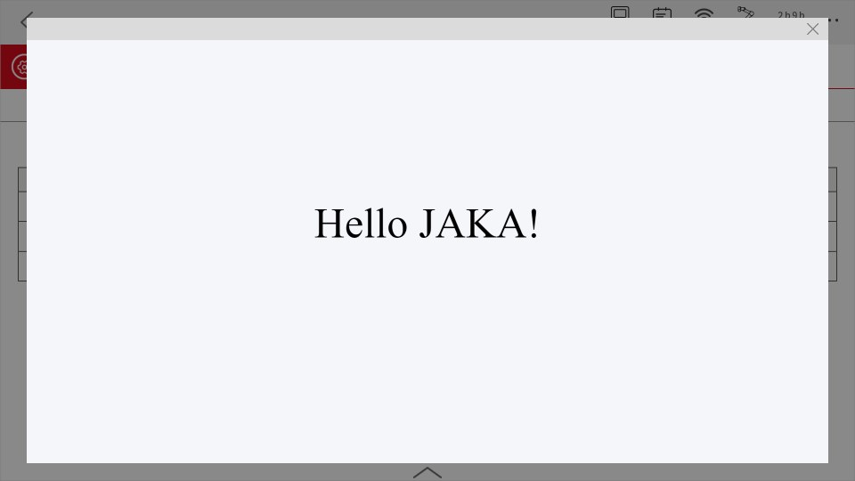
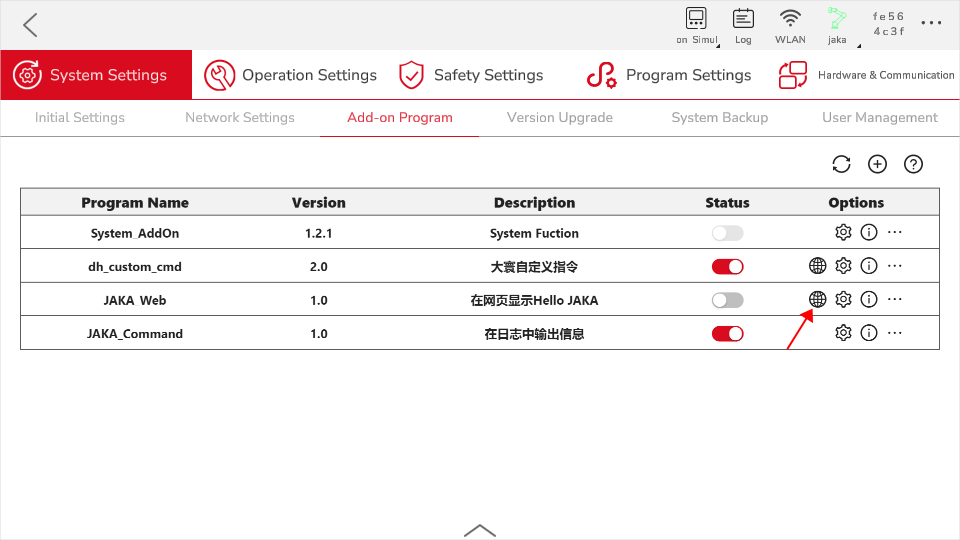
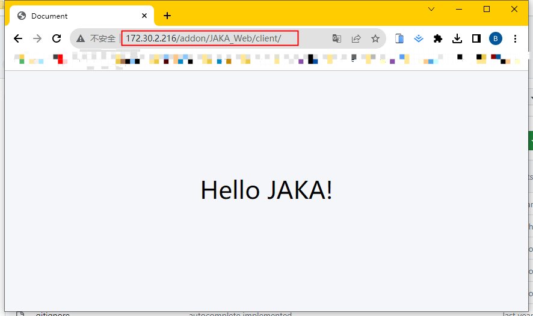

# Custom Page Development
**This page aims to guide developers on how to develop AddOn packages with custom page functionality.**

::: tip Please Note:
This chapter serves as an introductory tutorial, primarily intended to familiarize developers with the basics of custom page development and the fundamental development process.

If you need to learn how to develop AddOn custom page packages with specific application features for specific process scenarios, please refer to the subsequent complete example chapters.
:::

## About Custom Pages
### What Are Custom Pages
Custom pages refer to pages developed by developers according to their own needs, in compliance with web development standards, excluding the existing pages within the JAKA App.

### Purpose of Custom Pages

In practical application scenarios, it may be necessary to switch back and forth between different Apps, or between different pages within the JAKA App, or to stop working on a process in progress to debug third-party devices. In such cases, it may have an impact on work rhythm and efficiency.

By using AddOn custom pages, the "back and forth switching" issue can be solved directly within the JAKA App.

## Creating JAKA_Web
In this demonstration, we will create an AddOn of custom page type. The functionality of this AddOn is to display "Hello JAKA!" on the page.

<div align="center"></div>

### Step One: Create AddOn Folder
First, we need to create a basic AddOn folder. This folder should contain a configuration file in .ini format and a frontend project file. We recommend using "client" as the folder name for the frontend project.

You can either create it manually from scratch, or modify the AddOn template under the ["*Template*"](https://github.com/JakaCobot/jaka_addon_kit) directory in the AddOn development kit repository.

::: tip Directory Structure
|—JAKA_Web  
&emsp;&emsp;&emsp;|—client   
&emsp;&emsp;&emsp;|&emsp;&emsp;|—index.html  
&emsp;&emsp;&emsp;|—JAKA_Web_config.ini  
:::

* **index.html**   
&emsp;&emsp;
    ``` html
        <!DOCTYPE html>
        <html lang="en">
        <head>
            <meta charset="UTF-8">
            <meta name="viewport" content="width=device-width, initial-scale=1.0">
            <title>Hello JAKA!</title>
        </head>
        <body style="background-color:#f5f6fa;">
            <p style="font-size: 10vh;text-align: center;margin-top: 20%;"> Hello JAKA!</p>
        </body>
        </html>
    ```
* **JAKA_Web_config.ini**   
[Configuration File](./iniConfig.html) content is as follows:
    ``` ini
    [AddOnInfo]
    convention = 3.0
    name = JAKA_Web
    description = Display "Hello JAKA!" on the page.
    version = 1.0
    type = 3
    portal = 10006
    url = http://localhost/JAKA_Web/client/
    languagetype = node-red
    service = null
    serviceenabled = 0
    ```

### Step Two: Package & Upload
Next, we will package the folder created in step one and upload it to the controller for block command development. The required format for packaging is `.tar.gz`.

In Windows, you can use tools like 7z for secondary compression.
<div align="center"></div>

Attach the manager page in the App to upload the AddOn.
<!-- todo Update the correct image -->
<div align="center"></div>

### Step Three: Access the Page
Below are two methods to access the previously created page.
- Method 1: In the AddOn, find JAKA_Web and click the globe icon to access the page.

<div align="center"></div>

- Method 2: Enter `http://172.30.2.216/addon/JAKA_Web/client/` in your browser, replacing the link IP with the current robot's IP.

   <div align="center"></div>
   
<!-- todo:hbs Add debugging info -->

## Compatibility
When developing custom pages, pay attention to the version of the target browser to avoid incompatibility issues due to version differences.
- The web view plugin used in JAKA App to display custom pages uses the browser engine `Chromium:74.0.3729.157`.