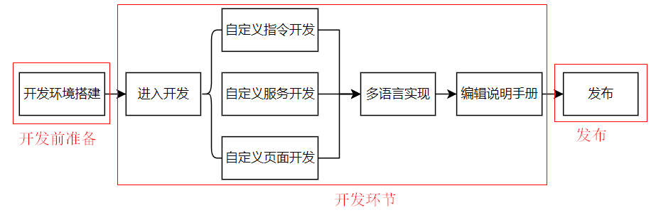

# AddOn Development Process Overview

**This page aims to provide AddOn developers with a brief overview of the complete development process for an AddOnXXX package, including the steps involved in each phase.**

::: tip Process Flow:
:::

As shown in the above diagram, the complete development process for the AddOnXXX package consists of three main stages and six major steps. If we further break down these six steps, there are many sub-steps.

The following sections will provide a brief explanation of this process diagram. For detailed explanations and operating instructions for the sub-steps, please refer to the specific chapters in the document.

## Preparations Before Development
---

### Setting Up the Development Environment
This step aims to provide the necessary development environment for the AddOnXXX package, including installing a virtual machine, upgrading controllers, and software versions.

For detailed information, please refer to [Setting Up the Development Environment:point_left:](./environment.md).

<!-- * Learn the basic process and rules of developing custom command-type AddOns through "[JAKA_Command:point_left:](./JAKA_Command.md)".
* Learn the basic process and rules of developing custom service-type AddOns through "[JAKA_Serve:point_left:](./JAKA_Serve.md)".
* Learn the basic process and rules of developing custom web-type AddOns through "[JAKA_web:point_left:](./JAKA_web.md)". -->

## Entering the Development Phase
---

After completing the environment setup, developers can choose the functionalities they need and refer to the corresponding documentation for development.

As mentioned earlier, JAKA AddOn has three parallel functionalities: custom commands, custom services, and custom pages.

An AddOnXXX package can include one or more functionalities.

### Developing Custom Commands
The custom command functionality allows developers to create commands other than the standard commands within the JAKA App. For detailed content and operation steps, please refer to: [Developing Custom Commands:point_left:](./JAKA_Command.md).

### Developing Custom Services
This functionality is not yet available. Any updates in the future will be synchronized on this page.

### Developing Custom Pages
The custom page functionality enables developers to create pages that meet custom requirements. For detailed content and operation steps, please refer to: [Developing Custom Pages:point_left:](./JAKA_web.md).

### Multilingual Implementation
JAKA AddOn supports multilingual functionality. After completing the development of a specific package's functionality, you can set multiple languages according to your needs.

Currently supported languages include: Chinese, English, and Japanese.

For detailed information, please refer to: [Multilingual Implementation:point_left:](./multi-language.md).

### Writing User Guides
Here, "user guides" refer to the documentation that developers need to provide to their users after developing specific applications or functional packages using JAKA AddOn. This step aims to guide developers on what content should be included in these user guides, what rules to follow, and how to release them for user download or use.

For detailed information, please refer to [Writing User Guides:point_left:](./userguide).

## Release
The term "release" here refers to how developers should publish specific applications or functional packages developed using JAKA AddOn, to provide them to their users for use.

The "release" feature is currently under development. After completion, the process instructions for the "release" step will be synchronously updated on this website.