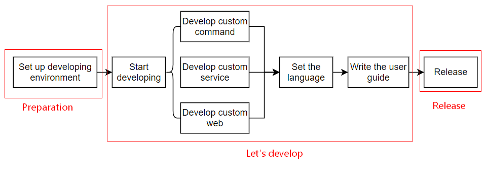
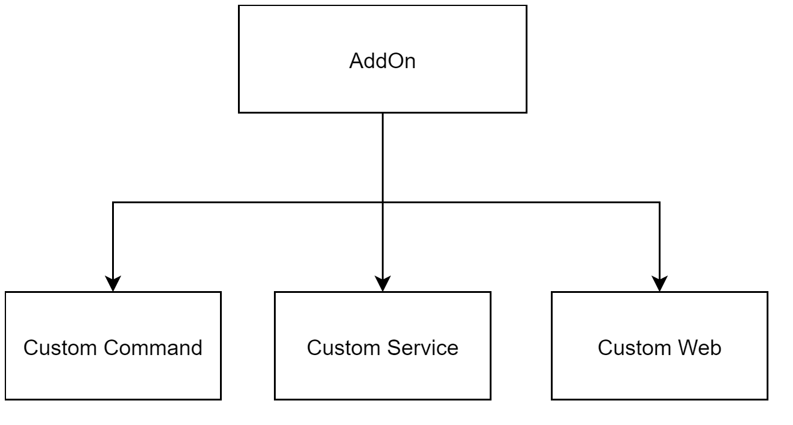

# AddOn Development Process Overview

**This page aims to provide AddOn developers with a brief overview of the development process for an AddOnXXX package, including the basic steps involved in each stage.**

::: tip Process Flow:
:::

As shown in the above diagram, the complete development process for the AddOnXXX package consists of three main stages and six major steps. If we further break down these six steps, there are many sub-steps.

The following sections will provide a brief explanation of this process diagram. For detailed explanations and operating instructions for the sub-steps, please refer to the specific chapters in the tutorial.

## Preparations Before Development
---

### Setting Up the Development Environment
This step aims to provide the necessary development environment for the AddOnXXX package, including installing a virtual machine, upgrading controllers, and upgrading software versions.

For detailed information, please refer to [Setting Up the Development Environment:point_left:](./environment.md).

<!-- * Learn the basic process and rules of developing custom command-type AddOns through "[JAKA_Command:point_left:](./JAKA_Command.md)".
* Learn the basic process and rules of developing custom service-type AddOns through "[JAKA_Serve:point_left:](./JAKA_Serve.md)".
* Learn the basic process and rules of developing custom web-type AddOns through "[JAKA_web:point_left:](./JAKA_web.md)". -->

## Start Developing AddOn
---

After setting up the environment, developers can choose the type they need and refer to the corresponding pages for more detailed intructions.

As mentioned earlier, JAKA AddOn has three functions: custom commands, custom services, and custom interface.

An AddOnXXX package can include at least one function.

### Developing Custom Commands
The custom command function allows developers to create commands other than the standard commands within the JAKA App. For detailed content and operation steps, please refer to: [Developing Custom Commands:point_left:](./JAKA_Command.md).

### Developing Custom Services
This function is not yet available. Any updates in the future will be synchronized on this page.

### Developing Custom Interfaces
The custom interface function enables developers to create interfaces that meet custom requirements. For detailed content and operation steps, please refer to: [Developing Custom Interfaces:point_left:](./JAKA_web.md).

### Language Setting
JAKA AddOn supports several languages. After developing a specific AddOn package, you can set the language according to your needs.

Currently supported languages include: Chinese, English, and Japanese.

For detailed information, please refer to: [Language Setting:point_left:](./multi-language.md).

### Writing User Guide
Here, "user guide" refers to the documentation that developers need to provide to their users after developing add-ons of a specific applications or with a particular function using JAKA AddOn. This step aims to guide developers on what content should be included in these user guide, what rules to follow, and how to release them for user download or use.

For detailed information, please refer to [Writing User Guides:point_left:](./userguide).

## Release
The term "release" here refers to how developers should publish add-ons of a specific applications or with a particular function to provide them to their users for use.

The "release" function is currently under development. After completion, more detailed instruction will be synchronously updated on this website.