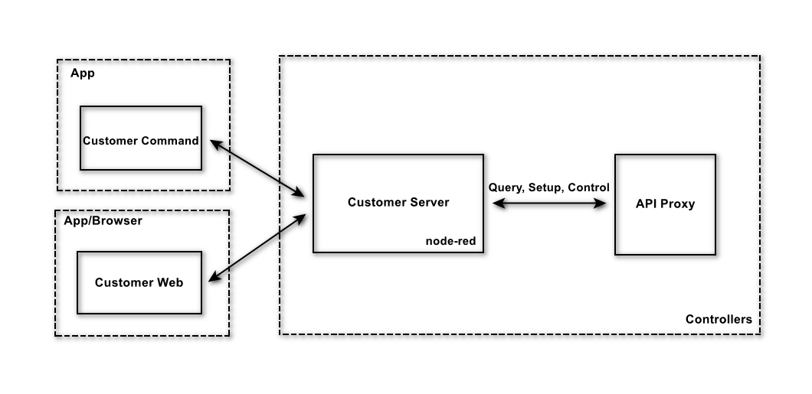
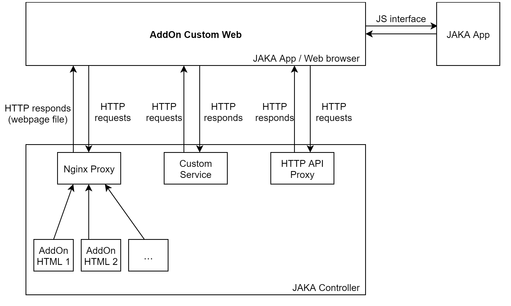

# About AddOn

**This page aims to explain  the basic concepts for AddOn developers.**

::: warning Please note:
1. The AddOn mentioned in this tutorial refers to AddOn 3.0 by default.
2. AddOn 3.0 development and usage are supported on JAKA controllers > 1.7.1.x _X64 version.
3. AddOn 1.0 and 2.0 are no longer maintained and provided with development support.
:::

## What is AddOn
---
JAKA AddOn, as its name, is an add-on software provided by JAKA. It supports users in developing custom command add-on, custom service add-on, custom interface plugins, and composite add-on that include the above types.

By using AddOn, users can significantly extend the functionality of the robot operating system or customize existing functionalities according to their preferences.
::: tip For distinction, two terms are defined here:
* JAKA AddOn Kit: The kit package required during the development environment setup, namely jaka_addon_kit.tar.gz.
* JAKA AddOnXXX Package: A developed package with specific functionality, such as JAKA AddOn Palletizing Package, JAKA AddOn DH Gripper Package, JAKA AddOn Visual Guidance Package, JAKA AddOn Force Control Package, and so on.
<!-- Process package, third-party device adaptation package -->
:::

## Why Use AddOn
---
In typical scenarios, when a new third-party tool is connected at the end of the robot, or when performing specific processes (such as palletizing, welding, etc.) in specific usage scenarios, new commands need to be set in the programming interface.

These commands often contain complex, lengthy codes and parameters that are difficult to understand and reuse, adding extra burden to simple actions or programs. For engineers who are proficient in specific crafting processes but not well-versed in robot programming, setting commands is particularly complex and difficult.

Using AddOn can deemphasize the code, greatly simplifying the command-setting process. It skips the complex settings in this programming step and directly encapsulates them into a simple, clear, and understandable command, making it easier to operate. It also facilitates the reuse of used commands, allowing users to focus on executing specific processes, thereby enhancing efficiency and productivity.

In summary, using AddOn make it easier and more effective to collaborate with robots.

## Basic Functions of AddOn
---
As mentioned earlier, AddOn has three basic functions: developing custom command add-ons, custom service add-ons, and custom interface add-ons.

The implementation of these functions empowers the existing systems, allowing users to customize new functions as needed or make changes and upgrades to the existing ones.

JAKA's application development team can develop official JAKA application packages, process packages, and process kits through the AddOn framework for users to download and use. The team can also assist JAKA customers in developing custom functions, services, and interfaces to meet their customization needs.

JAKA partners can develop ecosystem-standard add-ons through the AddOn framework to enhance product compatibility and usability.

JAKA robot end users can develop custom commands through the AddOn framework to encapsulate and reuse commonly used commands.

## AddOn Operation Mechanism
---
* AddOn Custom Commands

AddOn custom commands are based on a B/S architecture. The programming page in the JAKA App is the client (B), the running server based on node-red in the JAKA controller is the server (S). The operation mechanism is as follows:

* AddOn Custom Services

AddOn custom services are developed based on node-red and run internally on the controller. They can call JAKA's provided HTTP API interface to query information and control the robot. The operation mechanism is as follows:

* AddOn Custom Web Pages

AddOn custom interfaces are deployed in the JAKA control cabinet and can interact with the controller and JAKA App. The interaction with the controller is through HTTP requests, and with JAKA App, it is through the API provided by JAKA App (JS methods). The operation mechanism is as follows:

## AddOn File Composition
---
The completed AddOnXXX package may contain various files, and below are the most common ones:

**Data File**    
An AddOn package generally contains a JSON file that includes the definition of flows and nodes in node-red. The name of this file can be customized but needs to be pointed to in the configuration.

**Configuration File**    
Any type of add-on must include an `xxx_config.ini` file, i.e., [AddOn Configuration File:point_left:](./iniConfig). Only packages containing the AddOn configuration file can be installed, initialized, and run.

**Frontend Project**   
Under the AddOn directory containing custom pages, there is usually a folder for the frontend project, such as client or dist. It is recommended to use "client" as the frontend project folder.

<!-- ## Terminology Explanation -->

<!-- todo: Where should the explanation of 'hbs' terminology be placed here? -->

## Feedback
---

We appreciate your feedback!

If you find any wrong or unclear descriptions in the document, please feel free to submit [Issues](https://github.com/JakaCobot/JakaCobot.github.io/issues) in our document repository.
<!-- Provide links to the repository for the addon kit and this document -->