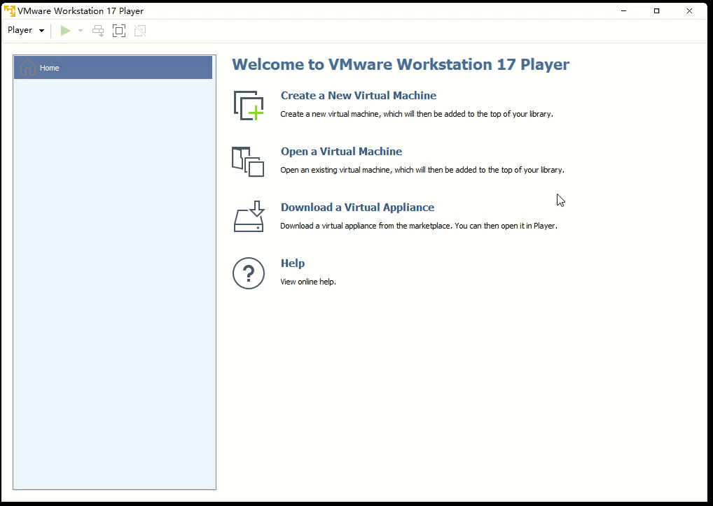
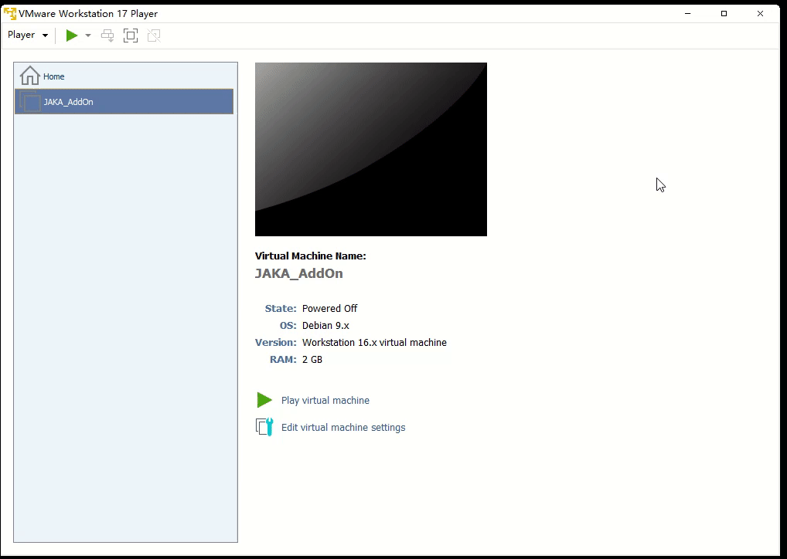
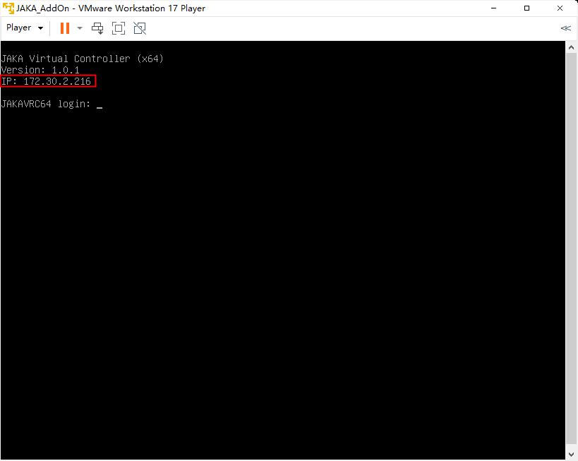
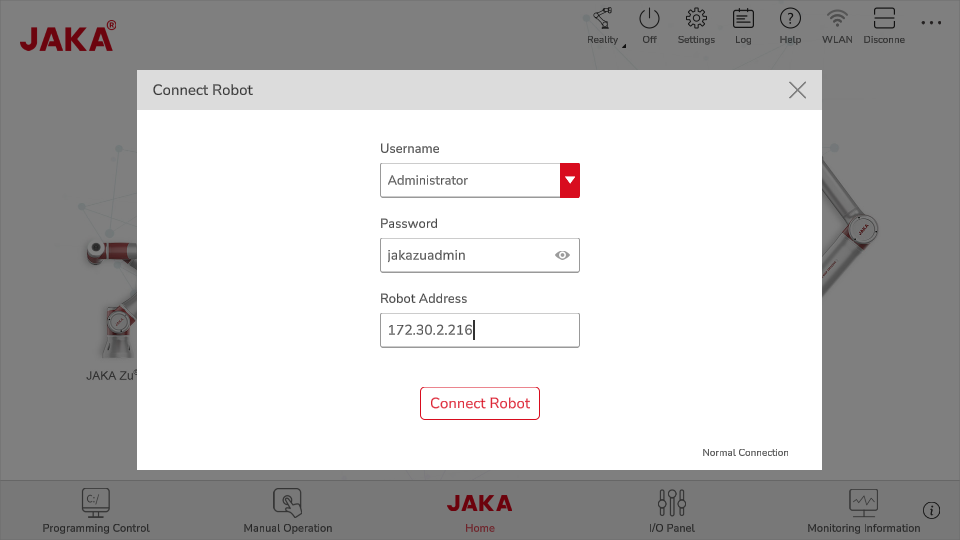
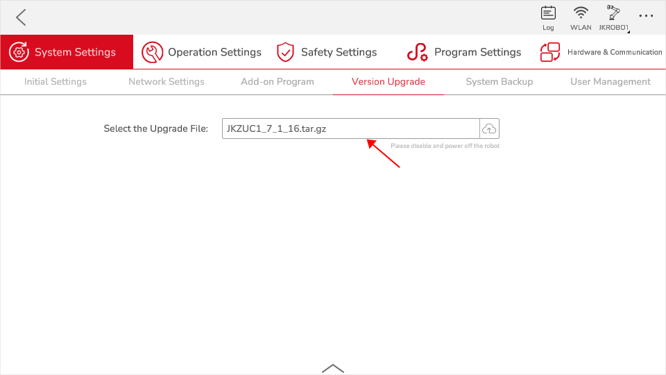

# Setting up Development Environment
**This page aims to guide you on how to set up the AddOn development environment. Before you begin, please download the [*development resources*:point_left:](./AddOn3.0.html#获取开发资料).**

Developing AddOns requires an appropriate development environment, related softwares and Apps are essentia, including the JAKA virtual machine and compatible software and controller versions.

## Installing the JAKA Virtual Machine

### Step One: Install Virtual Machine Software

Developers need to first install virtual machine software, VirtualBox or VMware Player is acceptable.

### Step Two: Install the JAKA Mirror File
Locate the virtual machine mirror file in the *jaka_addon_package* and import it for installation.

### Step Three: Start the JAKA Virtual Controller

Click "play virtual machine" to launch the virtual machine.

At this point, the virtual machine page will display the current robot's IP address.

## Installing the AddOn Suite

::: tip Please Note:
Apps and controllers that are not updated cannot support the AddOn function.
:::
After setting up the virtual machine, you need to upgrade the App and controller to the compatible versions before the AddOn development.

### Step One: Install JAKA App

In the APP folder of the AddOn development environment package, find the installation package and follow the guide to complete the installation of the App.

During the installation process, be sure to grant network permissions.

### Step Two: Connect the Robot Using the App

1. Open the App to connect to the robot. At this point, you should be able to find the virtual robot in the robot list based on its IP.

2. If you cannot find the robot in the list, try using offline connection.

3. For the password, enter the default login password (jakazuadmin).

4. For the address, enter the IP of the virtual robot.

### Step Three: Upgrade the Controller

Open the settings page, go to System Settings, then the Version Upgrade page. Select the controller package you want to upgrade, click upload, and complete the upgrade.

### Step Four: Install the AddOn Suite

Open the settings page, go to System Settings, then the Version Upgrade page. Select the AddOn Suite, click upload, and complete the installation.

### Step Five: Restart the App

::: tip Please Note:
After completing steps one to four, please restart the App to take effect.
:::

