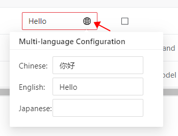

# Multilanguage Implementation

The JAKA AddOn supports multilanguage functionality. After completing the development of a certain package's functionality, you can set up multilanguage options as needed.

Currently supported languages include Chinese, English, and Japanese.

The specific steps for configuration are as follows:

## Multilanguage for Custom Commands

When creating custom commands, there will be a small globe icon to the right of the content input box that supports multilanguage. Clicking on it will allow you to configure multilanguage options. Currently, it supports Chinese, English, and Japanese.

<div align="center"></div>

## Multilanguage for Custom Pages

When a custom page is opened in the JAKA App, it needs to retrieve the current language of the app in order to synchronize the language of the user's custom page with that of the app. This can be achieved using the following method.

<div align="center"></div>

In the web initialization JavaScript code, call the method `JAKAController.jakaCall(result)`. After calling this, the JAKA App will invoke the `window.changeLanguageHandler(language)` function and pass in the current app language.

**Example Code:**

```js
let result = {
    "type": "getLanguage",
}

result = JSON.stringify(result);

JAKAController.jakaCall(result);

/**
 * Callback function from the App after triggering getAppLanguage.
 * @param {*} language Current language passed in by the App.
 */
window.changeLanguageHandler = (language) => {
    console.log(`Current language is {language}`)
}
```