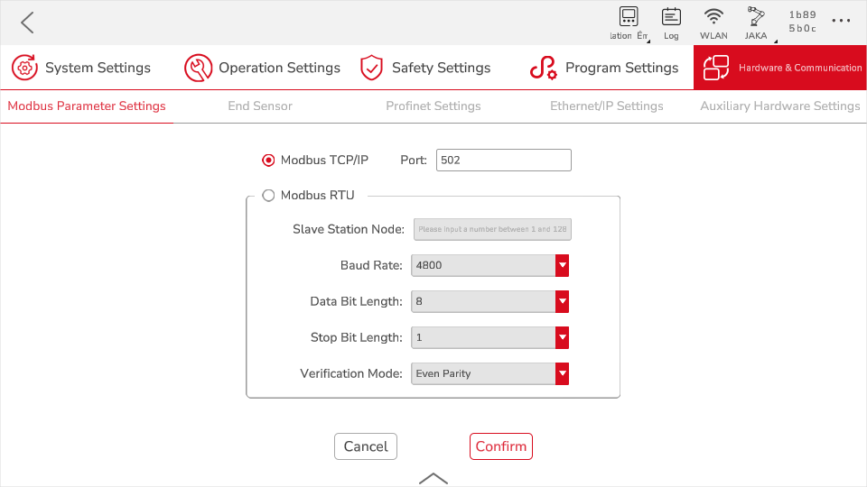
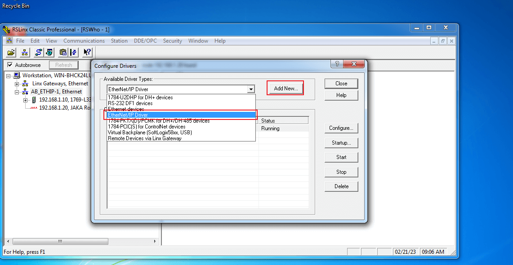
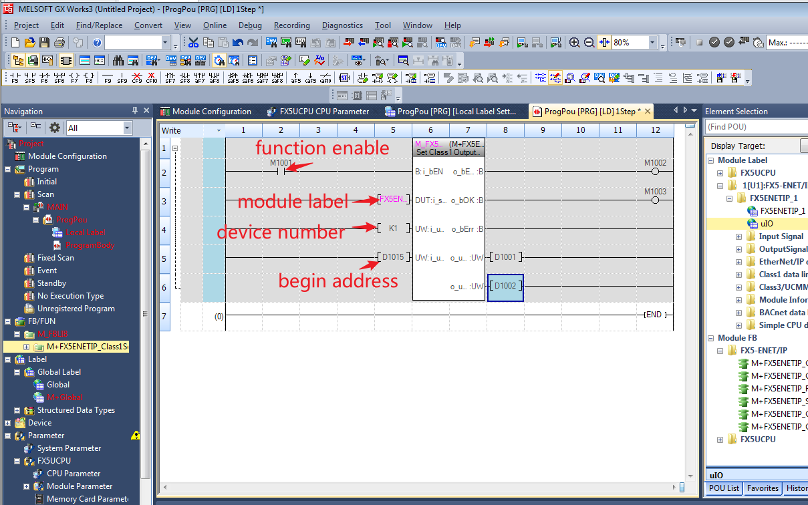
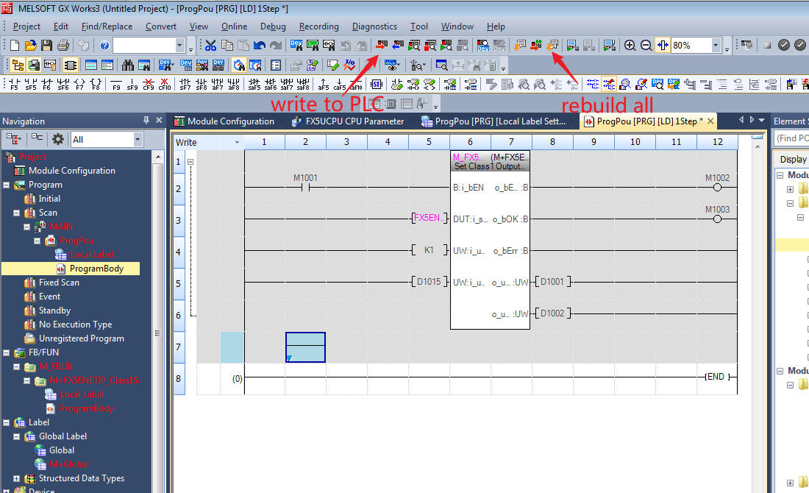
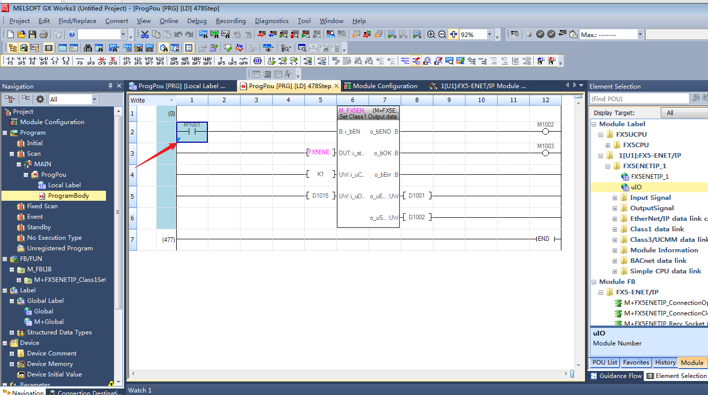
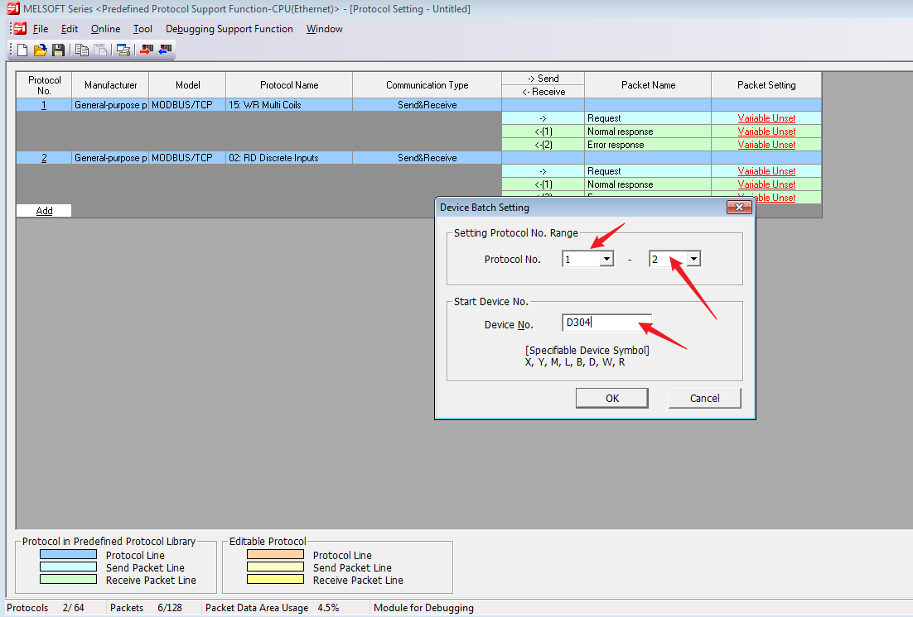
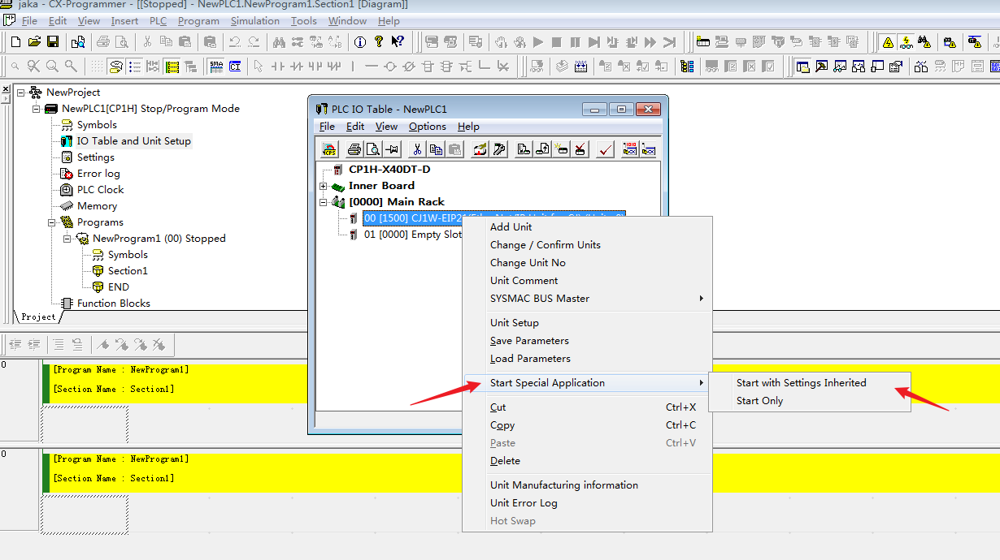
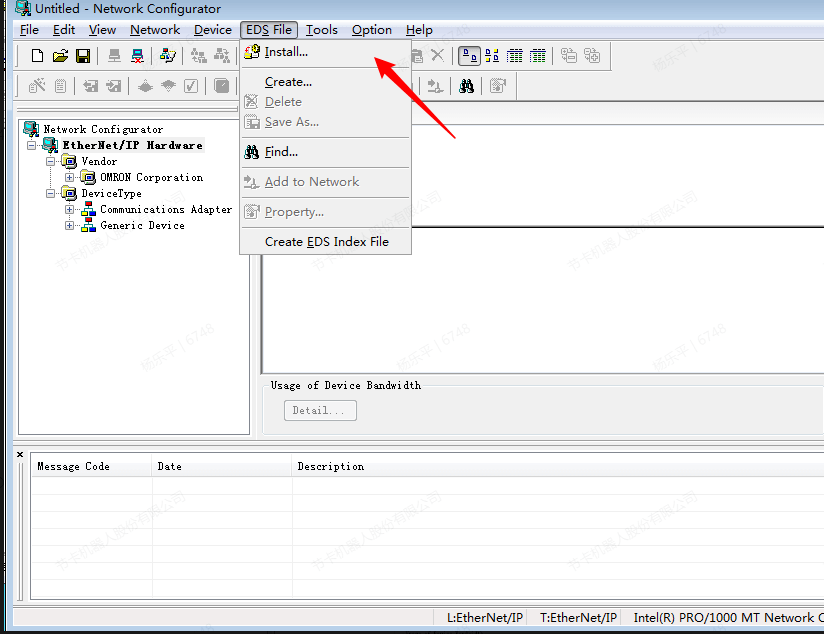
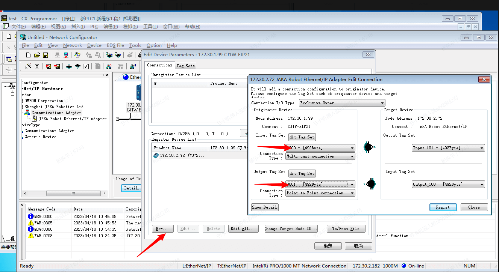
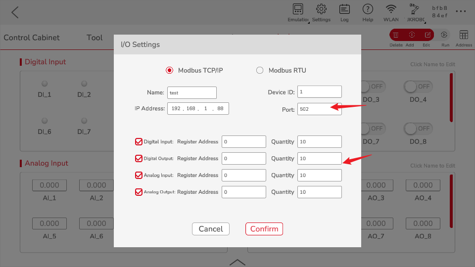

# JAKA Communication Manual

## Introduction

In order to help users better use JAKA's communication function, the manual introduces the data interaction methods between JAKA and the mainstream PLC on the market. The contents in this manual only involve part of PLC models. Even the PLC from the same manufacturer, due to differences in communication parameters and equipment versions, the usage methods are not exactly the same. Therefore, this manual is only for preliminary use reference. For further use, please contact the corresponding local supplier of the PLC.

The contents in this manual is based on the following PLC models. The firmware version and the software version of the host computer can be seen in the table below. The version in the table or later is recommended.

|                             | PLC Model          | Firmware Version | Software Version                                             |
| --------------------------- | ------------------ | ---------------- | :----------------------------------------------------------- |
| Rockwell                    | 5370 L3 1769-L33ER | 20.18            | RSLogix 5000 V20.00.00 (CPR 9 SR 5)                          |
| Siemens                     | 6ES7317-2EK14-0AB0 | 3.2.18           | TIA Portal V16                                               |
| Mitsubishi Electric         | CPU:FX5U-80MT/DSS  | 1.2450           | GX Works3 Version 1.090UEtherNetIPConfiguration Tool for FX5-ENET IP V1.00A |
| Expansion Unit: FX5-ENET/IP | 1.1                |                  |                                                              |
| Schneider Electric          | TM241CE24R         | 5.1.10.10        | EcoStruxure Mchine Expert Version 2.1                        |
| Omron                       | CPU:CP1H-X40DT-D   | 1.3              | CX-Programmer 9.50                                           |
| Expansion Unit:CJ1W-EIP21   | 3.0                |                  |                                                              |
| Keyence                     | CPU:KV-8000        | 2.602            | KV STUDIO 11.62                                              |
| Expansion Unit:KV-XLE02     | 1.400              |                  |                                                              |
| Delta                       | AS228T-A           | 1.12.50          | ISPSoft Version 3.15COMMGR 1.12                              |
| INOVANCE                    | Easy522‑0808TN     | 5.67.0.0         | Autoshop V4.8.1.0                                            |

For  JAKA products, the EtherNet/IP can be used as Adapter, the Profinet can be used  as Device, which both are slaves. The Modbus can be used as both master station and slave station. The main difference between Modbus RTU and Modbus TCP in use is the connection parameters, so the manual only introduce the Modbus TCP. In addition, the Modbus master station of most PLC manufacturers triggers communication through the LAD, so no repeated introduction is made for each manufacturer. The fact that a communication function is not mentioned in the manual for a specific PLC model does not mean that JAKA does not support it, but that the PLC does not integrate this function or verification is difficult.

### Setup

After the control cabinet of the JAKA robot and the PLC establish communication, the PLC can read the performance parameters of the robot in real time, such as: the status of the robot, the angle, speed, temperature of each joint, and the position, speed and force value of TCP. At the same time, the PLC can also exchange data with the control cabinet through registers of different types of data.

The device connections are as follows: the PLC, upper computer and control cabinet should be in the same segment. The usage methods and steps described below are all based on mutual access between the three.

It is recommended to use the bottom network port of the control cabinet for communication function. The JAKA Zu APP (hereinafter referred to as APP) can also be connected to the control cabinet through the bottom network port. However, in order to avoid the data transmission between the APP and the control cabinet from affecting the communication function, it is recommended that the APP use the panel Internet port or Wi-Fi to connect with the control cabinet.

Note: The bottom network port needs to be activated (connected to a computer or router) to use the relevant communication functions.

### Enable EtherNet/IP, Profinet

Since the Ethernet/IP and Profinet enable steps are basically the same, they are introduced together.

The Ethernet/IP function is turned off by default, and the specific steps to enable it are as follows:

Step 1: Open the latest version of the JAKA Zu APP and click the “Disconnected” icon in the upper right corner of the APP to open the robot connection page.

Step 2: Click the robot you want to connect and input the administrator password (jakazuadmin by default) to connect the robot.

Step 3: Click “Settings”→“Hardware \& Communication”→“EtherNet/IP Settings”, turn on the “enable” by switch and restart the control cabinet. The steps of restart the control cabinet are as follows:

a. Back to homepage, click “Power off the robot” and “Off” button on the upper right corner to power off the control cabinet.

b. After the control cabinet is powered off, press the “Power on” button on the remote stick. After the buzzer sounds, the control cabinet is powered on;

c. Open the JAKA Zu APP, reconnect the robot, see steps 1 and 2 for specific operations;

e. Enter the hompage, and click “Power on the robot”.

After reconnecting the control cabinet, check the status on the "EtherNet/IP Settings" or "Profinet Settings" interface. When the status is “Disconnect to the master”, it means that EtherNet/IP has been enabled and is waiting for the master to connect.

### Enable Modbus TCP/IP, Modbus RTU

Since the Modbus TCP/IP and Modbus RTU enable steps are basically the same, they are introduced together.

The Modbus TCP/IP and Modbus RTU function is turned on by default, and the specific steps to enable it are as follows:

Step 1: Open the latest version of the JAKA Zu APP and click the “Disconnected” icon in the upper right corner of the APP to open the robot connection page.

Step 2: Click the robot you want to connect and input the administrator password (jakazuadmin by default) to connect the robot.

Step 3: Click “Settings”→“Hardware \& Communication”→“Modbus Settings”.

a. If you want to enable Modbus TCP/IP, please check the radio button before Modbus TCP/IP, enter the port number (0~ 65535), and click "Confirm";

b. If you want to enable Modbus RTU, check the radio button before Modbus RTU, enter the slave station node (1~ 128), select the baud rate, data bit length, stop bit length, and vertification method, and click "Confirm".

## IO Quantity Configuration Instruction

### EtherNet/IP

In the address assignment table, the data types are arranged in the order: DIO Boolean, AIO Integer, and AIO Float: 

DIO: Boolean, accounting for 1 bit, every 8 DIOs form a byte, so the IO quantity configuration of DI and DO needs to be 8 \* n, n is a positive integer, so that the length of the corresponding DI and DO data is an integer byte,

AIO: Both integer and float occupy 4 bytes.

According to the usage scenario, the number of IOs for EtherNet/IP is configurable. In usersettings, if Mode = 0, it means that the EIP uses the standard number of IOs, and if Mode = 1, it means that the number of IOs can be configured.

The scanner needs to import the eds file to match the adapter of the controller. Currently, JAKA provides the following eds files, the meaning and application scenarios are:

#### JAKARobot.eds

The standard version of the eds file, the parameters cannot be configured and cannot be modified, and are fixed values. The specific number of IO is defined in usersettings:

\[EIP]

Enable = 1

Mode = 0

DI\_NUM = 64

DO\_NUM = 64

AI\_INT\_NUM = 24

AI\_FLOAT\_NUM = 24

AO\_INT\_NUM = 24

AO\_FLOAT\_NUM = 24

Among them, the sum of the data lengths output by DO and AO is up to 204 bytes, and the sum of the total lengths of the data input by DI and AI is up to 492 bytes.

#### JAKARobotSetup.eds

For the customized version of the eds file, the number of IO can be configured. You need to change the mode of usersettings to 1 in the controller, and then modify the number of IO.

Among them, the sum of the data lengths output by DO and AO is up to 492 bytes, and the sum of the total lengths of the data input by DI and AI is up to 492 bytes.

### Profinet

For Profinet IO data transfer operations, please refer to the address assignment table, which consists of 4 sheets, namely table description, Robot2PLC, PLC2Robot and script function. Each data defined in the Robot2PLC and PLC2Robot sheets occupies 4 bytes, that is, 0 to 31 bits. The key contents are as follows:

Transmission Type: R- > P (Robot- > PLC) or  P- > R (PLC- > Robot), indicating the direction of data transmission;

Unit Group: Indicates the data type and the module it belongs to. The data type is: robot status, safety settings, and belongs to the first module. For example: 1\_R - > P\_Robot\_Safety, indicating data module number is 1, the transmission direction is R- > P (Robot- > PLC), Robot represents the robot status, Safety represents the safety settings, 32 bytes are used addresses, and 4 bytes are reserved addresses. The content of other unit modules is similar.

PLC Settings: Including the slots corresponding to each unit group, the sub-slot number and the address on the PLC, such as 1\_R - > P\_Robot\_Safety corresponds to the No. 1 slot, the No. 1 sub-slot, and the PLC input I address is 0 to 35 bytes.

## PLC Communication Examples

### Rockwell 5370 L3 1769-L33ER

Software needed: RsLinx Classic，BOOTP-DHCP Server，RsLinx Classic Launch Panel，RsLogix 5000，JAKA Zu APP，Wireshark (opyional)

#### EtherNet/IP

1. In the case of not knowing the current IP address of the PLC, use Wireshark to confirm the IP address of the PLC, and use the cmd tool of Windows to ping the device to test whether the PLC is in the network. If the PLC is not in the same network segment as the controller and the host computer, go to step 2 and try to change the IP address of the PLC; if it is already in the same network segment, go to step 4.

2. Open RsLinx Classic, click “Configure Drivers”, select “Ethernet/IP Driver” in the popup, click “Add New”, configure by default and click “Ok” when done. 

3. Click the network node icon to pop up the WRWho session box. Click “ABETHIP\_1”, the information of PLC and Ethernet/IP will be refreshed. The normal connection indicates that the network has been properly organized. Right-click the PLC to modify its IP address so that it is in the same subnetwork segment as the controller and the host computer.

4. Open “BOOTP-DHCP Server”, and devices connected to the computer will be automatically searched.

Note: If the MAC address of the PLC is not found in the automatic search, please turn off the firewall of the computer and manually enter the MAC address. Check the IP address in the bottom half of the column and click “Disable BOOTP/DHCP”.

5. Open RsLinx Classic Launch Panel and click “Start”.

6. Click “Tools” on the menu bar, select install EDS file, register EDS file, and keep clicking “Next” until the configuration is complete.

7. Open RsLogix 5000, and create a new program. Click the PLC model used, input the project name, browse the project storage location, and click “OK”.

8. Right-click Ethernet in the left column, click “New module”, find the “JAKA Ethernet/IP Adapter” in the popup, click “Create”, input the module name. Note that the IP address here needs to be the same as the Ethernet/IP address of the control cabinet.

9. Click the Change button to set the type of data. The DINT type is selected for ease of data display.

Note: If you are using a customized version and need to manually configure the modules of the EIP, the configuration is as follows:

PLC to EIP output ID is 100

EIP to PLC Input ID is 101

PLC outputs a maximum of 492 bytes

PLC Input a maximum of 492 bytes

10. Click “Network Node” to pop up the “Who Active” Page, select PLC module, then click Online and the window pops up, then download the program.

11. Click online to enable the PLC in running mode. After the connection state is normal, right-click the controller label and select Monitoring Tag. You can see that the PLC has read some data from the robot.

12. Switch on the DO1 and DO2 of EtherNet/IP on the JAKA Zu APP, set integer AO1 as 123.

13. Check the data of RsLogix 5000, I.Data\[72] andI.Data\[75] show the data is correct. JAKA EtherNet/IP address table can be referred for data address.

#### Modbus TCP

##### Master Station

AB's PLC does not support Modbus TCP communication. Using AB PLC requires a third-party protocol conversion gateway to convert the ModBusTCP protocol to AB's own Ethernet/IP protocol. Therefore, Rockwell PLC must first have an Ethernet interface with EtherNet/IP protocol.

Sofware later than Logix5000 programming software version 15 (measured version 20 and above), for CompactLogix and Controllogix series PLCs, ModbusTCP protocol communication written using PLC programs is supported, and can communicate with other third-party devices as Master and Slave. The routines officially provided by AB are divided into two parts: Master and Slave, which can be used separately on demand. The Master function may occupy 200-230K of storage space in the PLC, and the Slave function may occupy 280-300K of the PLC.

As can be seen from the above, Rockwell does not support the native Modbus TCP protocol, which needs to be implemented through its EtherNet\\ IP Ethernet port.

You can write your own PLC program to support Modbus, or you can download a sample program at Rockwell. Below is a brief verification of the example program given by the official website.

1. Create a project, click “MainRoutine”, right-click “Import Rungs” in the blank area on the right.

2. Import the .L5X file in the sample program, you can modify the name of the parameter in the program, through the Final Name option of the Tags tag.
  
   

3. Click “Ok” to import, right-click in the Modbus TCP Client block, and click “Monitor”.

4. For the 5370 series, the value of LocalSlot is 0, fill in values such as EtherNet/IP port address, Modbus slave IP address and port number as actual.

5. Back to the MainRoutine, set the inp\_Enable to 1, which means to start the Modbus Client function. For RSLogix 5000, you need to compile and download the program to the PLC, and finally switch to the running state.

6. The monitoring table can set basic parameters such as Pollinterval (refresh time), Transtype (function code), Stationid (slave ID), BeginAddress (start address), Count (number of addresses), etc. In addition, LocalAddress needs to be set, which indicating the starting address of the Modbus Client corresponding to the starting address of the Modbus Slave.

7. Modbus Client also uses 4 registers to store data. After completing the mapping of the starting address, the data in the register can be directly modified. For example, the starting address of the Slave is set to 40. Modifying the data under the coils can updated to the inside of the controller.

### Siemens 6ES7317-2EK14-0AB0

Software needed： TIA Portal V15, JAKA APP

#### Profinet

1. Open TIA Portal V15, Click “Create New Project”, modify the project name (such as jakaPNIO) after the new project window pops up, click ”browse” button, select the path and confirm, then click create again. A new project is created and saved in the specified path.

2. In the created project window, click Devices \& Networks - > Add new devices - > Controllers, select the model of the PLC, and then click Add.

3. Double-click PLC Module, click Ethernet addresses under the general menu, and modify the IP address of the PLC.

4. If the PLC S7-300 is used, you need to modify the size of the IO address mapping so that the address mapping value is greater than 688 bytes, and the IO address mapping smaller than this value may cause data loss, because the maximum address range of JAKA Profinet IO is 0-688 bytes.

5. Click Options in the menu bar, click Manage general station description files (GSD) will pop up a window, click the Browse button, find the path of the file GSDML-V2.41-JAKA-JAKARobot-20210722, select the file after loading, and then install. Close the window after the installation is completed.

6. Double-click Devices \& Networks in the left column, click Other field devices→PROFINET IO→I/O→JAKA→JAKARobot→ JAKA\_V1.0 in the right column, double-click it or directly drag and drop it to the interface. 

7. Click Not assigned for Profinet devices and select PLC\_1. PROFINET interface \_1.

8. Click the DP-NORM icon of Profinet device and select Ethernet address in the menu bar below to modify the IP address of the Profinet device.

9. Click IO cycle, select Manually set the update time in the update time block, and select the data update time of Profinet in the drop-down box of the update time. Since the minimum update time of this device is 8ms, the selected value should be greater than or equal to 8ms.

10. Double-click the Profinet device named jaka and switch to the page of Device Overview. You can see the defined IO data blocks under the module of the catalog. Drag the data block into the corresponding slot.

11\. Switch to Device \& networks interface, select PLC, and select the Compile and Download icons in turn.

12. Double-click Online \& diagnostics in the left column, the configuration of online access is as follows, and then click Online access to observe the connection and the real-time data transmission between PLC and Profinet.

13. Under the Monitoring and Enforcement List in the menu bar on the left, create a new monitoring table, and operate the addresses corresponding to DI, AI, DO and AO according to the Profinet IO address assignment table, so that the data transmission between the controller and the PLC can be realized.

#### Modbus TCP

##### Master Station

Siemens also realizes the Modbus TCP protocol by programming, and the S7-300 can use the MODBUSPN module.

1. Insert MB\\ \_PN\\ \_PARAM.

2. Enter configuration to set connection, and set parameters such as IP address and port number.

3. Set the data areas of Modbus

4. Add 4 area blocks according to the data area of the process object

5. Create data block

6. Call the communication command and set the corresponding parameters

Subsequent operations are similar to Rockwell, modify parameters in commands to communicate with Modbus TCP, but this function requires Siemens' authorization key.

### Mitsubishi Electric FX5U-80MT/DSS

Software needed: MELSOFT GX Works3，EtherNet/IP Configuration Tool for FX5-ENET/IP，JAKA Zu APP

#### EtherNet/IP

The default IP of FX5U is 192.168.3.250；the default IP of FX5 ENET/IP is 192.168.3.251.

You need to use the expansion module FX5-ENT/IP to enable the EtherNet/IP function. This function requires the software EtherNet/IP Configuration Tool for FX5-ENET/IP, which can be obtained on the Mitsubishi official website or contact the supplier.

1. Login to the Profile of FX5-ENET/IP using GX works3.

2. Create a new project, select the corresponding type of PLC. 

3. Drag the FX5-ENET/IP from the information module and concatenate with the FX5U.

4. Open the Mitsubishi EtherNet/IP Configuration Tool for FX5-ENET/IP, click “Add” under “Description” to add a configuration module and change the address. Note that the IP address of the module remains the same network segment.

5. Click “Device Library” to add eds file.

6. Drag the eds file directly under TCP/IP, and pay attention to configuring its IP and module with the same network segment.

7. The Ping function on the configuration interface can be used to test whether it is connected.

8. Click “Go Online” icon and download configuration.

9. Since the Mitsubishi module needs to be run through the program and needs to be activated by function blocks, after the configuration download is completed, you need to go back to the homepage to program and trigger the EtherNet/IP function. After installing the configuration file of FX5-ENET/IP, the part library has its own standard function block, select Add Module Label. 

10. Click ”Online”→“Current Connection Destination...”.

11. Click “Other Connection Method” to open the specify connection destination window.

12. Double-click the device network to set the IP of the FX5U. 

13. Click Find, double-click the searched device and click OK.

14. Click Connection Test, which should show Successfully connected with  the FX5UCPU. 

15. Add M + FX5ENETIP\_Class1SetOutputdata\_01A module to test the function of sending data, and write the test program as follows.

16. At this point, EtherNet/IP Configuration Tool for FX5-ENET/IP has been configured, click write to PLC and rebuild all icon.

17. Click Select All→Execute, then reset the PLC, which can be realized by power off. Note that the network cable should be connected to the FX5U unit at this time.

18. After restart, unplug the network cable from the FX5U and connect to the FX5-ENET/IP. Click “Online”→”Current Connection Destination...” to confirms that the communication with the EIP module is normal, and then turn on the monitoring.

19. Place the cursor on the M1001 switch, press Shift + Enter to change the input signal to trigger this function.

20. After using the module to trigger the EIP function, the APP will display that the master station was successfully connected.

21. Diagnostics in EtherNet/IP Configuration Tool for FX5-ENET/IP will show that the device is online.

22. Right click the function block, then click Online→Device/Buffer Memory Batch Monitor.

23. Monitor D1015 and update, at which point the data should be updated to DI and AI.

24. Float is the same. You can view the device value through the monitor window. It should be noted that the device memory stores data in 16-bit units, and both signed integers and floats need high and low bits to form accurate 32-bit data.

25. Drag in the M + FX5ENETIP\_Class1Getinputdate\_01A module to test the function of receiving data. Write the test program as follows. Each time you compile and write, you need to plug the network cable into the CPU unit, that is, FX5U, and when you actually use the EIP function, you need to plug the network cable back into FX5-ENET/IP.

26. Modify the value of DO and AO in the JAKA Zu APP, and check the update of value.

27. Float is the same.

#### Modbus TCP

##### Slave Station

1. Click MODBUS/TCP Settings under Basic Settings, and double-click the target device connection configuration settings.

2. Drag a Modbus/TCP connection Module into the network topology, and click Close with Reflecting the Setting. 

3. The Modbus/TCP settings will display Used. Double-click Detailed Setting to enter the MODBUS Device Allocation, click OK, and then click Apply.

4. Write the modified module parameters into the PLC, then reset the PLC.

5. The APP can run the extended IO module at this time, open Device/Buffer Memory Batch Monitor, and check whether the value is updated to the corresponding address.

##### Master Station

1. Click Module Parameter→Ethernet Port, double-click connection configuration to enter Ethernet Configuration interface, set Communication Method as Predefined Protocol, set IP Address, Port No., note that Mitsubishi PLC using Modbus can only be through port 502, after the setup is complete, click Close with Reflecting the Setting and click Apply.

2. Click Tool→Predefined Protocol Support Function...

3. Select Ethernet and click OK.

4. Click Add, select MODBUS/TCP and add protocol name.

5. Protocol names can be added multiple times, up to 64 protocol numbers are supported.

6. If you are not familiar with the device allocation, you can directly and automatically assign the device data packet, right-click the blank area, and click Device Batch Setting...

7. Set the Protocol No. Range and Start Device No., clcik OK. 

8. The Variable Set showed now, you can also click Tool→Setting Device List to check the specific allocation method.

9. With the allocation rule with the function code of 15, D304 is the Transaction ID, D305 is the Module ID, D306 is Head coil number, D307 is Write points, D308 is device data, specifying the byte length of the written data, and D309-D1292 is the specific data written.

10. Write this module to the PLC after the assignment is completed. Note that the setting here is to write separately. The writing performed from the homepage of GX Works3 will not write the information of this module.

11. After the writing is completed, you need to write a program to trigger this communication protocol. Mitsubishi PLC mainly uses three commands as the Modbus master station. You can refer to the MELSEC iQ-F FX5 user manual (MODBUS communication). For the detailed meaning of the commands, you can press F1 to view the official commands help.

12. Here is a communication method, you can modify the program according to your own logical requirements. First, use SP. SOCOPEN to connect.

13. Set the connection, mainly according to the address of the above soft component allocation table.

14. Use SP. ECPRTCL to call the communication protocol ID for writing.

15. Disconnect by SP. SOCCLOSE.

16. Click convert the program and write to the PLC. The program logic will recycle the communication protocol number 1. Since SP. ECPRTCL will not open and close the connection, it is necessary to combine SP. SOCOPEN and SP. SOCCLOSE when using it. Click Device/Buffer Memory Batch Monitor.

17. Then the value will updated to the corresponding register.

18. The 02 function code is similar. Confirm the device allocation and modify the program.

19. Modify the protocol number and continuous read number to 2.

20. Convert the program and download it to the PLC, the value of DO will update to D1307.

### Schneider Electric TM241CE24R

Software needed: Machine Expert，JAKA Zu APP

#### EtherNet/IP

First, ensure the firmware version of  TM241CE24R is matches the Machine Expert. If the version is not correct, use the controller assistant to upgrade or downgrade the firmware version.

1. Add eds file by Machine Expert.

2. Double-click “MyController” to see devices connected now, the IP address of external devices can be modified by directly connecting the network cable.

3. Check “Save settings permanently” when modifying.

4. At this time, it has been successfully modified. Connect the TM241CE24R to the Ethernet switch. The JAKA APP and the controller are also connected to the Ethernet switch and remain in the same network segment.

5. Right click “Ethernet\_1” to add device.

6. Select “Industrial Ethernet Manager” under the “Modbus TCP”.

7. Click “Industrial Ethernet Manager” to add JAKA devices.

8. Compile and log in to the device. If prompted for safety, ignore and press ALT + F8 to continue logging in.

9. After changing to always enabled, click “Start”.

10. Then, the JAKA Zu APP shows “successfully connect the master station”.

11. Modify the values of DO and AO, and the corresponding Input Exclusive owner \[144], \[150], \[154] will change, which because the data from ROBOT to PLC contains the data of ROBOT status. That’s why DO starts at 72. JAKA's EtherNet/IP uses 32-bit data, and Machine Expert uses 16-bit data, so the final DO address starts at 144.

12. Use ctrl + F7 in the output to pass the value to the robot, and the value is also updated.

#### Modbus TCP

##### Master Station

1. Right click “Ethernet\_1” to add modbus slave device.

2. Set  IP address and other information of master station.

3. Login and click “Start” to monitor data.

4. The function codes of the hold register of the modbus slave supported by the TM241CE24R are 03, 06 and 16, while the function code supported by the input register is 17. The JAKA robot modbus master station does not support this function code for the time being. You need to check the official documentation before use.

   

### Omron CP1H-X40DT-D

Software needed: CX-Programmer，JAKA Zu APP

The CPU unit of CP1H does not have the function of EIP, so an expansion unit needs to be installed. Before that, you need to install a CJ1W-EXT01 expansion unit to support expansion. The installed product is as follows:

Since Omron's modbus is protocol-free communication, which means communication is realized through software, and additional optional hardware is required, such as CJ1W-ETN21 to support modbustcp and CP1W-CIF11 to support modbusrtu, they are not introduced here.

#### EtherNet/IP

1. Use CX-Programmer as the host computer and create a new project.

2. The default address of PLC is 192.168.250.1, click work online and program mode icon to switch to online mode and open the programming in order to modify parameters.

3. Click IO Table and Unit Setup, and initialize the CPU bus. 

4. Now the EtherNet/IP unit is created. 

5. After modifying the IP address of EIP21, transfer the parameters from PC to unit, and use modified IP address to connect PLC. 

6. Click Start Special Application→Start with Settings Inherited. 

7. Click “Network Configurator” to set EIP.

8. Click “Install” to install eds file.

9. Click “Upload”.

10. Drag the imported device onto the bus and click "Change Node Address..." to modify the IP address.

11. Connect and register: Click "JAKA Robot Ethernet/IP Adapter" → "Connections”.

12. Set variables.

13. After the settings is completed, modify the parameters to PLC.

14. Click “Download”.

15. Ignore the warning and continue.

16. The PLC will be restarted after the download is complete.

17. At this time, the APP shows that the master station is successfully connected, and the working mode of the PLC is switched to monitoring, which can realize the transmission of values.

### Keyence KV-8000

Software needed: KV STUDIO，JAKA Zu APP

This example uses KV-8000 as the CPU unit and KV-XLE02 as the expansion unit.

#### EtherNet/IP

1. Create a new project by KV STUDIO, when using an Ethernet unit for the first time, you need to open the unit editor.

2. Drag the unit to KV-8000, if the CPU unit is already connected, you can also choose to read the unit configuration directly from the PLC.

3. Set the protocol of the port to scanner, (if it is not set here, the EtherNet/IP setting will not be displayed), set the IP address of KV-8000 and KV-XLE02 respectively, and finally apply the settings.

4. Back to KV-STUDIO, select the communication settings of the monitor/emulator, select EtherNet/IP or USB to scan, and connect the PC and PLC using a network cable or USB. When selecting EtherNet/IP to scan, select the network interface card and execute it. The corresponding device can be scanned. After scanning to the device, click “Select”.

5. Click transfer to PLC and click “Execute”. After execution, the Ethernet settings in the unit editor will also be written into the PLC. If the IP address of KV-8000 and the communication protocol of KV-XLE02 are modified in the unit editor, the network parameters of the device will also change after the writing is complete. In addition, the network of the two ports of KV-XLE02 must be kept different.

6. Import eds file of JAKARobot.

7. In this example, set the IP address of port 1 to 192.168.1.10, repeat the above steps to select the device, connect the network cable to KV-XLE02, select this device, go back to the unit editor, and click “EtherNet/IP Settings”.

8. Set the IP address of the JAKA device to the same network segment as the PLC, the example is 192.168.1.20/24, change the setting to automatically scan the network topology.

9. Back to KV STUDIO, download EtherNet/IP settings and unit editor to the PLC, and the JAKA APP shows that the successfully connected master station.

10. Back to EtherNet/IP settings, click “Edit” of Exclusive Owner, check “Auto assign”. The data types of communication data of EtherNet/IP devices defined by Keyence are bits and bytes, and the display of the data varies according to the type. For non-Keyence devices, use auto assign, and check “Word device”.

11. Save settings, since the data of JAKA defaults to 32 bits, and the data type of KV-STUDIO defaults to WORD, accounting for 16 bits, when using the data type of WORD, JAKA's DI corresponds to PLC from IN\_101 \[144], DO starts from OUT\_100 \[0], open the monitor window.

12. Modify the parameters in the JAKA APP and KV STUDIO to check the values of each soft component and APP. Since the default data type of KV STUDIO is WORD, it needs to be spliced with high and low bits when using it.

#### Modbus TCP

##### Slave Station

1. When KV-XLE02 is used as a slave station, it is not necessary to send and receive the LAD program. Enter the unit editor and open the PROTOCOL STUDIO switch.

2. Configure all relevant parameters of Modbus in the Modbus device ma setting, such as IP address, modbus TCP port number, coil and register address, etc. By default, read-only soft components (input/input registers) are set to the same as read-write soft components (coil/holding registers).

3. Write the configuration of the unit editor into the PLC and enable the monitor mode. At this time, the slave station is successfully turned on, and the register address of the slave station is selected for monitoring. It should be noted that by default, the read-only soft component (input/input register) of KV-XLE02 is set to the same as the readable and writable soft component (coil/holding register), which can be assign by itself according to needs. A distinction is made here to distinguish.

4. Enter the IO panel in the JAKA Zu APP, click “Run”, modify the parameters, and then KV STUDIO reads and sends the parameters of the corresponding address, and the parameters are updated synchronously.

### DELTA AS228T-A

Software needed: Delta ISPSoft，HWCONFIG，JAKA Zu APP

#### EtherNet/IP

1. For Delta AS series, you need to open the EIP BUILDER from HWCONFIG, otherwise there is no option for the AS series. If it is a newer version, you can directly complete the EIP configuration and network topology in HWCONFIG. 
  
   Create a new project, double-click “HWCONFIG”.

2. Install “Device Description File Manager”.

3. Right click PLC device and click Communication Software→EtherNet/IP. 

4. Enter jaka in Product List to search JAKA Robot Ethernet/IP Adapter and drag it into the configuration network, and then double-click it to modify the IP Address. 

5. Click Fast Connect to connect devices within the same network, and download to the device.

6. Click Data Exchange and set Scanner Start Address and click Download to download the data to PLC.

7. Then, the JAKA Zu APP shows “successfully connect the master station”.

8. Close and save HWCONFIG, return to ISPSoft, click Online Mode, the item comparison does not match pops up, click OK to download. 

9. Click Device Monitor Table→Monitor Table→PLC→New Devices Table to create address variables. 

10. Monitor the changes of DO and AO, same for floats. 

11. Monitor the changes of DI and AI, the value of DI starts from D1000, same for floats.

#### Modbus TCP

##### Slave Station

1. The official website can find the MODBUS address, and you can directly access these addresses to realize access to Delta PLC Modbus slaves. The default port number is 502, and the first bit of the MODBUS address represents the register type.

2. Monitor data in the device monitoring table, taking access to Y, M, D as an example:

##### Master Station

1. Double-click to enter HWCONFIG, double-click Hardware Configuration and device icon. 

2. Click Data Exchange, this represents the trigger mode of Modbus TCP port, modify it as Always Enable, it will always be enabled when the PLC is powered on, add the data exchange rules after the modification is completed, set the Remote Device Type as Standard Modbus Device, set the IP address, Local Start Address, Remote Start Address and the number, note that the remote start address is in hexadecimal, and then download the parameters to the device after the setup is completed.

3. Close HWCONFIG, open the online option, monitor the data table, you can observe all the data update.

4. Since the JAKA Modbus slave uses big-end display for floating point numbers, the high byte is stored in the low byte, according to Delta PLC's display rules as follows: 

### INOVANCE Easy522‑0808TN

Software needed: AutoShop，JAKA Zu APP

#### EtherNet/IP

1. Open AutoShop, create a project, select PLC Model and enter communication settings of tools.

2. Click Search.

3. Click Import EDS.

4. Double-click JAKA Robot Ethernet/IP Adapter to add configuration 

5. Compile and download to the device, and switch the device to the running state.

6. At this time, the device should show that it has successfully connected to the master station, and the EtherNet/IP display in the configuration is green.

7. Using the DI and signed outputs, the PLC can be updated.

8. Floats can also be updated.

9. Output data from PLC to robot.

#### Modbus TCP

##### Slave Station

1. When the Easy-522 is used as a slave, the Modbus slave function is enabled by setting the IP address, and there is no need to set up the communication protocol. Configure JAKA expansion IO and use port 502 to communicate with the Easy-522.

2. The documentation of Easy-522 specifies the addresses that can be accessed by coils and registers, and the coils and registers share the same address.

##### Master Station

1.  Click Ethernet to open Modbus TCP Configuration window, enter JAKA’s IP address and port number. 

2. Right click to open and add the slave station number, configure it separately, assign the mapped address and click OK.

3. Open the device table, monitor the values of D200-D240, and assign the addresses according to the above figure, the addresses are mapped as follows:

DO 0-9 : D200-209

DI 0-9 : D210-D219

AO 0-9 : D220-229

AI 0-9 : D230-D239

Use the read memory and write memory to observe the update of the values.

### Codesys

#### EtherNet/IP

1. After downloading and installing Codesys, CODESYS Gateway Systray -x64 and CODESYS Control Win Systray -x64 will appear in the background. The former is the switch of the gateway, and the latter is the switch of the virtual PLC. When using it, you need to ensure that both are running.

2. Open Codesys and create a new project, click “Standard project”, the first time you use Codesys will prompt to create a user, and then you need to use this information to log in as a user when using PLC.

3. Select CODESYS Control Win V3 x64 as the PLC model, and don’t need to change the second column.

4. In the menu bar of Codesys, click “Tools”→“Device Repository”，click “Install” to import eds file. After that, a prompt will pops up, and the file will appear under the remote adapter of the EtherNet/IP bus.

5. Add EtherNet->EtherNet\_IP\_Scanner in Codesys respectively.

6. Double-click “Ethernet” to select the network port connected to the external device, and click “OK”. If there is already a JAKA controller matching the eds file in the network, and the EtherNet/IP function is enabled, right-click “EtherNet\_IP\_Scanner” to scan the device, you can see the eligible devices, and click “Copy All Devices to Project”; if the scan is unsuccessful, you can also manually add devices and configure their IP address.

7. Click the login and run buttons in turn. When the scanner and adapter in the device bar turn green, it means that the device is successfully connected. At this time, the APP will display the successful connection to the master station synchronously.

8. Open the IO mapping of the jaka adapter and change “Always update variables” to “Enabled 1”. To modify this option, you need to log out of the PLC first. If you log in again, you can find that the data has been updated synchronously.

9. From the controller to the PLC, modify the data of DO and AO respectively, the parameters corresponding to the address have been updated.

10. From the PLC to the controller, modify the values of DI and AI in the prepared value, and press ctrl + F7 to submit the data at the same time. You can see that the corresponding data has been updated.

## Summary

The verified PLC models and corresponding communication protocols are summarized as follows:

| Model              | Manufacture         | Modbus TCP | EtherNet/IP (scanner) | Profinet (controller) |
| ------------------ | ------------------- | ---------- | --------------------- | --------------------- |
| 5370 L3 1769-L33ER | Rockwell            | √          | √                     |                       |
| 6ES7317-2EK14-0AB0 | Siemens             | √          | √                     | √                     |
| FX5U-80MT/DSS      | Mitsubishi Electric | √          | √                     |                       |
| TM241CE24R         | Schneider Electric  | √          | √                     |                       |
| CP1H-X40DT-D       | Omron               |            | √                     |                       |
| KV-8000            | Keyence             | √          | √                     |                       |
| AS228T-A           | Delta               | √          | √                     |                       |
| Easy522‑0808TN     | INOVANCE            | √          | √                     |                       |

For the PLC models measured above, the communication protocol is well compatible with the master and slave protocol currently supported by JAKA, and can be used normally. It should be noted that due to the regulations of each PLC manufacturer on the data type and length, it may not be fully compatible, and the data needs to be spliced and other processing.

## Troubleshooting

If it cannot be connected or enabled, it can be preliminarily analyzed and processed according to the following items.

### Check Whether the Devices are in the Same Network Segment

Check whether the device is in the same network segment, you can use wireshark to analysis, or you can test the network by ping to ensure that the communication between the devices is good.

### Check EtherNet/IP Status from JAKA Zu APP

After modifying the EtherNet/IP enable state and network state, you need to restart the controller to update the configuration. Similarly, Profinet can check whether it is in the state of interacting with the master station and determine whether it is connected in the corresponding setting interface of the APP.

### Check Whether the Wiring is Normal

When connecting with the PLC, it is recommended to use the network port at the bottom of the control cabinet. At this time, the APP should be connected through Wi-Fi or the network port on the front panel of the control cabinet to ensure the communication quality.

### Check Status from PLC

Monitor the status of the PLC through the host computer software to ensure that it is in a running state and working normally. For example, the premise of Codesys data update is to open the "Enable 1" of the data mapping option.

### Check Print Information in Terminal Interface

Use the jkzuc command on the terminal interface to restart the controller, check the relevant print information of EtherNet/IP, including enable status, IO configuration mode, network interface card name, IP address, connection status with master, etc., to confirm whether the information matches or normal.

