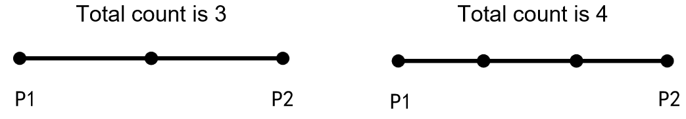

# Command Description

## Description of Command Functions 

## Arc Transition

Arc transition refers to using the smooth arc transition at the corner instead of angular transition. Activating the arc transition can make the robot's movement smoother, and the movement trajectory difference is shown in the following figure:

 

Diagram of trajectories with arc transition not activated (left) and with arc transition activated (right)

> Note:
>
> * R stands for the radius (mm) of the arc transition.
> * Activate arc transition at the point where you want to use arc transition. For example, in the figure above, you only need to activate arc transition at P2.

## Shared Parameters

For the command configuration interface of the three waypoint commands of the robot, you can choose to use shared parameters or set parameters by yourself. If shared parameters are used, the speed and acceleration values set under the subroutine node at the upper level of the waypoint will be automatically used.

## Create Program

 

* Meaning: The program that the robot is about to run.

* Application: The commands to be executed are placed in order below the new program; click the commands to modify the program name.

* Example: Let the robot perform joint movement from the starting point to the vertical posture.

 

> Note: If the module is not placed under "New Program", it will not be executed.

## Movement Command

The movement position of the robot will change with the change of the coordinate system. When the user sets the position under a certain coordinate system, if the program is run after the coordinate system is switched, all points will automatically switch to the corresponding position. For example, the initial set point is (0°, 0°, 0°, 180°, 90°, 20°). After the coordinate system is switched, the point is switched to a position relative to the switched coordinate system (0°, 0°, 0°, 180°, 90°, 20°). Therefore, the user needs to set the coordinate system before editing movement commands or moving the robot.

## MoveJ

 

* Meaning: Make the robot perform joint movement.

* Application: Click the command to open the setting interface and edit the name, speed, and acceleration of this command; Select whether to use the Cartesian position; Select stop or arc transition here; Select stop conditions; Edit the demonstration point.

 

MoveL editing interface

When using the joint movement, if the Cartesian position option is selected, the robot will calculate the corresponding joint angle value based on the Cartesian position of the robot saved in the current movement, and then move the joint to the set position.

## MoveJ Using the Cartesian Coordinate System

 

* Meaning: Use the points recorded in the Cartesian coordinate system to perform joint movement.

* Application: Use this command before the joint movement, and the subsequent joint movement will be performed in accordance with the points recorded in the Cartesian coordinate system. The movement mode is still joint movement, but the robot will automatically perform inverse solution.

## MoveL

 

* Meaning: Make the end of the robot perform linear movement.

* Application: Click the command to open the setting interface and edit the name, speed, and acceleration of this command; Select stop or arc transition here; Select stop conditions; Edit the demonstration point.

  

MoveL editing interface

## Relative MoveL

 

> Note: This is a new command of the 1.7 version of the APP, and the 1.5 version does not have this command for the time being.

* Meaning: A position change amount is set to let the robot perform the end linear movement relative to the current posture, where the position change amount is an incremental value in the current user coordinate system.

* Application: Click the command to open the setting interface, and edit the name, speed, acceleration, reference coordinate system, whether to use arc transition and stop conditions of this command as required; Edit the amount of position change.

* Example: The robot end moves 100mm along the negative direction of the Z-axis of the current user coordinate system.

 
 

## MoveC

 

Three points are required to complete the MoveC, the initial point, the passing point, and the end point. The initial point is the last point of the previous command, the passing point is the first point under the MoveC command, and the end point is the second point under the MoveC command. See in the following figure. 

Movement lap: The movement lap can only be an integer. When the number of laps is 0, the MoveC trajectory is an arc from the initial point to the end point. When it is 1, the system will automatically calculate the whole circle through the set initial point, passing point and end point. In this case, the MoveC trajectory is 1 full circle calculated by the system. When it is 2, the MoveC trajectory is 2 full circles calculated by the system, and the like.

 

Schematic diagram of the MoveC trajectory

 

MoveC editing interface

## MoveZ

 

* Meaning: The end of the robot maintains the current posture and performs Z-shaped movement.

* Application: Click the command to open the setting interface, edit the start position, end position and random passing position of the movement (the robot will perform Z-shaped movement on the plane determined by these three points), the width of the Z-shaped trajectory, the moving speed, the density of the Z-shaped trajectory, the arc transition or peak pause time (choose one).

**Width:** The width of the robot movement in the current plane;

**Density:** The distance between the peaks on the same side and the density determine the movement cycle of the robot; if the Z-shaped density is not set, the Z-shaped movement cycle is determined by the current movement speed of the robot;

**Peak pause time:** Every time a peak is reached (the red dot in the trajectory diagram), the robot pauses, and the points on the x side and-x side can be set with different pause time;

The plane perpendicular to the Z axis of the user coordinate system is used as the plane of the robot movement by default, and the user can also customize the movement plane, i.e. add a point to create a plane formed by the start point, the end point and the third point as the robot's Z-shaped movement plane, where the third point direction is the +X direction;

 

MoveZ editing interface

The diagram of the MoveZ trajectory is as follows:

 

MoveZ trajectory diagram

## MoveZS

 

* Meaning: The end of the robot rotates RZ while moving in the set direction.

* Application: Click the command to open the setting interface, edit the start position, end position and random passing position of the movement (the robot will move on the user coordinate system determined by these three points), the width of the trajectory, the moving speed, the density of the trajectory, the rotation angle (45°by default), the arc transition or peak pause time (choose one).

**Width:** The width of the robot movement in the current plane;

**Density:** The distance between the peaks on the same side and the density determine the movement cycle of the robot; if the Z-shaped density is not set, the Z-shaped movement cycle is determined by the current movement speed of the robot;

**Rotation angle:** The rotation angle in the positive or negative direction of the x-axis.

**Peak pause time:** Every time a peak is reached (the red dot in the trajectory diagram), the robot pauses, and the points on the x side and-x side can be set with different pause time;

The plane perpendicular to the Z axis of the user coordinate system is used as the plane of the robot movement by default, and the user can also customize the movement plane, i.e. add a point to create a plane formed by the start point, the end point and the third point as the robot's Z-shaped movement plane, where the third point direction is the +x direction;

 

MoveZS editing interface

The diagram of the MoveZS trajectory is as follows:

 

MoveZS trajectory diagram

## Waypoint Variable Management

> Note: This is a new command of the 1.7 version of the APP, and the 1.5 version does not have this function for the time being.

The JAKA Zu APP supports the movement waypoint function. Users can define the movement waypoint in the waypoint variable management and use the corresponding movement waypoint command to call and control the robot to move to the set waypoint position.

In the movement control interface, click the command bar on the left, enter the movement command {width="0.25in" height="0.21875in"}option, select "Settings" button, and enter the waypoint variable management interface. In the waypoint variable management interface, users can add, modify and delete movement waypoints according to actual needs, as shown in the figure below: 

 

Waypoint variable manager

## Movement Waypoint

 

> Note: This is a new command of the 1.7 version of the APP, and the 1.5 version does not have this command for the time being.

* Meaning: The point of TCP during the movement.

* Application: Click the command selection function to select custom waypoints or call waypoints defined in the waypoint variable management (for example, in the figure above, P1 is the waypoint in the waypoint variable management); Click the command to open the setting interface and edit the alias of this command (in the custom mode, this cannot be modified), speed and acceleration; select whether to use shared parameters, the Cartesian position (joint movement), and arc transition; select stop conditions (the program will skip this command when the robot meets the state set by the stop conditions).

> Note: This command needs to be used with the movement command box. If used alone, it is equivalent to the joint movement command.

* Example: The robot uses MoveJ to move from the position of waypoint 1 to the position of waypoint 2.

 

## Movement Command Box

 

> Note: This is a new command of the 1.7 version of the APP, and the 1.5 version does not have this command for the time being.

This works with the movement waypoint command to let the robot perform MoveJ or MoveL. Click the command of movement switching function to switch joint movement or linear movement; click the command to open the editing interface, and you can edit the name, speed, and acceleration of this command.

 

Movement command box editing interface

## Pallet Waypoint

 

* Meaning: Set the movement end point after the robot reaches each pallet point in the pallet program.

* Application: Click the command to open the setting interface and edit the name, speed, and acceleration of this command; you may select stop or arc transition here; select stop conditions; edit the demonstration point (this command only takes effect in the pallet command).

 

Pallet waypoint editing interface

> Note: This command only takes effect in the pallet box.

* Example: The end of the robot walks in a 3x3 square pallet and moves down by 100mm at each point.

 

## Trajectory Record

 

* Meaning: The recorded trajectories are reproduced. Trajectories to be reproduced can be collected by JOG or dragging.

* Application: In the drop-down list of instructions, you can select the trajectory to be used; click the command to open the setting interface, and you can edit the speed and acceleration of this command. The way to record the trajectory is shown in the following text.

 

Movement editing interface

## Set the Global Speed

 

Drop down the list to select an appropriate speed variable. After the global speed setting is enabled, the movement speed and acceleration of all subsequent MoveL and MoveJ commands will be consistent with the selected speed variable.

## Disable the Global Speed

 

After this command is executed, the global speed setting is disabled, and the subsequent MoveL and MoveJ restore the original movement speed and acceleration.

## Get Movement Waypoint Parameters

 

> Note: This is a new command of the 1.7 version of the APP, and the 1.5 version does not have this command for the time being.

* Meaning: Get the movement waypoint information in the waypoint variable management.

* Application: This can be sent to the host computer or assigned to variables.

* Example: Read the information of movement waypoint 1 in waypoint variable management. The host computer receives the movement waypoint 1 information in waypoint variable management.

 

## Get Robot-Related Parameters

 

* Meaning: Obtain the information of the robot\'s current joint position, tool end center position, flange center position, end load, end force, impact sensitivity and system time.

* Application: This can be sent to the host computer or assigned to variables.

* Example: The host computer receives the angle values of Joint 1-6 of the current robot.

 

## Obtain the Robot's UCS or TCS Settings

 

* Meaning: Obtain the robot's user coordinate system settings or tool coordinate system settings.

* Application: This can be sent to the host computer or assigned to variables.

* Example: The host computer receives the tool end coordinate value of the robot.

 

## Is the Cartesian Spatial Position Reachable

 

> Note: This is a new command of the 1.7 version of the APP, and the 1.5 version does not have this command currently.

* Meaning: Determine whether a given Cartesian position can be reached through Cartesian spatial movement based on the current position.

## IO Command

## Set the Digital Output

 

This command is an immediate command. When it is used in the program, the DO signal set by it will be output immediately.

Example: Move to the object placement point, and release the soft claw to place the object.

 

## Set the Digital Output During Movement

 

This command is a non-immediate command. When it is used in the program, the DO signal will not be output immediately until the robot starts to move.

## Wait Digital Input

 

This command is used to wait for a DI signal. When the time input in the command is 0, the program will wait until the command is true before executing the program under the command. When the input waiting time is not 0, if the conditions in the command is true, the program under it will be executed immediately. Otherwise, the program under it will be executed after waiting for the input time.

## Set Analog Output

 

This command is an immediate command. When it is used in the program, the AO signal set by it will be output immediately. The value of the analog output signal can be filled in the oval white box, and the value range is -65535 \~ 65535.

Example: When the robot moves to the standby point, the value of the control cabinet AO1 is set to 2048.

 

## Set Analog Output in Movement

 

This command is a non-immediate command. When it is used in the program, the AO signal will not be output immediately until the robot starts to move. The value of the analog output signal can be filled in the oval white box, and the value range is -65535 \~ 65535.

## Digital Input

 

This command is used to obtain the status of the digital input and needs to be used with other commands. It can be used as a judgment condition in the program. It is True when the DI status is consistent with the set one in the command.

Example: Determine the status of the current digital input. If the current digital input DI1 is ON, the robot moves from point A to point B.

 

## Digital Output

 

This command is used to obtain the status of the digital output and needs to be used with other commands. It can be used as a judgment condition in the program. It is True when the DO status is consistent with the set one in the command.

Example: Determine the status of the current digital output. If the current digital output DO1 is ON, the robot moves from point A to point B.

 

## Get Analog Input

 

This command is used to obtain the status of the digital input and needs to be used with other commands. The value of the analog input can be assigned to the variable by means of variable assignment.

Example: Assign the current analog input to the system variable named distance. If the distance value of the system variable is less than 10, the robot moves from point A to point B.

 

## Get Analog Output

 

This command is used to obtain the status of the analog output and needs to be used with other commands. The value of the analog output can be assigned to the variable by means of variable assignment.

Example: Assign the current analog output to the system variable named distance. If the distance value of the system variable is less than 10, the robot moves from point A to point B.

 

## Control Command

## Set the Tool Coordinate System

**①** **②** 

There are two ways to set the tool coordinate system in the control command: **①** **Manually input TCP**; **②** **Select the TCP established in the settings**.

Click the command to open the setting interface, and you can edit the name and coordinate values of the coordinate system. This coordinate system is available only in this program. (The default tool coordinate system is the end flange center).

 

Tool coordinate system editing interface

Example: Create a new TCP coordinate system in the program and observe the change of the robot end movement after setting the parameters.

 

## Set the UCS

**①****②**

There are two ways to set the user coordinate system in the control command: **① Manually input the user coordinate system**; **② Select the user coordinate system established in the settings**.

Click the command to open the setting interface, and you can edit the name and coordinate values of the coordinate system. This coordinate system is available only in this program (the default user coordinate system is the world coordinate system).

 

User coordinate system editing interface

Example: Create a new user coordinate system in the program and observe the change of the robot end movement after setting the parameters.

 

## Set the Payload and Centroid

 

When the payload changes during operation, it is necessary to use the command to set the payload. If the payload set during operation does not match the actual payload, the robot may tremble or alarm collision.

This command is used to modify the payload and the centroid during the operation of the program. There are two ways:

* Enter the actual payload and centroid directly in the table;

* Enter the numeric variable in the white oval box, and the initial value of the variable is the payload or centroid value you want to set.

 

## Set Collision Sensitivity

 

This command is used to set the collision sensitivity. There are 5 levels of impact sensitivity (1-5). The higher the level, the lower the sensitivity. In addition, the collision sensitivity can also be set in【Safety Settings】→【Collision Protection】.

## Waiting Command

**①****②**

There are two types of waiting commands: **① To set a specific waiting time**; **② To set a specific waiting condition**.

* **Specific waiting time:** After the waiting time is entered, the program will continue to run after waiting for the input time when running this command. If the set waiting time is 0s, the robot will wait all the time.

  Example: After the robot moves to point A, it pauses for 5s and continues to run.

 

* **Specific waiting condition:** After the judgment conditions are entered in the box, when running to this command, the robot will keep waiting until the judgment conditions are met before continuing to run the program;

  Example: Wait until the digital input DI1 is ON, and then the robot moves from point A to point B.

  

## Loop Command

**①****②****③****④**
**⑤**

There are five types of loop commands: **① Loop for a specific number of
times; ②Repeat Loop; ③ Conditional loop; ④ End loop; ⑤ Skip this loop**

* **Loop for a specific number of times**: When the program runs this command, the content included in the loop command will not end until it is repeatedly executed for a specific number of times or until the loop command ends.

  There are two ways:
  * Enter number of times of the loop in the white oval box;

  * Enter the numeric variable in the white oval box, and the initial value of the variable is the number of times of the loop.

* **Repeat Loop:** When the program runs this command, it will always repeat the contents in this command until the command to end the loop is performed.

* **Conditional loop**: The program will make a judgment upon running this command. When the judgment condition in the diamond space is met, the contents in this command will be repeated until the condition is not met or the loop command ends. Add a command condition in the diamond-shaped space, and if the condition is met, the contents of the command will always be looped.

  Example: If the condition is true, the robot will repeat the movement between points A and B.

 

* **End loop:** This command should be used with loop commands and judgment commands. When certain conditions are met, the loop closest to the loop end command is terminated. A judgment condition is added before this command, and the current loop is terminated immediately if the condition is true.

  Example: If the loop end condition is not true, the joint movement ABCD is executed. If the loop end condition is true, the joint movement AB is executed, then the current cycle is skipped without executing the joint movement CD, and the program terminates.

 

* **Skip this loop:** This command needs to be used with loop commands and judgment commands. When certain conditions are met, the loop closest to the loop end command is terminated. A judgment condition is added before this command. The current loop is skipped if the condition is true, and then the program returns to the original position of the loop to continue the loop.

  Example: If the condition for skipping this loop is not true, execute movement ABCD; if it is true, execute movement AB, skip movement CD, and continue to execute the loop from the beginning without jumping out of the current loop.

 

## If Command

**①** **②**

There are two types of judgment commands: **① If; ② If else**

* **If:**

This command is used to determine whether the condition in the conditional command is true, and if the condition is true, the program inside the framework is executed, otherwise it is not executed.

Example: If the current digital input DI1 is ON, the robot moves from point A to point B; If the current digital input DI1 is OFF, the robot only performs joint movement A.

 

* **If else:**

This command is used to judge whether the condition in the conditional command is true. If the condition is true, the program in Area A is executed. If the condition is not true, the program in Area B is executed, as shown in the following figure:

 

Example: If the current digital input DI1 is ON, the robot moves to point A, otherwise the robot moves to point B.

 

## Pallet Command

 

The pallet command is mainly used for palletizing, that is, items are stacked on the pallet according to the rules. This command needs to be used with the loop command.

There are three types of pallets: one-dimensional (line segment), two-dimensional (quadrilateral), and three-dimensional (cube). The trajectories are as follows: 

One-dimensional   Two-dimensional   Three-dimensional

The operation steps are as follows:

* Select the pallet type.

* Set the speed, acceleration, and whether to use arc transition, and select stop conditions.

* **Edit the point:** one-dimensional pallets need to set 2 points, two-dimensional pallets need to set 4 points, and three-dimensional pallets need to set 8 points. Click the pallet command to open the pallet editing interface, and click the circular number to enter the editing interface to editing points. Before editing a point, switch to the desired coordinate system and ensure that all points are in the same coordinate system, as shown in the following figure:

One-dimensional   Two-dimensional    Three-dimensional

* **Set the total count from Point X to Point X:** The total count is the number of artifacts, which is also the total number of points including Point 1 and Point 2. For example, in a one-dimensional pallet, if the total count from point 1 to point 2 is set to 3, the system will automatically divide the line segment from point 1 to point 2 into two equal segments and set a point at the midpoint. If the total number is 4, the system will automatically divide the line segment from point 1 to point 2 into three equal segments and set two points at the dividing points, as shown in the following figure:

* **Set the start point:** There are three ways to set the start point:
  * Enter the number of points or variables in the white oval box after the "start position" (when the value is less than 1, the program will report an error; when the value is greater than the total number of points, it will start from the first point of the pallet; when the value is within the range from 1 to the total number of points, the robot will start to run from the entered number of points). For example, for a two-dimensional pallet, if the total count from point 1 to point 2 is 3, and the total count from point 2 to point 3 is 3, then the total number of points is 3×3=9.
  * Add MoveJ or MoveL before the pallet movement. The start point of the movement is the initial point, and the end point is point 1.
  
* **Edit the loop command**: The number of times of the loop is related to the number of points. For example, to set a 3×3 pallet, if you want to pass through the 9 points, the number of times should be set to 9.

* **Insert other commands**: Other commands can be inserted into the pallet command box to enable the robot to complete the desired action.

  Example: The end of the robot walks in a 3x3 square pallet and moves down by 100mm at each point.

 

## Conveyor Tracking Command

 

This command makes the robot end follow the movement of the conveyor in real time. There are two types of conveyor tracking: **① Straight conveyor tracking**; **② Circular conveyor tracking**.

Before using the APP to carry out the conveyor tracking operation, the environment needs to be set up first, that is, connect the encoder to the control cabinet, and connect the robot by Modbus poll.

* **Linear conveyor tracking**: 

  * **Calculate the pulse equivalent:** Calculate the pulse equivalent by reading the change in the encoder pulse value and measuring how far the conveyor has moved. (The distance can be measured by a caliper, and the pulse value can be read by Modbus). The pulse equivalent calculation formula is as follows:

    Pulse equivalent = Distance (mm)/Pulse value (cnt)

  * **Set the conveyor direction:** There are two ways to set the direction of the conveyor:
  
    * Manual input: the conveyor direction XYZ indicates the direction of the position \[0,0,0\] pointing to \[X,Y,Z\] under the user coordinate system. For example, setting \[1,0,0\] indicates the positive direction along the X axis of the user coordinate system.
    * Set the start point and end point: Click the start point (end point)
      to confirm the robot's position. The current command will automatically
      calculate the movement direction of the conveyor according to the two
      points. The direction of the conveyor will point from the start point to
      the end point.

 

Linear conveyor editing interface

* **Circular conveyor tracking:**
  * **Calculate the pulse equivalent:** The pulse equivalent is the angle at which the conveyor rotates when the encoder sends a pulse. It can be determined by the angle at which the conveyor rotates when the encoder finishes a lap (the pulse value can be read by Modbus). The pulse equivalent calculation formula is as follows: 
  
    Pulse equivalent = Angle (°)/Pulse value (cnt)

  * **Ensure that the posture of the end tool is covariant:**
  
    * When the option "Covariant posture of the end tool" is selected, during the movement of the circular tracking conveyor, the end tool also synchronously rotates around the rotation axis of the conveyor, that is, the posture of the end tool in the current user coordinate system is changing;
    * When the option "Covariant posture of the end tool" is not selected, the posture of the end tool in the current user coordinate system remains unchanged during the movement of the circular tracking conveyor;

  * **Calibrate the center coordinate system of the conveyor:** The circular coordinate system of the conveyor is determined by the position coordinates of the three points on the conveyor: P1, P2, P3. The calibration of the positions of P1, P2 and P3 can through demonstrating their positions or directly inputting the coordinates.

     > Note: P1, P2, and P3 must be selected in turn according to the direction of conveyor movement, and their position coordinates must be relative to the world coordinate system.
        > When "Demonstrate three points position" is selected, follow the steps below to carry out circular conveyor tracking:
  
        * Determine a point P on the conveyor, and rotate the conveyor belt to move the point P to the working range of the robot;
        * Click the command to enter the setting interface of circular conveyor tracking, click P1 to enter the movement control interface, control the robot movement in the interface to make the end of the robot coincide with P (note that the user coordinate system at this time must be the "world"), and click "Confirm" to complete the calibration of P1;
        * Lift the robot tool and rotate the conveyor belt at a certain angle in the movement direction of the conveyor;
        * Click P2 in the setting interface of circular conveyor tracking to enter the movement control interface, control the robot movement in the interface to make the end of the robot coincide with P again (note that the user coordinate system at this time must be the "world"), and click "Confirm" to complete the calibration of P2;
        * Lift the robot tool again and rotate the conveyor belt at a certain angle in the movement direction of the conveyor;
        * Click P3 in the setting interface of circular conveyor tracking to enter the movement control interface, control the robot movement in the interface to make the end of the robot coincide with P again (note that the user coordinate system at this time must be the "world"), and click "Confirm" to complete the calibration of P3;
        * Click "Confirm" in the setting interface of circular conveyor tracking to complete the calibration of the circular coordinate system of the conveyor.
  
     
    Circular conveyor editing interface
  
  * **Write program**, the movement command that requires the robot to carry out conveyor tracking is embedded into the conveyor tracking module (the movement command in the conveyor tracking module must not be the MoveJ).

## Command Folding

 

Drag the command in this command to fold it into a single command.

Example: Fold the following commands.

  

## Output Log Type and Log Content

 

This command enables the user to customize the content of output logs. In the command drop-down list, can select the log type, including message, warning, and error. Enter a value in the log content or drag a string variable. The output log content can be viewed in the APP log information.

Example: Output the log contents pos1 and pos2 when the specified position is reached.

 

## Stop/Pause Program

 

In the command drop-down list, you can select to pause or stop a program, and this command can be added at any position in the program to stop or pause the program at this position.

## Multi-threaded Command

> Note: This is a new command of the 1.7 version of the APP, and the 1.5 version does not have this command currently.

* **Execute program**

 

This command is used when multiple programs are executed at the same time. When the program runs this command, the program in this command will be executed at the same time as the original program. The program within this command can be the main thread or sub-thread. When it is used as a sub-thread, the original program is the main thread; when it is used as the main thread, the original program is the sub-thread; up to five sub-threads can be inserted, but only one main thread can be used. When the main thread finishes running, the sub-threads also end.

Example: The first command executes the program file named 231 in the main thread mode, and the second command executes the program file named Sub-thread 1 in the sub-thread mode. The example program is as follows:

 

* **Thread operation**

There are two types of thread operation: wait and destroy.

**Wait:** When the command is run, wait for the programs in it to finish before running the programs after this command.

**Destroy:** When the command is run, the programs in it are terminated, and the programs after this command continues to run.

Example 1: After the robot moves to A, it executes Sub-thread 1 and moves to B at the same time. After Sub-thread 1 finished, the robot moves to C.

 

Example 2: After the robot moves to A, it executes Sub-thread 1 and moves to B at the same time. After terminating Sub-thread 1, the robot moves to C.

 

* **Thread mutual exclusion support**

 

When there are multiple subroutines in a main program, and the different programs have the same command, the use of thread mutual exclusion command can prevent conflicts between different commands. The same command can be placed in the thread mutual exclusion command box to prevent program errors due to the same command being executed at the same time. The execution order of the same command: if a command is executed first, then other identical commands are stopped until the execution of the repeat command being executed is completed.

Example: Sub-thread 1 is inserted into the main thread, and sub-thread 1 also contains the set system variable ABC. To avoid conflicts, the set system variable ABC can be placed in the command box of thread mutual exclusion support.

 

## Calculation Command

## Calculation Symbol

 

Six calculation methods are available: addition (+), subtraction (-), multiplication (\*), division (/), rem (%), and exponentiation (\*\*).

## Mathematical Function Calculation

 

Provide mathematical functions to calculate sine, cosine, tangent, arcsin, arccos, arctan, natural exponent, natural logarithm, round-up, round-down, rounding, absolute value, and square root.

## Comparison Operator

 

Comparison operators are available: less than, equal to, greater than, not equal to, less than or equal to, greater than or equal to, and returns true when the condition is met.

## AND

 

If both conditions in the diamond box are true, the returned result is true.

## OR

 

If two conditions in the diamond box are true or one of them is true, the returned result is true.

## XOR

 

If only one of the two conditions in the diamond box is true, the returned result is true.

## NOT

 

If the conditions in the diamond box are not true, the returned result is true.

## Position Calculation

* **Position calculation · · · Addition**

 

Add the two positions.

* **Position calculation · · · Subtraction**

 

Subtract the two positions.

* **Inverse transformation of position calculation**

 

Matrix inversion. The calculation position is in the Cartesian coordinate.

For example, if the coordinate of the set point P is [10,10,10,10,10,10\], the inverse transform position is [-10,-10,-10,10,-10,-10\].

* **Position transformation of position calculation**

 

Drag in the position variable or demonstration point, which are the incremental change of the robot\'s start position and relative start position, and the returned value of the command is the change result.

> Note: The position is calculated in Cartesian coordinates.

* **Calculate position distance**

 

Drag in the position variable or demonstration point, and the returned value of the command is the distance between the two points.

## Point Insertion

 

The command calculates the inserted point between two points according to the given coefficient, and the range of the coefficient is 0-1. Drag in the position variable or demonstration point, and the returned position of the inserted point. For example, set the coefficient as 0.5 or 0.25, and the position of the inserted point is as follows:

 

  **0.5**                                                                               **0.25**

## Transform Plane

 

To change in the XY(YZ/ZX) plane, rotate around the Z(X/Y) axis at the base point, then translate along the X(Y/Z) axis, and translate along the Y(Z/X) axis. Position variable, array variable, or demonstration point can be dragged to the base point, and the returned value of the command is the changed position.

Example: First, translate P along the direction of the user coordinate system \[0,10,10\], and then rotate P by 10° around the X-axis of the user coordinate system.

 

## Inverse (Forward) Kinematic Solution

 

* **Inverse kinematic solution to the Cartesian spatial value**

Use this command, enter the Cartesian spatial position, and calculate the joint angle value.

* **Forward kinematic solution to the joint angle value**

Use this command, enter the joint angle value, and calculate the Cartesian spatial position.

## Character Command

The escape characters available in string commands include \\\\, \\\',\\", \\n, \\t, and \\r, which correspond to the backslash symbol, single quotation, double quotation, line feed, horizontal tab character, and carriage return.

## String Concatenation

 

* Meaning: Connect the dragged variables or input strings in a certain order.

* Application: Click this command to edit the number (number of the white oval box: 1\~8) and the required array separators. Drag in variables or input strings. This command can return the connected string, and the returned value is a string variable.

 

* Example: Connect the following variables, A=8888, B=Hello, and C=\[1,2,3,4,5,6\], and the returned result is: 

  A:8888

  B:Hello

  C:1,2,3,4,5,6
  
  The example program is as follows:

 

 

## String or Array Length ()

 

* Meaning: Calculate the length of a string or array and return the length value.

* Application: Drag in a string variable or an array variable, or input a string, and the returned value is the length.

* Example: If the host computer needs to obtain the length 12 of the string variable "JAKA_AMAZING" and the length of the array variable\[1,2,3,4,5,6\], the example program is as follows:

{width="3.68799978127734in"
height="1.4154297900262467in"}

## String Comparison

 

* Meaning: Compare the size of two strings based on the ACSII code.

* Application: Drag in string variables or input string values str1 and str2. If str1=str2, 0 is returned. If str1\<str2, a negative value is returned. If str1\>str2, a positive value is returned.

* Example: For example, if you need to compare the size of string variables str1 and str2, the returned value should be negative. The example program is as follows:

 
 
 

## Format Output Strings

 

* Meaning: The specified data is output as a string in the specified format.

* Application: Click this command to edit the number (number of the white oval box: 1\~8) and the required array separators. You can drag in variables or input values. This command can return the formatted string, and the returned value is a string variable.

 

* Example: Obtain the information about the robot:

  Current joint position: \[0,90,0,90,180,0\]

  End load: \[0,0,0,0\]
  
  The example program is as follows:

 

 

## Enter Formatted String

 

 

* Meaning: Match a certain format of string and enter the matched data into the specified variable.

* Application: Click this command to edit the number (number of the white oval box: 1\~8) and the required array separators. You can drag in the specified variable or input the value, and the required value can be extracted from the specified variable. Formatted result variables support integer, floating and string variables, or constants.

  

* Example: Extract the array \[0,0,0\] in the string variable "End load is: 0,0,0". The example program is as follows:

 
  

## Convert Array to String

  

* Meaning: Converts an array into a string variable of a certain format.

* Application: Drag in variables of the array type to be converted following the "array". In the separators, you can enter a string separator.

* Example: For example, to convert an array variable \[1,2,3,4,5,6\] to "1a2a3a4a5a6", the example program is as follows:

 

## Convert String to Array

 

* Meaning: Convert a string of a certain format into an array variable.

* Application: Drag in string variables to be converted into arrays following the "string". In the separators, you can enter a string separator.
* Example: For example, to convert the string variable "1a2a3a4a5a6" to an array variable \[1,2,3,4,5,6\], the example is as follows:

 

## Access Subscript

You can access a variable in an array by setting an access subscript, or access multiple variables in an array at the same time by setting stepping.

*  

  * Meaning: Access the elements in the array variable.
  * Application: Drag in the array variable to be accessed and enter the subscript value of the array to be accessed. The index of the subscript starts from 0, and the like. The command returns the element accessed.
  * Example: Access the value with the subscript 3 in the array variable \[1,2,3,4,5,6\], and the return value is 4. The example program is as follows:

 

*  

  * Meaning: Access the elements in the array variable according to the desired subscript and stepping.
  * Application: You can drag in the array variable to be accessed and enter the subscript value and stepping of the array to be accessed. The index of the subscript starts from 0, and the like. The command returns the sub-array accessed.
  * Example: Access the value with the subscript 0,2,4 in the array variable \[1,2,3,4,5,6\], and the return value is \[1,3,5\]. The example program is as follows:

 

## Set Array Elements
 

* Meaning: Set the value of an element in an array.

* Application: Drag in the array variable to be set and enter the subscript value of the array element to be set. The index of the subscript starts from 0, and the like.

* Example: For example, to set the value with the subscript 0 in the array variable \[1,2,3,4,5,6\] to 888, i.e. change the array variable into \[888,2,3,4,5,6\], the example program is as follows:

 

## Communication Command

## Open SOCKET

 

* Meaning: Create TCP client and establish communication with TCP server.

* Application: Select the specified SOCKET ID in the drop-down list, and enter the IP address and port number of the TCP Server. When this command is executed, a connection between the TCP Client (robot) and the TCP Server will be established.

## Open SOCKET and Result Returned

 

* Meaning: Create TCP client, establish communication with TCP server, and return a Socket value.

* Application: Select the specified SOCKET ID in the drop-down list, and enter the IP address and port number of the TCP Server. The TCP Client (robot) and the TCP Server will be connected when this command is executed, and this command will get a returned value. If the connection is successful, it will return an integer value greater than 0; If the connection fails, the returned value is -1.

## Close SOCKET
 

* Meaning: Disconnect the specified SOCKET communication connection.

* Application: Select the specified SOCKET ID in the drop-down list. When this command is executed, the specified SOCKET communication connection will be disconnected.

## SOCKET Sending

 

* Meaning: Make the controller send variables to the TCP Server via SOCKET communication.

* Application: Select the specified SOCKET ID in the drop-down list, drag in a variable or enter a value, execute this command, and the TCP Server will receive the content of this variable.

> Note: The supported variable types include numbers, strings, and arrays. There is no special requirement for the format of the sent data, but Unicode characters are not supported.

## SOCKET Send and Result Returned

 

* Meaning: Make the controller send variables to the TCP Server via SOCKET communication.

* Application: Select the specified SOCKET ID in the drop-down list, drag in a variable or enter a value, execute this command, and the TCP Server will receive the content of this variable. This command will get a returned value. If the delivery is successful, the data length sent will be returned; If the delivery fails, the returned value is -1.

* Example: Connect the socket server, receive variables A, B, and C, and return the result. The example program is as follows:

  

## SOCKET Variable Receiving

 

* Meaning: Wait for ( ) s until the variable is received. The controller will send a data request string, and then enter the receipt waiting state.

* Application: Select the specified SOCKET ID in the drop-down list, and drag in the variable type to be received. If the variable is received within ( )s or not received even after the waiting time, the program will continue to execute subsequent steps (if the waiting time is set to 0s, the robot will wait until the condition is met). Variable names containing Unicode characters are not supported.

> Note: Variable types that can be received include numbers, strings and arrays, and the format of server data is:
>
> Numbers: \<variable name\>\<data content\>
>
> Strings: \<variable name\>\<\"data content\"\>
>
> Arrays: \<variable name\>\<\[data content\]\>

## SOCKET Array Receiving

 

* Meaning: The robot stops running within ( )s until it receives an array variable with a length of ( ). The controller will send a data request string, and then enter the waiting state.

* Application: Select the specified SOCKET ID in the drop-down list. If the variable is received within ( )s or not received even after the waiting time, the program will continue to execute subsequent steps (if the waiting time is set to 0s, the robot will wait until the condition is met). If fails to receive or exceeds the time, an empty array will be returned; If it is successful, the variable will be stored in the array.

> Note: The delivery format of server data is \[n1, n2, n3\...\]

* Example: Connect to the SOCKET server, receive the array variable C and return the result. The array length is 4.

 

## SOCKET Data Receiving

 

* Meaning: The robot stops running within ( )s until the data is received. Unlike other receipt commands, the controller does not send additional data when executing this command.

* Application: Select the specified SOCKET ID in the drop-down list. If the data is received within ( )s or or not received even after the waiting time, the program will continue to execute subsequent steps (if the waiting time is set to 0s, the robot will wait until the condition is met). If the receipt is successful, return the strings received. If the receipt fails or exceeds the time, an empty string is returned.

> Note: The variable type to be received is strings, and there is no special requirement for the delivery format of server data. Unicode characters are not supported.

* Example: Connect the SOCKET server, receive program variable B, and return the result.

 

## Refresh Semaphore
 

* Meaning: Refresh the semaphore defined in【Settings】→【Hardware and Communication】→【End IO】.

* Application: Select the semaphore to be refreshed in the command drop-down list, enter the refreshing frequency (Hz).

  Refreshing frequency: Subject the bus broadband, the sum of the refreshing frequency of all signals does not exceed 125Hz, and the system will automatically regulate it.

## Get Semaphore Status

 

* Meaning: Obtain the value of the semaphore.

* Application: Select the required semaphore in the command drop-down list, and the value returned by the command is the value of semaphore.

## Modbus Command Sending

 

* Meaning: Sending immediate control commands for TIO external devices.

* Application: Select the TIO channel used in the command drop-down list. Users can enter a hexadecimal data command at the byte array, and they do not need to add a verification code, for the system will automatically add it.

* Example: Set the position of a device to 500 and obtain the position. The example program is as follows:

  

## Subroutine Command

## Subroutine

 

* **Command-type subroutine**
  * Meaning: A command sequence is formed into a relatively independent program segment. If this program segment is added in programming, the program will run the sequence of commands in this program segment and return to its original position to continue running after the execution is completed. This relatively independent program segment is a subroutine.
  * Application: Add a subroutine of the command editing type, edit an independent program segment in the subroutine and save it. This subroutine can be added at any time in the main program and can be reused.

* **Script-type subroutine**
  * Meaning: The subroutine content is the preparation of a script syntax with a prescribed format.
  * Application: Add a subroutine of the script editing type, edit the script syntax with the required format in the subroutine and save it. This subroutine can be added at any time in the main program and can be reused.

## Add/Delete Subroutine

* **Add subroutine**

Click the plus sign on the right side of the subroutine title, select the type of subroutine, and click "Confirm" to complete. After the creation is completed, the programming area will automatically jump into the subroutine.

* **Delete subroutine**

Click the minus sign on the right side of the subroutine title, click the trash can icon on the right side of the subroutine, and click "Confirm".

## Edit Subroutine

In the subroutine command bar or in the program, click the subroutine command box to enter the subroutine editing interface. After editing the subroutine, save the main program again to ensure that the subroutine has been properly modified in the main program.

##  Variable Command

## Variable Operation

**Add variable**: Click the plus sign  on the right side of the variable title, select the variable type, click "Confirm" to enter the variable setting interface, fill in the required parameters, and click "Confirm" to complete. 4 types variables are available: system variables, program variables, speed variables, and position variables.

**Delete variable**: Click the minus sign  on the right side of the variable title, click the trash can icon on the right side of the variable to delete, and click "Confirm".

**Edit variable parameters**: In the variable command bar or in the program, click the variable box to enter the variable editing interface. After editing the variable, save the main program again to ensure that the variable has been properly modified in the main program.

## System Variable

 

> Note: This is a new command of the 1.7 version of the APP, and the 1.5 version does not have this command currently.

There are two ways to create system variables. In addition to the method described in 13.1.9.1, you can also create and use them in【Settings】→【Program Settings】→【System Variables】. The system variable is a variable in the control cabinet. When the robot is shut down or the program is deleted, this variable will not be cleared or disappear, and can be called in any program. The system variable type is numbers.

 

System variable editing interface

## Program Variable

 

> Note: This is a new command of the 1.7 version of the APP, and the 1.5 version does not have this command currently.

Program variables are variables created and used in the current program. The variable follows the program and can only be used in this program. They are not available in other programs. If the program is deleted, the program variables created in this program will also be deleted. There are three types of program variables: numbers, strings, and arrays.

Program variable naming supports Chinese format. Note that in the communication with third parties, variable names in Chinese may be displayed in garbled characters due to coding problems.

 

Program variable editing interface

## Speed Variable

 

> Note: This is a new command of the 1.7 version of the APP, and the 1.5 version does not have this command currently.

The speed variable is a special variable that can be called on or off in the program by the global speed command in the movement command. The robot movement speed in the program can be controlled according to the actual working conditions. When the speed variable is called, the movement speed after this command is subject to the speed selected in the speed variable, and the speed in the movement command does not take effect. Like program variables, the speed variable can only be used in the current program and cannot be used in other programs.

> Note: The speed variable can be sent through the SOCKET command. The delivery content includes the joint speed, joint acceleration, linear speed, and linear acceleration.

 

Speed variable editing interface

## Position Variable

 

> Note: This is a new command of the 1.7 version of the APP, and the 1.5 version does not have this command currently.

The position variable is a specific variable that applies to the movement command or position calculation command and cannot be called in other commands. The position variable can set the Cartesian position and joint position of the robot. You can click the text box for direct input, or click Edit to enter the robot manual operation interface for robot positioning. When setting the Cartesian position, pay attention to the selection of the coordinate system. When the set coordinate system is inconsistent with the actual situation, there will be deviation of the robot point position, thus causing potential safety hazards. When the position variable is placed in the movement command, the robot moves according to the point information in the movement type selection variable. Like program variables, the position variable can only be used in the currently open program and cannot be used in other programs.

 

Position variable editing interface

 

In the white oval input box, enter fixed values, variables, and values obtained by SOCKET to assign data to variables.

> Note: If you want to assign values to the whole array variable, you need to add \[\] before and after the specific value.

 

If you assign a value to a string, you need to add "" (double quotation in English) before and after the content.

 

## Extension Command

The extension command needs to be used with JAKA's force control products.

## Flexible Control of Constant Force

* **Flexible parameter settings of constant force**

    

  * Meaning: Set the flexible parameters in the constant force mode.
  
  * Application: Select the direction in which the force control sensing function needs to be activated, and set the damping force (when the program is executed, the greater the rigidity of the external environment, the greater the damping force to be set; in the drag-and-drop mode, it is recommended to set the Fx, Fy, Fz greater than 10N, Mx, My, Mz greater than 0.2Nm, and the set value cannot be 0), rebound force (to enable the robot to return to the preset trajectory; the larger the value, the less likely the robot will deviate from the preset trajectory), constant force value (to ensure that the contact force between the end of the robot and the external environment is within the range of the set constant force value), and direction tracking function (normal tracking).

 

Constant force flexible parameter editing interface

* **Activate the flexible control of constant force**

 

Activate the constant force mode and select whether to initialize.

Initialization: Compensate for the offset and payload of the sensor (ensure that the sensor does not contact with external force in this mode);

Non-initialization: Adopt the previous compensation value.

* **Disable the flexible control of constant force**

 

Exit the constant force mode.

## Speed Flexible Control

* **Speed flexible parameter settings** 

   

  * Meaning: Set the flexible parameter in the speed mode.
  
  * Application: Configure the deceleration level, and at most three-speed deceleration can be configured. When the force at the end of the robot is greater than the set value of the control force, the robot will decelerate until the sensor detection value is less than the set value of the control force. Users can set the percentage of each deceleration to the original speed.

  

Speed flexible control editing interface

* **Activate speed flexible control**

 

Activate the speed mode and select whether to initialize.

Initialization: Compensate for the offset and payload of the sensor (ensure that the sensor does not contact with external force in this mode);

Non-initialization: Adopt the previous compensation value.

* **Disable speed flexible control**

 

Exit the speed mode.

* **Flexible control force**

 

This is used to set the control force in the speed flexible control mode.

 

Flexible control force editing interface

## Movement Stop Condition

 

  * Meaning: Set conditions for early termination of movement.

* Application: Select the direction to be monitored and set the upper or lower limit value. When the external force value is less than the lower limit value or greater than the upper limit value, the movement termination condition is triggered. This command monitors the next movement command. If the movement termination condition is triggered, the robot will immediately move from the current position to the position of the next movement command. Note that to use this command, all parameters must be set to 0 in the "Flexible parameter settings of constant force" with no direction selected.

 

Movement termination condition editing interface

## Set Force Control Coordinate System

 

* Meaning: Set the coordinate system used in the force control mode (to ensure that the direction of the coordinate system is consistent with the direction of the sensor).

* Application: Select the tool coordinate system, and the robot end position is relative to the tool coordinate system; select the world coordinate system, and the robot end position is relative to the robot base coordinate system.
