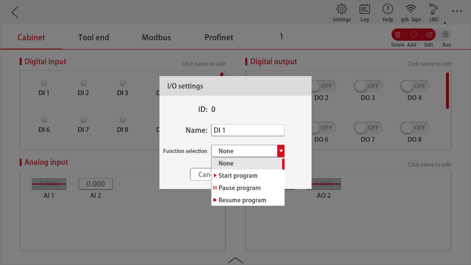

# Function IO

## Description of Function IO 

In I/O interface, DI can be set up. Select the function for DI in the function selection box, and click "Confirm". When the DI signal is triggered, the function will be enabled. The current DI signal supports the following functions: start program, pause program, continue running program, stop program, power on, power off, enable the robot, disable the robot, Level 1 reduced mode, Level 2 reduced mode, protective stop, return to initial position, clear fault, enter or exit drag-and-drop mode. Function trigger conditions, as shown in the following table:

| **Function Name**    | **Trigger mode** |
| -------------------------- | ---------------------- |
| Start program              | Rising signal          |
| Pause program              | Rising signal          |
| Continue running program   | Rising signal          |
| Stop program               | Rising signal          |
| Power on                   | Rising signal          |
| Power off                  | Rising signal          |
| Enable the robot           | Rising signal          |
| Disable the robot          | Rising signal          |
| Level 1 reduced mode       | Low level signal       |
| Level 2 reduced mode       | Low level signal       |
| Protective stop            | Low level signal       |
| Return to initial position | Rising signal          |
| Clear fault                | Rising signal          |
| Enter drag-and-drop mode   | Rising signal          |
| Exit drag-and-drop mode    | Rising signal          |

Note:

Clear fault only clears the collision alarm, and other abnormal alarms cannot be cleared.

The level 2 reduction should be less than the level 1 reduction. Set the reduction multiplier in【Settings】→【Safety Settings】→【Protection System】.

NPN for input 24V OFF, PNP for input 24V ON.

In the I/O interface, you can set the function of the DO. In the function selection box, set the predefined system status variables bound by the DO. Then click “Confirm”, the DO signal will reflect the status of system state variables in real time. The current DO signal supports the following functions: idle, program paused, program running, error, power-on, enabled, in movement, static, cabinet power-on, system emergency stop button status, reduced status, system protective stop status, safety position, etc.

The signal status in different status are as follows:

| **Robot status**              | **Signal status** |
| ----------------------------------- | ----------------------- |
| Idle                                | High level signal       |
| Program paused                      | High level signal       |
| Program running                     | High level signal       |
| Error                               | High level signal       |
| Power-on                            | High level signal       |
| Enabled                             | High level signal       |
| In movement                         | High level signal       |
| Static                              | High level signal       |
| Cabinet power-on                    | High level signal       |
| System emergency stop button status | High level signal       |
| Reduced status                      | High level signal       |
| System protective stop status       | High level signal       |
| Safety position                     | High level signal       |

Note:

The idle status is the status where the robot does not run the program and has nothing to do with the status of the robot.

The error status is the collision alarm status triggered by the robot.

The in-movement status is triggered when the robot is in movement (running program movement, manual control, secondary development control movement, etc.), regardless of the program status.

The static status is that the robot is in a static status (program paused, program not running, program ended, waiting for signal, etc.), regardless of the program status.

The cabinet power-on status means that the control cabinet is in the power-on status and has nothing to do with the robot status.

The reduced status is whether the robot triggers the level 2 reduced mode status.

The safety position status DO is the position of the custom configuration set by the user in the safety settings. When the robot is in this position, this signal will be triggered.  

DI function diagram  

DO function diagram  

