## **名词解释**

| 名词 | 说明 |
| ---- | ----|
| SRCI | Standard Robot Control Interface。 |
| JSI | JAKA SIMATIC Interface，节卡SIMATIC接口。 |
| SRL | SIMATIC Robot Library，西门子在PLC端的机器人库，用于提供对应SRCI的功能块（FB）等。 |
| EDK | Easy Development Kit，西门子提供的SRCI协议解析器。 |
| RI | Robot Interface，其状态一般用来表示SRCI通讯是否建立。 |
| RA | Robot Arm，机器人本体。 |
| RC | Robot Controller，机器人控制器。 |
| TCP | Tool Center Point，工具中心点。 |
| TCS | Tool Coordinate System，工具坐标系。 |
| UCS | User Coordinate System，用户坐标系。 |
| WCS | World Coordinate System，世界坐标系。 |
| WCP | Wrist Center Point，用于配置机器人本体肩肘腕姿态参数。 |
| M/O | Mandatory/Optional，SRCI手册要求的必须和可选功能。 |

## **前言**  

SRCI是PLC控制机器人的新标准接口，该接口允许在PLC中直接对机器人进行编程和控制。

SRCI的目标是使数据包和PLC库功能标准化。这使得用户能够在不同的机器人之间切换，而无需重写任何代码。

注意

> 不同时期发布的版本，对于SRCI功能支持程度会有所调整。请仔细阅读以下内容，尤其是针对***风险项***的说明。

### 软硬件支持
- JAKA 部分
  - 机器人硬件：全系通用（***开启PROFINET支持***）
  - 需要将PROFINET的GSDML文件版本更新至***GSDML-V2.41-JAKA-JAKARobot-20231017.xml***
  - 机器人控制器：1.7.1_25及以上（控制器版本和SRCI AddOn版本需要匹配）
  - App：1.7.1_22及以上
  - AddOn：JSI（1.6.27）或以上
- 西门子PLC部分
  - PLC 1500以上规格， 例如1516-3 PN/DP
  - PLC要支持PROFINET功能
  - PLC要具备相应的SRL库（需要西门子的单独授权）

| 控制器版本      | AddOn | 
| ------------- | ----------------- | 
| 171.26rc      | 1.6.28 | 

### 版本说明

SRCI定义了三种功能组，这三个组内包含了所有接口功能：
| Profile Core | Profile Extended | Profile Optional |
| ------------- | ----------------- | ---------------|
| 包含接口的核心功能 包含基础指令 | 包含所有核心配置文件中未定义的强制指令 | 包含所有可选功能 |

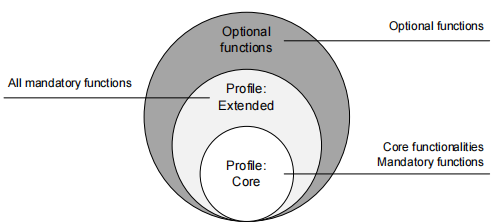

> 节卡将主要支持有限制的**Core**

#### 缩减范围的Core

以下是缩减范围的Core支持的功能：

> 整个Core的实现依赖于Core功能中部分基础指令的实现，这类基础指令可以理解为支持Core运行的前置指令，并不需要客户单独使用，所以不在此处列出。
>
>
> 部分指令的支持程度各异，会单独说明。

- `ChangeSpeedOverride`

- `EnableRobot`

- `GroupContinue`

- `GroupInterrupt`

- `GroupJog`

- `GroupReset`

- `GroupStop`

- `MoveAxesAbsolute`

- `MoveDirectAbsolute`

- `MoveLinearAbsolute`

- `ReadActualPosition`

- `ReadToolData`

- `ReadFrameData`

- `ReadLoadData`

- `ReadRobotDefaultDynamics`

- `ReadRobotReferenceDynamics`

- `ReadRobotSWLimits`

- `WriteToolData`

- `WriteFrameData`

- `WriteLoadData`

- `WriteRobotDefaultDynamics`

- `WriteRobotReferenceDynamics`

  

#### 限制

在使用JSI指令前，需要明确了解以下限制：

- 暂未支持OperationMode的设置，JSI在使用时默认一直处于OperationMode=4（外部自动）的情况

- 使用PLC控制机器人时，机器人仅上报运动相关报错，报错时，请至PLC端TIA软件中的Robot_UserData->SystemLog中查看机器人的详细错误代码。

- ***当前不支持的功能：***
  - ***SYNC功能，PLC和机器人端的信息不会自动同步，需要使用对应的读写函数手动同步***

  - ***ReturnToPrimary***

  - ***LogLevel***

  - ***StepMode in EnableRobot***

  - ***部分UserData内容：DelayTime, InterpreterCycleTime,  Accelerating, ConstantVelocity, IsBlending***

#### 风险项

在使用JSI指令前，需要明确了解以下风险项：

- 在使用MoveDirectAbsolute以及MoveLinearAbsolute指令时，需要特别注意PLC端ConfigMode的设置，由于协作机器人的机械构型与传统工业机器人略有不同，因此无法完全契合SRCI中对于Shoulder、Elbow和Wrist的定义，如果您无法确定人为设置ConfigMode后机器人的运动轨迹，请尽量在使用前修改配置为如下：

  - `ConfigMode.Shoulder=1` ("*No change*")

  - `ConfigMode.Elbow=1` ("*No change*")

  - `ConfigMode.Wrist=1` ("*No change*")

- 执行任何运动指令前，请确保全局的运行速率和指令的运行速率处于一个可接受的安全范围内。
- 同时使用App和SRCI的AddOn将不符合“单点控制”的要求，会带来意料外的风险（包括但不限于意料外的运动或者报错信息丢失等等），因此请避免同时使用。
- 控制器版本和SRCI的AddOn版本要严格对应，混用可能带来意料外的风险。

#### 使用JAKA安全设置
配合JAKA的安全功能以保障操作人员的安全性。JAKA提供如下的安全功能（外部IO触发）：
1. 附加急停
2. 附加保护性停止
3. 缩减模式（可以设置相应的末端速度、机器人功率等）  
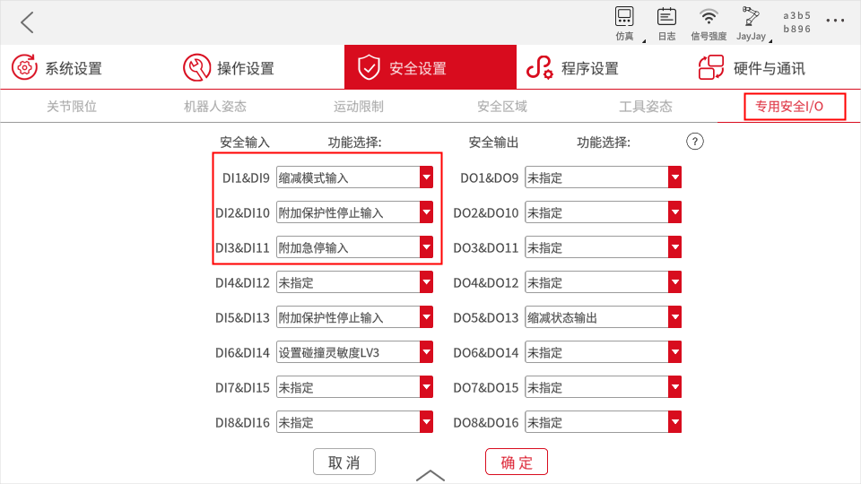

## 指令说明

> 符号解释：
>
> √ 代表运行JSI时，此参数的定义和表现与SRCI标准一致。  
> × 代表暂不支持。  
> ! 代表有条件的支持。

### ChangeSpeedOverride

- ChangeSpeedOverride修改除GroupJog和FreeDrive外的所有运动指令的运行速率。
- 指令支持在运动中修改，即运动中的运行速率设置是生效的。
- RI初始化后修改运行速率为5%。

#### 指令参数

| 参数     | 数据类型  | 单位  | M/O  | 备注 |
| :------- | -------- | ---- | ---- | :--- |
| Override | REAL     | [%]  | M    | √   |

### EnableRobot

- 节卡机器人允许单独操作Power On/Off（机械臂上下电）和Enable/Disable（机械臂上下使能），这个和其他普通工业机器人有所不同。
- Enable之前必须要Power On；Power Off之前必须要Disable。
- Enable（上使能）表示机器人可以接收运动指令。

> 仅支持operationmode=4（外部自动）的情况。  
>
> 一般情况下，使用EnableRobot指令后只需5s便可使能机器人进行操作。
>
> 但在特殊情况下，比如遭遇碰撞或急停后再次发送该指令，时长可能会延至20s。这是因为Enable（使能）机器人的前提是Power On（上电）机器人。在一般情况下，Power On这个过程已由AddOn程序完成，所以用户直接发送Enable指令即可操作。但在特殊情况下，机器人急停后处于掉电状态（Power Off），此时AddOn依然在运行，并不会重新上电机器人。所以当再次发送Enable指令后，机器人会先给自己上电（Power On）（该过程大约为15s），而后再执行Enable指令（5s）。

| 参数       | 数据类型  | 单位 | M/O  | 备注          |
| ---------- | -------- | ---- | ---- | -----------  |
| HoldToRun  | BOOL     | -    | M    | √            |
| StepMode   | USINT    | -    | M    | ! 仅支持0    |
| ManualStep | BOOL     | -    | O    | ×            |

#### 响应参数

| 参数    | 数据类型  | 单位 | M/O  | 备注 |
| ------- | -------- | ---- | ---- | ---- |
| Enabled | BOOL     | -    | M    | √    |

### GroupContinue

该函数会让状态为 "Interrupted"的运动指令继续执行，在运动指令中断的情况下恢复运动。

### GroupInterrupt

该功能中断所有活跃运动指令，在运动指令运动会中断运动并使所有关节停止，但已规划的路径不会清除，可以通过GroupContinue继续。

节卡支持GroupInterrupt时jog机器人，***此时会自动切换到第二序列***。

GroupStop的优先级大于GroupInterrupt，调用时将终止GroupInterrupt。

### GroupJog

GroupJog模式共有JogFrame、JogTool和JogAxes，节卡均支持。

### GroupReset

- 使用groupreset将清除ReadMessages读取的信息，包括错误、警告等信息。
- 主要使用场景是：
  - 控制器错误，如pstop（保护性停止）
  - addon的SRCI功能表现异常时

### GroupStop

清除当前活跃序列的运动指令，并清空运动指令缓存。

### MoveAxesAbsolute

该函数给出到达绝对位置的未定义路径的运动。

#### 指令参数

| 参数              | 数据类型             | 单位 | M/O  | 备注                       |
| ----------------- | ------------------- | ---- | ---- | --------                  |
| JointPosition     | RobotJointPosition  | -    | M    | ！不支持外部轴             |
| VelocityRate      | REAL                | [%]  | M    | √                         |
| AccelerationRate  | REAL                | [%]  | M    | √                         |
| DecelerationRate  | REAL                | [%]  | O    | ×                         |
| JerkRate          | REAL                | [%]  | O    | ×                         |
| ToolNo            | USINT               | -    | M    | 支持0-15，默认0为法兰坐标系 |
| AbortingMode      | USINT               | -    | M    | √                         |
| BlendingMode      | USINT               | -    | M    | ！参考单独的blending说明   |
| BlendingParameter | ARRAY[0..1] of REAL | -    | M    | √                         |

### MoveDirectAbsolute

通过给定的笛卡尔位置计算出一条最快到达目标位置（关节位置）的路径，目标位置根据ConfigMode的ConfigParameters计算。

#### 指令参数

| 参数             | 数据类型                 | 单位 | M/O  | 备注                                    |
| ---------------- | ----------------------- | ---- | ---- | ---------------------------             |
| Position         | RobotCartesian Position | -    | M    | ！不支持外部轴                           |
| VelocityRate     | REAL                    | [%]  | M    | √                                       |
| AccelerationRate | REAL                    | [%]  | M    | √                                       |
| DecelerationRate | REAL                    | [%]  | O    | ×                                       |
| JerkRate         | REAL                    | -    | O    | ×                                       |
| ToolNo           | USINT                   | -    | M    | 支持0-15，默认0为法兰坐标系， -1表示当前   |
| FrameNo          | USINT                   | -    | M    | 支持0-15，默认0为世界坐标系， -1表示当前   |
| AbortingMode     | USINT                   | -    | M    | √                                       |
| BlendingMode     | USINT                   | -    | M    | ！参考单独的blending说明                  |
| ConfigMode       | ConfigParameters        | -    | M    | ！参考单独的构型说明                      |
| TurnMode         | USINT                   | -    | M    | ! 仅支持2                                |

### MoveLinearAbsolute

该函数给出到达基于指定坐标系的实际笛卡尔位置的插补直线运动路径，通过ConfigMode的ConfigParameters可以明确目标位置。

#### 指令参数

| 参数             | 数据类型                | 单位 | M/O  | 备注                          |
| ---------------- | ----------------------- | ---- | ---- | --------------------------- |
| Position         | RobotCartesian Position | -    | M    | ！不支持外部轴               |
| VelocityRate     | REAL                    | [%]  | M    | √                           |
| AccelerationRate | REAL                    | [%]  | M    | √                           |
| DecelerationRate | REAL                    | [%]  | O    | ×                           |
| JerkRate         | REAL                    | -    | O    | ×                           |
| ToolNo           | USINT                   | -    | M    | 支持0-15，默认0为法兰坐标系   |
| FrameNo          | USINT                   | -    | M    | 支持0-15，默认0为世界坐标系   |
| AbortingMode     | USINT                   | -    | M    | √                           |
| BlendingMode     | USINT                   | -    | M    | ！                          |
| ConfigMode       | ConfigParameters        | -    | M    | ！参考单独的构型说明         |
| TurnMode         | USINT                   | -    | M    | ！ 仅支持2                  |

### ReadActualPosition

读取基于指定坐标系的当前（TCP）位置。

#### 指令参数

| 参数           | 数据类型  | 单位 | M/O  | 备注                     |
| -------------- | -------- | ---- | ---- | ----                    |
| ToolNo         | INT      | -    | M    | ！ 支持0-15，-1表示当前   |
| FrameNo        | INT      | -    | M    | ！ 支持0-15，-1表示当前   |

#### 响应参数

| 参数                | 数据类型      | 单位 | M/O  | 备注  |
| ------------------ | ------------- | ---- | ---- | ---- |
| Position           | RobotPosition | -    | M    | √    |

### ReadFrameData

读取基于FrameNumber的用户坐标系设置。
#### 指令参数

| 参数           | 数据类型  | 单位  | M/O  | 备注                      |
| -------------- | -------- | ---- | ---- | ----                      |
| FrameNo        | INT      | -    | M    | ！ 支持0-15，-1表示当前    |

### ReadLoadData

读取基于LoadNo的负载数据。

#### 指令参数

| 参数   | 数据类型  | 单位  | M/O  | 备注                      |
| ------ | -------- | ---- | ---- | ----                       |
| LoadNo | INT      | -    | M    |  ！ 支持1-15，-1表示当前    |

#### 响应参数

| 参数         | 数据类型  | 单位 | M/O   | 备注                    |
| ------------ | -------- | ---- | ---- | ----------------------- |
| LoadData     | LoadData | -    | M    | ！支持X、Y、Z和Mass的读取 |

### ReadRobotDefaultDynamics

读取机器人默认动力学参数

#### 响应参数

返回DefaultDynamics，结构如下：

| 参数              | 数据类型 | 单位 | M/O   | 备注        |
| ---------------- | -------- | ---- | ---- | ----        |
| VelocityRate     | REAL     | [%]  | M    | √           |
| AccelerationRate | REAL     | [%]  | M    | √           |
| DecelerationRate | REAL     | [%]  | O    | ×，返回-1   |
| JerkRate         | REAL     | [%]  | O    | ×，返回-1   |

### ReadRobotReferenceDynamics

读取机器人参考动力学参数

#### 响应参数

返回ReferenceDynamics，结构如下

| 参数                   | 数据类型 | 单位     | M/O  | 备注 |
| --------------------- | -------- | ------- | ---- | ---- |
| VelocityReference     | REAL     | [mm/s]  | M    | √    |
| AccelerationReference | REAL     | [mm/s2] | M    | √    |
| DecelerationReference | REAL     | [mm/s2] | O    | ×    |
| JerkReference         | REAL     | [mm/s3] | O    | ×    |

### ReadRobotSWLimits

读取机器人关节正负软限位

#### 响应参数

返回ReferenceDynamics，结构如下

| 参数                                                           | 数据类型 | 单位    | M/O  | 备注  |
| ---------------------                                          | ------- | ------- | ---- | ---- |
| J1LowerLimit, J1UpperLimit ~ J6LowerLimit, J6UpperLimit  | REAL    | [mm/s]  | M    | √    |
| E1LowerLimit, E1UpperLimit ~ E6LowerLimit, E6UpperLimit  | REAL    | [mm/s]  | M    | ×    |

### ReadToolData

读取基于ToolNumber的工具坐标系设置

#### 指令参数

| 参数            | 数据类型   | 单位  | M/O  | 备注                    |
| -------------- | --------   | ---- | ---- | ----------------------- |
| ToolNo         | USINT      | -    | M    | ！仅支持1~15            |

#### 响应参数

| 参数         | 数据类型  | 单位 | M/O   | 备注                    |
| ------------ | -------- | ---- | ---- | ----------------------- |
| ToolData     | ToolData | -    | M    | √                       |

### WriteFrameData

基于FrameNo写入用户坐标系数据

#### 指令参数

| 参数            | 数据类型     | 单位 | M/O  | 备注                    |
| --------------  | --------    | ---- | ---- | -----------------------|
| FrameNo         | USINT       | -    | M    | ！仅支持1~15            |
| FrameData       |  FrameData  | -    | M    | √                       |

>referenceFrame不可以是一个已经使用referenceFrame（不为0）的坐标系

### WriteLoadData

基于LoadNo写入负载数据

#### 指令参数

| 参数            | 数据类型 | 单位  | M/O  | 备注                       |
| -------------- | -------- | ---- | ---- | -----------------------    |
| LoadNo         | USINT    | -    | M    | ！仅支持1~15                |
| LoadData       | LoadData | -    | M    | ！仅支持X、Y、Z和Mass的写入 |

### WriteRobotDefaultDynamics

写入机器人默认动力学参数

#### 指令参数

| 参数              | 数据类型 | 单位  | M/O  | 备注 |
| ---------------- | -------- | ---- | ---- | ---- |
| VelocityRate     | REAL     | [%]  | M    | √    |
| AccelerationRate | REAL     | [%]  | M    | √    |
| DecelerationRate | REAL     | [%]  | O    | ×    |
| JerkRate         | REAL     | [%]  | O    | ×    |

### WriteRobotReferenceDynamics

写入机器人参考动力学参数

| 参数              | 数据类型 | 单位 | M/O   | 备注 |
| ---------------- | -------- | ---- | ---- | ---- |
| VelocityRate     | REAL     | [%]  | M    | √    |
| AccelerationRate | REAL     | [%]  | M    | √    |
| DecelerationRate | REAL     | [%]  | O    | ×    |
| JerkRate         | REAL     | [%]  | O    | ×    |

### WriteToolData

基于ToolNo写入用户坐标系数据

#### 指令参数

| 参数            | 数据类型   | 单位  | M/O  | 备注                    |
| -------------- | --------   | ---- | ---- | ----------------------- |
| ToolNo         | USINT      | -    | M    | ！仅支持1~15            |
| ToolData       |  ToolData  | -    | M    | √                       |

## 部署步骤 #
### 申请授权
1. 请向当地西门子销售团队申请获取SRL的许可证、demo、手册等资料；
2. 请向当地JAKA销售团队申请获取SRCI（机器人端）的AddOn、demo、手册以及GSDML文件等资料；

### AddOn准备
1. 检查控制器的PROFINET是否打开；  
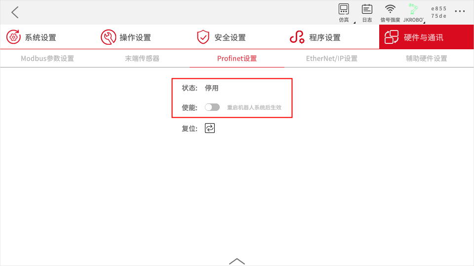
2. 请参考（https://jakacobot.github.io/guide/addOn/1.1-AboutAddOn.html）了解AddOn相关信息；
3. 安装对应版本的Tool-Kit；
4. 安装SRCI对应的AddOn，并使能该AddOn（等待片刻，控制器自动Power On）。

### PLC准备
1. SD卡初始化（PLC在下载程序到新的SD卡时，需要先复位存储卡的存储区域，再下载，否则可能会出现需要密码的情况）；
2. 导入JAKA提供的GSDML文件；
3. 准备PROFINET组态；  
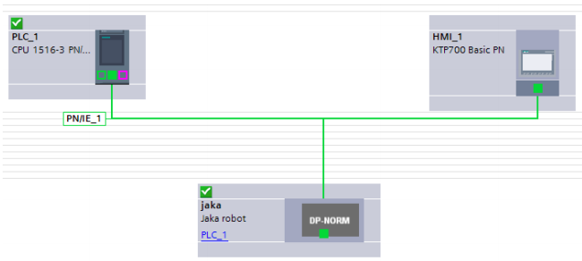  
4. 设定PROFINET通讯周期（8ms）；  
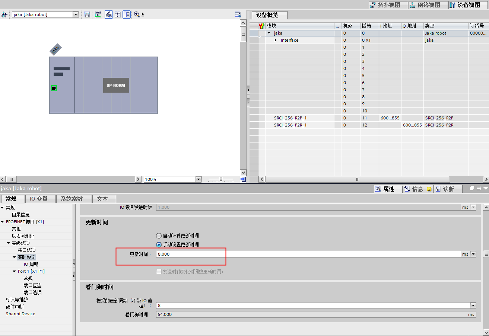
5. 设定循环中断时间（8ms）；   
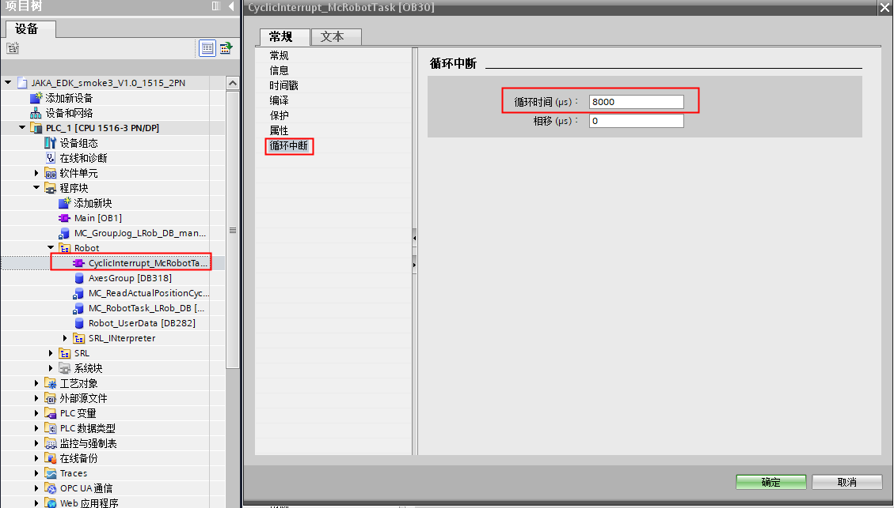
1. 设置SRCI数据的时候需要保持数据的起始地址和RobTask的起始地址一致，否则会出现无法初始化的情况；   
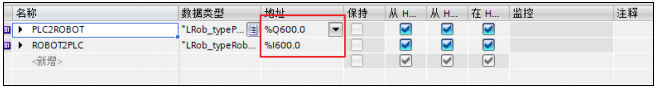 
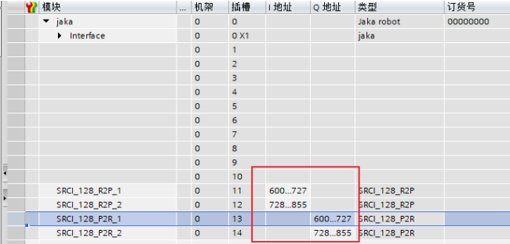

## 故障排查
一般排查顺序
1. 检查机器人控制器版本和SRCI AddOn版本是否对应；
2. 检查AddOn是否运行；
3. 检查机器人和PLC的PROFINET是否建立通讯（PLC功能是否使用了正确的JAKA的GSDML文件）；
4. 检查PLC的PROFINET数据帧是否配置；
5. 如果依然不行，联系JAKA售后支持（或发邮件至SRCI.Support@jaka.com， 附上AddOn导出文件）。
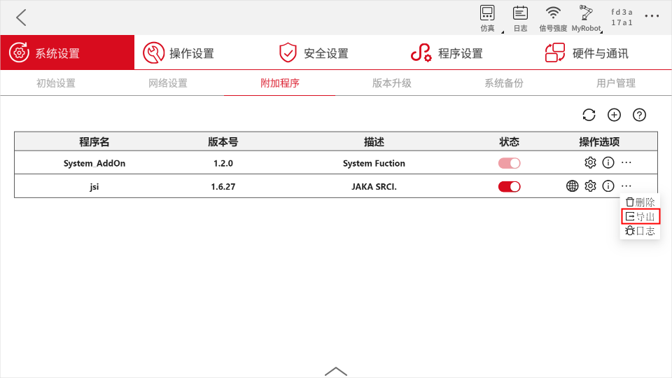
   
JSI通讯建立失败的排查顺序为：
1. 确认JAKA端PROFINET是否正常运行并与PLC连接；
2. 确认PLC端配置信息是否有误；
3. 如果经常断连，则检查交换机是否符合PROFINET要求，或者不经过交换机，将PLC和控制柜进行直连；
4. 如果PROFINET已正常连接，则为JSI的通讯问题；
5. 如果需要HMI仿真的话，要设置“PG/PC接口”（详细情况请咨询西门子）。

下发指令后机器人不动：
1. 检查overridespeed设置
2. 检查defaultDynamic和referenceDynamic中的Velocity相关设置
3. 检查运动指令中的速度和加速度设置
4. 检查是否处于Interrupted状态

## 附录 #

### JAKA机械臂SEW说明

| 参数      | 数据类型 | 单位  | M/O                        | 备注                               |
| -------- | -------- | ---- | -------------------------- | ---------------------------------- |
| Shoulder | USINT    | -    | M（需支持默认0，使用设置）    | 支持0-使用配置和1-不改变移动时配置   |
| Elbow    | USINT    | -    | M                          | 同上                               |
| Wrist    | USINT    | -    | M                          | 同上                               |

协作机器人构型一般有别于工业机器人，特别是4-5-6轴不会相交于一点，也就是没有工业机器人传统的WCP（wrist center point）。一般用4-5轴或者5-6轴交点代替。

- shoulder  
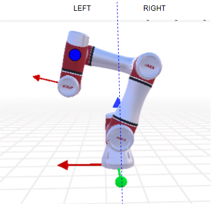

- elbow  
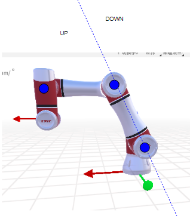

- wrist  
w = sin(axis5)

### JAKA路径Blending说明
多运动段转接方式如下： 
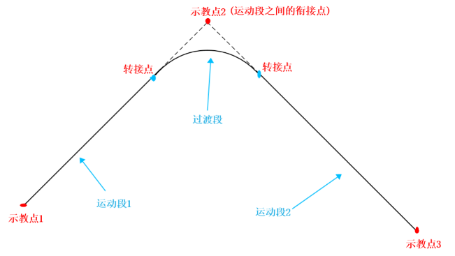

目前支持的转接场景：
- 关节转关节
- 关节转直线
- 直线转直线
- 直线转关节

要实现转接功能，需要在usersetting.ini中设置如下配置参数（默认不用修改）：
- MOVEJ_MOVEL_BLEND = 1
- MOVEJ_MOVEJ_BLEND = 1

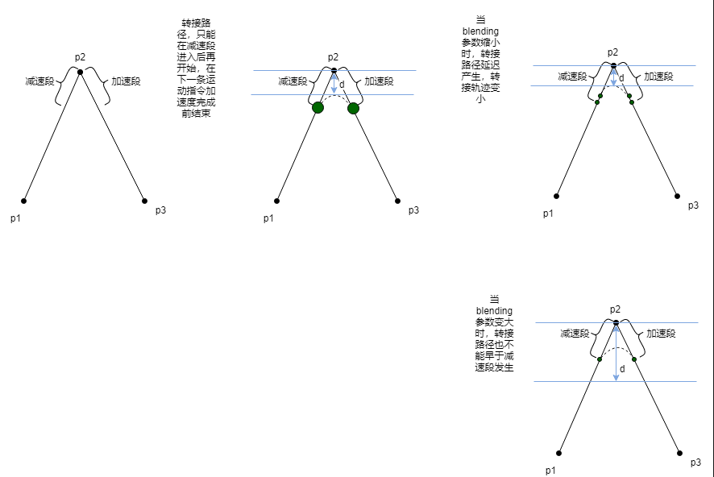

当参数较大时，实际blending会按照SRCI手册中的Mode11（RampOverlap），按照加减速段100% overlap融合： 
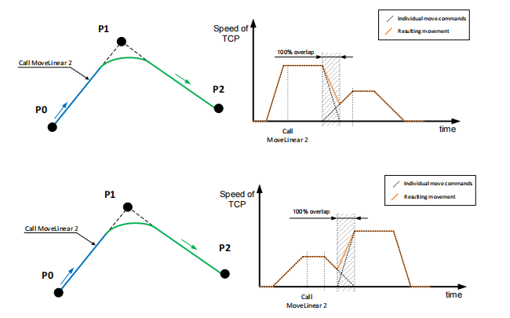

