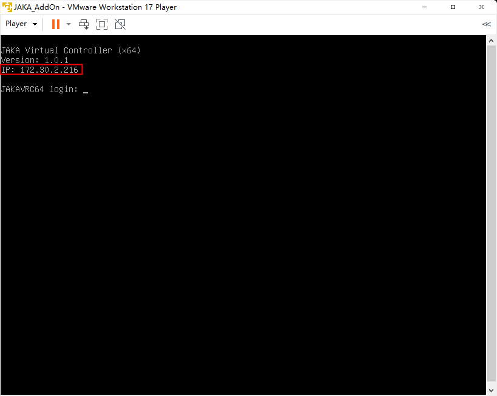

# 开发环境搭建
**本页面旨在介绍如何搭建 AddOn 开发环境，所有需要下载的内容均可在[*开发资料*:point_left:](./1.2-AboutDev.html#开发资料获取)中获取。**

AddOn 的开发需要依赖适当的开发环境，例如 JAKA 虚拟机以及相适配的软件、控制器版本。

::: tip 提示：
如果您手边有JAKA控制器真机，也可以不使用虚拟机，直接使用真机开发。直接跳到[*安装 AddOn 套件包*:point_left:](./3-EnvironmentInstall.html#安装AddOn套件包),根据指引安装升级控制器和 JAKA APP，安装 AddOn 套件包即可。
:::

## 安装JAKA虚拟机

### 步骤一：安装虚拟机软件

开发者需先安装虚拟机软件，例如 VirtualBox 或 VMware Player。

### 步骤二：安装JAKA虚拟镜像
下载 JAKA 虚拟机镜像文件，导入安装。

### 步骤三：启动JAKA虚拟控制器

点击“开启此虚拟机”启动虚拟机。

此时虚拟机页面上显示了当前机器人的IP地址。

## 安装AddOn套件包

::: tip 需注意:
版本过低的 App 及控制器无法支持 AddOn 功能。
:::
所以我们在安装好虚拟机后，还需将 App 和控制器升级至相应适配版本后，再安装 AddOn 套件包，以实现 AddOn 开发。

### 步骤一：安装JAKA App

在 AddOn 开发环境包中 APP 文件夹中找到安装包，点击根据引导安装完成 APP。

在安装过程中要注意给予网络权限。

### 步骤二：使用App连接机器人

1.打开 App 连接机器人，此时可在机器人列表中根据 IP 找到虚拟机器人。

2.若在列表中无法找到机器人，可尝试使用离线连接。

3.密码处，输入默认登录密码（jakazuadmin）。

4.地址处，输入虚拟机器人 IP。

::: tip 提示:
如果发现先提示 App 与控制器版本不匹配，导致无法连接，请先安装对应版本的 App 并根据步骤三，将控制器升级。
:::

### 步骤三：升级控制器

打开设置页面——系统设置——版本升级页面，选择要升级的控制器包，点击上传，完成升级。

### 步骤四：安装AddOn套件包

打开设置页面——系统设置——版本升级页面，选择 AddOn 套件包，点击上传，完成安装。

### 步骤五：重启App

::: tip 需注意：
在完成步骤一至四后，请重启 App ，以使操作生效。
:::

