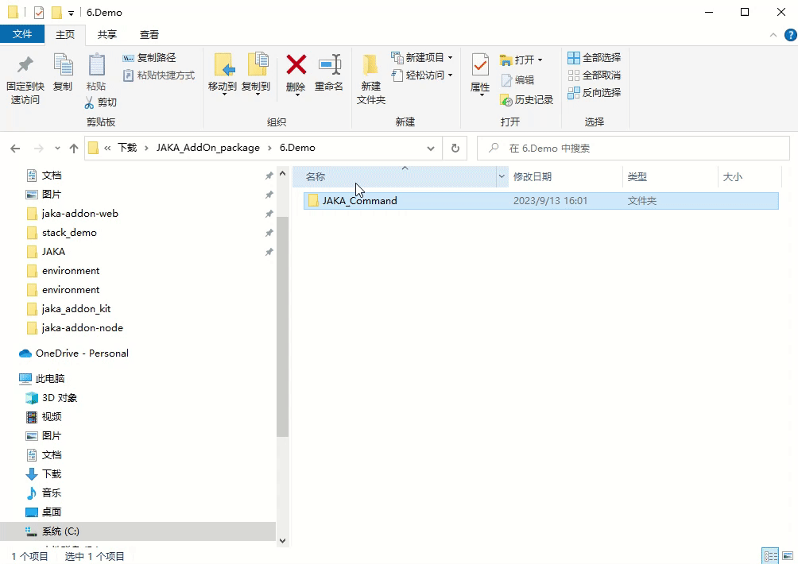
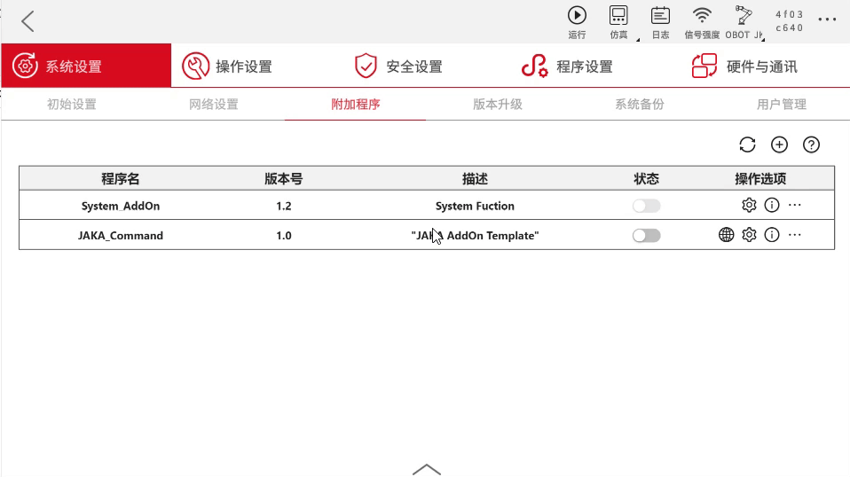
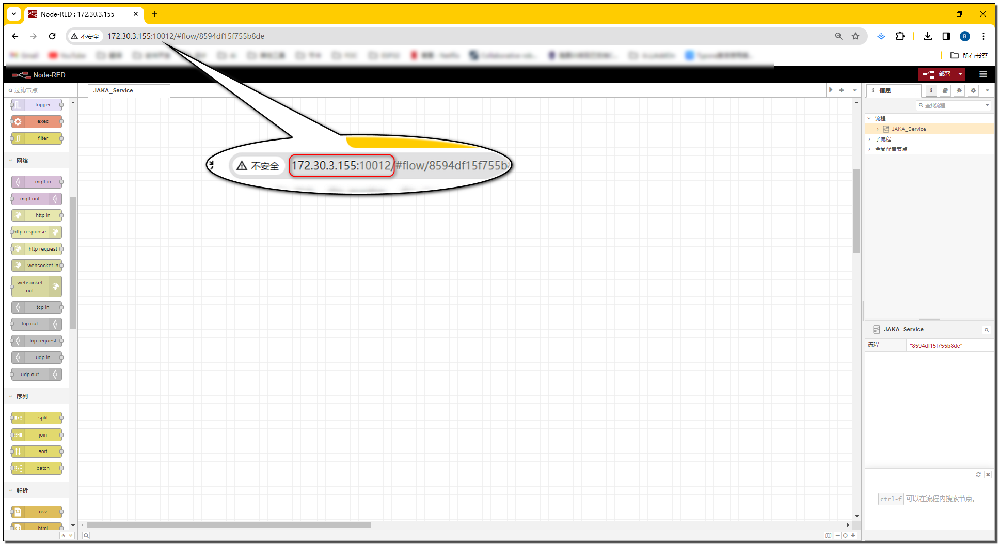
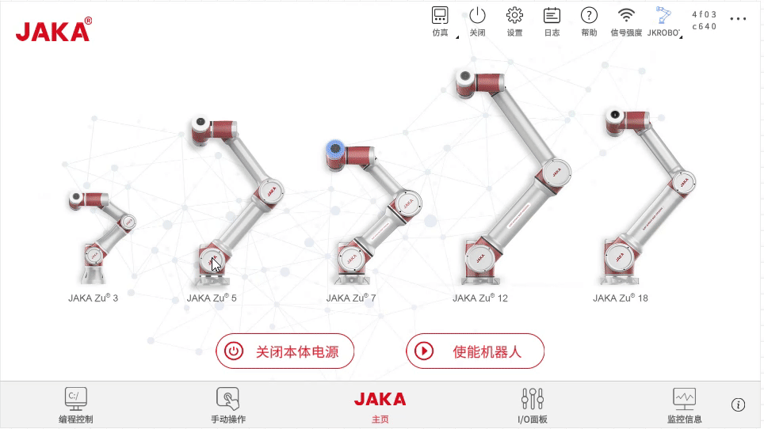
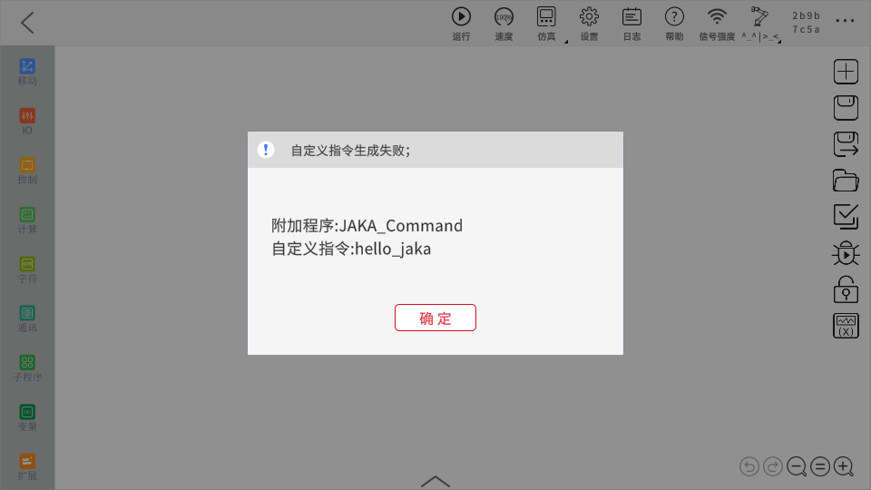

# 自定义指令开发
---
**该页面旨在指导开发者如何开发具有自定义指令功能的 AddOn 包。**

::: tip 请注意：
本章为入门教程，主要目的是使开发者了解自定义指令的基础知识与基本开发流程。

若需了解如何开发带有具体应用功能、应用于具体工艺场景的自定义指令 AddOn 包，请参考后续的完整案例章节：。
:::


## 关于自定义指令
### 自定义指令是什么

自定义指令是指开发者根据自己的需求，在符合 JAKA 脚本规则的情况下，开发出的除 JAKA App 内标准程序指令之外的其他指令。

### 自定义指令的作用

如简介中所述，当机器人末端连接了新的第三方工具，或是应用于具体工作场景中去操作具体工艺时，往往需要在 JAKA App 编程界面编写繁杂的指令、设置繁多的参数。这一步骤较复杂，且不易于二次复用，所以此时就需要把这些繁、杂、多的指令和参数封装为一条直接易懂、简单易用的指令块，以节约时间成本、提升操作效率。


## 创建 AddOn 自定义指令包
在此处的示范中，我们将创建一个自定义指令类型的 AddOn ，该 AddOn 的功能是将指令块上输入和选择的内容显示在 App 日志中。

<div align="center">
<video width="800" controls autoplay >
<source src="./img/4.1-JAKA_Command/案例展示.mp4" type="video/mp4">
</video>
</div>

::: tip 注：
下文中的 JAKA_Command 就是我们即将创建的 AddOn 自定义指令包的包名。
:::

### 步骤一：创建 AddOn 文件夹 
首先我们需要创建一个 AddOn 基本文件夹，该文件夹需包含一个 `.ini ` 格式的配置文件和一个保存数据的 Json 文件。 
您可以从头开始手动创建，也可以使用 AddOn 开发包仓库中  ["*Template*" ](https://github.com/JakaCobot/jaka_addon_kit) 目录下的 AddOn 模板进行修改。 

::: tip 目录结构
|——JAKA_Command  
&emsp;&emsp;&emsp;|——AddOn.json   
&emsp;&emsp;&emsp;|——JAKA_Command_config.ini  
:::

* **AddOn.json**   
Json 文件内容为空即可，后面的步骤中会自动生成数据写入。
* **JAKA_Command_config.ini**  
 配置文件具体内容如下:
    ``` ini
    [AddOnInfo]
    convention = 3.0
    name = JAKA_Command
    description = "在日志中输出信息"
    version = 1.0
    type = 1
    portal = 10006
    url = http://localhost/myAddOnUi
    languagetype = node-red
    service = AddOn.json
    serviceenabled = 1
    ```

::: tip
详细的配置项说明可参考：[配置文件说明:point_left:](./7.1-IniConfig.html)
:::

### 步骤二：打包 & 上传
接下来我们会将步骤一中创建好的文件夹打包，上传至控制器中进行指令块开发，打包的要求格式为`.tar.gz`。

在 Windows 中您可以使用 7z 等打包工具进行二次压缩。    
<div align="center"></div>

在 App 中附加管理程序页面上传 AddOn 。

<div align="center"></div>

::: tip 小结
到此为止，我们完成了 AddOn 包的初始化工作，并打包为了 AddOn 的标准格式，上传至控制器。
接下来我们可以进一步制作 AddOn 的具体功能。
:::

### 步骤三：开发自定义指令

1. 运行 AddOn 并查看 AddOn 运行的端口号。

<div align="center"></div>

2. 打开浏览器，在地址栏中输入机器人 IP + 端口号（`IP:Portal`）进入开发者界面。

<div align="center"></div>

::: tip 小结
当 AddOn 运行后，控制器会基于该 AddOn 包中的 `AddOn.json` 文件启动一个 node-red 实例。
我们可以通过机器人的 IP 和 AddOn 当前运行的端口号访问这个 node-red 实例。
:::

::: warning 请注意：
AddOn 的运行端口不是固定不变的，系统会根据实际情况进行动态分配。因此每当你需要使用 AddOn 的端口号时，
都应该查询当前的端口号是多少。如果是你在代码需要用到这个端口号，最佳的实践方式是从 AddOn 的配置文件，
`xxx_config.ini` 中查询。
:::

3. 在左侧节点栏 JAKA AddOn 目录中找到 `自定义指令` 节点，拖入中间工作区中，点击部署。

双击`自定义指令` 节点，打开指令块生成工具页面。

<div align="center">
<video width="1000" controls autoplay >
<source src="./img/4.1-JAKA_Command/open_customer_node.mp4" type="video/mp4">
</video>
</div>

::: tip 
`自定义指令` 节点的使用说明可以在 node-red 的节点帮助文档中查看。
:::

4. 在*基本配置*页面中，使用页面案例自带的属性定义指令块的样式和属性，不进行任何修改。
同时，将指令块名称更改为*hello_jaka*，并将颜色调整为绿色。在*脚本生成*页面中，
使用页面案例提供的脚本定义指令块的行为，保持原样不做更改。


<div align="center"></div>

::: tip 
此处所使用的脚本语言为 JAKA 编程脚本，具体语法请参考[JAKA编程脚本:point_left:](/guide/jks.html)。
:::

::: tip 小结
到此为止，我们已经成功的完成了自定义指令的定义，包括了样式、属性、脚本等。到这一步，其实在 App 中已经可以
找到我们刚才制作的指令块了，但是并不能拖到程序中运行，是因为 App 还不能获取到自定义指令的脚本。  
接下来我们就需要在 node-red 中继续完善流程，让 App 可以获取脚本。
:::

5. 使用 `http in` 和 `http response` 节点完善流程。

<div align="center"></div>

::: warning 请注意：
`http in` 节点的 URL 要与自定义指令块的名称一致。
:::

::: tip 小结
可以认为，自定义指令其实是自定义服务的一种，通过 Http 请求的形式，为 App 提供自定义指令的脚本。
当在 App 中保存或运行自定义指令时，会发起 Http GET 请求获取脚本，
请求的 URL 是 `Robot_IP:AddOn_Port/Command_Name`。
:::

### 步骤四：运行
在 node-red 中部署流程后，在附加程序页面点击刷新按钮，即可在 App 中编程页面的扩展指令中找到刚才制作的指令块。

<div align="center"></div>


::: tip 
:tada:恭喜！
您已经完成了整个自定义指令的开发流程。接下来一起了解如何调试及处理一些常见问题吧。
:::

## 调试

**如何检查通讯收发的参数是否正确？**    
::: tip
 在 node-red 中使用 debug 节点，是进行调试的常用手段
:::

使用 debug 节点检查保存时 App 发来的指令块参数和返回的 JKS 是否正确。

<div align="center"></div>

保存或运行程序时，App 发起 Get 请求，此时指令块中填入的内容作为请求的参数。

<div align="center"></div>

此时debug1可以捕获到请求中传入的参数对象。该对象的键为指令块上属性的名字，值为属性的具体内容，包括属性值和属性类型。

以下面收到的内容为例，“Select1” 为定义的下拉框属性名，“value” 为属性值，0 代表此时选中了下拉框的第一个选项。“type” 为指令块上填入参数的类型，该参数仅对输入框类型的属性有意义。0 表示输入框内为手动写入的值，1 表示输入框内放入了变量类型的内容（系统变量、计算结果等数据类型的指令块）。

<div align="center"></div>


debug2打印的信息中包含了本次保存生成的 JKS 脚本的对象。

其中 error_code 为生成 JKS 的错误码，0 是生成正常，-12 为内部错误。当该错误码不等于 0 时，App 会弹窗报错相应的错误码和错误信息。我们这里只需要关注 “jks” 这个属性即可，该属性的值即为实际生产的 JKS 脚本。

<div align="center"></div>


**模拟生成脚本**

- 脚本生成页面，在左侧指令块上输入参数后，点击“生成 JKS 脚本”可模拟生成脚本，在下方代码窗口内查看模拟生成的代码。

<div align="center"></div>

::: tip 请注意：
 点击“生成 JKS 脚本”按钮只是在下方的代码窗口中显示模拟生成的脚本，并没有其他实际的作用。
:::

## 常见问题
在开发过程中，可能会遇到如下问题，具体情况及相应解决方法请看下文。

**自定义指令生成失败**  
在 App 编程页面使用自定义指令块后，点击保存，报错“自定义指令生成失败”，可能是以下几个原因导致的。

<div align="center"></div>


1. AddOn 没有运行   
   解决方法：在附加程序页面找到该 AddOn ，点击运行按钮开启 AddOn 。
<div align="center"></div>

2. node-red 中的 `http in` 节点中 url 与指令块名字不一致  
   解决方法：将 url 与指令块名称统一。
<div align="center"></div>

**服务器内部错误**  
当遇到服务器内部错误时，一般都是因为 App 没有收到 Http 请求的响应超时导致。  

<div align="center"></div>

解决方法：检查 node-red 端的 `http in` 节点是否正确连接 `http response` 节点，连接后在 App 端重启 AddOn 。

::: warning 注意：
-恢复连接后任然需要重启 AddOn 服务，才能正常保存程序。   
-报错信息中请重启控制器的描述有误，重启 AddOn 即可。
:::

**属性匹配失败**  
<div align="center"></div>

解决方法：检查 node-red 中自定义指令的属性名称是否与脚本定义中用到的一致。

<div align="center"></div>


