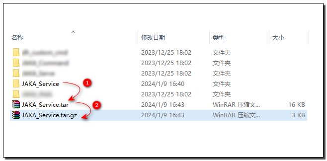
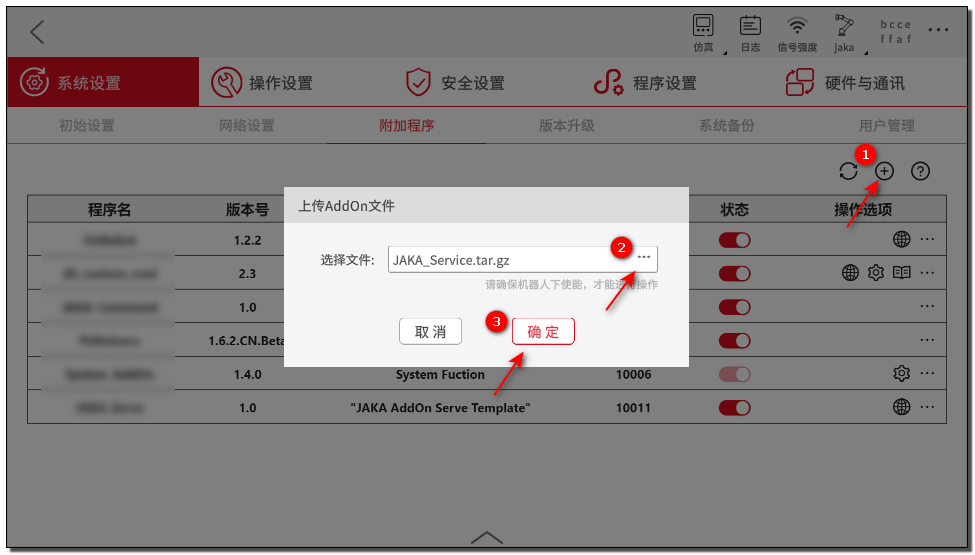
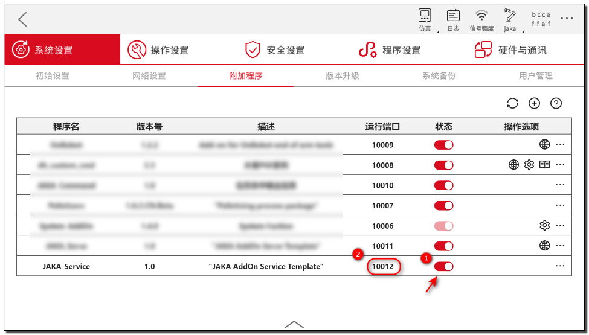

# 自定义服务开发

**该页面旨在指导开发者如何开发具有自定义服务功能的 AddOn 包。**

::: tip 请注意：

本章为入门教程，主要目的是使开发者了解自定义服务的基础知识与基本开发流程。    

若需了解如何开发带有具体应用功能、应用于具体工艺场景的自定义服务 AddOn 包，请参考后续的完整案例章节：。

:::

## 关于自定义服务

### 自定义服务是什么
自定义服务是一种在后台执行任务的服务，用户不会直接感知其存在。

### 自定义服务的作用
自定义服务负责处理与用户交互无关的、后台数据处理和业务逻辑处理的部分。与 Http 节点配合，可以和前台界面进行数据交互，为自定义指令、自定义网页、或其他客户端提供接收、处理、存储、计算和分析数据等服务。

## 创建AddOn自定义服务包
在此处的示范中，我们将创建一个自定义服务类型的AddOn。该AddOn的功能是，对外提供查询机器人电源状态的服务。
::: tip 注：
下文中的 JAKA_Service 就是我们即将创建的 AddOn 自定义指令包的包名。
:::

### 步骤一：创建 AddOn 文件夹 
首先我们需要创建一个 AddOn 基本文件夹，该文件夹需包含一个 `.ini ` 格式的配置文件和一个保存数据的 Json 文件。

您可以从头开始手动创建，也可以使用 AddOn 开发包仓库中  ["*Template*" ](https://github.com/JakaCobot/jaka_addon_kit) 目录下的AddOn模板进行修改。 

::: tip 目录结构
|——JAKA_Service  
&emsp;&emsp;&emsp;|——AddOn.json   
&emsp;&emsp;&emsp;|——JAKA_Service_config.ini  
:::

* **AddOn.json**   
Json 文件内容为空即可，后面的步骤中会自动生成数据写入。
* **JAKA_Service_config.ini**  
 配置文件具体内容如下:
    ``` ini
    [AddOnInfo]
    convention = 3.0
    name = JAKA_Service
    description = "JAKA AddOn Service Demo"
    version = 1.0
    type = 1
    portal = 10006
    url = http://localhost/myAddOnUi
    languagetype = node-red
    service = AddOn.json
    serviceenabled = 1
    ```
    ::: tip
    详细的配置项说明可参考：[配置文件说明:point_left:](./7.1-IniConfig.html)
    :::

### 步骤二：打包&上传
接下来我们会将步骤一中创建好的文件夹打包，上传至控制器中进行指令块开发，打包的要求格式为`.tar.gz`。

在 Windows 中您可以使用 7z 等打包工具进行二次压缩。    
<div align="center"></div>

在 App 中附加管理程序页面上传 AddOn 。

<div align="center"></div>

::: tip 小结
到此为止，我们完成了 AddOn 包的初始化工作，并打包为了 AddOn 的标准格式，上传至控制器。
接下来我们可以进一步制作 AddOn 的具体功能。
:::

### 步骤三：开发自定义服务
1. 运行 AddOn 并查看 AddOn 运行的端口号。

<div align="center"></div>

1. 打开浏览器，在地址栏中输入机器人 IP + 端口号（`IP:Portal`）进入开发者界面。

<div align="center"></div>

::: tip 小结
当 AddOn 运行后，控制器会基于该 AddOn 包中的 `AddOn.json` 文件启动一个 node-red 实例。
我们可以通过机器人的 IP 和 AddOn 当前运行的端口号访问这个 node-red 实例。
:::

::: warning 请注意：
AddOn 的运行端口不是固定不变的，系统会根据实际情况进行动态分配。因此每当你需要使用 AddOn 的端口号时，
都应该查询当前的端口号是多少。如果是你在代码需要用到这个端口号，最佳的实践方式是从 AddOn 的配置文件，`xxx_config.ini` 中查询。
:::

3. 在左侧节点栏 JAKA AddOn 目录中找到 `获取机器人信息` 节点，
双击打开编辑页面，设置名称“电源状态”,并依次选择“机器人状态”——“电源状态”。

<div align="center">
<video width="1000" controls autoplay >
<source src="./img/4.2-JAKA_Service/配置获取信息节点.mp4" type="video/mp4">
</video>
</div>

::: tip 
`获取机器人信息` 节点的使用说明可以在 node-red 的节点帮助文档中查看。
:::

4. 添加 `http in` 节点,监听 Get 请求。

<div align="center">
<video width="1000" controls autoplay >
<source src="./img/4.2-JAKA_Service/添加Http监听.mp4" type="video/mp4">
</video>
</div>
   
::: tip 小结
使用 `http in` 节点连接，并定义了 URL 后，我们可以通过 `Robot_IP:AddOn_Port/Your_URL` 对我们的服务进行请求。
但无法收到响应，所以接下来需要制作响应消息对象，然会返回给请求。
:::

5. 生成响应消息，并使用 `http response` 响应请求。

<div align="center">
<video width="1000" controls autoplay >
<source src="./img/4.2-JAKA_Service/响应请求.mp4" type="video/mp4">
</video>
</div>

::: tip 提示
- 一开始我们不确定查询结果的类型和数据结构，可以使用 `inject` 节点手动触发查询，用 `debug` 节点观察返回值。
- 响应只能是字符串（String）或对象（Object）类型，因此需要将布尔值（Boolean） 放到一个对象中再返回。
:::


## 测试

这里将使用 API 接口测试工具，对我们刚才制作的服务进行测试。

<div align="center">
<video width="1000" controls autoplay >
<source src="./img/4.2-JAKA_Service/测试.mp4" type="video/mp4">
</video>
</div>


::: tip 恭喜
:tada:现在我们已经可以通过自定义服务查询机器人的电源状态了！
:::
