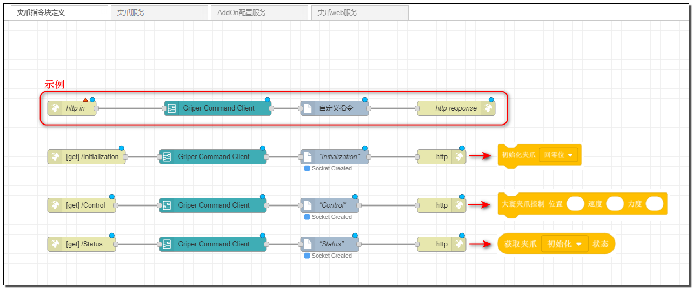
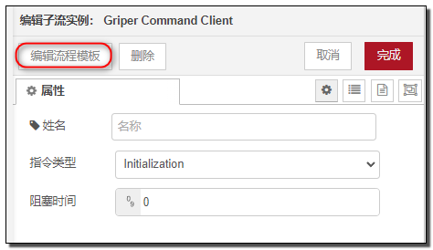
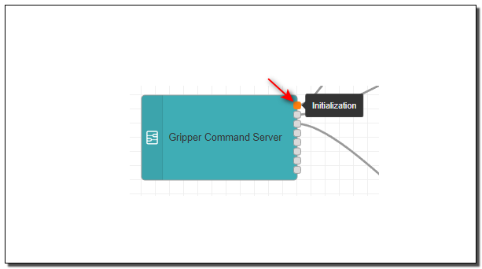
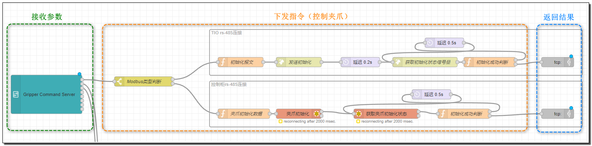
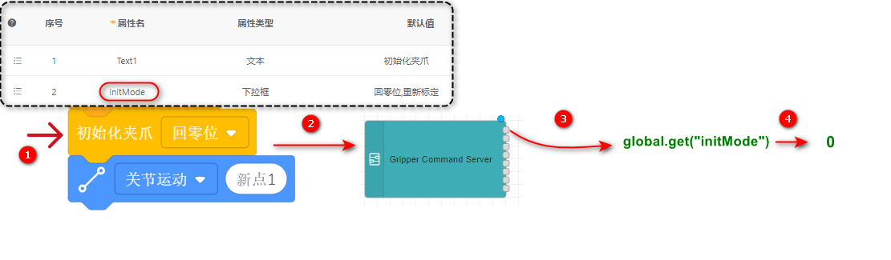
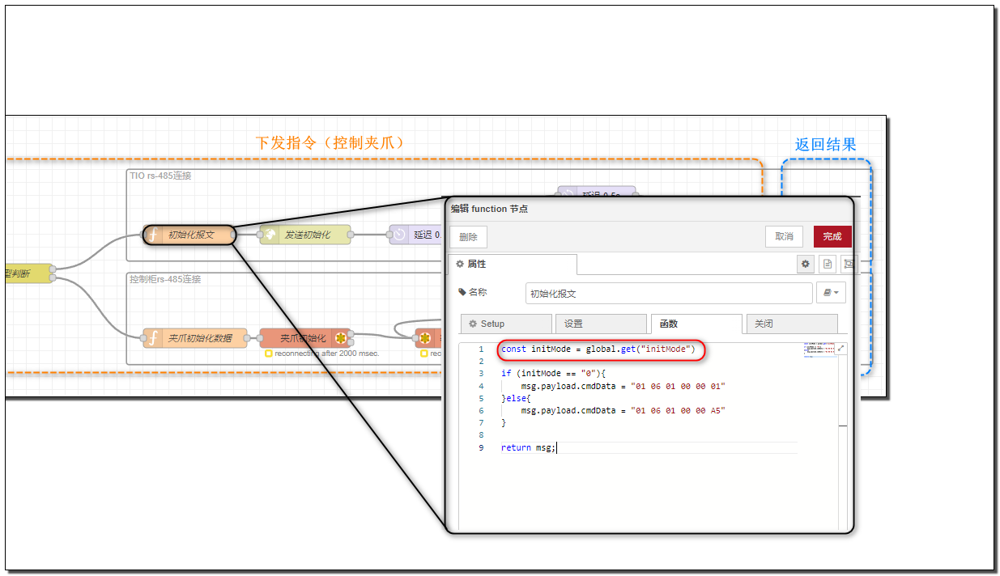

# 大寰夹爪 AddOn 介绍

**通过本文，您将了解一种通过 Modbus/RS-485 控制夹爪的 AddOn ，并且能够基于该模板快速制作自己的夹爪 AddOn。**

::: tip 
开始之前，默认您已经了解 AddOn 的基础功能，以及实现的原理。  
大寰夹爪 AddOn [**下载**](https://github.com/JakaCobot/jaka_addon_kit/releases/download/dh_v2.3/dh_custom_cmdv2.3.tar.gz)
:::

接下来将按照功能演示、模板介绍、上手开发的顺序进行讲解，如果您并不想关心和了解实现原理，也可以直接跳过模板介绍，直接按照上手开发部分的引导完成开发。

## 功能演示

- 配置页面（切换夹爪连接方式，通过末端 TIO 连接或控制柜 RS485 接口连接。）
- 内置文档
- 日志查看
- 控制页面（自定义页面）
- 控制指令（自定义指令）
  

<video width="1000" controls autoplay >
<source src="./img/6.1-DHGripper/功能演示.mp4" type="video/mp4">
</video>

## 功能讲解

接下来将分别讲解每部分功能是如何实现的，以及所用到的节点如何使用。
使用 Robot_Ip:AddOn_Port 进入 node-red 开发页面。

### 自定义指令
在上方的标签栏中选中“夹爪指令块定义”页面，可以看到三个自定义指令的流。每个流用到了 4 个节点，分别是 `http in` 、`Gripper Command Client` 、 `自定义指令` 、 `http response`

`http in` 、 `http response` 和 `自定义指令`节点已经在入门教程中介绍过，接下来重点讲解 `Gripper Command Client` 节点。

`Gripper Command Client` 是一个子流程，只有导入 AddOn *"dh_custom_cmd"* 包，才能在节点目录中找到。
为了简化开发流程，其内部预封装了一些 JKS 脚本和流程，其作用是生成一个 Socket 客户端，将运行时的指令参数传递到 node-red 中。双击该节点可打开编辑页面。

<!-- todo: hbs 需要有一部分内容介绍函数生成jks的方式，并在这里指出? -->
点击左上角的编辑流程模板，可以查看子流程的具体实现。

::: tip 指令类型

这里选中的类型，将在 App 实际运行该指令时，把指令块上的参数传递给 `Gripper Command Server` 的不同通道。
 
:::

本质上 `Gripper Command Client` 是用 JKS 实现了一个 Socket 客户端，用来发送指令块上的参数。
而 `Gripper Command Server` 是在 node-red 中用 `tcp in` 封装实现的一个 Socket 服务端，用来接收和处理参数，并通过对应的通道传出。

::: tip 阻塞时间
可以为指令指定一个阻塞超时时间，设为 0 时将会一直阻塞，直到收到了返回值。如何返回将在下面介绍。
<!-- todo：hbs 加上连接指向如何返回的部分 -->
:::

上面在“夹爪指令块定义”页面，定义了指令块的样式和传递参数的 Socket 脚本，接着介绍如何接收指令块上的参数和控制夹爪并返回一些值。

在上方的标签栏中选中 *“夹爪服务”* ，可以看到 `Gripper Command Server` 节点和其他很多节点。我们选其中的一路流来讲解。

上图以初始化夹爪流程为例，整个流可以分为三部分，分别是“接收参数”部分、“下发指令”部分和“返回结果”部分。

而我们要做的事情，就是实现控制夹爪的部分，连接到 `Gripper Command Server` 节点对应的通道，然后根据参数生成夹爪指令下发给夹爪。
那该如何拿到参数呢？还是用初始化夹爪指令来举例。

初始化时，需要通过下拉菜单来选择模式，当程序运行到 *“初始化夹爪”* 这一行时，会将当前选中的值发送至 `Gripper Command Server` 节点。
之后 `Gripper Command Server` 节点会将收到的所有参数储存到 node-red 的 global 上下文中，并触发指令块类型对应的通道。之后我们就可以在后续
的流程中使用 `global.get()` 这个方法获取对应的参数。

### 自定义页面

### 内置文档

### 配置

 

