## 前言

本教程将会创建一个Ewellix LIFTKIT插件，可以让客户将LIFTKIT升降柱的功能与JAKA应用程序集成。
在开始之前，需要了解的知识/文档包括：
* 可视化编程概念；
* JavaScript编程知识；
* Node-RED节点和流程库的使用；
* JAKA AddOn介绍文档：（具体名称或连接）
  
本教程默认JAKA 机械臂控制器内部已安装完整AddOn环境，且控制器和APP版本均满足创建AddOn要求。

## 插件功能说明

Ewellix LIFTKIT插件具体实现功能如下：
1.	通过node-red实现3个自定义指令块的创建：
（1）获取升降柱位置并将获取的值存入数字类型变量内以便后续调用；
（2）升降柱移动到绝对位置，运动方式分为阻塞和非阻塞；
（3）停止升降柱的移动。
2.	通过node-red实现与前端界面的交互：
（1）升降柱参数获取、设置，包括界面语言显示、升降柱IP、端口号、虚拟限位、类型；
（2）通过前端界面的控制按钮实现对升降柱的控制，包括控制升降柱移动到绝对位置、上升到虚拟限位最大值、下降到虚拟限位最小值、停止当前运动。

## 准备工作

1.	首先，需要提前下载一份AddOn开发模板”JAKA_AddOn”，该工程文件包含了各种类型AddOn开发所用到的功能。
2.	修改JAKA_AddOn文件夹下的配置文件JAKA_AddOn_config.ini
（1）修改配置文件中的name = JAKA_LiftKit;

（2）修改description = “JAKA LiftKit Command”；

（3）由于配置文件和文件夹的名称与addOn的名称要求必须统一，所以需修改配置文件名称为：JAKA_ LiftKit_config.ini；

（4）url暂时不修改，之后讲到前后端交互时会再作修改;

（5）增加LiftKit配置信息：包括升降柱的IP、端口号及语言。这3个参数由前端设置后传入配置文件，我们再从配置文件中读取值，这里先固定为如下参数。
    ``` ini
    [LIFIKIT_CONFIG]
    lang = cn
    ip = 172.30.0.61
    port = 50001
    ```
修改后的配置文件内容如下：

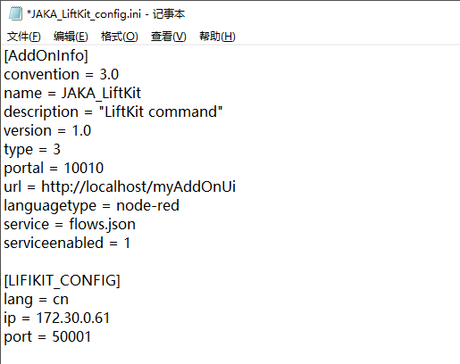


3.	修改文件夹JAKA_AddOn名称为JAKA_LiftKit，并压缩成文件夹压缩为JAKA_LiftKit.tar.gz 格式。

4.	打开JAKA APP，依次点击“设置”—“系统设置”—“附加程序”，在“附加程序”中点击如下的+号上传JAKA_LiftKit.tar.gz文件。
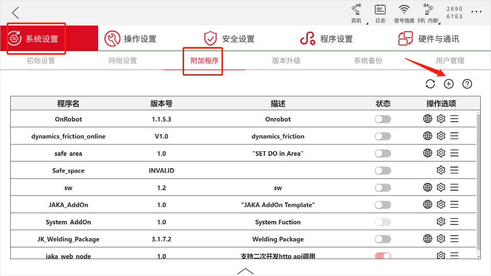
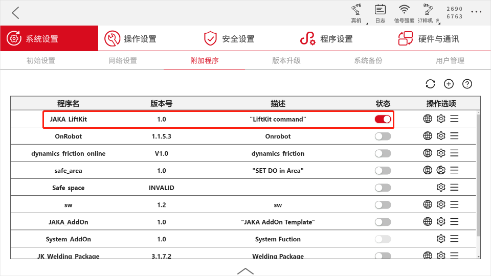


## 自定义指令块的创建

该部分创建后完整的指令块样式和node-red节点部署如下所示，接下来我们将一步步完成这些功能。
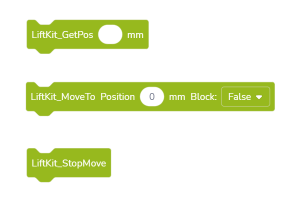
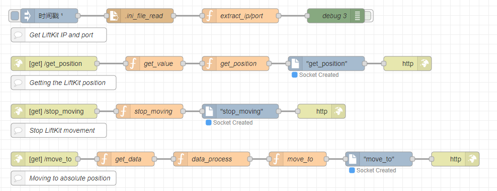

### 4.1 获取位置指令块

#### 4.1.1 创建步骤

具体步骤为：
1.	在APP附件程序管理界面，点击JAKA_LiftKit的齿轮按钮，查看当前的端口号。
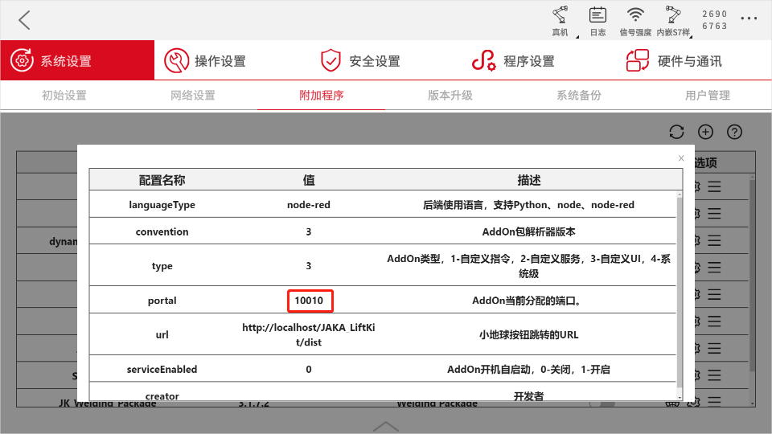
2.	示例中机器人IP为172.30.3.123，AddOn端口号为10010。在浏览器地址栏输入：“172.30.3.123:10010”进入开发者页面。
3.	从JAKA_ LiftKit _config.ini配置文件中读取升降柱IP和端口号。

（1）在开发者页面的左侧节点菜单栏中找到“inject”、“read file”、“function”、“debug”这4个节点连并接部署。
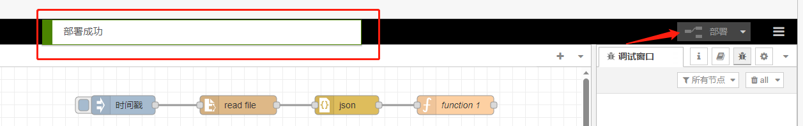
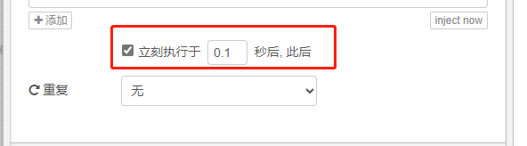
（3）双击“read file”节点，属性设置中，文件名写JAKA_LiftKit_config.ini 文件在控制器中的存放位置。/usr/etc/jkzuc/configs/JAKA/AddOns/JAKA_LiftKit/JAKA_LiftKit_config.ini。编码选择utf8，点击“完成”按钮。
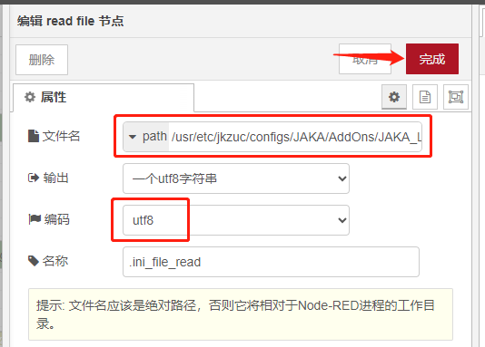

（4）编写函数实现IP和端口号的读取：
代码如下：
```javascript
    // payload 属性是包含配置信息的字符串
    let configString = msg.payload;
    
    // 正则表达式匹配配置字符串中的IP和端口
    const ipRegex = /ip\s*=\s*([\d.]+)/;
    const portRegex = /port\s*=\s*(\d+)/;
    
    // 自定义函数：从给定的字符串 str 中提取匹配正则表达式 regex 的结果
    function extractValue(regex, str) {
        const matches = str.match(regex);
        return matches ? matches[1] : null;
    }
    const ipValue = extractValue(ipRegex, configString);
    const portValue = extractValue(portRegex, configString);
    
    // 设置全局变量存放IP和Port
    global.set("global_ip", ipValue);
    global.set("global_port", portValue);
    
    // 获取IP地址和端口号的值
    msg.payload = [ipValue, portValue];
    msg.ipValue = ipValue;
    msg.portValue = portValue;
    return msg 
```
（5）所有都置完成之后重新部署，最后Debug验证输出是否是升降柱IP和端口号。

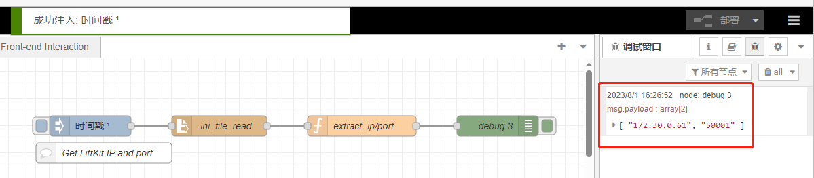

（6）可以在这条节点下方给node-red加上注释节点，增加可读性。

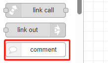

4.	在开发者页面的左侧节点菜单栏中，找到JAKA AddOn，将其中的Customized-commands拖到中间的工作区域。点击“部署”，之后页面顶部出现“部署成功”即可进行下一步。

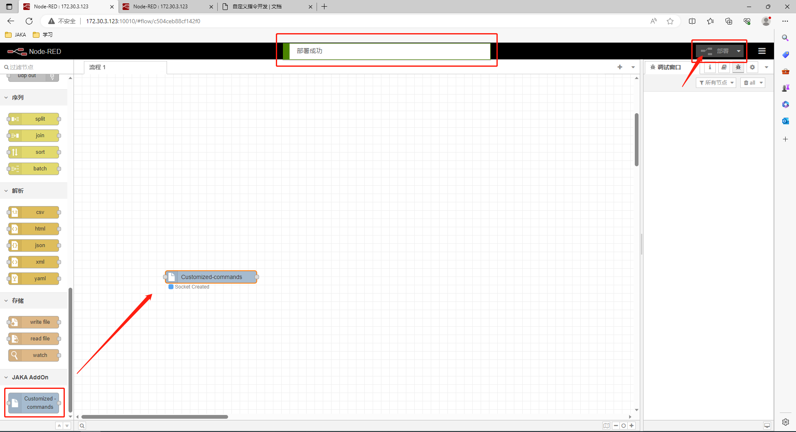

5.	双击工作区域中的块，进入指令块开发页面。该页面中我们可以定义指令块的样式、链接、和其实现的功能。

（1）基本配置：
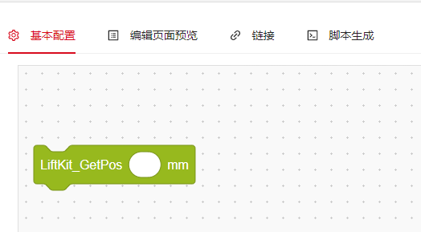
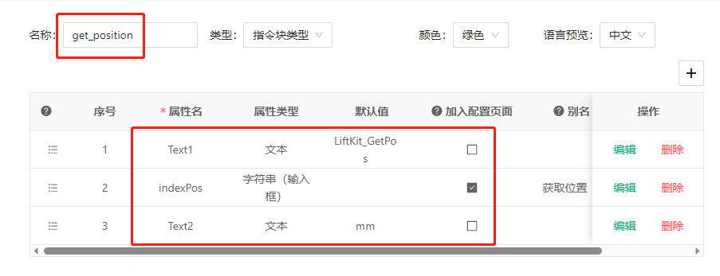

注：中间空白输入框用来存放程序或者系统数字类型变量，获取到的位置值由变量接收。

（2）编辑界面预览：预览页面，无须任何设置。

（3）链接：默认

（4）脚本生成：
方式一：脚本生成方式选择Template Syntax。在Jks Template中编写脚本，当脚本内容较少可直接定义时，建议选用该方式。
方式二：脚本生成方式选择Function。自定义函数生成方式，由于升降柱的IP和端口号等参数是变化的，所以我们这里选择函数方式实现。选择之后点击“完成”。
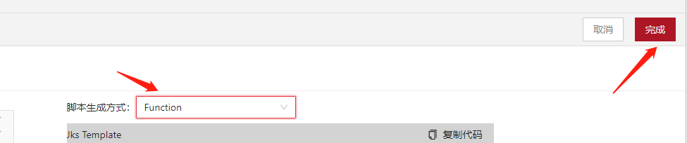
6.	在左侧节点功能栏中拖出“http in”、“http response”、2个“function”、“debug”节点。加上前面的“get_position”节点按下图连接并部署：
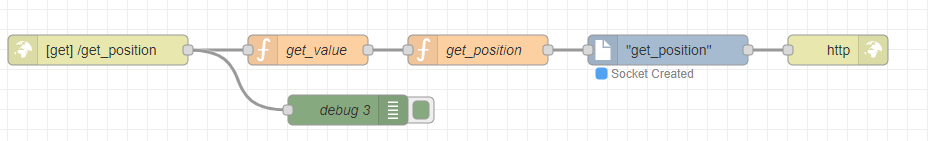
7.	编辑“http in”，请求方式为“GET”，URL为自定义指令块的名称，编辑好后点击“完成”。
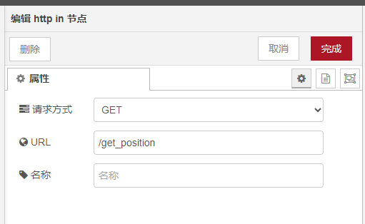
8.	重新启动APP，在编程控制页面的扩展中找到自定义指令块LiftKit_GetPos，将指令块拖入主程序中保存，提示保存成功说明脚本请求成功。同时在node-red界面的调试窗口可以看到APP返回的信息。我们分别看下输入框内是程序数字型变量、系统数字型变量和手动输入数值时APP返回的信息。
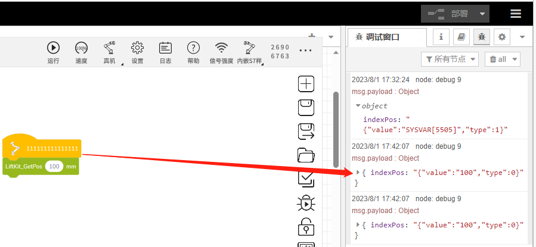
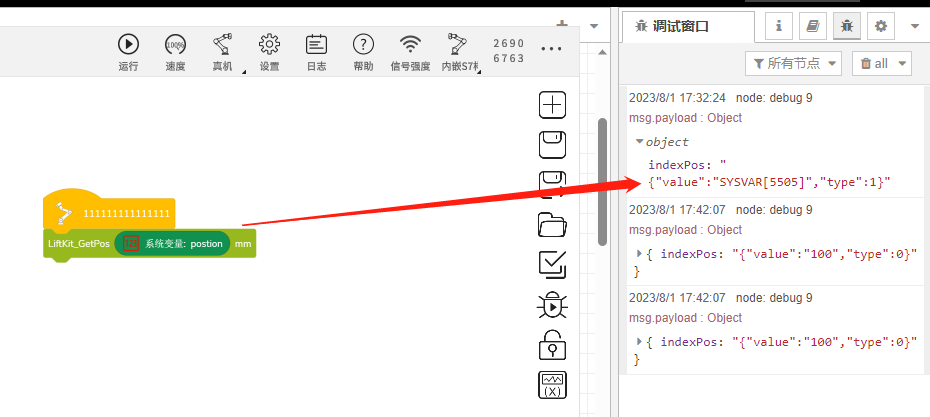
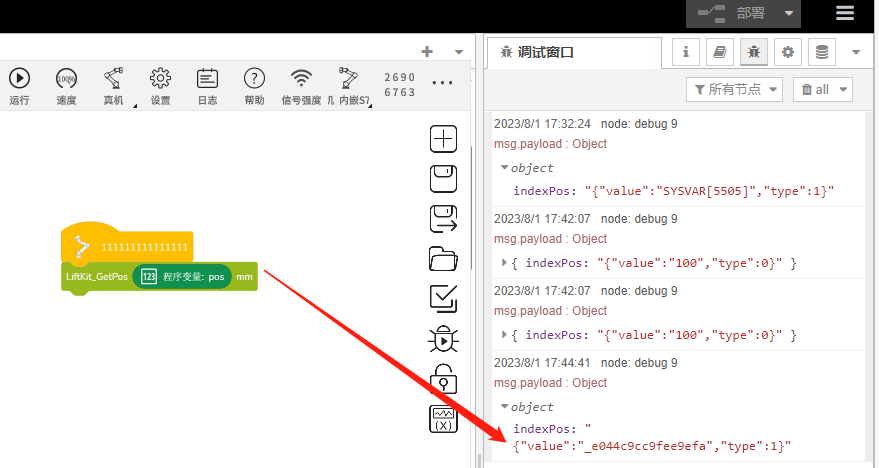

“indePos”是前面我们在自定义指令基本配置里输入框的属性名，“type”为0表示输入框为手动输入；“type”为1表示输入框为拖入的变量。由于获取的位置值是个变量，所以我们需建立一个数字型程序变量或者系统变量来存放获取的位置值。

9.	编辑第1个“function”节点，写入以下代码对传入的数据流做预处理。
```javascript
    // 将传入数据进行预处理
    var value = msg.payload.indexPos;
    var selectObj = JSON.parse(value);
    msg.payload = selectObj;
    return msg;
```
10.	编辑第2个“function”节点，输入以下代码生成jks脚本：
```javascript
    // 若返回正确error_code = 0
    msg.error_code = 0;
    var LIFTKIT_ip = global.get("global_ip");
    var LIFTKIT_port = global.get("global_port");
    var value = msg.payload.value;
    var type = msg.payload.type;
    // 若type为0，表示用户未设置变量来接收获取值，返回错误码为-1
    if(type == 0){
        msg.error_code = -1;
        msg.error_msg = "Please set a program variable to receive the position value.";
    }
    // 若type为1，表示用户已设置变量来接收获取值，通过socket向升降柱发送获取位置指令并将返回数据存入程序/系统变量中
    if (type == 1){
        var jks_txt = ''
        jks_txt += `LIFTKIT_clinet = socket_open("${LIFTKIT_ip}", ${LIFTKIT_port})\n`;
        jks_txt += `get_position = "get_position\\n"\n`;
        jks_txt += `get_position_str = socket_send(LIFTKIT_clinet, get_position)\n`;
        jks_txt += `recv_data = socket_recv(LIFTKIT_clinet, 0)\n`;
        jks_txt += `recv_data_cut = ""\n`;
        jks_txt += `formatStr = "get_position,OK,%s"\n`;
        jks_txt += `cutting = sscanf(recv_data, formatStr, recv_data_cut)\n`;
        jks_txt += `position_data = recv_data_cut\n`;
        jks_txt += `arrayOut = [0,1,2]\n`;
        jks_txt += `resLen = get_array_from_string(position_data," ",arrayOut)\n`;
        jks_txt += `position_data = arrayOut[0]\n`
        jks_txt += `${value} = position_data\n`;
        jks_txt += `socket_close(LIFTKIT_clinet)\n`;
        msg.jks = jks_txt;
    }
    return msg;
```
11.	各节点都设置完成之后连接并部署。
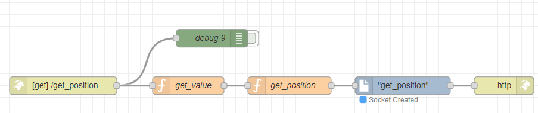


### 4.1.2 APP测试
打开JAKA APP，在编程界面扩展模块找到LiftKit_GetPos。由于程序运行结束后变量会显示初始值，所以在程序中加上延时以便更好观察到变量的改变。
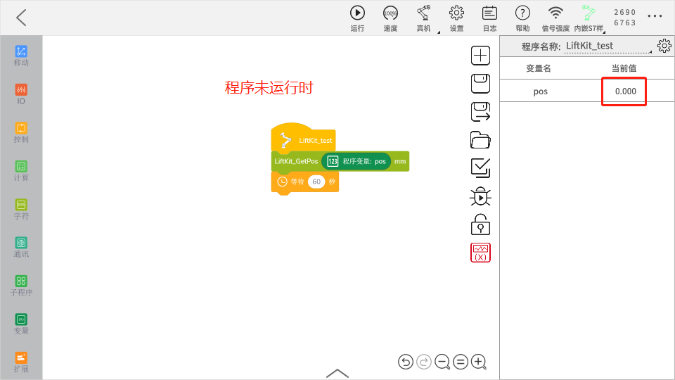
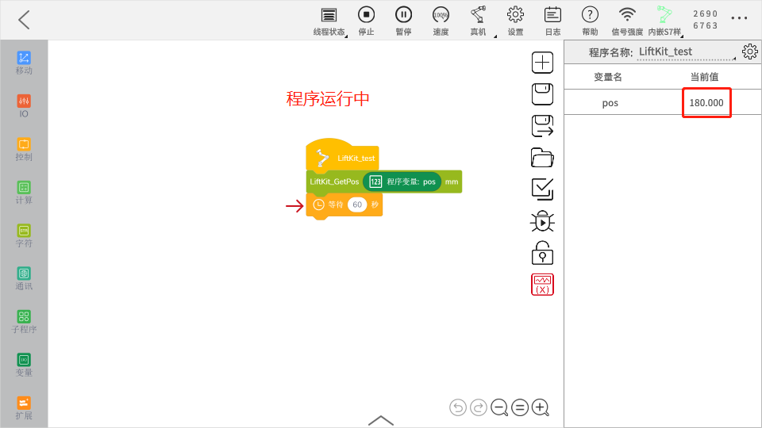
可以看到此时升降柱返回的位置为180 mm，说明该自定义指令已生效。
### 4.1.3 扩展
上节创建的指令块类型属于指令块类型，现在我们创建一个数字类型的指令来实现同样功能。
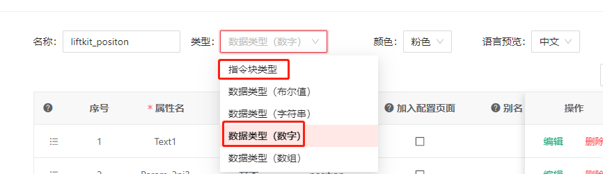
1.	在开发者页面的左侧节点菜单栏中，找到JAKA AddOn，将其中的Customized-commands拖到中间的工作区域。点击“部署”，之后页面顶部出现“部署成功”即可进行下一步。
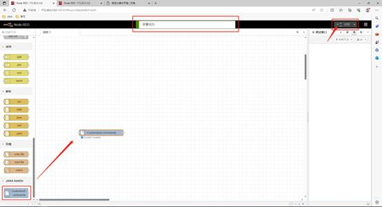
2. 双击工作区域中的块，进入指令块开发页面。该页面中我们可以定义指令块的样式、链接、实现的功能。
（1）基本配置：
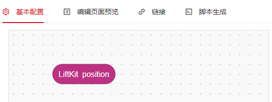
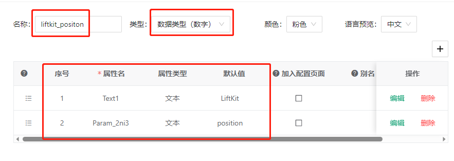
（2）编辑界面预览：预览页面，无须任何设置。

（3）链接：使用默认。

（4）脚本生成：选择Function。选择之后点击“完成”。

3.	在左侧节点功能栏中拖出“http in”、“http response”、“function”节点。加上“liftkit_positon”节点按下图连接并部署：
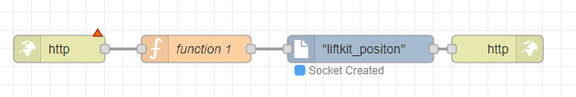
4.	编辑“http in”节点，请求方式为“GET”，URL为自定义指令块的名称，编辑好后点击“完成”。
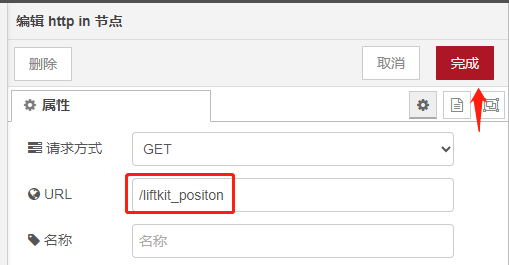
5.	编辑“function”节点，实现通过该数据块上获取位置值并将所得位置参数存储在该数据块上。
```javascript
    var LIFTKIT_ip = global.get("global_ip");
    var LIFTKIT_port = global.get("global_port");
    var jks_txt = ''
    jks_txt += `LIFTKIT_clinet = socket_open("${LIFTKIT_ip}", ${LIFTKIT_port})\n`;
    jks_txt += `get_position = "get_position\\n"\n`;
    jks_txt += `get_position_str = socket_send(LIFTKIT_clinet, get_position)\n`;
    jks_txt += `recv_data = socket_recv(LIFTKIT_clinet, 0)\n`;
    jks_txt += `recv_data_cut = ""\n`;
    jks_txt += `formatStr = "get_position,OK,%s"\n`;
    jks_txt += `cutting = sscanf(recv_data, formatStr, recv_data_cut)\n`;
    jks_txt += `position_data = recv_data_cut\n`;
    jks_txt += `arrayOut = 0\n`;
    jks_txt += `resLen = sscanf(position_data,"%f",arrayOut)\n`;
    jks_txt += `position_data = arrayOut\n`
    jks_txt += `socket_close(LIFTKIT_clinet)\n`;
    jks_txt += `return position_data`;
    msg.jks = jks_txt;
    return msg;
```
6.	在APP上测试。
测试步骤为：

（1） 重新启动APP，在编程控制页面的扩展中找到自定义指令块LiftKit Position、条件判断指令、比较指令及设置数字输出指令。同时确认I/O界面的控制柜DO1是关闭状态。

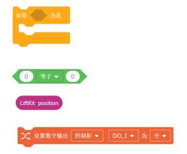

（2）将指令按下图部署，点击保存：
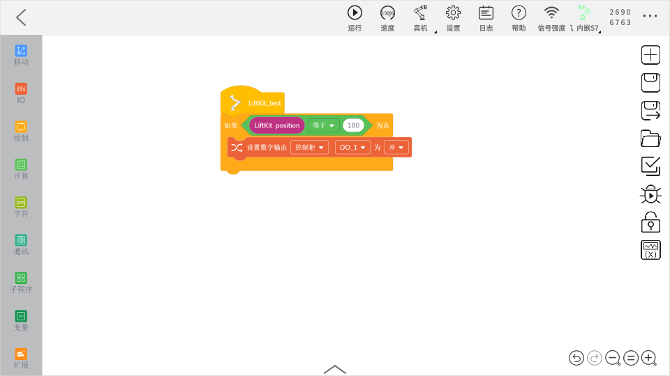
（3）当真实效果是升降柱的位置为180 mm处时，运行程序之后控制柜DO1状态应为开启状态。为了方便看到效果，这里借助调试助手模拟TCP服务端，即升降柱，机器人为TCP客户端。运行程序时看到机器人会先发送“get_position\n”指令查询升降柱当前状态，升降柱正常状态会回复“get_position,OK,180\n”指令，其中180就是当前升降柱的位置值，随后关闭socket (TCP)通讯，程序运行结束。查看APP I/O界面的控制柜DO1变为开启状态。说明该自定义指令已生效。
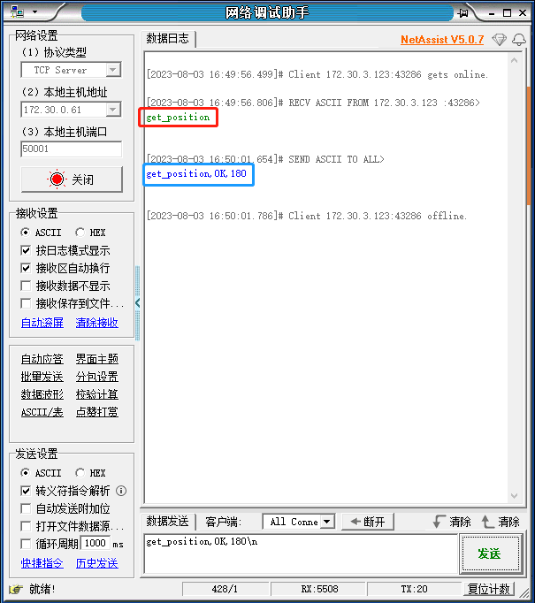
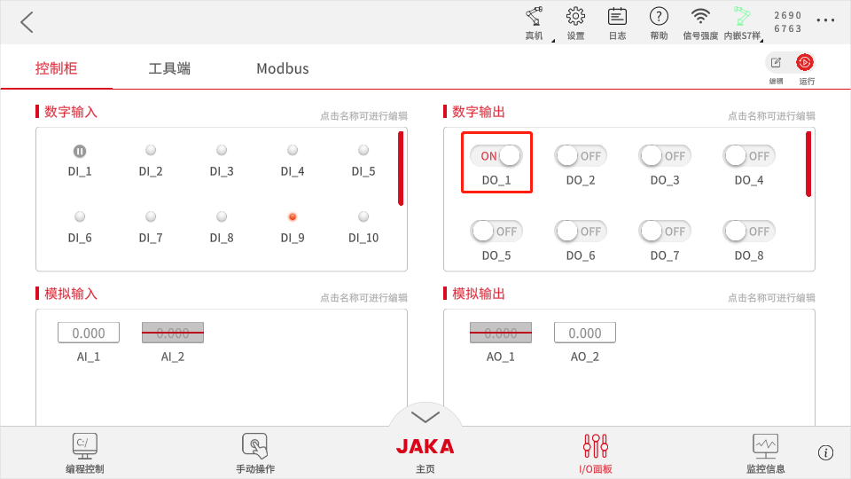

### 4.2 移动指令块
### 4.2.1 创建步骤
1. 在开发者页面的左侧节点菜单栏中，找到JAKA AddOn，将其中的Customized-commands拖到中间的工作区域，点击“部署”。
2. 双击工作区域中的块，进入指令块开发页面。
（1）基本配置：
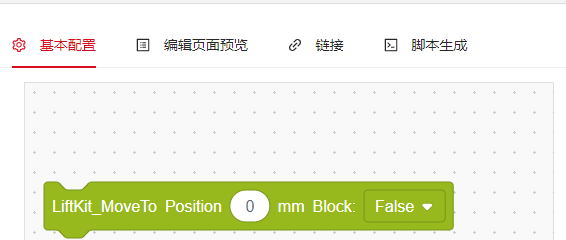
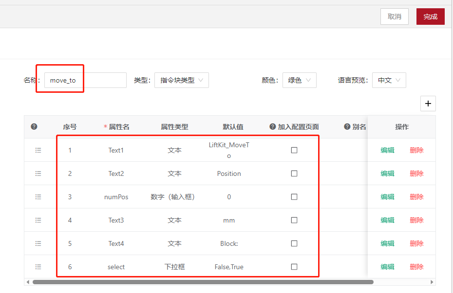
注：在“LiftKit_MoveTo”指令中“Block”表示是否开启指令阻塞功能，“False”表示非阻塞，“True”表示阻塞。默认“False”，即关闭阻塞。若开启阻塞，升降柱在未到达指定高度前机器人无法进行下一步运动；若关闭阻塞，机器人就可以在升降柱移动的时候同时执行下一步指令进行运动。

（2）链接：使用默认。

（3）脚本生成：选择Function方式，点击“完成”。

3.	在左侧节点功能栏中拖拽出“http in”、“http response”、3个“function”、“debug”节点。将各节点按下图连接并部署：
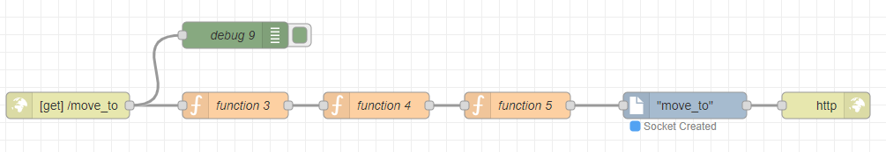
4.	编辑“http in”节点，请求方式为“GET”，URL为自定义指令块的名称，编辑好后点击“完成”。
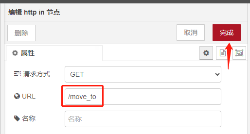
5.	重新启动APP，在编程控制页面的扩展中找到自定义指令块LiftKit_MoveTo，将指令块拖入主程序中保存，提示保存成功说明脚本请求成功。同时在node-red界面的调试窗口可以看到APP返回的信息。
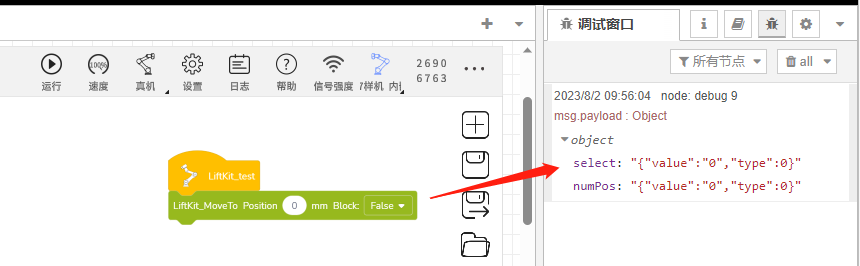
“select”是自定义指令块配置时下拉框的属性名，“select”里面的“value”为0表示当前下拉框选择“False”，“value”为0表示当前下拉框选择“True”。“numPos”是输入框的属性名，“numPos”里面的“value”为0表示当前输入框里的值为0。“type”含义参考3.1节获取位置指令块中的解释。
6.	编辑第1个“function”节点，函数命名任意，这里命名为“get_data”。输入以下代码对传输数据进行预处理，转化为JavaScript对象：
```javascript
var value_pos = msg.payload.numPos;
var select = msg.payload.select;
var selectObj1 = JSON.parse(value_pos);
var selectObj2 = JSON.parse(select);
msg.payload = [selectObj1, selectObj2];
msg.selectObj1 = selectObj1;
msg.selectObj2 = selectObj2;
return msg;
```
7.	编辑第2个“function”节点，函数命名为“data_process”。输入以下代码对传输数据进行进一步处理：
```javascript
var value_pos = msg.payload[0].value;
var type_pos = msg.payload[0].type;
var value_select = msg.payload[1].value;
var type_select = msg.payload[1].type;
msg.payload = [value_pos, type_pos, value_select, type_select];
msg.value_pos = value_pos;
msg.type_pos = type_pos;
msg.value_select = value_select;
msg.type_select = type_select;
return msg;
```
8.	编辑第3个“function”节点，函数命名为“move_to”。输入以下代码对升降柱发送socket指令实现移动到指定位置。
```javascript
msg.error_code = 0;
var LIFTKIT_ip = global.get("global_ip");
var LIFTKIT_port = global.get("global_port");
var value_pos = msg.payload[0];
var type_pos = msg.payload[1];
var value_select = msg.payload[2];
var type_select = msg.payload[3];
// 虚拟限位根据前端设置，后面详细介绍
// var l_min = global.get("global_virtualLimits_min");
// var l_max = global.get("global_virtualLimits_max");
//这里先固定l_min = 0，l_max = 900
var l_min = 0;
var l_max = 900;
// 判断输入框内数据为手动输入还是以程序/系统变量存储
if (type_pos == 0){
    value_pos = parseFloat(value_pos);
    // 输入框为手动输入，判断是否超出升降柱设定的虚拟限位
    if (value_pos >= l_min && value_pos <= l_max) {
        //未超出虚拟限位则发送移动命令
        var jks_txt = ``
        jks_txt += `LIFTKIT_clinet = socket_open("${LIFTKIT_ip}", ${LIFTKIT_port})\n`;
        jks_txt += `Str_READY = "READY\\n"\n`;
        jks_txt += `compare_value = 1\n`;
        jks_txt += `condition_value = 0\n`;
        jks_txt += `condition = (compare_value != condition_value)\n`;
        jks_txt += `while(condition):\n`;
        jks_txt += `get_status = "get_status\\n"\n`;
        jks_txt += `get_status_str = socket_send(LIFTKIT_clinet,get_status)\n`;
        jks_txt += `recv_data = socket_recv(LIFTKIT_clinet,0)\n`;
        jks_txt += `recv_data_cut = recv_data\n`;
        jks_txt += `separator_cutting = ""\n`;
        jks_txt += `formatStr = "get_status,OK,%s"\n`;
        jks_txt += `cutting = sscanf(recv_data,formatStr,recv_data_cut)\n`;
        jks_txt += `Str_READY = "READY\\n"\n`;
        jks_txt += `compare_value = strcmp(recv_data_cut,Str_READY)\n`;
        jks_txt += `condition_value = 0\n`;
        jks_txt += `condition = (compare_value != condition_value)\n`;
        jks_txt += `end\n`;
        jks_txt += `sleep(1)\n`;
        jks_txt += `moveTo = "moveTo_absolutePosition,${value_pos}\\n"\n`;
        jks_txt += `moveTo_str = socket_send(LIFTKIT_clinet,moveTo)\n`;
        jks_txt += `recv_data = socket_recv(LIFTKIT_clinet,0)\n`;
        jks_txt += `sleep(1)\n`;  
        jks_txt += `if(${value_select} == 1)\n`;
        jks_txt += `Str_READY = "READY\\n"\n`;
        jks_txt += `compare_value = 1\n`;
        jks_txt += `condition_value = 0\n`;
        jks_txt += `condition = (compare_value != condition_value)\n`;
        jks_txt += `while(condition):\n`;
        jks_txt += `get_status = "get_status\\n"\n`;
        jks_txt += `get_status_str = socket_send(LIFTKIT_clinet,get_status)\n`;
        jks_txt += `recv_data = socket_recv(LIFTKIT_clinet,0)\n`;
        jks_txt += `recv_data_cut = recv_data\n`;
        jks_txt += `separator_cutting = ""\n`;
        jks_txt += `formatStr = "get_status,OK,%s"\n`;
        jks_txt += `cutting = sscanf(recv_data,formatStr,recv_data_cut)\n`;
        jks_txt += `Str_READY = "READY\\n"\n`;
        jks_txt += `compare_value = strcmp(recv_data_cut,Str_READY)\n`;
        jks_txt += `condition_value = 0\n`;
        jks_txt += `condition = (compare_value != condition_value)\n`;
        jks_txt += `end\n`;
        jks_txt += `socket_close(LIFTKIT_clinet)\n`;
        jks_txt += `else:\n`;
        jks_txt += `socket_close(LIFTKIT_clinet)\n`;
        jks_txt += `end\n`;
        msg.jks = jks_txt;
    }
    //超出虚拟限位则弹出错误信息
    else {
        msg.error_code = -1;
        msg.error_msg = "Position value outside the virtual limit range";
    }

}
 // 输入框内为程序/系统变量，发送移动命令
else {
    var jks_txt = ``
    jks_txt += `LIFTKIT_clinet = socket_open("${LIFTKIT_ip}", ${LIFTKIT_port})\n`;
    jks_txt += `Str_READY = "READY\\n"\n`;
    jks_txt += `compare_value = 1\n`;
    jks_txt += `condition_value = 0\n`;
    jks_txt += `condition = (compare_value != condition_value)\n`;
    jks_txt += `while(condition):\n`;
    jks_txt += `get_status = "get_status\\n"\n`;
    jks_txt += `get_status_str = socket_send(LIFTKIT_clinet,get_status)\n`;
    jks_txt += `recv_data = socket_recv(LIFTKIT_clinet,0)\n`;
    jks_txt += `recv_data_cut = recv_data\n`;
    jks_txt += `separator_cutting = ""\n`;
    jks_txt += `formatStr = "get_status,OK,%s"\n`;
    jks_txt += `cutting = sscanf(recv_data,formatStr,recv_data_cut)\n`;
    jks_txt += `Str_READY = "READY\\n"\n`;
    jks_txt += `compare_value = strcmp(recv_data_cut,Str_READY)\n`;
    jks_txt += `condition_value = 0\n`;
    jks_txt += `condition = (compare_value != condition_value)\n`;
    jks_txt += `end\n`;
    jks_txt += `sleep(1)\n`;
    jks_txt += `bufferIn = ${value_pos}\n`;
    jks_txt += `bufferOut = ""\n`;
    jks_txt += `resLen = sprintf(bufferOut,"%f",bufferIn)\n`;
    jks_txt += `position_data = bufferOut\n`
    jks_txt += `Str_move = "moveTo_absolutePosition,"\n`
    jks_txt += `concatStr = string_concat(Str_move,bufferOut)\n`
    jks_txt += `concatStr = string_concat(concatStr,"\\n")\n`
    jks_txt += `moveTo = concatStr\n`;
    jks_txt += `moveTo_str = socket_send(LIFTKIT_clinet,moveTo)\n`;
    jks_txt += `recv_data = socket_recv(LIFTKIT_clinet,0)\n`;
    jks_txt += `sleep(1)\n`;
    jks_txt += `if(${value_select} == 1)\n`;
    jks_txt += `Str_READY = "READY\\n"\n`;
    jks_txt += `compare_value = 1\n`;
    jks_txt += `condition_value = 0\n`;
    jks_txt += `condition = (compare_value != condition_value)\n`;
    jks_txt += `while(condition):\n`;
    jks_txt += `get_status = "get_status\\n"\n`;
    jks_txt += `get_status_str = socket_send(LIFTKIT_clinet,get_status)\n`;
    jks_txt += `recv_data = socket_recv(LIFTKIT_clinet,0)\n`;
    jks_txt += `recv_data_cut = recv_data\n`;
    jks_txt += `separator_cutting = ""\n`;
    jks_txt += `formatStr = "get_status,OK,%s"\n`;
    jks_txt += `cutting = sscanf(recv_data,formatStr,recv_data_cut)\n`;
    jks_txt += `Str_READY = "READY\\n"\n`;
    jks_txt += `compare_value = strcmp(recv_data_cut,Str_READY)\n`;
    jks_txt += `condition_value = 0\n`;
    jks_txt += `condition = (compare_value != condition_value)\n`;
    jks_txt += `end\n`;
    jks_txt += `socket_close(LIFTKIT_clinet)\n`;
    jks_txt += `else:\n`;
    jks_txt += `socket_close(LIFTKIT_clinet)\n`;
    jks_txt += `end\n`;
    msg.jks = jks_txt;
}
return msg;
```

9.	各节点都设置完成之后连接并部署（Debug可以选择删除）。
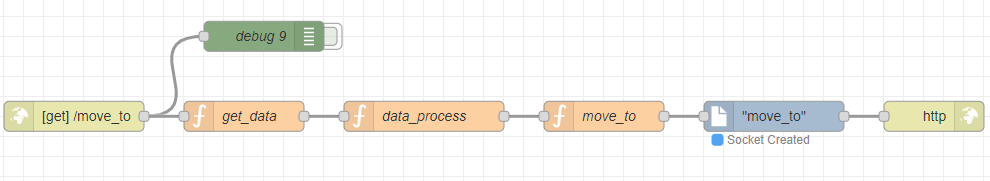
### 4.2.2 APP测试
打开JAKA APP，在编程界面扩展模块找到LiftKit_MoveTo。
情况一：“Block”选择“False”。直接在输入框内输入合理位置值或通过程序变量输入合理位置值。保存运行程序让升降柱移动到绝对位置为100 mm处。
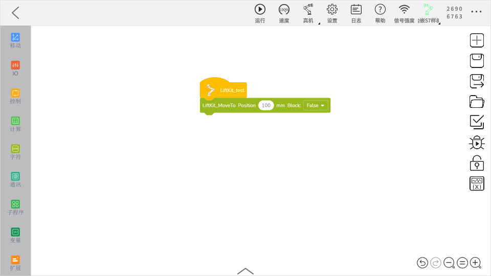
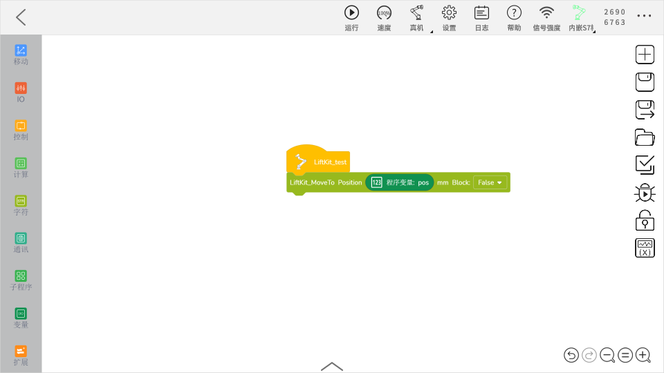
当连接真实升降柱，真实效果是升降柱会移动到绝对位置为100 mm处。为了方便看到效果，这里借助调试助手模拟TCP服务端，即升降柱，机器人为TCP客户端。
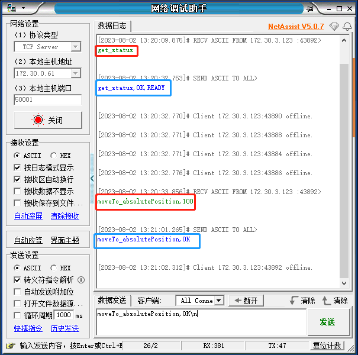
运行程序时看到机器人会先发送“get_status\n”指令查询升降柱当前状态，升降柱若是准备状态会回复“get_status,OK,READY\n”指令，只有收到是“READY”状态时，机器人才会发送“moveTo_absolutePosition,100\n”指令，发送后升降柱会回复“moveTo_absolutePosition,OK\n”指令，最后关闭socket (TCP)通讯，程序运行结束。
情况二：“Block”选择“True”。直接在输入框内输入合理位置值或通过程序变量输入合理位置值，这里设置变量初试值为200，保存运行程序让升降柱移动到绝对位置为200 mm处。
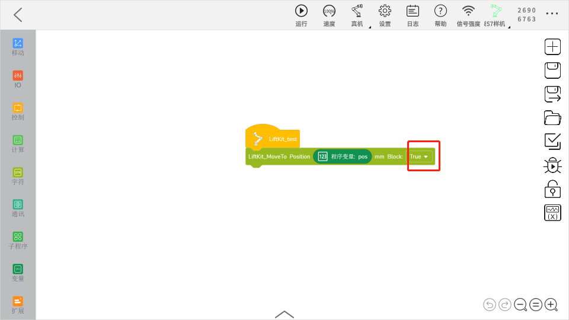
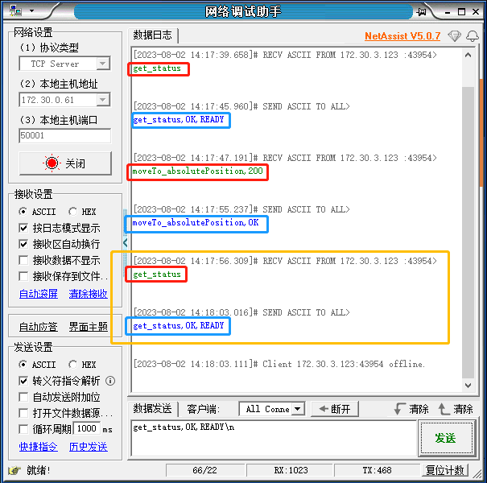
运行程序时看到机器人会先发送“get_status\n”指令查询升降柱当前状态，升降柱若是准备状态会回复“get_status,OK,READY\n”指令。只有收到是“READY”状态时，机器人才会发送“moveTo_absolutePosition,200\n”指令，发送后升降柱会回复“moveTo_absolutePosition,OK\n”指令。之后再次发送“get_status\n”指令查询升降柱当前状态，若升降柱正在移动返回“get_status,OK,Moving\n”。若是移动结束处于停止则返回“get_status,OK, READY\n”，以此来确认升降柱移动完成，程序才会跳转至下一条指令。
以上测试成功说明该自定义指令块生效。


### 4.3 停止指令块
### 4.3.1 创建步骤
1.	在开发者页面的左侧节点菜单栏中，找到JAKA AddOn，将其中的Customized-commands拖到中间的工作区域，点击“部署”。
2.	双击工作区域中的块，进入指令块开发页面。
（1）基本配置：
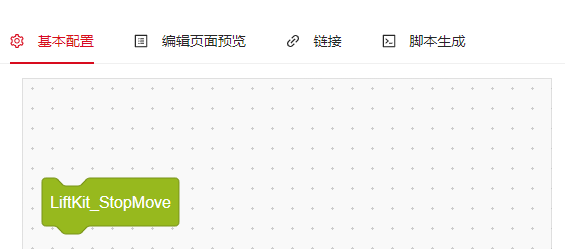
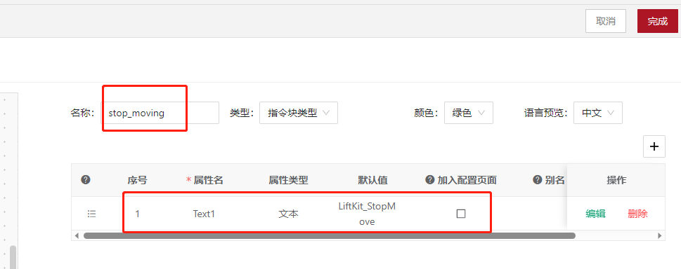
（2）链接：路径使用默认。
（3）脚本生成：选择Function方式，点击“完成”。
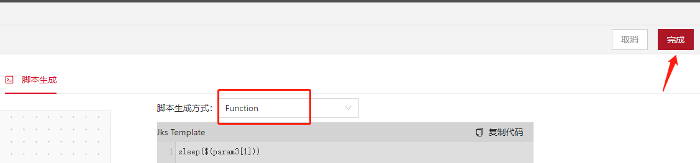
3.	将“http in”、“http response”、“function”、“debug”及前面的“get_position”节点按下图连接并部署：
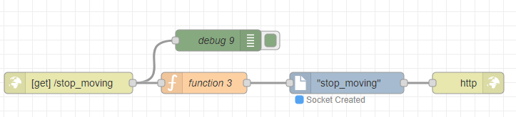
4. 编辑“http in”节点，请求方式为“GET”，URL为自定义指令块的名称stop_moving，编辑好后点击“完成”。
5.	重新启动APP，在编程控制页面的扩展中找到自定义指令块LiftKit_StopMove，将指令块拖入主程序中保存，提示保存成功说明脚本请求成功。同时在node-red界面的调试窗口可以看到APP返回的信息，返回对象为空，是因为这个指令块只有一个文本属性。
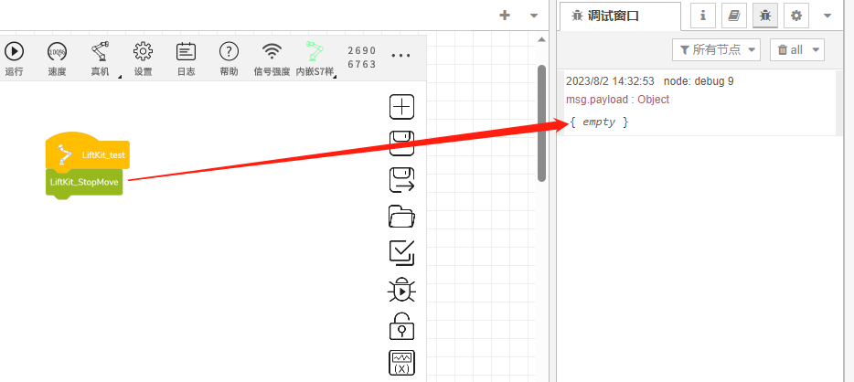
6.	双击函数，函数命名任意，这里命名为“stop_moving”。输入以下代码在控制器中生成jks脚本：
```javascript
var LIFTKIT_ip = global.get("global_ip");
var LIFTKIT_port = global.get("global_port");
var jks_txt = ``
jks_txt += `LIFTKIT_clinet = socket_open("${LIFTKIT_ip}", ${LIFTKIT_port})\n`;
jks_txt += `stop_moving = "stop_moving\\n"\n`;
jks_txt += `stop_moving_str = socket_send(LIFTKIT_clinet, stop_moving)\n`;
jks_txt += `recv_data = socket_recv(LIFTKIT_clinet, 0)\n`;
jks_txt += `socket_close(LIFTKIT_clinet)\n`;
msg.jks = jks_txt;
return msg;
```
7.	各节点都设置完成之后连接并部署（Debug这里选择删除）。
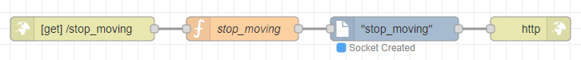

### 4.3.2 APP测试
打开JAKA APP，在编程界面扩展模块找到LiftKit_StopMove。这里需要结合移动指令使用，并且是非阻塞运动状态，先让升降柱移动到300 mm，在移动未完成之前发送停止指令。
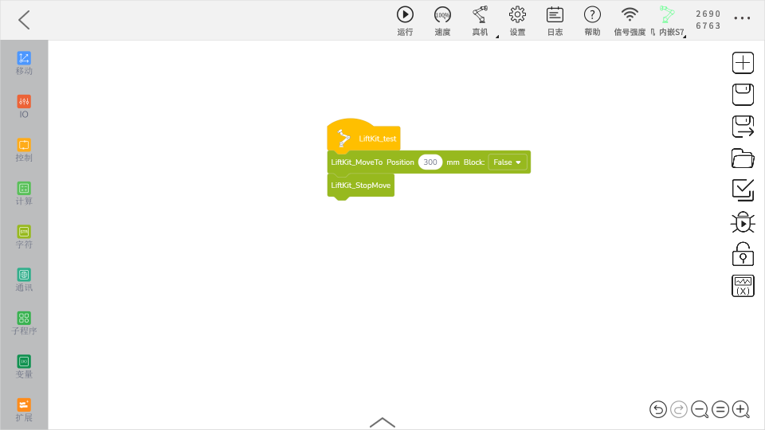
当连接真实升降柱，真实效果是升降柱还没移动到300 mm就停止了，具体停在什么位置取决于立柱本身的延迟。为了方便看到效果，这里借助调试助手模拟TCP服务端，即升降柱，机器人为TCP客户端。
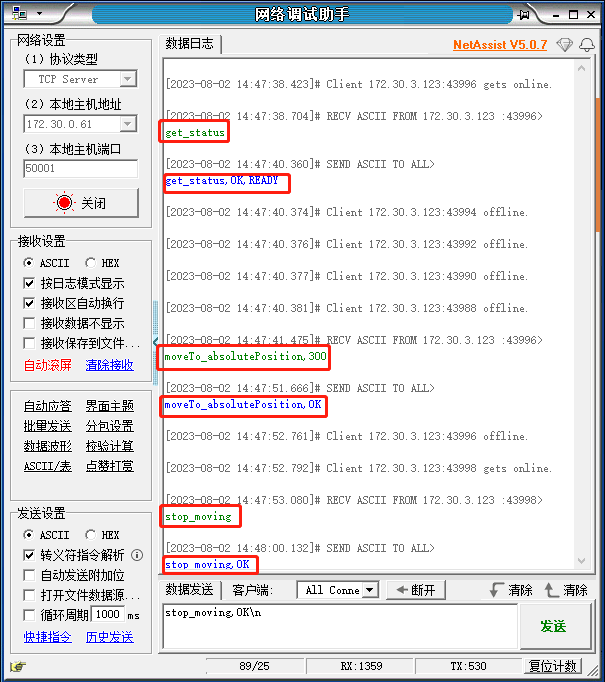
运行程序时看到机器人会先发送“get_status\n”指令查询升降柱当前状态，升降柱若是准备状态会回复“get_status,OK,READY\n”指令。只有收到是“READY”状态时，机器人才会发送“moveTo_absolutePosition,300\n”指令，发送后升降柱会回复“moveTo_absolutePosition,OK\n”指令。之后机器人发送“stop_moving\n”指令停止移动，升降柱返回“stop_moving,OK\n”。
以上测试成功说明该自定义指令块生效。

## 前后端交互
该部分需要连接真实升降柱进行测试才能实时访问到其虚拟限位、型号、当前状态、当前位置、行程等信息。
### 5.1 准备工作
1.	提前下载一份前端工程文件夹“dist”。将改文件夹放置在AddOn包JAKA_LiftKit目录下。
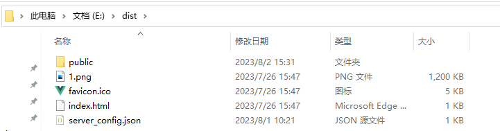
2.	修改JAKA_LiftKit文件夹下的配置文件JAKA_LiftKit_config.ini中的url路径为http://localhost/JAKA_LiftKit/dist/
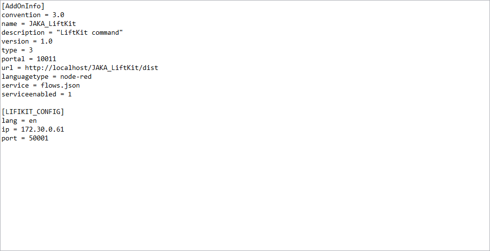
3.	保存JAKA_LiftKit_config.ini，并将JAKA_LiftKit压缩成文件夹压缩为JAKA_LiftKit.tar.gz 格式。
4.	打开JAKA APP，依次点击“设置”—“系统设置”—“附加程序”，在“附加程序”中删除原有JAKA_LiftKit包，重新上传JAKA_LiftKit.tar.gz文件。
5.	点开附加程序JAKA_LiftKit包右侧的操作选项中的小地球图标，就可以打开前端界面。
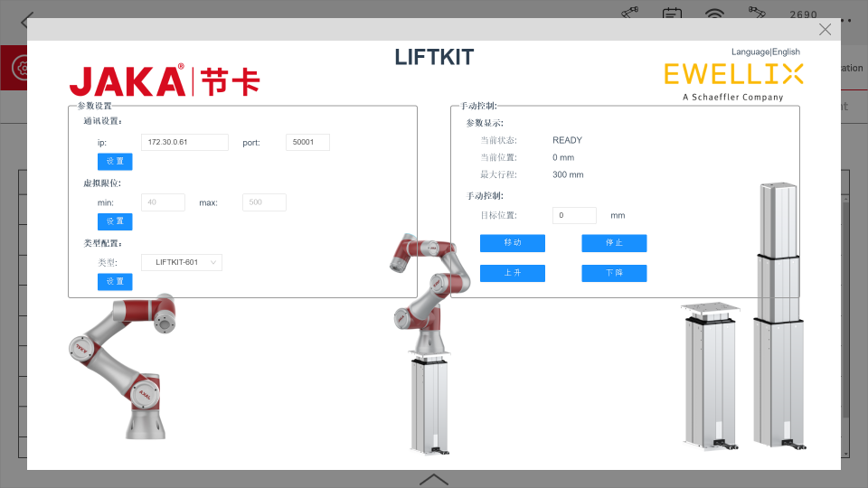
6.	为了方便调试，可以在浏览器中打开前端界面，当前机器人IP为172.30.3.123。故在浏览器地址栏输入172.30.3.123/addon/JAKA_LiftKit/dist/。若打开的页面有信息错误、缺失、设置按钮失效等都是正常现象，这是由于我们还没开始创建后端服务。
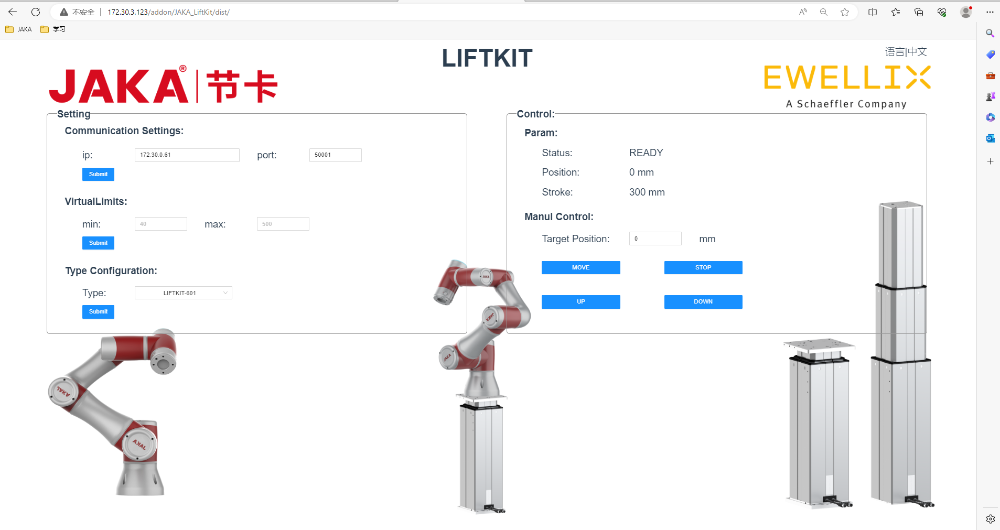

### 5.2 初始化界面
前端界面中的语言、升降柱ip、port初始参数来源于JAKA_AddOn_config.ini，所以需要提前从文件中读取出。当前状态、当前位置、最大行程、虚拟限位、类型及类型列表来源于升降柱，所以需要提前建立TCP通讯向升降柱发送相关指令获取这些信息。该部分创建后的node-red节点部署如下所示，接下来我们将一步步完成这些功能。
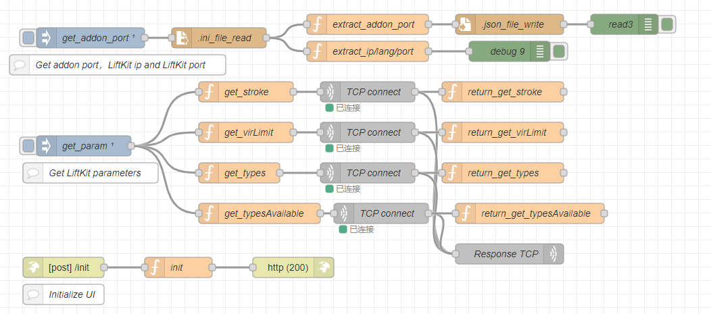
1.	在左侧节点菜单栏中找到“inject”、“read file”、2个“function”、“write file”、2个“debug”，将这些节点并连接部署。
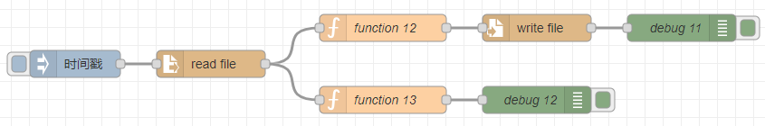
（1）编辑“inject”节点，勾选立刻执行于0.1秒后。
（2）编辑“read file”节点，文件路径为：
/usr/etc/jkzuc/configs/JAKA/AddOns/JAKA_LiftKit/JAKA_LiftKit_config.ini
编码选择utf8。
（3）编辑“function 12”节点，更名为“extract_addon_port”使用正则表达式将addon端口号提取出来并输出。
代码如下：
```javascript
let configString = msg.payload;
const portRegex = /portal\s*=\s*(\d+)/
function extractValue(regex, str) {
    const matches = str.match(regex);
    return matches ? matches[1] : null;
}
const portValue = extractValue(portRegex, configString);
const jsonObject = { "PORT": portValue };
msg.payload = jsonObject;
return msg
```
（4）编辑“write file”节点，文件路径为：
/usr/etc/jkzuc/configs/JAKA/AddOns/JAKA_LiftKit/dist/server_config.json行为选择复写文件，编码选择utf8。

（5）编辑“function 13”节点，更名为“extract_ip/lang/port”同样使用正则表达式将升降柱IP地址、端口号、默认语言提取出来并输出。代码如下：
```javascript
let configString = msg.payload;
const langRegex = /lang\s*=\s*([^\s]+)/;
const ipRegex = /ip\s*=\s*([\d.]+)/;
const portRegex = /port\s*=\s*(\d+)/;
function extractValue(regex, str) {
    const matches = str.match(regex);
    return matches ? matches[1] : null;
}
const ipValue = extractValue(ipRegex, configString);
const langValue = extractValue(langRegex, configString);
const portValue = extractValue(portRegex, configString);
// 设置为全局变量，方便后续调用
global.set("global_ip", ipValue);
global.set("global_lang", langValue);
global.set("global_port", portValue);
msg.payload = [ipValue, langValue, portValue];
msg.ipValue = ipValue;
msg.langValue = langValue;
msg.portValue = portValue;
return msg
```
（6）全部编辑完成之后连接部署，debug调试界面应输出如下信息。
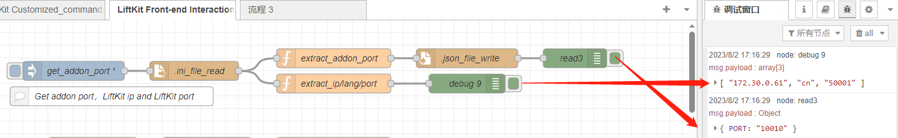
2. 获取升降柱参数：在左侧节点菜单栏中找到“inject”、8个“function”，4个“tcp request”，1个“tcp out”节点，并将这些节点按下图连接并部署。
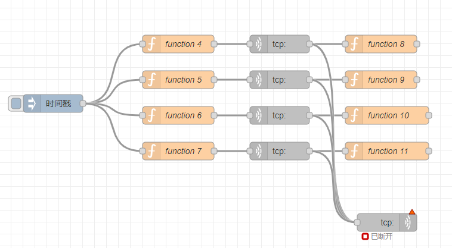
（1）编辑“inject”节点，勾选立刻执行于0.1秒后。

（2）编辑“function 4”节点，名称改为“get_stroke”，该节点用来向升降柱发送获取行程命令。代码如下：
```javascript
msg.payload = "get_stroke\n"
msg.host = global.get("global_ip");
msg.port = global.get("global_port");
return msg;
```
（3）编辑“tcp request”节点，更改名称，返回选择字符串，因为上个步骤使用msg.host和msg.port属性设置tcp主机或端口，所以可以将tcp主机或端口留空。

（4）编辑“function 8”节点，名称改为“return_get_stroke”，用于接收并处理tcp服务端回复的消息，获得行程值。
```javascript
var get_stroke_data = msg.payload;
var data = get_stroke_data.split(",");
global.set("global_stroke", data[2]);
msg.payload = global.get("global_stroke");
return msg;
```
注：可以在“return_get_stroke”函数节点后加debug节点输出行程值，这里不做演示。

（5）编辑“function 5”节点，名称改为“get_virLimit”，该节点用来向升降柱发送获取虚拟限位命令。代码如下：
```javascript
msg.payload = "get_virtualLimits\n"
msg.host = global.get("global_ip");
msg.port = global.get("global_port");
return msg;
```
（6）编辑“function 9”节点，名称改为“return_get_virLimit”，用于接收并处理tcp服务端回复的消息，获得虚拟限位值。代码如下：
```javascript
var get_stroke_data = msg.payload;
var data = get_stroke_data.split(",");
global.set("global_virtualLimits_min", data[2]);
global.set("global_virtualLimits_max", data[3]);
msg.payload = global.get("global_virtualLimits_min");
return msg;
```
（7）编辑“function 6”节点，名称改为“get_types”，该节点用来向升降柱发送获取类型命令。代码如下：
```javascript
msg.payload = "get_type\n"
msg.host = global.get("global_ip");
msg.port = global.get("global_port");
return msg;
```
（8）编辑“function 10”节点，名称改为“return_get_types”，用于接收并处理tcp服务端回复的消息，获得当前升降柱类型。代码如下：
```javascript
var get_stroke_data = msg.payload;
var data = get_stroke_data.split(",");
global.set("global_types", data[2]);
msg.payload = global.get("global_types", data[2]);
return msg;
```
（9）编辑“function 7”节点，名称改为“get_typesAvailable”，该节点用来向升降柱发送获取可用类型命令。代码如下：
```javascript
msg.payload = "get_typesAvailable\n";
msg.host = global.get("global_ip");
msg.port = global.get("global_port");
return msg;
```
（10）编辑“function 11”节点，名称改为“return_get_typesAvailable”，该用于接收并处理tcp服务端回复的消息，获得当前升降柱可用类型。代码如下：
```javascript
var get_stroke_data = msg.payload;
var data = get_stroke_data.split(",");
const filteredArray = data.filter(item => item.includes('LIFTKIT-'));
global.set("global_typesAvailable", filteredArray);
msg.payload = global.get("global_typesAvailable");
return msg;
```
（11）编辑“tcp out”节点，改个名称，类型选择为响应TCP。
（12）各节点编辑之后重新部署。
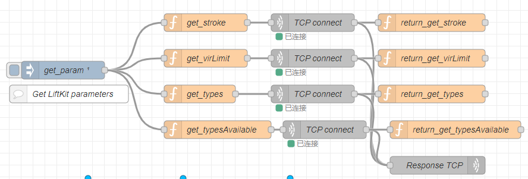
3. 初始化UI：在左侧节点菜单栏中找到“http in”、“function”，“http response”节点，并将这些节点按下图连接并部署。
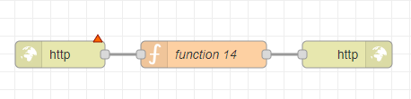
（1）编辑“http in”节点：请求方式选择“POST”，URL为“/init”，点击“完成”。

（2）编辑“function”节点，名称改为“init”，代码如下：
```javascript
msg.payload={
    ip: global.get("global_ip"),
    lang: global.get("global_lang"),
    port: global.get("global_port"),
    ewelli_params: {
        stroke: global.get("global_stroke"),
        virtualLimits: [global.get("global_virtualLimits_min"), global.get("global_virtualLimits_max")],
        types: global.get("global_types"),
        typesAvailable: global.get("global_typesAvailable")
    }
}

return msg;
```
（3）编辑“http response”节点，状态码为200。

（4）各节点编辑连接后重新部署，并且成功连接真实升降柱（注：只有连接真实机械臂才会自动返回正确行程、类型、虚拟限位信息），刷新前端界面就可以显示完整信息。

### 5.3 heartbeat监测
该部分用来监测并更新升降柱的状态、位置、行程及虚拟限位。该部分创建后的node-red节点部署如下所示：
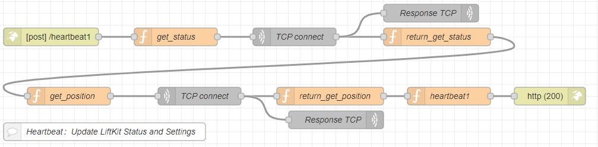
1. 在左侧节点菜单栏中找到“http in”、5个“function”，“http reponse”，2个“tcp request”，2个“tcp out”节点，并将这些节点按上图顺序连接并部署。

（1）编辑“http in”节点：请求方式选择“POST”，URL为“/heartbeat1”，点击“完成”。

（2）编辑第1个“function”节点，名称改为“get_status”，该节点用来向升降柱发送获取状态命令。代码如下：
```javascript
msg.payload = "get_status\n";
msg.host = global.get("global_ip");
msg.port = global.get("global_port");
return msg;
```
（3）编辑第2个“function”节点，名称改为“return_get_status，该节点用于接收并处理tcp服务端回复的消息，获得当前状态。代码如下：
```javascript
var get_status_data = msg.payload;
var data = get_status_data.split(",");
global.set("get_status_data", data[2]);
msg.payload = data[2];
return msg;
```
（4）编辑第3个“function”节点，名称改为“get_position”，该节点用来向升降柱发送获取位置命令。代码如下：
```javascript
msg.payload = "get_position\n";
msg.host = global.get("global_ip");
msg.port = global.get("global_port");
return msg;
```
（5）编辑第4个“function”节点，名称改为“return_get_position”，该节点用于接收并处理tcp服务端回复的消息，获得当前位置。代码如下：
```javascript
var get_position_data = msg.payload;
var data = get_position_data.split(",");
global.set("get_position_data",data[2]);
msg.payload = data[2];
return msg;
```
（6）编辑第5个“function”节点，名称改为“heartbeat1”，该节点用于监测并更新升降柱当前状态、位置、最大行程、最大虚拟限位、最小虚拟限位。代码如下：
```javascript
msg.payload = {
    status: global.get("get_status_data"),
    position: global.get("get_position_data"),
    stroke: global.get("global_stroke"),
    min_limit: global.get("global_virtualLimits_min"),
    max_limit: global.get("global_virtualLimits_max")  
}
return msg;
```
（7）编辑“http response”节点，状态码为200。

（8）编辑2个“tcp request”节点，更改名称，返回选择字符串。

（9）编辑2个“tcp out”节点，修改名称，类型选择为响应TCP。

### 5.4 参数设置
该部分是为了使前端设置按钮生效，包括升降柱IP地址、端口号、语言（中文/英文）、虚拟限位、选择类型。该部分创建后的node-red节点部署如下所示：
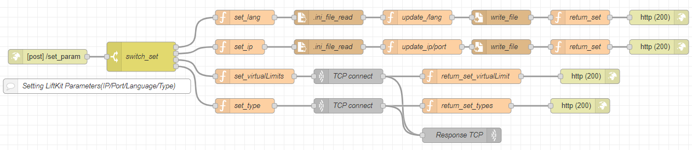
1.	设置语言：
（1）在左侧节点菜单栏中找到“http in”、“switch”、3个“function”，“http reponse”，“read file”，“write file”节点，并将这些节点按下图顺序连接并部署。
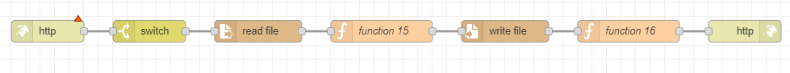

（2）编辑“http in”节点：请求方式选择“POST”，URL为“/set_param”，点击“完成”。

（3）编辑“switch”节点，名称改为“switch_set”，属性选择msg.payload.param，左下角选择添加共4个流，输出分别为：“set_lang”、“set_ip”、“set_virtualLimits”、“set_type”。
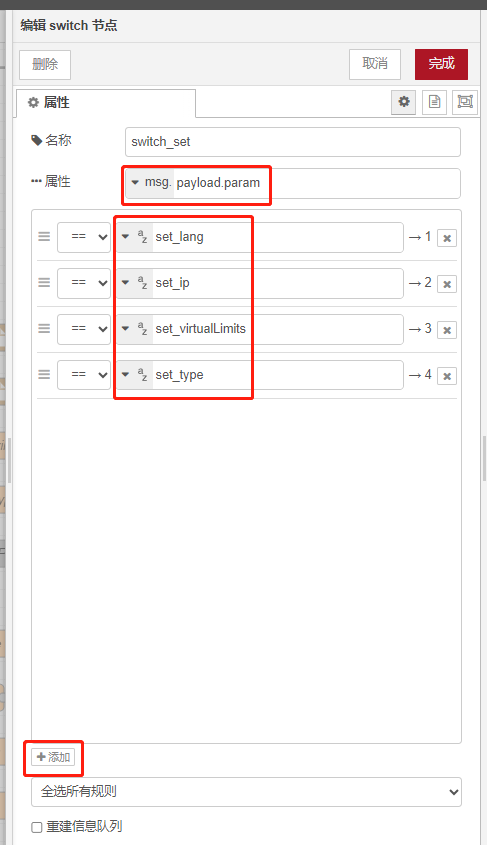
（4）编辑第1个“function”节点，更名为“set_lang”，对传输数据流作预处理：
```javascript
var setlang = msg.payload.data.lang
global.set("global_setlang", setlang);
msg.setportValue = global.get("global_setlang");
return msg;
```
（5）编辑“read file”节点，属性设置中，文件名写JAKA_LiftKit_config.ini 文件在控制器中的存放位置。/usr/etc/jkzuc/configs/JAKA/AddOns/JAKA_LiftKit/JAKA_LiftKit_config.ini。编码选择utf8，点击“完成”按钮。

（6）编辑第2个“function”节点，更名为“update_/lang”，利用正则表达从配置文件中提取出界面语言：
```javascript
let configString = msg.payload;
var newLang = global.get("global_setlang");
const langRegex = /lang\s*=\s*([^\s]+)/;
function extractValue(regex, str) {
    const matches = str.match(regex);
    return matches ? matches[1] : null;
}
const langValue = extractValue(langRegex, configString);
msg.payload = configString;
return msg;
```
（7）编辑“write file”节点，文件路径为：
/usr/etc/jkzuc/configs/JAKA/AddOns/JAKA_LiftKit/JAKA_LiftKit_config.ini行为选择复写文件，编码选择utf8。

（8）编辑第3个“function”节点，更名为“return_set”，给前端返回设置成功的信息。
```javascript
msg.payload = "0";
return msg;
```
（9）编辑“http response”节点，状态码为200。

2.	设置IP/端口：
（1）在左侧节点菜单栏中找到3个“function”，“http reponse”，“read file”，“write file”节点，并将这些节点按下图顺序连接并部署。
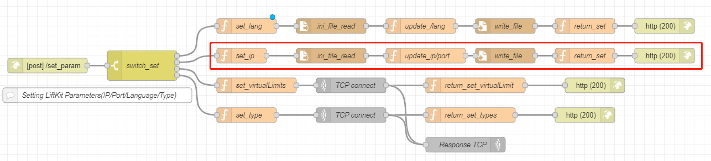
（2）编辑第1个“function”节点，更名为“set_ip”，对传输数据流作预处理：
```javascript
var setip = msg.payload.data.ip
var setport = msg.payload.data.port
global.set("global_setip", setip);
global.set("global_setport", setport);
msg.payload = [global.get("global_setip"), global.get("global_setport")];
msg.setipValue = global.get("global_setip");
msg.setportValue = global.get("global_setport");
return msg;
```
（3）编辑“read file”节点，属性设置中，文件名写JAKA_LiftKit_config.ini 文件在控制器中的存放位置。/usr/etc/jkzuc/configs/JAKA/AddOns/JAKA_LiftKit/JAKA_LiftKit_config.ini。编码选择utf8，点击“完成”按钮。

（4）编辑第2个“function”节点，更名为“update_ip/port”，利用正则表达从配置文件中提取出升降柱IP和端口号：
```javascript
let configString = msg.payload;
var newIP = global.get("global_setip");
var newPort = global.get("global_setport");
const ipRegex = /ip\s*=\s*([\d.]+)/;
const portRegex = /port\s*=\s*(\d+)/;
function extractValue(regex, str) {
    const matches = str.match(regex);
    return matches ? matches[1] : null;
}
const ipValue = extractValue(ipRegex, configString);
const portValue = extractValue(portRegex, configString);
configString = configString.replace(ipRegex, `ip = ${newIP}`);
configString = configString.replace(portRegex, `port = ${newPort}`);
msg.payload = configString;
return msg;
```
（5）编辑“write file”节点，文件路径为：
/usr/etc/jkzuc/configs/JAKA/AddOns/JAKA_LiftKit/JAKA_LiftKit_config.ini行为选择复写文件，编码选择utf8。

（6）编辑第3个“function”节点，更名为“update_ip/port”，给前端返回设置成功的信息。
```javascript
msg.payload = "0";
return msg;
```
（7）编辑“http response”节点，状态码为200。
3.	设置虚拟限位：
（1）在左侧节点菜单栏中找到2个“function”，“tcp repuest”、“tcp out”、“http response”节点，并将这些节点按下图顺序连接并部署。
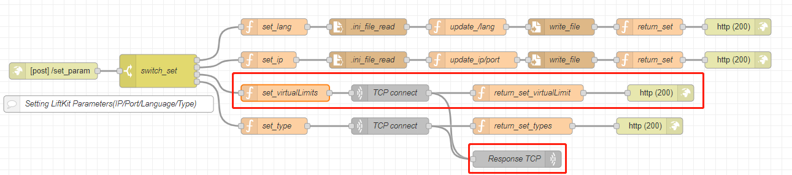
（2）编辑第1个“function”节点，更名为“set_virtualLimits”，向TCP服务端发送获取虚拟限位指令：
```javascript
const l_min = parseFloat(msg.payload.data.min_limit);
const l_max = parseFloat(msg.payload.data.max_limit);
global.set("global_l_min", l_min);
global.set("global_l_max", l_max);
var set_l_min = global.get("global_l_min");
var set_l_max = global.get("global_l_max");
const send_msg_virtualLimits = `set_virtualLimits,${set_l_min},${set_l_max}\n`;
msg.payload = send_msg_virtualLimits;
msg.host = global.get("global_ip");
msg.port = global.get("global_port");
return msg;
```
（3）编辑“tcp request”节点，更改名称，返回选择字符串。
（4）编辑“tcp out”节点，修改名称，类型选择为响应TCP。
（5）编辑第2个“function”节点，更名为“return_set_virtualLimit”，处理接收的虚拟限位并更新到全局变量中，并给前端返回设置成功的信息。
```javascript
if (msg.payload == 'set_virtualLimits,OK\n')
{
    global.set("global_virtualLimits_min", global.get("global_l_min"));
    global.set("global_virtualLimits_max", global.get("global_l_max"));
    msg.payload = "0";
}
else
{
    msg.payload = "1";
}
return msg;
```
（6）编辑“http response”节点，状态码为200。
4.	设置类型：
（1）在左侧节点菜单栏中找到2个“function”，“tcp repuest”、“http response”节点，并将这些节点按下图顺序连接并部署。
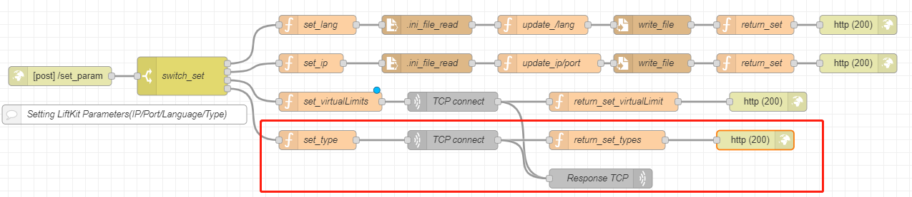
（2）编辑第1个“function”节点，更名为“set_type”，向TCP服务端发送获取类型指令：
```javascript
const types = msg.payload.data.types;
global.set("global_types", types);
var set_types = global.get("global_types");
const send_msg = `set_type,${set_types}\n`;
msg.payload = send_msg;
msg.host = global.get("global_ip");
msg.port = global.get("global_port");
return msg;
```
（3）编辑“tcp request”节点，更改名称，返回选择字符串。
（4）编辑“tcp out”节点，修改名称，类型选择为响应TCP。
（5）编辑第2个“function”节点，更名为“return_set_types”，给前端返回设置成功的信息。
```javascript
if (msg.payload == 'set_type,OK\n')
{
    msg.payload = "0";
}
else
{
    msg.payload = "1";
}
return msg;
```
（6）编辑“http response”节点，状态码为200。
### 5.5 运动控制
该部分是为了使前端关于运动控制的按钮生效，包括移动、上升（上升到虚拟限位最大值）、下降（下降到虚拟限位最小值）、停止。该部分创建后的node-red节点部署如下所示：
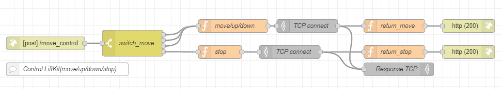
1.	由于移动、上升、下降都是向TCP服务端发送移动到绝对位置的指令，所以这三个输出可以使用同一路输出流来处理。

2.	控制升降柱移动/上升/下降：

（1）在左侧节点菜单栏中找到“http in”、“switch”、2个“function”，“http reponse”，“read file”，“write file”节点，并将这些节点按下图顺序连接并部署。
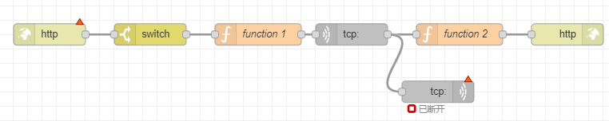
（2）编辑“http in”节点：请求方式选择“POST”，URL为“/move_control”，点击“完成”。

（3）编辑“switch”节点，名称改为“switch_set”，属性选择msg.payload.param，左下角选择添加共4个流，输出分别为：“move”、“up”、“down”、“stop”。
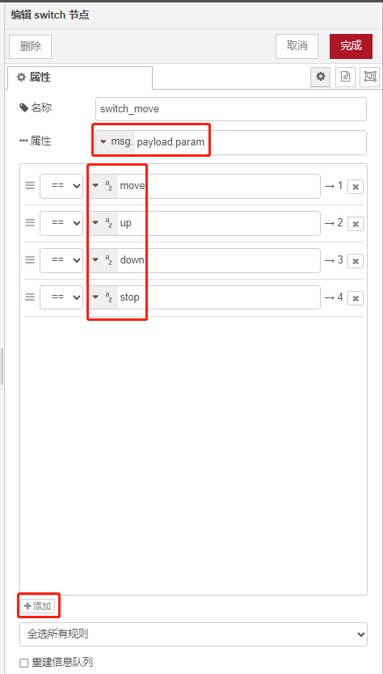

（4）编辑第1个“function”节点，更名为“move/up/down”，对传输数据流作预处理：
```javascript
const move_data = parseFloat(msg.payload.data);
global.set("global_move_data", move_data);
var position = global.get("global_move_data");
const send_msg = `moveTo_absolutePosition,${position}\n`;
msg.payload = send_msg;
msg.host = global.get("global_ip");
msg.port = global.get("global_port");
return msg;
```
（5）编辑“tcp request”节点，更改名称，返回选择字符串。

（6）编辑“tcp out”节点，修改名称，类型选择为响应TCP。

（7）编辑第2个“function”节点，更名为“return_move”，给前端返回设置成功的信息。
```javascript
if (msg.payload == 'moveTo_absolutePosition,OK\n')
{
    msg.payload = "0";
}
else
{
    msg.payload = "1";
}
return msg;
```
（8）编辑“http response”节点，状态码为200。
至此，与前端交互的后端服务便创建完整了，节点部署如下所示：
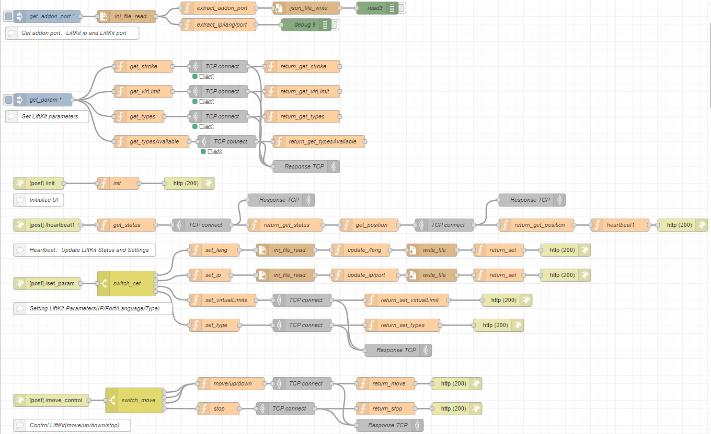

### 5.6 APP测试
前提条件：已连接真实升降柱。这里我们使用的是EWELLIX公司生产的型号为LIFTKIT-601的升降柱。只有连接真实升降柱才能实时访问到其虚拟限位、型号、当前状态、当前位置、行程等信息。
具体测试步骤：
1. 点开附加程序JAKA_LiftKit包右侧的操作选项中的小地球图标，就可以打开前端界面。
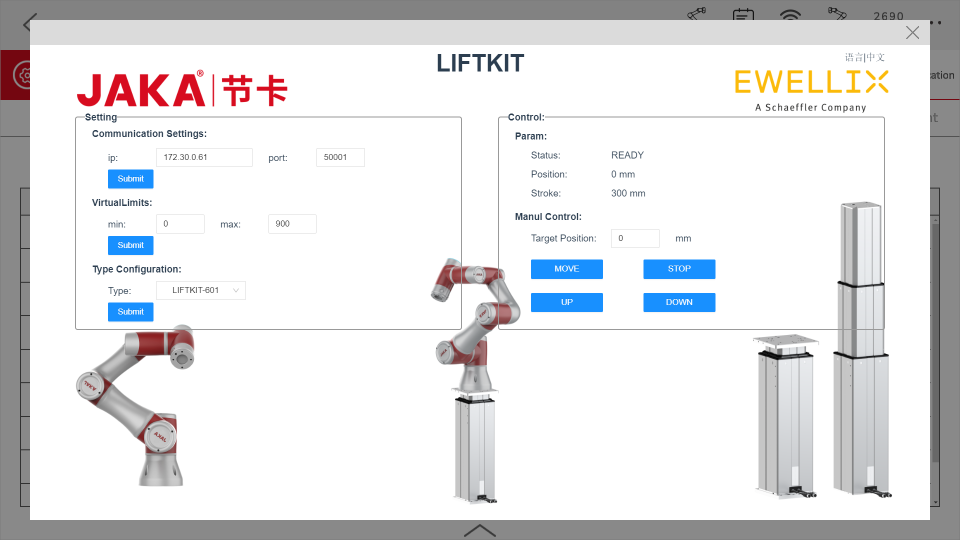

2. 语言切换：点击右上角语言切换，可以看到界面由英文变为中文。
3. 通讯设置：输入正确升降柱IP、端口，点击下方“设置”按钮，界面弹出“设置参数成功”提示。
4. 虚拟限位：输入虚拟限位的最大最小值，点击下方“设置”按钮，界面弹出“设置参数成功”提示。
5. 类型配置：下拉框可以看到目前共有LIFTKIT-601、LIFTKIT-602、LIFTKIT-00这三种类型，选择“LIFTKIT-601”，点击下方“设置”按钮，界面弹出“设置参数成功”提示。
6. 手动控制：
（1）目标位置输入200，单击“移动”按钮，升降柱移动到200 mm位置后停下。参数实时显示到右侧“参数显示”模块。能实时监测升降柱当前状态、位置。
（2）目标位置输入400，单击“移动”按钮后，升降柱开始移动，之后马上点击“停止”，升降柱还未到400 mm位置就已停止。
（3）长按“上升”按钮，升降柱开始移动，到达最大虚拟限位900 mm后运动停止。
（4）长按“下降”按钮，升降柱开始移动，到达最小虚拟限位0 mm后运动停止。
以上测试成功说明通过Node-red创建的前后端交互功能已生效。
