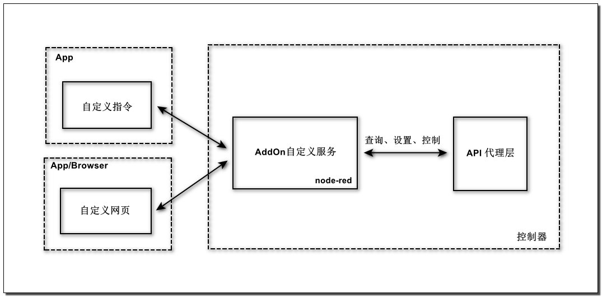
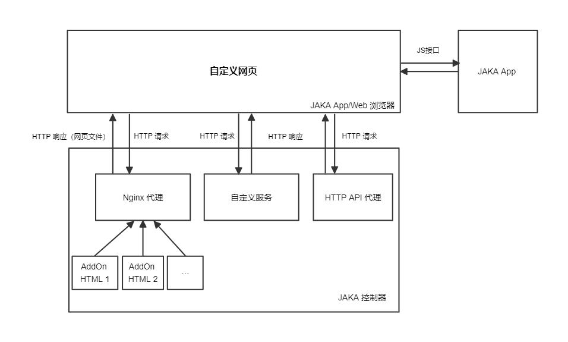

# 关于AddOn

**该页面旨在为AddOn开发者解释基本概念。**

::: warning 请注意：
1. 该教程中所提到的AddOn默认为AddOn3.0。
2. 在JAKA控制器 > 1.7.1.x 的_X64版本上支持AddOn3.0的开发和使用。
3. AddOn1.0和2.0都不再进行维护和提供开发支持。
:::

## AddOn是什么
---
JAKA AddOn是一款由JAKA提供的插件型软件产品，它支持用户开发自定义的指令插件、服务插件、网页插件，以及包含上述几种类型的复合型插件。

通过使用AddOn，用户能够对机器人操作系统进行全新的功能拓展，或对现有功能进行个性化定制。
::: tip 为了方便区分，此处将定义四个易混名词：
* JAKA AddOn套件包：在开发环境搭建时需要使用的套件包，即jaka_addon_kit.tar.gz。
* JAKA AddOnXXX包：开发完成后已经带有具体功能的功能包，如JAKA AddOn码垛包、JAKA AddOn大寰夹爪包、JAKA AddOn视觉引导包、JAKA AddOn传感器控制包等。
工艺包、第三方设备的适配包

* 包
* 插件
:::

## 为何需要使用AddOn 
---
通常情况下，如果在机器人末端连接了新的第三方工具，或是在具体的使用场景中操作具体工艺（如码垛、焊接等）时，都需要在编程界面设置新的指令。

这样的指令包含复杂、冗长的代码和参数，且不易理解、难以复用，经常给简单的动作或程序带来了额外的负担。对于精通具体操作工艺、却对机器人编程不甚了解的工程师来说，指令设置这一步骤显得尤为复杂、繁难。

使用AddOn能够去代码化，极大地简化指令设置流程。它将编程这一步骤中复杂的设置省略，直接封装为一条简单、明了、易懂的指令，更易于操作，也更利于复用已编指令，使用户能够专注在具体工艺的执行上，充分提升效率、创造成果。

总而言之，使用AddOn能提高应用的编程效率、降低用户的学习成本。

## AddOn基本功能
---
如前所述，AddOn的基本功能有三：开发自定义指令插件、自定义服务插件及自定义网页插件。

上述功能的实现，可为现有系统赋能，支持用户按需定制新功能，或对已有功能进行更改与升级。

JAKA应用开发团队可以通过AddOn框架开发JAKA官方应用包、工艺包与工艺套件，以供用户下载使用。同时也可帮助JAKA客户开发定制功能、服务及界面，满足客户的定制化需求。

JAKA合作伙伴可以通过AddOn框架开发生态链标准插件，增强产品适配性和易用性。

JAKA机器人终端用户可以通过AddOn框架开发自定义指令，对常用指令进行封装与复用。

## AddOn开发建议
---
本文档的目标读者应接受过基本的机器人操作培训，并掌握一定的基础开发能力，会使用Python、JavaScript、HTML5、CSS3等编程语言。

除此之外，还应熟悉JAKA的脚本语言JKS，这将有助于用户更好地开发、使用AddOn。

## AddOn运行机制
---
* AddOn自定义指令

AddOn自定义指令基于B/S架构，JAKA App中的编程页面为客户端（B），运行在JAKA控制器内基于node-red的AddOn服务为服务端（S），运行机制如下：

* AddOn自定义服务

AddOn自定义服务基于node-red开发，运行在控制器内部，可以调用JAKA提供的HTTP API接口来查询信息及控制机器人，运行机制如下：

* AddOn自定义网页

AddOn自定义网页部署在JAKA控制柜中，可以与控制器、JAKA App进行交互。与控制器的交互方式为通过http请求；与JAKA App的交互方式为通过JAKA App提供的API（JS方法）。运行机制如下：

## AddOn文件组成
---
开发完成的AddOnXXX包中可能包含不同的文件，下面是最常用的几种：

**数据文件**    
AddOn包中一般都包含一个json文件，其中包含了在node-red中定义流和节点信息。该文件的名称可以自定义，但需要在配置中指向该文件。

**配置文件**    
任何类型的AddOn插件必须包含`xxx_config.ini`文件，即[AddOn配置文件](/guide/addOn/iniConfig)。只有包含AddOn配置文件才能安装、初始化、运行。

**前端工程**   
包含自定义页面的AddOn目录下一般会有前端工程的文件夹，例如client、dist。

## 反馈
---

我们很高兴收到您的反馈！

如果您发现文档有任何叙述错误或描述不清的地方，欢迎在我们的文档仓库中提交[Issues](https://github.com/JakaCobot/JakaCobot.github.io/issues)。
<!-- 给addonkit的仓库链接和该文档的链接 -->
