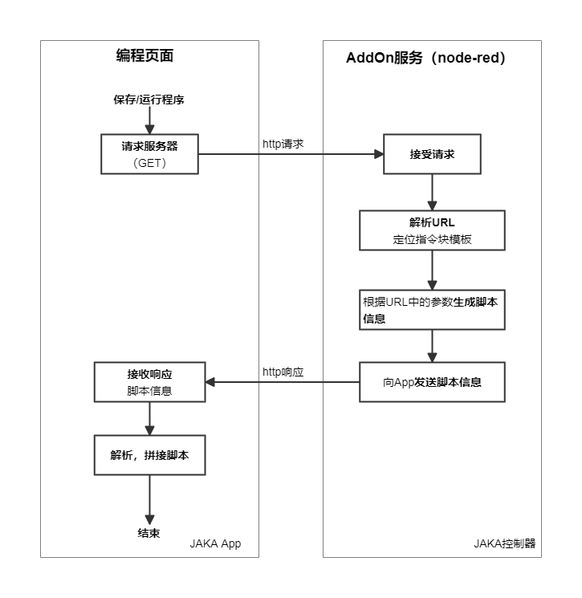
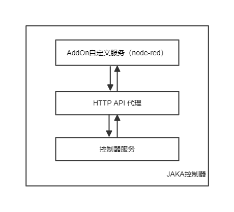

# AddOn
**该页面介绍了什么是AddOn，以及其运行原理。**

::: warning 注意：
1. 该教程中所提到的AddOn默认为AddOn3.0。
2. 在JAKA控制器 > 1.7.1.x 的_X64版本上支持AddOn3.0的开发和使用。
3. AddOn1.0和2.0都不再维护和提供开发支持。
:::

## AddOn是什么
---
&emsp;&emsp;JAKA AddOn是一款由JAKA提供的插件型软件产品，它支持用户开发自定义的指令插件、服务插件、页面插件，以及包含上述几种类型的复合型插件。通过使用AddOn，用户能够对机器人操作系统进行全新的功能扩展，或对现有功能进行个性化定制。
&emsp;&emsp;典型的AddOn应用包括夹爪控制插件、视觉引导插件、传感器控制插件、通信协议插件、工艺包插件等。

## 为何需要使用AddOn
&emsp;&emsp;JAKA 应用开发团队可以通过 AddOn 框架开发 JAKA 官方应用包、工艺包、功能套件，供给于其他用户下载使用；帮助客户开发定制功能、界面及服务，快速实现客户定制功能。
&emsp;&emsp;JAKA合作伙伴可以通过 Addon 框架开发生态链标准插件，增强产品适配性和易用性。
&emsp;&emsp;JAKA 机器人的终端用户也可通过 AddOn 框架开发自定义指令，封装并复用常用流程。
&emsp;&emsp;总而言之，AddOn的主要目的是为了提高应用的编程效率、降低用户的学习成本。
  
## 基本功能
&emsp;&emsp;如前所述，AddOn的基本功能有三：开发自定义指令插件、自定义服务插件及自定义页面插件。上述功能的实现，可为现有系统赋能，支持用户按需定制新功能，或对已有功能进行更改与升级。

## AddOn运行机制
&emsp;&emsp;AddOn基于B/S架构，JAKA App中的编程页面为客户端（B），运行在JAKA控制器内基于node-red的AddOn服务为服务端（S），运行机制如下：

&emsp;&emsp;AddOn自定义服务基于node-red开发，运行在控制器内部，可以调用JAKA 提供的HTTP API接口查询信息和控制机器人：

&emsp;&emsp;AddOn自定义页面部署在控制器中，可以通过HTTP请求与自定义服务或控制器交互，通过App提供的JS接口与App进行交互。

## 目标用户

&emsp;&emsp;本文档的目标用户应接受过基本的机器人操作培训，并掌握一定的基础开发能力，熟悉JavaScript、HTML5、CSS3。此外，还应熟悉JAKA的脚本语言JKS(基于Lua)，这将有助于更好地开发AddOn。

- [**JAKAScript**](/guide/jks.html): JAKA机器人程序运行的脚本语言JKS，用来实现自定义指令功能的脚本语言。
<!-- - [**JAKA http APIs**](https://console-docs.apipost.cn/preview/4799a89c0be775ce/48bff16c603e4a42): 提供与机器人交互的http接口。 -->
- [**JAKA App APIs**](/guide/addOn/AppAPI.html): 提供前端与JAKA App交互的js函数，用户可在该文档中获取接口说明和使用示例。
- [**node-red**](https://nodered.org/docs/): 是AddOn的开发平台和后端服务,开发者需要对node-red有基本的了解。
- [**JavaScript**](https://developer.mozilla.org/zh-CN/docs/Learn/JavaScript): 在node-red中编写脚本和逻辑。
- [**前端技术**](https://web.dev/learn/html/): 在开发自定义页面插件时需要掌握一定的前端技术，该网站介绍了

:::tip
点击红色高亮部分可直接跳转至相应的章节哦。
:::

## 反馈
---

我们很高兴收到您的反馈！如果您发现文档有错误或不清楚的地方,可以在我们的文档仓库中提交[Issues](https://github.com/JakaCobot/JakaCobot.github.io/issues)。
<!-- 给addonkit的仓库链接和该文档的链接 -->
