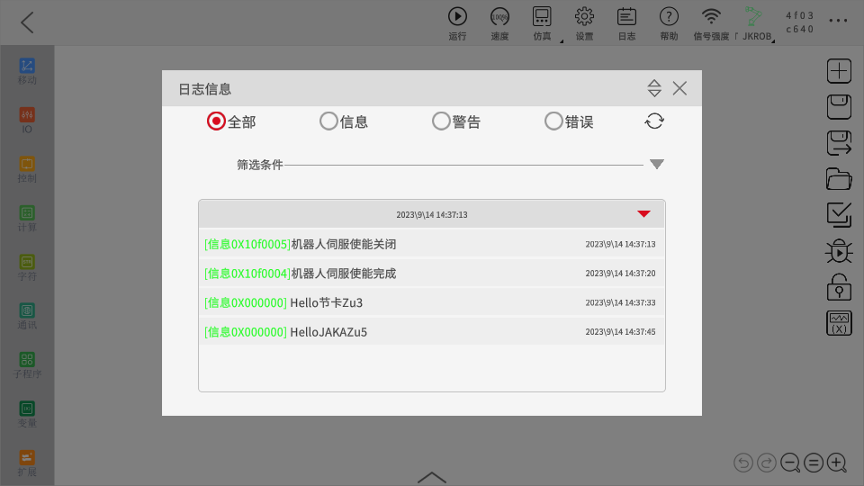
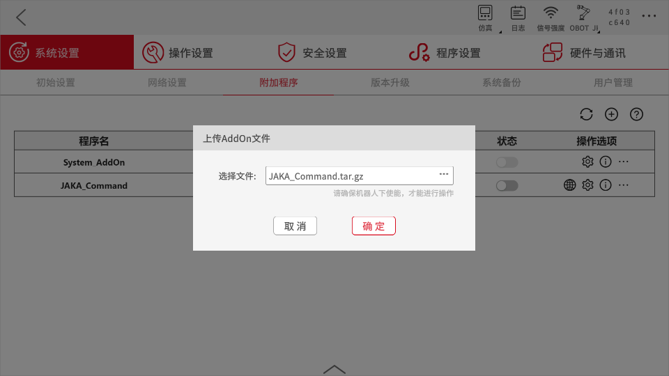
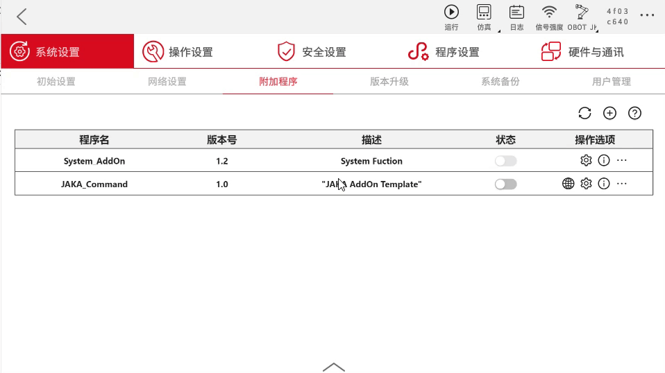
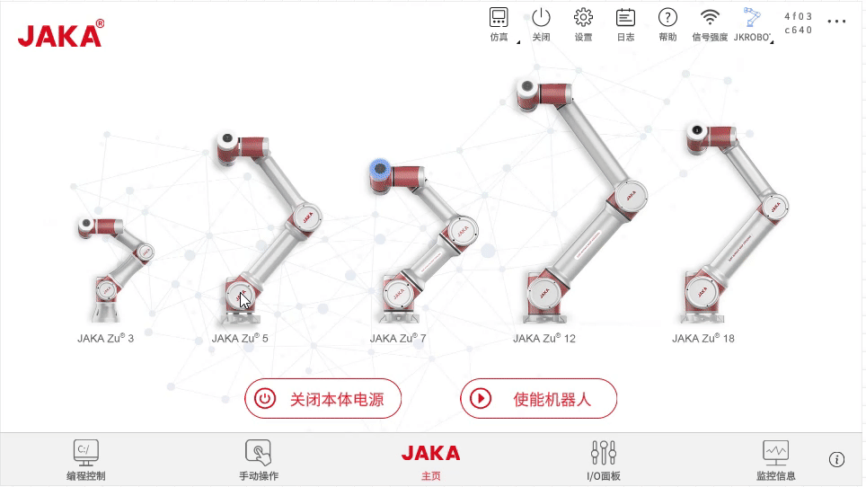
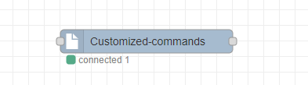
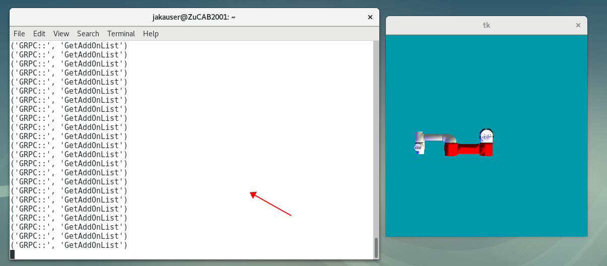
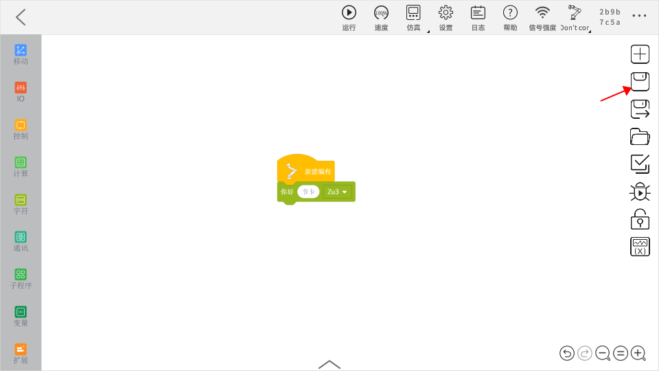
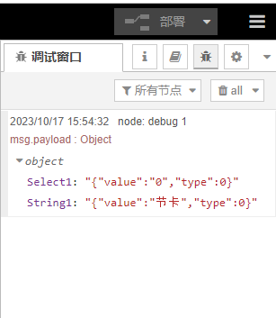
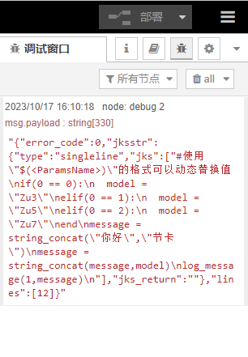
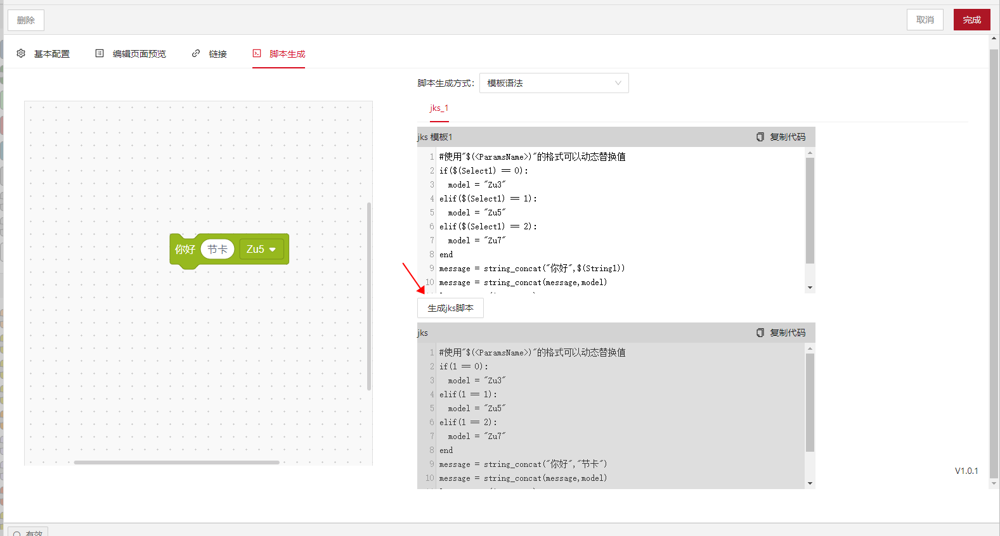

# 自定义指令开发
**该页面旨在指导开发者如何开发具有自定义指令功能的AddOn包。**

::: tip 请注意：
本章为入门教程，主要目的是使开发者了解自定义指令的基础知识与基本开发流程。

若需了解如何开发带有具体应用功能、应用于具体工艺场景的自定义指令AddOn包，请参考后续的完整案例章节：。
:::


## 关于自定义指令
### 自定义指令是什么

自定义指令是指开发者根据自己的需求，在符合JAKA脚本规则的情况下，开发出的除JAKA App内标准程序指令之外的其他指令。

### 自定义指令的作用

如简介中所述，当机器人末端连接了新的第三方工具，或是应用于具体工作场景中去操作具体工艺时，往往需要在JAKA App编程界面编写繁杂的指令、设置繁多的参数。这一步骤较复杂，且不易于二次复用，所以此时就需要把这些繁、杂、多的指令和参数封装为一条直接易懂、简单易用的指令块，以节约时间成本、提升操作效率。


## 创建AddOn自定义指令包
在此处的示范中，我们将创建一个自定义指令类型的AddOn，该AddOn的功能是将指令块上输入和选择的内容显示在App日志中。
<!-- todo:hbs 替换更有说明性的图片 -->
<div align="center"></div>

::: tip 注：
下文中的JAKA_Command就是我们即将创建的AddOn自定义指令包的包名。
:::

### 步骤一：创建AddOn文件夹 
首先我们需要创建一个AddOn基本文件夹，该文件夹需包含一个.ini格式的配置文件和一个保存数据的json文件。

您可以从头开始手动创建，也可以使用AddOn开发包仓库中 ["*Template*"](https://github.com/JakaCobot/jaka_addon_kit) 目录下的AddOn模板进行修改。 

::: tip 目录结构
|——JAKA_Command  
&emsp;&emsp;&emsp;|——AddOn.json   
&emsp;&emsp;&emsp;|——JAKA_Command_config.ini  
:::

* **AddOn.json**   
json文件内容为空即可，后面的步骤中会自动生成数据写入。
* **JAKA_Command_config.ini**  
 <!--  -->
[配置文件:point_left:](/guide/addOn/iniConfig.html)内容如下:
    ``` ini
    [AddOnInfo]
    convention = 3.0
    name = JAKA_Command
    description = "在日志中输出信息"
    version = 1.0
    type = 1
    portal = 10006
    url = http://localhost/myAddOnUi
    languagetype = node-red
    service = AddOn.json
    serviceenabled = 1
    ```

### 步骤二：打包&上传
接下来我们会将步骤一中创建好的文件夹打包，上传至控制器中进行指令块开发，打包的要求格式为`.tar.gz`。

在Windows中您可以使用7z等打包工具进行二次压缩。    
<div align="center"></div>

在App中附加管理程序页面上传AddOn。

<div align="center"></div>

### 步骤三：开发自定义指令

1. 运行AddOn并查看AddOn运行的端口号。

<div align="center"></div>

2. 打开浏览器，在地址栏中输入机器人IP及端口号`IP:Portal`进入开发者界面。

<div align="center"></div>

3. 在左侧工具栏中找到`Customized Commands`节点，拖入画布中，点击部署。

双击`Customized Commands`节点，打开指令块生成工具页面。

<div align="center">
<video width="1000" controls autoplay >
<source src="../../../resource/ch/AddOn/JAKA_Command/open_coustomer_node.mp4" type="video/mp4">
</video>
</div>

5. 在*基本配置*页面中定义指令块的样式和属性，这里使用页面案例自带的属性，不做更改。
6. 更改指令块名称为*hello_jaka*，颜色为绿色。
7. 在*脚本生成*页面中定义指令块的行为，这里使用页面案例自带的脚本，不做更改。

  
    <div align="center"></div>

    - 此处所使用的脚本语言为JAKA编程脚本，具体语法请参考[JAKA编程脚本:point_left:](/guide/jks.html)。
    <!-- - 更详细的`Customized Commands`节点使用方法请参考[自定义指令创建节点](/guide/addOn/Commands_Tool.html) -->
 
8. 当在App中保存自定义指令时，会通过http的get请求获取脚本，因此需要使用`http in`和`http response`节点完善流程。

<div align="center"></div>

::: warning 请注意：
`http in` 节点的url要与自定义指令块的名称一致。
:::

### 步骤四：运行
在node-red中部署流程后，即可在App中使用该指令块。

<div align="center"></div>


## 调试
在开发过程中，可能会遇到如下问题，具体情况及相应调试方法请看下文。

### 自定义指令生成失败


### 服务器内部错误



- node-red中使用debug节点进行调试。可以调试保存时指令块发来的参数和返回的jks是否正确。

<div align="center"></div>

保存或运行程序时，App发起Get请求。

<div align="center"></div>


此时debug1可以捕获到请求中的传参。

“Select1”为定义的属性名，“value”为该属性的值，即指令块上填入的内容。

“type”为指令块上填入参数的类型，0表示输入框内为手动写入的值，1表示输入框内放入了变量。

<div align="center"></div>


debug2中可以看到包含了Jks脚本的对象。

其中error_code为生成Jks的错误码，0是生成正常，-12为内部错误。当该错误码不等于0时，App会弹窗报错相应的错误码和错误信息。jksstr中包含了type（指令块类型）jks（指令块脚本）jks_return(指令块返回值) 。

lines为指令块脚本的行数，自动计算生成。

<div align="center"></div>


- 脚本生成页面，在左侧指令块上输入参数后，点击“生成jks脚本”可模拟生成脚本，在下方代码栏内查看模拟生成的代码。

<div align="center"></div>


