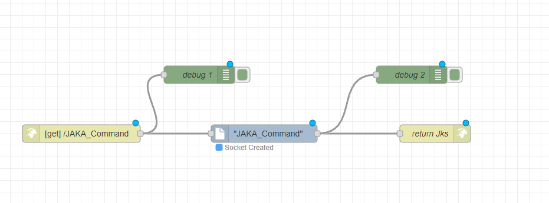
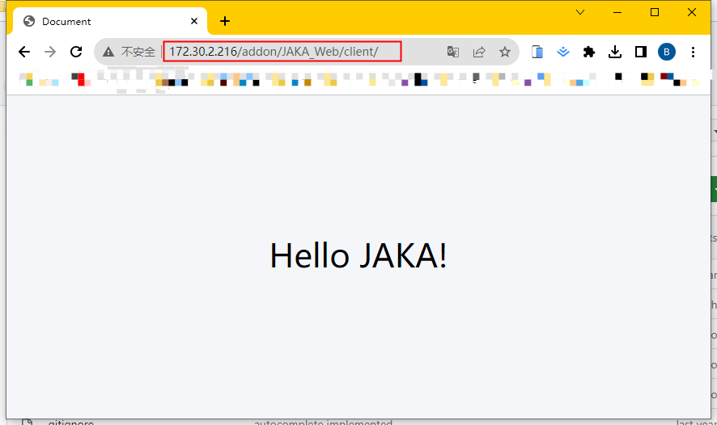

## 自定义指令开发
**该页面旨在指导开发者如何开发具有自定义指令功能的AddOn包。**

::: tip 请注意：
本章为入门教程，主要目的是使开发者了解自定义指令的基础知识与基本开发流程。

若需了解如何开发带有具体应用功能、应用于具体工艺场景的自定义指令AddOn包，请参考后续的完整案例章节：。
:::


### 关于自定义指令
#### 自定义指令是什么

自定义指令是指开发者根据自己的需求，在符合JAKA脚本规则的情况下，开发出的除JAKA App内标准程序指令之外的其他指令。

#### 自定义指令的作用

如简介中所述，当机器人末端连接了新的第三方工具，或是应用于具体工作场景中去操作具体工艺时，往往需要在JAKA App编程界面编写繁杂的指令、设置繁多的参数。这一步骤较复杂，且不易于二次复用，所以此时就需要把这些繁、杂、多的指令和参数封装为一条直接易懂、简单易用的指令块，以节约时间成本、提升操作效率。


### 创建AddOn自定义指令包
在此处的示范中，我们将创建一个自定义指令类型的AddOn，该AddOn的功能是将指令块上输入和选择的内容显示在App日志中。
<!-- todo:hbs 替换更有说明性的图片 -->
<div align="center"></div>

::: tip 注：
下文中的JAKA_Command就是我们即将创建的AddOn自定义指令包的包名。
:::

#### 步骤一：创建AddOn文件夹 
首先我们需要创建一个AddOn基本文件夹，该文件夹需包含一个.ini格式的配置文件和一个保存数据的json文件。

您可以从头开始手动创建，也可以使用AddOn开发包仓库中 ["*Template*"](https://github.com/JakaCobot/jaka_addon_kit) 目录下的AddOn模板进行修改。 

::: tip 目录结构
|——JAKA_Command  
&emsp;&emsp;&emsp;|——AddOn.json   
&emsp;&emsp;&emsp;|——JAKA_Command_config.ini  
:::

* **AddOn.json**   
json文件内容为空即可，后面的步骤中会自动生成数据写入。
* **JAKA_Command_config.ini**  
 <!--  -->
[配置文件:point_left:](/guide/addOn/iniConfig.html)内容如下:
    ``` ini
    [AddOnInfo]
    convention = 3.0
    name = JAKA_Command
    description = "在日志中输出信息"
    version = 1.0
    type = 1
    portal = 10006
    url = http://localhost/myAddOnUi
    languagetype = node-red
    service = AddOn.json
    serviceenabled = 1
    ```

#### 步骤二：打包&上传
接下来我们会将步骤一中创建好的文件夹打包，上传至控制器中进行指令块开发，打包的要求格式为`.tar.gz`。

在Windows中您可以使用7z等打包工具进行二次压缩。    
<div align="center"></div>

在App中附加管理程序页面上传AddOn。

<div align="center"></div>

#### 步骤三：开发自定义指令

1. 运行AddOn并查看AddOn运行的端口号。

<div align="center"></div>

2. 打开浏览器，在地址栏中输入机器人IP及端口号`IP:Portal`进入开发者界面。

<div align="center"></div>

3. 在左侧工具栏中找到`Customized Commands`节点，拖入中间工作区中，点击部署。

双击`Customized Commands`节点，打开指令块生成工具页面。

<div align="center">
<video width="1000" controls autoplay >
<source src="../../../resource/ch/AddOn/JAKA_Command/open_coustomer_node.mp4" type="video/mp4">
</video>
</div>

4. 在*基本配置*页面中定义指令块的样式和属性，这里使用页面案例自带的属性，不做更改。
5. 更改指令块名称为*hello_jaka*，颜色为绿色。
6. 在*脚本生成*页面中定义指令块的行为，这里使用页面案例自带的脚本，不做更改。

  
    <div align="center"></div>

    - 此处所使用的脚本语言为JAKA编程脚本，具体语法请参考[JAKA编程脚本:point_left:](/guide/jks.html)。
    <!-- - 更详细的`Customized Commands`节点使用方法请参考[自定义指令创建节点](/guide/addOn/Commands_Tool.html) -->
 
7. 当在App中保存自定义指令时，会通过http的get请求获取脚本，因此需要使用`http in`和`http response`节点完善流程。

<div align="center"></div>

::: warning 请注意：
`http in` 节点的url要与自定义指令块的名称一致。
:::

#### 步骤四：运行
在node-red中部署流程后，在附加程序页面点击刷新按钮，即可在App中编程页面的扩展指令中找到刚才制作的指令块。

<div align="center"></div>


### 调试
在开发过程中，可能会遇到如下问题，具体情况及相应调试方法请看下文。

**自定义指令生成失败**  
在App编程页面使用自定义指令块后，点击保存，报错“自定义指令生成失败”，可能是以下几个原因导致的。

<div align="center"></div>


1. AddOn没有运行   
   解决方法：在附加程序页面找到该AddOn，点击运行按钮开启AddOn。
<div align="center"></div>

2. node-red中的`http in`节点中url与指令块名字不一致  
   解决方法：将url与指令块名称统一。
<div align="center"></div>

**服务器内部错误**  
当遇到服务器内部错误时，一般都是因为App没有收到Http请求的响应超时导致。  

<div align="center"></div>

解决方法：检查node-red端的`http in`节点是否正确连接`http response`节点，连接后在App端重启AddOn。

::: warning 注意：
-目前恢复连接后任然需要重启AddOn服务，才能正常保存程序。这是内部的一些未知bug导致，会在后续版本修复。   
-报错信息中请重启控制器的描述有误，重启AddOn即可。
:::

**属性匹配失败**  
<div align="center"></div>

解决方法：检查node-red中自定义指令的属性名称是否与脚本定义中用到的一致。

<div align="center"></div>

**如何检查通讯收发的参数是否正确？**    
- node-red中使用debug节点进行调试。可以调试保存时指令块发来的参数和返回的jks是否正确。

<div align="center"></div>

保存或运行程序时，App发起Get请求。

<div align="center"></div>
  
此时debug1可以捕获到请求中传入的参数对象。该对象的键为指令块上属性的名字，值为属性的具体内容，包括属性值和属性类型。

以下面收到的内容为例，“Select1”为定义的下拉框属性名，“value”为属性值，0代表此时选中了下拉框的第一个选项。“type”为指令块上填入参数的类型，该参数仅对输入框类型的属性有意义。0表示输入框内为手动写入的值，1表示输入框内放入了变量类型的内容（系统变量、计算结果等数据类型的指令块）。

<div align="center"></div>


debug2打印的信息中包含了本次保存生成的Jks脚本的对象。

其中error_code为生成Jks的错误码，0是生成正常，-12为内部错误。当该错误码不等于0时，App会弹窗报错相应的错误码和错误信息。我们这里只需要关注“jks”这个属性即可，该属性的值即为实际生产的Jks脚本。

<div align="center"></div>


**模拟生成脚本**

- 脚本生成页面，在左侧指令块上输入参数后，点击“生成Jks脚本”可模拟生成脚本，在下方代码窗口内查看模拟生成的代码。

<div align="center"></div>

::: tip 请注意：
 点击“生成Jks脚本”按钮只是在下方的代码窗口中显示模拟生成的脚本，并没有其他实际的作用。
:::

## 自定义服务开发

**敬请期待**

## 自定义页面开发
**该页面旨在指导开发者如何开发具有自定义页面功能的AddOn包。**

::: tip 请注意：
本章为入门教程，主要目的是使开发者了解自定义页面的基础知识与基本开发流程。

若需了解如何开发带有具体应用功能、应用于具体工艺场景的AddOn自定义页面包，请参考后续的完整案例章节：。
:::


### 关于自定义页面
#### 自定义页面是什么
自定义页面是指开发者根据自己的需求，在符合web开发规范的情况下，开发出的除JAKA App内已有页面之外的其他页面。

#### 自定义页面的作用

在实际的应用场景中，可能需要在不同的App中来回切换，或是在JAKA App的不同页面中来回切换，或是停止正在进程中的工作去调试第三方设备。如此一来，可能会对工作节奏和效率产生影响。

若使用AddOn自定义页面的话，只需在JAKA App页面中即可解决“来回切换”的问题。

### 创建AddOn自定义页面包
在此处的示范中，我们将创建一个自定义页面类型的AddOn，该AddOn的功能是在页面中显示“Hello JAKA!”。

<div align="center"></div>

#### 步骤一：创建AddOn文件夹  
首先我们需要创建一份AddOn基本文件夹，该文件夹需包含一个.ini格式的配置文件和前端工程文件，我们建议使用client作为前端工程的文件夹名称。

您可以从头开始手动创建，也可以使用AddOn开发包仓库中 ["*Template*"](https://github.com/JakaCobot/jaka_addon_kit) 目录下的AddOn模板进行修改。 
::: tip 目录结构
|—JAKA_Web  
&emsp;&emsp;&emsp;|—client   
&emsp;&emsp;&emsp;|&emsp;&emsp;|—index.html  
&emsp;&emsp;&emsp;|—JAKA_Web_config.ini  
:::

* **index.html**   
&emsp;&emsp;
    ``` html
        <!DOCTYPE html>
        <html lang="en">
        <head>
            <meta charset="UTF-8">
            <meta name="viewport" content="width=device-width, initial-scale=1.0">
            <title>HelloJAKA!</title>
        </head>
        <body style="background-color:#f5f6fa;">
            <p style="font-size: 10vh;text-align: center;margin-top: 20%;"> Hello JAKA!</p>
        </body>
        </html>
    ```
* **JAKA_Web_config.ini**   
[配置文件](/guide/addOn/iniConfig.html)内容如下:
    ``` ini
    [AddOnInfo]
    convention = 3.0
    name = JAKA_Web
    description = 在页面中显示“Hello JAKA!”
    version = 1.0
    type = 3
    portal = 10006
    url = http://localhost/JAKA_Web/client/
    languagetype = node-red
    service = null
    serviceenabled = 0
    ```

#### 步骤二：打包&上传
接下来我们会将步骤一中创建好的文件夹打包，上传至控制器中进行指令块开发，打包的要求格式为`.tar.gz`。

在Windows中您可以使用7z等打包工具进行二次压缩。    
<div align="center"></div>

在App中附加管理程序页面上传AddOn。
<!-- todo 更新正确的图片 -->
<div align="center"></div>

#### 步骤三：访问页面
下面将介绍两种方式访问之前制作的页面。
- 方法1 在附加程序找到JAKA_Web，点击小地球按钮访问AddOn中的页面。

<div align="center"></div>


- 方法2 在浏览器中输入`http://172.30.2.216/addon/JAKA_Web/client/`，注意将链接IP替换为当前机器人的IP。

   <div align="center"></div>
   
<!-- todo:hbs 补充调试 -->

### 兼容性
在进行自定义页面开发时，需注意目标浏览器的版本，避免因版本而产生的不兼容。
- JAKA App中用来显示自定义页面的web view插件使用的浏览器内核为`Chromium:74.0.3729.157`。


## 多语言实现

JAKA AddOn支持多语言功能，在完成AddOn某个包的功能开发后，可根据需要，自行进行多语言设置。

目前支持的语种有：汉语、英语、及日语。

具体设置步骤如下：

### 自定义指令的多语言

在制作自定义指令时，支持多语言的内容输入框右侧会有一个小地球图标，点击即可配置多语言。目前支持中英日三种语言。

<div align="center"></div>

### 自定义页面的多语言

当自定义页面在JAKA App中打开时，需要获取App当前的语言，进而切换用户自定义页面的语言与App一致。可以采用下面的方式实现该功能。


<div align="center"></div>

在web的初始化js代码中调用方法JAKAController.jakaCall(result)，调用后JAKA App会回调window.changeLanuageHandler(language)函数，并将当前App语言传入。

**示例代码：**

```js

let result = {
    "type":"getLanguage",
}

result = JSON.stringify(result);

JAKAController.jakaCall(result);


/**
 * 触发getAppLanguage后App的回调函数。
 * @param {*} language App传入当前语言
 */
window.changeLanuageHandler = (language)=>{
    console.log(`Curret language is {language}`)
}

```
## 说明手册编写

**该页面旨在为开发者明示，编写已开发完成AddOnXXX包的说明手册需要包含哪些内容、遵循哪些规则，并且以何种形式发布给自己的用户下载或使用。**

一般来说，一份面向用户的插件使用说明书应该包括以下内容，以确保用户能够顺利地安装、配置及使用插件：

### 标题和简介
具体包括：

* 插件名称
* 插件版本
* 插件基本信息介绍

### 安装指南
具体包括：

* 系统要求

列出插件所需的操作系统、软件环境、硬件要求等信息。

* 安装步骤

提供逐步的安装说明，包括下载插件及安装过程中可能会遇到的问题与相应的解决方案。

### 配置指南
具体包括：

* 插件配置选项

列出用户可以自定义的配置选项。

* 配置步骤

提供逐步的配置说明，包括各个配置选项的作用及设置建议。

* 默认配置

如果插件有默认的配置项，需提供默认配置的详细信息。

### 使用说明
具体包括：

* 主要功能

列出插件的主要功能和用途

* 使用示例

提供实际的使用示例，以帮助用户了解该插件的具体使用方法，以及该如何在他们自己的工作流程中使用该插件。

### 故障排除
具体包括：

* 常见问题

列出用户可能遇到的常见问题及相应的解决方案。

* 插件日志

如果插件生成日志文件，则需说明该如何查看、分析这些日志以解决问题。

### 更新和升级
具体包括：

* 更新指南

提供如何获取、安装插件以进行更新的说明。

* 版本历史

列出插件的版本历史及每个版本的改动。

### 支持和联系方式
具体为：

* 提供支持的联系信息，如技术支持热线、电子邮件地址、社交媒体链接或论坛链接。

### 其他信息
具体为：

* 附件信息，比如插件的依赖关系、已知问题或警告。

::: tip 提示：
除上述内容之外，还需注意确保说明书的语言简明扼要、易于理解，适用于插件的目标用户群体。
:::

