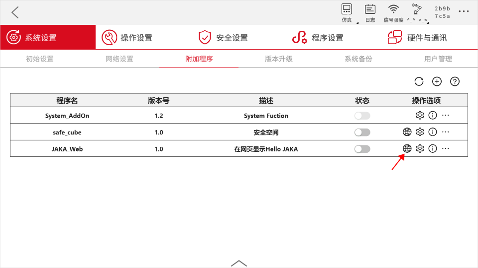
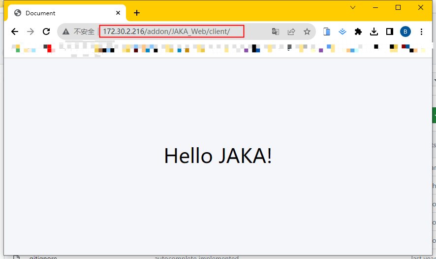

# 自定义页面开发
**该页面旨在指导开发者如何开发具有自定义页面功能的AddOn包。**

::: tip 请注意：
本章为入门教程，主要目的是使开发者了解自定义页面的基础知识与基本开发流程。

若需了解如何开发带有具体应用功能、应用于具体工艺场景的AddOn自定义页面包，请参考后续的完整案例章节：。
:::


## 关于自定义页面
### 自定义页面是什么
自定义页面是指开发者根据自己的需求，在符合web开发规范的情况下，开发出的除JAKA App内已有页面之外的其他页面。

### 自定义页面的作用

在实际的应用场景中，可能需要在不同的App中来回切换，或是在JAKA App的不同页面中来回切换，或是停止正在进程中的工作去调试第三方设备。如此一来，可能会对工作节奏和效率产生影响。

若使用AddOn自定义页面的话，只需在JAKA App页面中即可解决“来回切换”的问题。

## 创建JAKA_Web
在此处的示范中，我们将创建一个自定义页面类型的AddOn，该AddOn的功能是在页面中显示“Hello JAKA!”。

<div align="center"></div>

### 步骤一：创建AddOn文件夹  
首先我们需要创建一份AddOn基本文件夹，该文件夹需包含一个.ini格式的配置文件和前端工程文件，我们建议使用client作为前端工程的文件夹名称。

您可以从头开始手动创建，也可以使用AddOn开发包仓库中 ["*Template*"](https://github.com/JakaCobot/jaka_addon_kit) 目录下的AddOn模板进行修改。 
::: tip 目录结构
|—JAKA_Web  
&emsp;&emsp;&emsp;|—client   
&emsp;&emsp;&emsp;|&emsp;&emsp;|—index.html  
&emsp;&emsp;&emsp;|—JAKA_Web_config.ini  
:::

* **index.html**   
&emsp;&emsp;
    ``` html
        <!DOCTYPE html>
        <html lang="en">
        <head>
            <meta charset="UTF-8">
            <meta name="viewport" content="width=device-width, initial-scale=1.0">
            <title>HelloJAKA!</title>
        </head>
        <body style="background-color:#f5f6fa;">
            <p style="font-size: 10vh;text-align: center;margin-top: 20%;"> Hello JAKA!</p>
        </body>
        </html>
    ```
* **JAKA_Web_config.ini**   
[配置文件](/guide/addOn/iniConfig.html)内容如下:
    ``` ini
    [AddOnInfo]
    convention = 3.0
    name = JAKA_Web
    description = 在页面中显示“Hello JAKA!”
    version = 1.0
    type = 3
    portal = 10006
    url = http://localhost/JAKA_Web/client/
    languagetype = node-red
    service = null
    serviceenabled = 0
    ```

### 步骤二：打包&上传
接下来我们会将步骤一中创建好的文件夹打包，上传至控制器中进行指令块开发，打包的要求格式为`.tar.gz`。

在Windows中您可以使用7z等打包工具进行二次压缩。    
<div align="center"></div>

在App中附加管理程序页面上传AddOn。
<!-- todo 更新正确的图片 -->
<div align="center"></div>

### 步骤三：访问页面
下面将介绍两种方式访问之前制作的页面。
- 方法1 在附加程序找到JAKA_Web，点击小地球按钮访问AddOn中的页面。

<div align="center"></div>


- 方法2 在浏览器中输入`http://172.30.2.216/addon/JAKA_Web/client/`，注意将链接IP替换为当前机器人的IP。

   <div align="center"></div>
   
<!-- todo:hbs 补充调试 -->

## 兼容性
在进行自定义页面开发时，需注意目标浏览器的版本，避免因版本而产生的不兼容。
- JAKA App中用来显示自定义页面的web view插件使用的浏览器内核为`Chromium:74.0.3729.157`。
