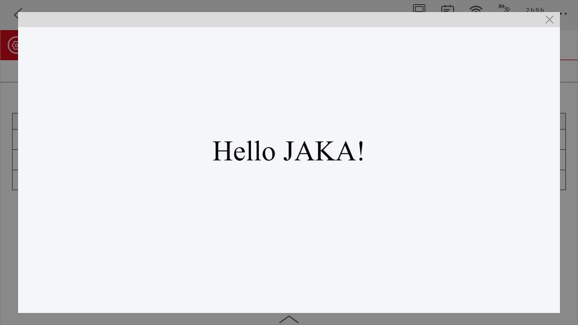
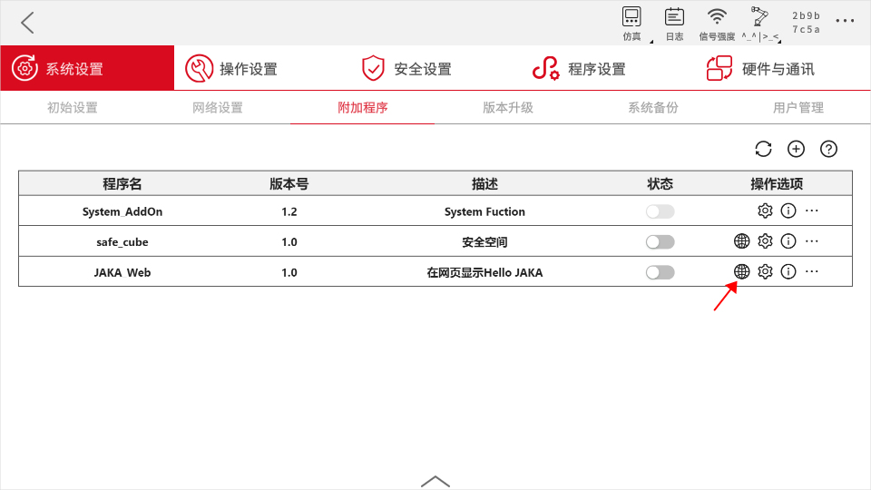

# 自定义指令基础
**通过创建JAKA_Web了解自定义网页类型AddOn的开发流程和基础知识。**


## 概述
&emsp;&emsp;我们将创建一个自定义网页类型的AddOn，并在网页中打印"Hello JAKA"。

<div align="center"></div>

## 创建JAKA_Command
### Step1:创建AddOn包  
&emsp;&emsp;首先我们需要创建一份AddOn基本文件，包含一个.ini格式的配置文件和一个保存数据的json文件。您可以从头开始手动创建，也可以使用AddOn开发包仓库中 ["*Template*"](https://github.com/JakaCobot/jaka_addon_kit) 目录下的AddOn模板进行修改。 
::: tip 目录结构
|—JAKA_Web  
&emsp;&emsp;&emsp;|—client   
&emsp;&emsp;&emsp;|&emsp;&emsp;|—index.html  
&emsp;&emsp;&emsp;|—JAKA_Web_config.ini  
:::

* **index.html**   
&emsp;&emsp;
    ``` html
        <!DOCTYPE html>
        <html lang="en">
        <head>
            <meta charset="UTF-8">
            <meta name="viewport" content="width=device-width, initial-scale=1.0">
            <title>HelloJAKA</title>
        </head>
        <body style="background-color:#f5f6fa;">
            <p style="font-size: 10vh;text-align: center;margin-top: 20%;"> Hello JAKA!</p>
        </body>
        </html>
    ```
* **JAKA_Web_config.ini**   
&emsp;&emsp;[配置文件](/guide/addOn/iniConfig.html)内容如下:
    ``` ini
    [AddOnInfo]
    convention = 3.0
    name = JAKA_Web
    description = 在网页中显示Hello JAKA
    version = 1.0
    type = 3
    portal = 10006
    url = http://localhost/JAKA_Web/client/
    languagetype = node-red
    service = null
    serviceenabled = 0
    ```

### Step2:打包&上传
&emsp;&emsp;接下来我们会将AddOn打包，上传至控制器中进行指令块开发。打包的要求格式为`.tar.gz`。在Windows中您可以使用7z等打包工具进行二次压缩。    
<div align="center"></div>
&emsp;&emsp;在App中附加管理程序页面上传AddOn。    
<div align="center"></div>

### Step3:访问网页
&emsp;&emsp;下面将介绍两种方式访问之前制作的网页。
1. 在附加程序找到JAKA_Web,点击小地球按钮访问AddOn中的网页。

<div align="center"></div>


2. 在浏览器中输入`http://172.30.2.216/addon/JAKA_Web/client/`,注意将链接IP替换为当前机器人的IP。

   <div align="center"></div>

## 兼容性
- App中的web view插件使用的浏览器内核为`Chromium:74.0.3729.157`，开发网页时请注意兼容性。
