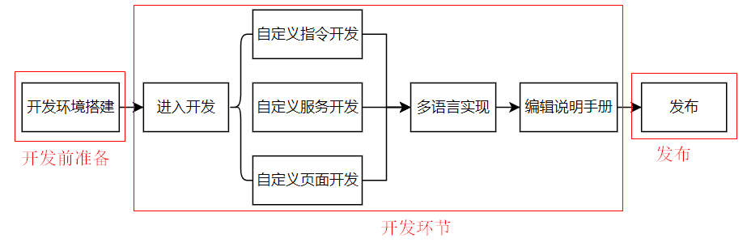
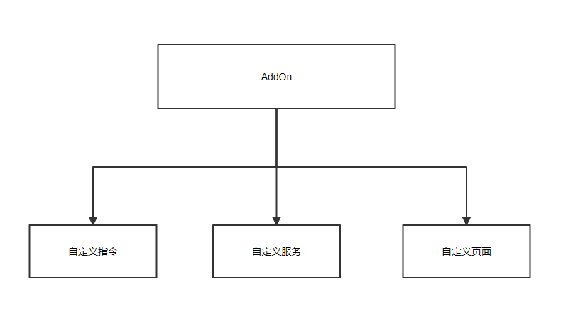

# AddOn开发流程速览

**该页面旨在向AddOn开发者简单展示完整地开发完一个AddOnXXX包共有几个步骤，以及每个步骤的大致内容。**

::: tip 流程图示意：
:::

如上图所示，AddOnXXX包的完整开发过程一共有三大环节、六大步骤，继续往下细分的话，六大步骤中还包含许多小步骤。

下文将对此流程图作一个简要说明，而小步骤的详细说明及操作方法请参考文档后续的具体章节。

## 开发前准备
---

### 开发环境搭建
该步骤旨在为AddOnXXX包的开发提供其所需的开发环境，即安装虚拟机、升级控制器与软件的版本。

具体信息详见[开发环境搭建:point_left:](./environment.md)

<!-- * 通过制作 "[JAKA_Command:point_left:](./JAKA_Command.md)"学习自定义指令类型AddOn开发的基本流程和规则。
* 通过制作 "[JAKA_Serve:point_left:](./JAKA_Serve.md)"学习自定义服务类型AddOn开发的基本流程和规则。
* 通过制作 "[JAKA_web:point_left:](./JAKA_web.md)"学习自定义网页类型AddOn开发的基本流程和规则。 -->

## 进入开发环节
---

在完成环境搭建后，开发者就可自行选择自己所需要的功能，参照相应的文档进行开发。

如前所述，JAKA AddOn有三个并行的功能，即自定义指令、自定义服务与自定义页面。

一个AddOnXXX包可以包含一种或多种功能。

### 开发自定义指令
自定义指令功能支持开发者根据需求开发除JAKA App内标准指令之外的指令，具体内容及操作步骤详见：[自定义指令开发:point_left:](./JAKA_Command.md)

### 开发自定义服务
该功能还未开放，后续若有更新，将在此网页进行同步说明。
### 开发自定义页面
自定义页面功能支持开发者开发满足自定义需求的页面，具体内容及操作步骤详见：[自定义页面开发:point_left:](./JAKA_web.md)
### 多语言实现
JAKA AddOn支持多语言功能，在完成AddOn某个包的功能开发后，可根据需要，自行进行多语言设置。

目前支持的语种有：汉语、英语、及日语。

具体信息详见：[多语言实现:point_left:](./multi-language.md)
### 编写说明手册
此处的“说明手册”是指，开发者在使用JAKA AddOn功能开发出具体的应用或功能包后，需要将这些应用或功能包提供给自己的用户使用。此时便需要编写这些应用或功能包的说明手册。

所以该步骤旨在为开发者明示此类说明手册的编写需要包含哪些内容、遵循哪些规则，并且以何种形式发布给自己的用户下载或使用。

具体信息详见[说明手册编写:point_left:](./userguide)

## 发布
此处的“发布”是指，开发者在使用JAKA AddOn功能开发出具体的应用或功能包后，该如何将这些应用或功能包发布，以提供给自己的用户使用。

目前“发布”功能还在开发中，后续完成后将在本网站将“发布”步骤的流程说明做同步更新。
