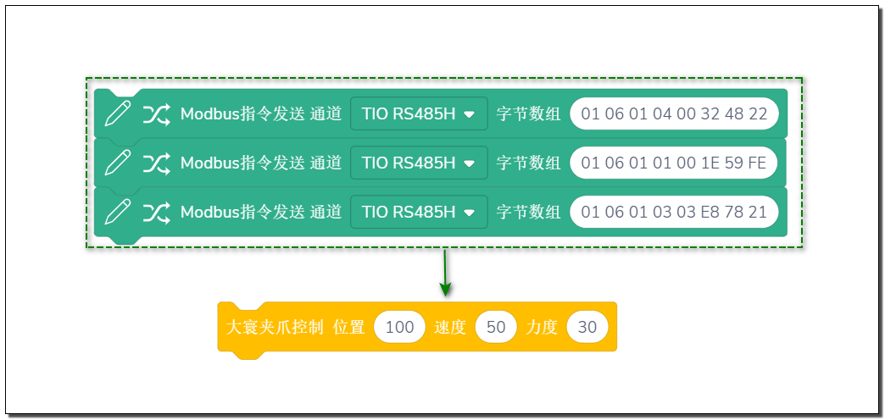
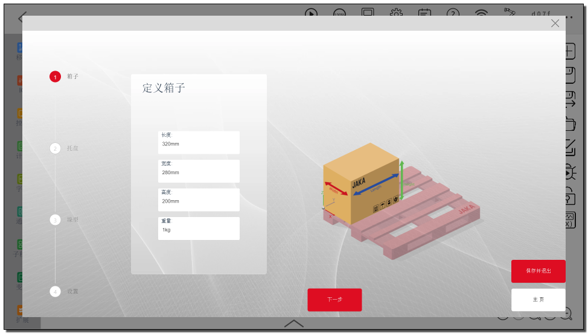
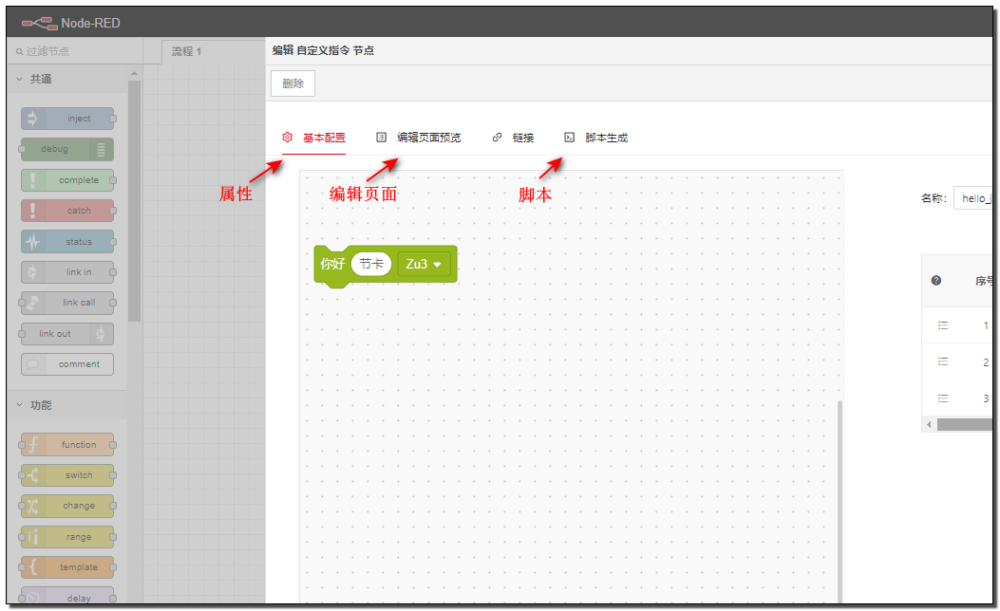
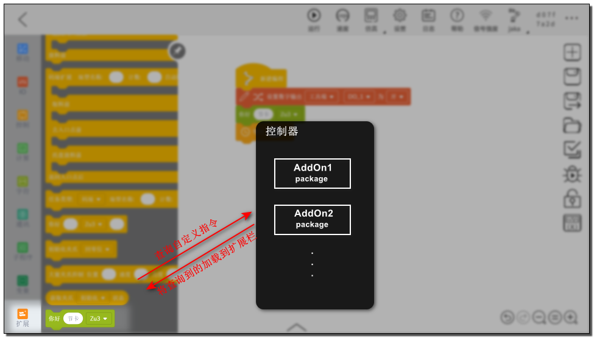
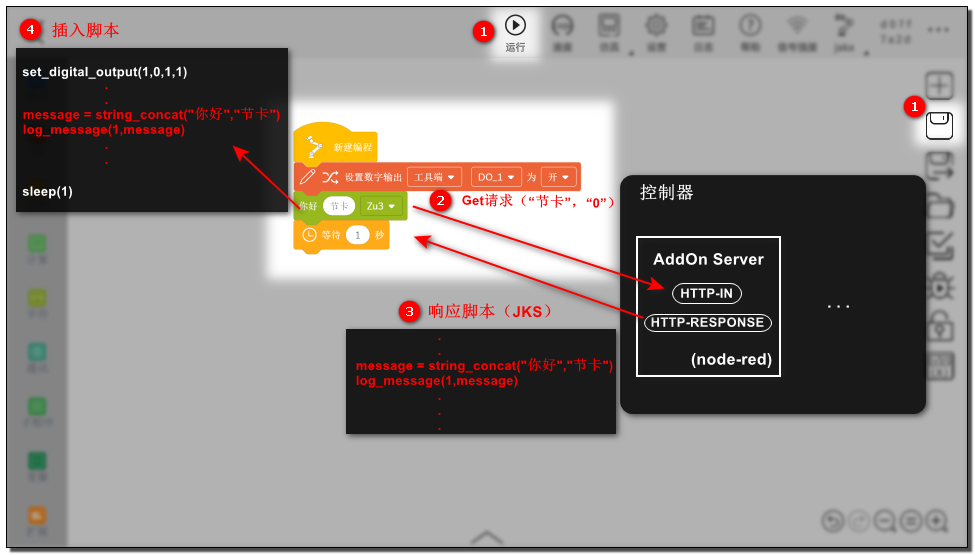
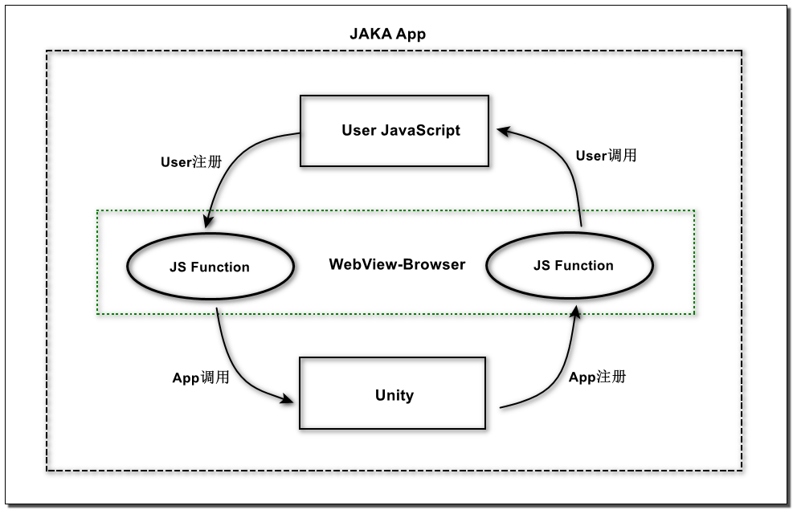

# 关于AddOn

**该页面旨在为AddOn开发者解释基本概念。**

::: warning 请注意：
1. 该教程中所提到的AddOn默认为AddOn3.0。
2. 在JAKA控制器 > 1.7.1.x 的_X64版本上支持AddOn3.0的开发和使用。
3. AddOn1.0和2.0都不再进行维护和提供开发支持。
:::

::: tip 提示：
本文档的目标读者应接受过基本的机器人操作培训，并掌握一定的基础开发能力，并掌握熟悉JAKA的脚本语言`JKS`。

除此之外，如有使用node-red、JavaScript、HTML5、CSS3等编程语言的经验，将更有助于用户更好地开发、使用AddOn。
:::

## AddOn是什么
---
JAKA AddOn是一款由JAKA提供的插件型软件产品，它支持用户开发自定义的指令插件、服务插件、网页插件，以及包含上述几种类型的复合型插件。

通过使用AddOn，用户能够对机器人操作系统进行全新的功能拓展，或对现有功能进行个性化定制。

::: tip 区分名词：
* JAKA AddOn套件包：开发及运行AddOn时需要安装的套件包，即jaka_addon_kit.tar.gz。
* JAKA AddOnXXX包：开发完成后已经带有具体功能的功能包，如JAKA AddOn码垛包、JAKA AddOn大寰夹爪包、JAKA AddOn视觉引导包、JAKA AddOn传感器控制包等。
<!-- 工艺包、第三方设备的适配包 -->
:::

## 为何需要使用AddOn 
---
通常情况下，如果在机器人末端连接了新的第三方工具，或是在具体的使用场景中操作具体工艺（如码垛、焊接等）时，都需要在编程界面设置新的指令。

这样的指令包含复杂、冗长的指令块和参数，且不易理解、难以复用，经常给简单的动作或程序带来了额外的负担。对于精通具体操作工艺、却对机器人编程不甚了解的工程师来说，指令设置这一步骤显得尤为复杂、繁难。

使用AddOn能够去代码化，极大地简化指令设置流程。它将编程这一步骤中复杂的设置省略，直接封装为一条简单、明了、易懂的指令，更易于操作，也更利于复用已编指令,充分提升效率、创造成果。

 <label>第三方设备控制</label> 

另一方面，工艺包类的AddOn使用户能够专注在具体工艺的执行上，而不是指令如何使用，降低用户的学习成本和使用难度。

 <label>工艺包</label> 

总而言之，使用AddOn能提高应用的编程效率、降低用户的学习成本。

## AddOn基本功能
---
如前所述，AddOn的基本功能有三：开发自定义指令插件、自定义服务插件及自定义网页插件。

上述功能的实现，可为现有系统赋能，支持用户按需定制新功能，或对已有功能进行更改与升级。

JAKA应用开发团队可以通过AddOn框架开发JAKA官方应用包、工艺包与工艺套件，以供用户下载使用。同时也可帮助JAKA客户开发定制功能、服务及界面，满足客户的定制化需求。

JAKA合作伙伴可以通过AddOn框架开发生态链标准插件，增强产品适配性和易用性。

JAKA机器人终端用户可以通过AddOn框架开发自定义指令，对常用指令进行封装与复用。

## AddOn运行机制
---
* AddOn自定义指令

一个自定义指令块由三部分组成，属性、编辑页面和脚本，这三部分均在AddOn开发工具（node-red）中定义。

App启动时，会从AddOn包中寻找自定义指令块的数据。如果找到，则加载到程序-扩展栏中。

当自定义指令块被插入到程序中，点击保存或运行时，App向AddOn服务发起请求，将指令块上的参数一并发送。AddOn服务接收请求，将参数拼接到自定义指令的脚本中，返回给App。最后App将收到的脚本插入。

* AddOn自定义服务

AddOn自定义服务基于node-red开发，在控制器中运行。当AddOn被启动时，控制器启动该AddOn的node-red进程。自定义服务可以作为中间层，为自定义指令、自定义网页提供服务。通过node-red中提供的相关节点，可以查询机器人信息、设置机器人参数、控制机器人运动。

* AddOn自定义网页

通常，自定义网页被部署在 JAKA 控制器上，并通过 Nginx 进行代理。当然，也有可能将其部署在个人计算机或其他设备上。

自定义网页不仅可用于访问 AddOn 自定义服务或其他设备的服务，还能与 JAKA APP 进行交互，通过 JAKA APP 在网页中注入的 JavaScript 方法实现这一功能。

## AddOn文件组成
---
开发完成的AddOnXXX包中可能包含不同的文件，下面是最常用的几种：

**数据文件**    
AddOn包中一般都包含一个`flows.json`文件，其中包含了在node-red中定义流和节点信息,即AddOn的自定义指令、自定义服务等。该文件的名称可以自定义，但需要在配置文件中指向该文件。

**配置文件**    
任何类型的AddOn插件必须包含`xxx_config.ini`文件，即[AddOn配置文件:point_left:](/guide/addOn/iniConfig)。只有包含AddOn配置文件才能安装、初始化、运行。

**前端工程**   
包含自定义页面的AddOn目录下一般会有前端工程的文件夹，例如client、dist。我们建议统一使用client作为前端工程文件夹。

<!-- ## 术语解释 -->

<!-- todo：hbs 术语解释放这里如何？ -->

## 反馈
---

我们很高兴收到您的反馈！

如果您发现文档有任何叙述错误或描述不清的地方，欢迎在我们的文档仓库中提交[Issues](https://github.com/JakaCobot/JakaCobot.github.io/issues)。
<!-- 给addonkit的仓库链接和该文档的链接 -->