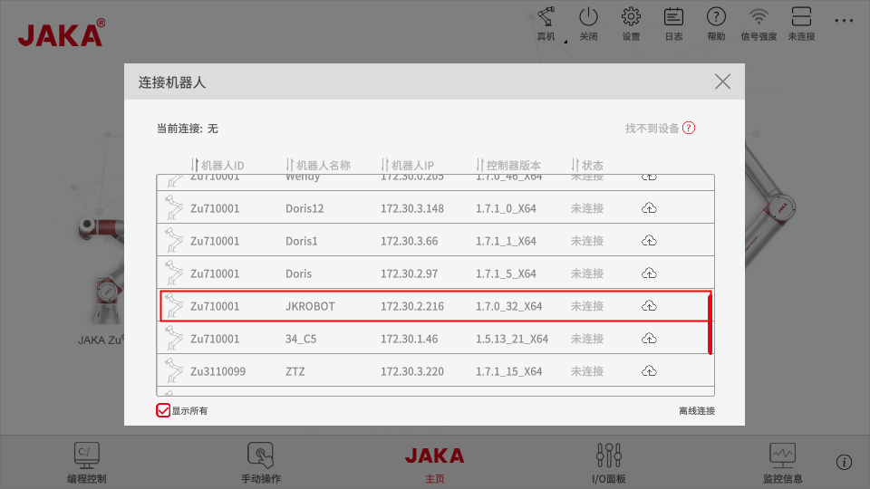
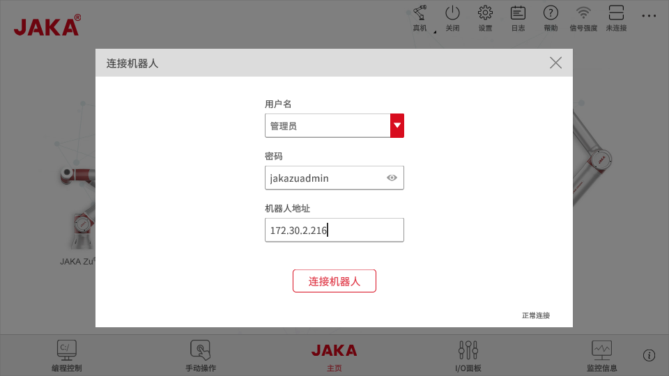
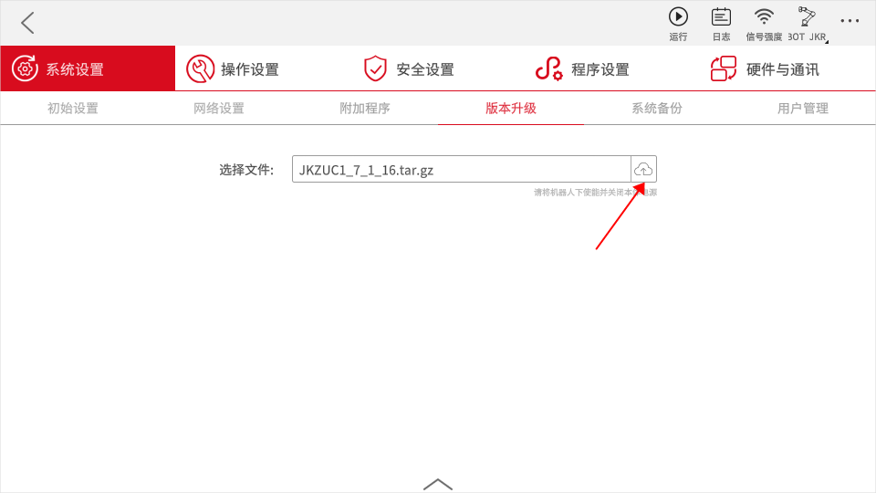
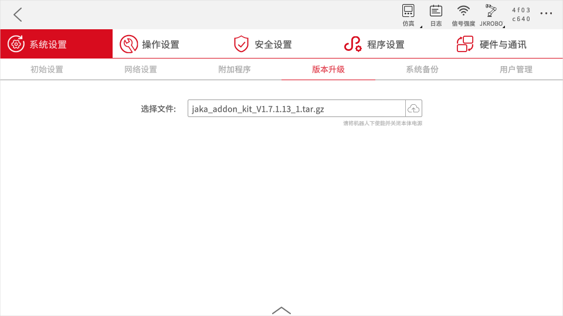

# 开发环境准备
**本文将介绍如何搭建AddOn开发环境，开始前请先下载["*jaka_addon_package*"](/guide/addOn/AddOn3.0.html#开发资料获取)。**

## JAKA虚拟机安装

### 1.1 安装虚拟机软件

&emsp;&emsp;开发者需先安装虚拟机软件，例如VirtualBox 或 VMware Player。

### 1.2 安装JAKA虚拟镜像
&emsp;&emsp;在*jaka_addon_package*中找到虚拟机镜像文件，导入安装。

### 1.3 启动JAKA虚拟控制器
&emsp;&emsp;点击“开启此虚拟机”启动虚拟机。

&emsp;&emsp;此时虚拟机页面上显示了当前机器人的IP地址。

## 安装其他环境
### 2.1 安装App

1.在AddOn开发环境包中APP文件夹中找到安装包，点击根据引导安装完成APP。在安装过程中要注意给予网络权限。

### 2.2 使用App连接机器人

1.打开APP连接机器人，此时可在机器人列表中根据IP找到虚拟机器人。

2.若在列表中无法找到机器人，可尝试使用离线连接。

3.密码填入默认登录密码（jakazuadmin）

4.地址填入虚拟机器人IP

### 2.3 升级控制器

&emsp;&emsp;打开设置页面--系统设置--版本升级页面,选择要升级的控制器包，点击上传升级。

### 2.4 升级AddOn环境

&emsp;&emsp;打开设置页面--系统设置--版本升级页面,选择AddOn环境包，点击上传升级。

&emsp;&emsp;升级完成后，需新启动APP。

