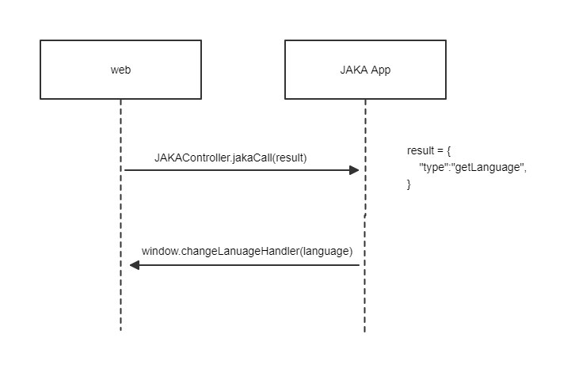

## 自定义指令的多语言

在制作自定义指令时，支持多语言的内容输入框右侧会有一个小地球图标，点击即可配置多语言。目前支持中英日三种语言。

<div align="center"></div>

## 自定义网页的多语言

当自定义网页在JAKA App中打开时，需要获取App当前的语言，进而切换用户自定义页面的语言与App一致。可以采用下面的方式实现该功能。


<div align="center"></div>

在web的初始化js代码中调用方法JAKAController.jakaCall(result)，调用后JAKA App会回调window.changeLanuageHandler(language)函数，并将当前App语言传入。

### 示例代码：

```js

let result = {
    "type":"getLanguage",
}

result = JSON.stringify(result);

JAKAController.jakaCall(result);


/**
 * 触发getAppLanguage后App的回调函数。
 * @param {*} language App传入当前语言
 */
window.changeLanuageHandler = (language)=>{
    console.log(`Curret language is {language}`)
}

```