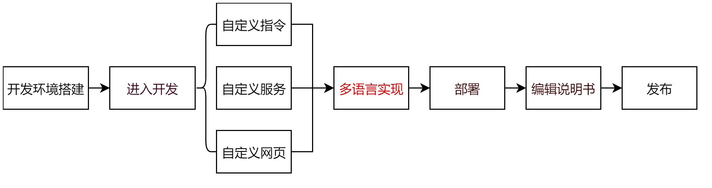

为AddOn开发者提供开发指南。

## AddOn开发流程

## AddOn开发资料获取
---

1. [JAKA虚拟机](https://github.com/JakaCobot/JAKASim)
2. [AddOn环境包](https://github.com/JakaCobot/jaka_addon_kit/releases)
3. AddOn[开发模板](https://github.com/JakaCobot/jaka_addon_kit)
4. 教程中包含的[Demo](https://github.com/JakaCobot/jaka_addon_kit)

:::tip
1. 点击红色高亮部分跳转至资源页面
2. 环境包中会附带与之匹配的最新App和控制器版本。
:::

## AddOn开发环境搭建

* 按照AddOn[开发环境准备](./environment.md)中的步骤，搭建AddOn开发环境。

## AddOn文件组成
---
AddOn可能包含许多不同的文件，下面是最常见的一种组成。   

**数据文件**    
&emsp;&emsp;AddOn包中一般都包含一个json文件，其中包含了在node-red中定义流和节点信息。该文件的名称可以自定义，但需要在配置中指向该文件。

**配置文件**    
&emsp;&emsp;任何类型的AddOn插件必须包含`xxx_config.ini`文件，即[AddOn配置文件](/guide/addOn/iniConfig)。只有包含AddOn配置文件才能安装、初始化、运行。

**前端工程**   
&emsp;&emsp;包含自定义页面的AddOn目录下一般会有前端工程的文件夹，例如client、dist。

## 快速入门AddOn开发
---

<!-- ### 自定义指令 -->
<!--  -->
<!-- ### 自定义服务 -->
<!-- ### 自定义网页 -->

&emsp;&emsp;如果您不知道从哪里开始，先学习下面的入门教程吧：

* 通过制作 "[JAKA_Command](./JAKA_Command.md)" 快速入门自定义指令类型AddOn开发的基本流程和规则。
* 通过制作 "[JAKA_Serve](./JAKA_Serve.md)" 快速入门自定义服务类型AddOn开发的基本流程和规则。
* 通过制作 "[JAKA_web](./JAKA_web.md)" 快速入门自定义网页类型AddOn开发的基本流程和规则。

## 深入AddOn开发

&emsp;&emsp;在此基础之上，您可以选择一个实际场景的AddOn示例教程进行学习，它们可能包含了自定义指令、自定义服务、自定义网页中的至少两种，被称为复合型AddOn：
<!-- demo还需要确定，至少包含三种不同类型的？目前只提供自定义指令块的详细的？ -->
<!-- 展开说下每个demo能学到什么 -->
1. [Ewellix升降轴](./demo_LiftKit.md) 
2. [大寰夹爪]() 

  
<!-- todo 这里补充更多的教程覆盖到每一种场景：夹爪、升降轴、视觉等 -->