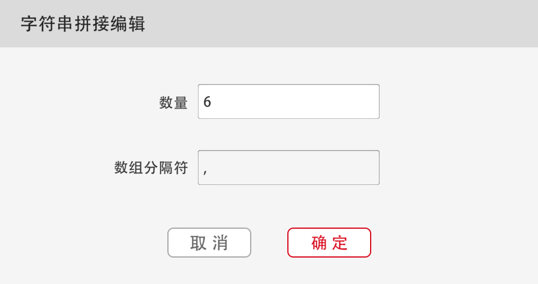
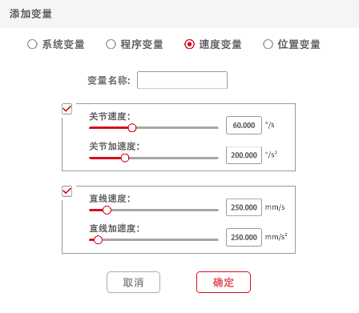

# 指令介绍

## 指令功能介绍

## 圆弧过渡

圆弧过渡是指在转角的地方不用棱角分明的角度，而用圆弧平滑过渡。开启圆弧过渡可以让机器人的运动更加顺滑，运动轨迹差异如下图所示：
 
未开启圆弧过渡（左）与开启圆弧过渡（右）轨迹示意图

> 注：
> * R为圆弧过渡的半径，单位mm。
> * 只需在想要圆弧过渡的位点开启圆弧过渡。例如上图中，只需在点2开启圆弧过渡。

## 共享参数

机器人的三种路点指令的指令配置界面均可以选择使用共享参数或是自行设置，若是使用共享参数，则自动使用该路点上一级子程序节点下设置的速度和加速度数值。

## 新建编程

 

* 含义：机器人即将运行的程序。

* 用法：将需要执行的指令按顺序放置在新建编程下方；点击指令可以修改程序名称。

* 范例：让机器人做关节运动从起点到竖直姿态。

 

> 注：如果模块没有放置在"新建编程"下方，将不会执行此模块。

## 运动指令

机器人的运动位置会根据坐标系的变化而变化，当用户在某一坐标系下设置好位点后，若切换坐标系后运行程序，则所有点会自动切换到相应的位置。例如初始设置点为（0°,0°, 0°, 180°, 90°,20°），切换坐标系后该点会切换到相对于切换后的坐标系下（0°, 0°, 0°, 180°,90°,20°）的位置。因此，用户在编辑运动指令或使机器人运动前需要先设置好坐标系。

## 关节运动

 

* 含义：使机器人执行关节运动。
* 用法：点击指令打开设置界面，编辑此条指令的名称、速度、加速度；选择是否使用笛卡尔位置；选择在此处停止或圆弧过渡；选择停止条件；编辑示教点位。

 

关节运动编辑界面

当使用关节运动时，若勾选了使用笛卡尔位置选项，机器人会以当前运动中保存的机器人笛卡尔位置解算出对应关节角度值，再进行关节运动到设定位置。

## 关节运动使用笛卡尔坐标系

 

* 含义：使用笛卡尔坐标系记录的点位执行关节运动。
* 用法：在关节运动前使用此指令，后续的关节运动都会以笛卡尔坐标系记录的点位运动，运动方式仍然是关节运动，但是机器人会自动逆解。   

## 直线运动

 

* 含义：使机器人末端执行直线运动。
* 用法：点击指令打开设置界面，编辑此条指令的名称、速度、加速度；选择在此处停止或圆弧过渡；选择停止条件；编辑示教点位。

 

直线运动编辑界面

## 相对直线运动

 

> 注：此指令为1.7版本APP新增指令，1.5版本APP暂无此指令。

* 含义：设置位置变化量使机器人执行相对于当前姿态的末端直线运动，其中位置变化量为当前用户坐标系下的增量值。
* 用法：点击指令打开设置界面，根据需求编辑此条指令的名称、速度、加速度、参考坐标系、是否使用圆弧过渡及停止条件；编辑位置变化量。
* 范例：机器人末端沿着当前用户坐标系Z轴负方向运动100mm。

## 圆弧运动

 

完成圆弧运动需要三个点，初始点、圆弧运动的经过点和终点。初始点为上一条指令的最后一个点，圆弧运动的经过点为圆弧运动指令下的第一个点，终点为圆弧运动指令下的第二个点。如后图。

运动圈数：此运动圈数只能为整数。当圈数为0时，圆弧运动轨迹为初始点到终点的圆弧；当圈数为1时，系统会自动通过设置的初始点、经过点和终点计算出整圆，此时，圆弧运动轨迹为系统计算的1圈整圆；当运动圈数为2时，圆弧运动轨迹为系统计算的2圈整圆，依此类推。

 

圆弧运动轨迹示意图

 

圆弧运动编辑界面

## MoveZ

 

* 含义：机器人末端保持当前姿态做Z字型的轨迹运动。

* 用法：点击指令打开设置界面，编辑运动的开始位置、结束位置和任意位置（机器人将会在此三点确定的平面上执行Z字型运动），Z型轨迹的宽度，移动速度，Z型轨迹的密度，圆弧过渡或峰值暂停时间（二选一）。

**宽度：**机器人在当前平面运动的宽度；

**密度：**同侧峰值之间的距离，密度决定机器人的运动周期；如果没有设置 Z型密度，由当前机器人的运动速度决定 Z 型运动周期；

**峰值暂停时间：**每到达一个峰值（轨迹示意图中的红点），机器人暂停，+x侧和-x 侧的点可设置不同暂停时间；

默认垂直于用户坐标系Z轴的平面作为机器人运动的平面；用户也可以自定义运动平面，即新增一个点位，即由起始点、结束点、第三个点所形成的平面作为机器人Z 型运动平面，此时，第三个点方向为+X 方向；

 

MoveZ编辑界面

MoveZ轨迹示意图如下：

 

MoveZ轨迹示意图

## MoveZS

 

* 含义：机器人末端旋转RZ的同时向设定方向移动。

* 用法：点击指令打开设置界面，编辑运动的开始位置、结束位置和任意位置（机器人将会在此三点确定的用户坐标系上执行运动），轨迹的宽度，移动速度，轨迹的密度，旋转角度（默认为45°），圆弧过渡或峰值暂停时间（二选一）。

**宽度：**机器人在当前平面运动的宽度；

**密度：**同侧峰值之间的距离，密度决定机器人的运动周期；如果没有设置 Z型密度，由当前机器人的运动速度决定 Z 型运动周期；

**旋转角度**：往X轴正方向或负方向旋转运动的角度。

**峰值暂停时间：**每到达一个峰值（轨迹示意图中的红点），机器人暂停，+x侧和-x 侧的点可设置不同暂停时间；

默认垂直于用户坐标系Z轴的平面作为机器人运动的平面；用户也可以自定义运动平面，即新增一个点位，即由起始点、结束点、第三个点所形成的平面作为机器人Z 型运动平面，此时，第三个点方向为+x 方向；

 

MoveZS编辑界面

MoveZS 运动轨迹示意图如下：

 

MoveZS 运动轨迹示意图

## 路点变量管理

> 注：此指令为1.7版本APP新增功能，1.5版本APP暂无此功能。

JAKAZu软件支持运动路点功能。用户可以在路点变量管理中进行运动路点定义，并使用对应的运动路点指令进行调用，控制机器人运动至设置的路点位置。

在运动控制界面中，点击左侧指令栏，进入移动指令选项，选择"设置" 按钮，进入路点变量管理界面。在路点变量管理界面中，用户可以根据实际需求对运动路点进行新增、修改和删除。

 

路点变量管理器

## 运动路点

 

>  注：此指令为1.7版本APP新增指令，1.5版本APP暂无此指令。

* 含义：运动过程中TCP的位点。

* 用法：点击指令选择功能，可以选择自定义路点或调用路点变量管理中定义的路点（如上图中P1则为路点变量管理中的路点）；点击指令打开设置界面，编辑此条指令的别名（自定义模式无法修改）、速度、加速度；选择是否使用共享参数、笛卡尔位置（关节运动）、及圆弧过渡；选择停止条件（当机器人满足停止条件设置的状态时，程序会跳过此条指令）。

注意：此指令需要搭配运动指令框配合使用，若单独使用其等效于关节运动指令。

* 范例：机器人采用关节运动方式，从路点1位置运动到路点2位置。

  

## 运动指令框

  

> 注：此指令为1.7版本APP新增指令，1.5版本APP暂无此指令。

搭配运动路点指令，使机器人做关节运动或直线运动。点击指令运动切换功能进行关节运动或直线运动切换；点击指令打开编辑界面，可以编辑此条指令的名称、速度、加速度。

 

运动指令框编辑界面

## 托盘路点

 

* 含义：设置托盘程序中机器人到达每个托盘点之后的运动终点。

* 用法：点击指令打开设置界面，编辑此条指令的名称、速度、加速度；可以选择在此处停止或圆弧过渡；选择停止条件；编辑示教点位（此指令仅在位于托盘指令内时才会生效）。

 

托盘路点编辑界面

注意：此指令仅在位于托盘框内生效。

* 范例：器人末端走一个3X3的正方形托盘，并在每个点向下运动100mm。

   

## 轨迹记录

 

* 含义：对记录的轨迹进行复现，待复现的轨迹可通过JOG或拖拽的方式继续采集。

* 用法：在指令的下拉列表中，可选择需要使用的轨迹；点击指令打开设置界面，可以编辑此条指令的速度和加速度。

 

运动编辑界面

## 设置全局速度

 

下拉列表，选择合适的速度变量。开启设置全局速度后，后续所有直线运动和关节运动指令的运动速度、加速度将会和所选的速度变量一致。

## 关闭全局速度

 

执行此条指令后关闭全局速度设置，后续的直线运动和关节运动恢复原本的运动速度、加速度。

## 获取运动路点参数 

 

> 注：此指令为1.7版本APP新增指令，1.5版本APP暂无此指令。

* 含义：获取路点变量管理中运动路点信息。

* 用法：可发送给上位机或赋值给变量。
* 范例：读取路点变量管理中运动路点1信息。上位机会接收到路点变量管理中运动路点1信息。

 

## 获取机器人相关参数

 

* 含义：获取机器人当前关节位置、工具端中心位置、法兰中心位姿、末端负载、末端力、碰撞灵敏度和系统时间。

* 用法：可发送给上位机或赋值给变量。

* 范例：上位机接收当前机器人一到六关节的角度值。

  

## 获取机器人用户坐标系设置或工具坐标系设置

 

* 含义：获取机器人用户坐标系设置或工具坐标系设置。

* 用法：可发送给上位机或赋值给变量。

* 范例：上位机接收当前机器人的工具端坐标值。

 

## 笛卡尔空间位姿是否可达

 

> 注：此指令为1.7版本APP新增指令，1.5版本APP暂无此指令。

* 含义：基于当前位置判断给定的笛卡尔位姿是否可通过笛卡尔空间运动到达。

## IO指令

## 设置数字输出

 

该指令为即时指令，程序中使用该指令时，会立即输出该指令所设定的DO信号。

范例：运动到物体放置点松开软爪放置物体。

 

## 运动中设置数字输出

 

该指令为非即时指令，程序中使用该指令时，不会立即输出DO信号，而是等待机器人开始运动时输出DO信号。

## 等待数字输入

 

该指令用于等待DI信号。当指令中输入的时间为0时，程序运行到该指令时会一直等待，直到该指令成立，才会执行此条指令下的程序；当输入的等待时间为非0时，如果指令中的条件成立，则会立即执行此条指令下的程序，如果指令中的条件不成立，则会等待输入的时间后执行此条指令下的程序。

## 设置模拟输出

 

该指令为即时指令，程序中使用该指令时，会立即输出该指令所设定的AO信号。可在椭圆形白色框中填入模拟输出信号的值，数值范围为-65535\~65535。

范例：当机器人运动到待命点后设置控制柜AO1的值为2048。

  

## 运动中设置模拟输出

  

该指令为非即时指令，程序中使用该指令时，不会立即输出AO信号，而是等待机器人开始运动时输出AO信号。可在椭圆形白色框中填入模拟输出信号的值，数值范围为-65535\~65535。

## 数字输入

 

该指令用于获取数字量输入的状态，需搭配其他指令使用。可在程序中作为判断条件来使用。当DI状态与指令上设定的一致时，即为真。

范例：判断当前数字输入的状态。如果当前DI1为开，则机器人从A点运动到B点。

 

## 数字输出

 

该指令用于获取数字量输出的状态，需搭配其他指令使用。可在程序中作为判断条件来使用。当DO状态与指令上设定的一致时，即为真。

范例：判断当前数字输出的状态，如果当前DO1为开，则机器人从A点运动到B点。

 

## 获取模拟输入

 

该指令用于获取数字量输入的状态，需搭配其他指令使用。可通过变量赋值的方式将模拟输入的值赋值到变量中。

范例：将当前模拟量输入赋值到名为距离的系统变量中，如果系统变量距离值小于10，则机器人从A点运动到B点。

 

## 获取模拟输出

 

该指令用于获取模拟量输出的状态，需搭配其他指令使用。可通过变量赋值的方式将模拟输出的值赋值到变量中。

范例：将当前模拟量输出赋值到名为距离的系统变量中，如果系统变量距离值小于10，则机器人从A点运动到B点。

 

## 控制指令

## 设置工具坐标系

**①****②**

控制指令中有两种设置工具坐标系的方式，**①手动输入TCP**，**②选择在设置中建立好的TCP**。

点击指令打开设置界面，可以编辑坐标系的名称和坐标值。此坐标系只能在此程序中可用。（默认的工具坐标系为末端法兰中心）。

 

工具坐标系编辑界面

范例：在程序中建立一个新的TCP坐标系，观察设定后机器人末端运动的变化。

 

## 设置用户坐标系

**①****②**

控制指令中有两种设置用户坐标系的方式，**①为手动输入用户坐标系**；**②为选择在设置中建立好的用户坐标系。**

点击指令打开设置界面，可以编辑坐标系的名称和坐标值。此坐标系只能在此程序中可用（默认的用户坐标系为世界坐标系）。

 

用户坐标系编辑界面

范例：在程序中建立一个新的用户坐标系，观察设定后机器人末端运动的变化。

 

## 设置负载与质心

 

当运行中负载发生变化时，需要用设置负载的指令，运行中设置的负载与实际负载不匹配可能会有抖动或者误报碰撞。

该指令用于在程序运行中修改末端的负载及负载的质心。有以下两种使用方式：

* 直接在表格中填入实际的负载和质心；

* 在白色椭圆形框中填入数字变量，变量初始值即为想要设置的负载或质心数值。

 

## 设置碰撞灵敏度

 

该指令用于设置当前的碰撞灵敏度，有1-5等级的碰撞灵敏度，级数越高，灵敏度越低。此外，也可在【安全设置】→【碰撞保护】中设置碰撞灵敏度。

## 等待指令

**①****②**

等待指令有两种，**①用于设定特定等待时间**；**②用于设定特定等待条件**。

* **等待特定时间：**输入等待时间后程序会在运行此指令时等待输入的时间后继续运行，如果设定的等待时间为0s，机器人会一直等待。

  范例：机器人运动到A点后暂停5s后继续运行。

 

* **等待特定条件：**将判定条件填入框内后，运行到此指令时，机器人会持续等待直到判断条件满足以后才会继续运行程序；

  范例：等待直到DI1为开时，机器人从A点运动到B点。

 

## 循环指令

**①****②****③****④**

**⑤**

循环指令有五种类型：**①循环特定次数；②一直循环；③如果···执行循环；④结束循环；⑤跳过本次循环**

* **循环特定次数**：程序运行到此指令后循环执行指令所包括的内容，直到循环指令中的内容被重复执行特定次数后或运行到结束循环指令才会结束。

  有以下两种使用方式：
  * 在白色椭圆形框内填入循环次数；

  * 在白色椭圆形框内填入数字变量，变量初始值即为循环次数。

* **一直循环：**程序运行到此指令后会一直循环执行此指令所包含的内容，直到运行结束循环指令时才会结束。把期望重复执行的指令放置在此指令内即可。

* **如果···执行循环**：程序运行到此指令后会进行判断，当满足菱形空格中的判断条件后会一直循环此指令所包括的内容，直到条件不满足或者运行结束循环指令时才会结束。在菱形空格中加入菱形指令条件，如果满足条件则会一直循环指令中的内容。

  范例：如果条件成立，机器人会重复在A、B两点之间运动。

     

* **结束循环：**该指令需与循环指令、判断指令搭配使用，满足特定条件时终止最靠近此结束循环指令的循环。在此条指令前加入判断条件，条件成立则立即终止当前循环。

  范例：如果结束循环条件不成立，执行关节运动ABCD；如果结束循环条件成立，执行关节运动AB，然后跳出当前循环，不执行关节运动CD，程序终止。

 

* **跳过本次循环：**该指令需与循环指令、判断指令搭配使用。满足特定条件时终止最靠近此结束循环指令的循环。在此条指令前加入判断条件，条件成立则跳过本次循环，回到循环初始位置继续执行循环。

  范例：如果跳过本次循环条件不成立，执行动作ABCD；跳过本次循环条件成立时，执行动作AB，然后跳过CD动作，继续从循环开头执行，不会跳出当前循环。

 

## 判断指令

**①****②**

判断指令有两种类型：**①如果···为真；②如果···为真，否则**

* **如果···为真：**

该指令用于判断条件指令内的条件是否成立，如果条件成立则执行框架内部的程序，反之，则不执行。

范例：如果当前DI1为开时，则机器人从A点运动到B点；如果当前DI1为关时，则机器人只进行关节运动A。

 

* **如果···为真，否则：**

该指令用于判断条件指令内的条件是否成立，如果条件成立，执行A区域的程序；若果条件不成立，执行B区域的程序，如下图：

  

范例：如果当前DI1为开时，则机器人运动到A点，否则机器人会运动到B点。

 

## 托盘指令

 

托盘指令主要用于码垛，即将物品按照规则堆叠在托盘上，此指令需搭配循环指令使用。

托盘类型分为三种：一维（线段）、二维（四边形）、三维（立方体），轨迹示意图如下；

一维                           二维                       三维

操作步骤如下：

* 选择托盘类型。

* 设置速度、加速度、是否使用圆弧过渡、选择停止条件。

* **编辑位点**：一维需要设置2个位点、二维需要设置4个位点，三维需要设置8个位点。点击托盘指令，打开托盘编辑界面，点击圆形数字即可进入编辑界面编辑位点。在编辑位点前，请切换至想要的坐标系，并保证所有点位在同一坐标系下。如下图：

  一维            二维                                   三维

* **设置点X至点X的总计数**：总计数为工件数，也是包括点1和点2在内的总点数。例如，在一维托盘下，设置点1至点2的总计数为3，那么系统将会自动将点1至点2的这条线段等分为2段，并在中点处设定一个位点；若总计数为4，那么系统将会自动将点1至点2的这条线段等分为3段，并在分割点设定两个位点，如下图所示：

* **设置起始点**：有以下三种设置起始点的方式：
  * 在"起始位置"后的白色椭圆形框内输入点数或变量（当值小于1时程序会报错，当值大于总点数时，会从托盘第一个点开始执行；当值在1\~总点数范围内时，机器人从输入的点数开始运行）。例如二维托盘，点1至点2的总计数为3，点2至点3的总计数为3，则总点数为3×3=9。
  * 在托盘运动前增加关节运动或直线运动，运动起点为初始点，终点为点1。

* **编辑循环指令**：循环次数与点数有关。例如设定3×3托盘，想要走完9个点位，循环次数应设置为9。

* **插入其他指令**：在托盘指令框内可插入其他指令运，使机器人完成想要的动作。

  范例：器人末端走一个3X3的正方形托盘，并在每个点向下运动100mm。

 

## 传送带跟踪指令

 

该指令使机器人末端跟随传送带移动并实时地做出动作，有两种类型的传送带跟踪：**①直线传送带跟踪**；**②圆形传送带跟踪**。

在使用软件进行传送带跟踪操作之前，需先进行环境搭建，即将编码器与控制柜相连、使用Modbus poll 和机器人进行Modbus TCP连接。

* **直线传送带追踪**：
  * **计算脉冲当量：**通过读取编码器脉冲数值变化量并测量当前传送带移动了多少距离，然后计算出脉冲当量。（距离可用卡尺测量，脉冲量可通过Modbus读取），脉冲当量计算式如下：
  
    脉冲当量 = 距离（mm）/脉冲量（cnt）
    
  * **设置传送带方向：**有以下两种设置传送带方向的方式：
  
    * 手动输入：传动带方向XYZ表示用户坐标系下位置\[0,0,0\]指向\[X,Y,Z\]的方向，比如设置\[1,0,0\]表示沿着用户坐标系X轴正方向。
    * 起点终点设置：点击起点（终点）可以进行机器人点位确认，当前指令会根据两个点进行自动计算出传送带的运动方向，传送带方向由起点指向终点。

 

直线传送带编辑界面

* **圆形传送带追踪：**

  * **计算脉冲当量：**脉冲当量为编码器发送一个脉冲所对应的传送带转过的角度，可以通过编码器运动一圈时传送带转过的角度来确定（脉冲量可通过Modbus读取），脉冲当量计算式如下：
  
    脉冲当量 = 角度（°）/脉冲量（cnt）

  * **确认末端工具姿态是否随变：**

    * 当选则"末端工具姿态随变"选项时，跟踪圆形传送带运动过程中，末端工具也同步进行绕着传送带转动轴转动的运动，即末端工具在当前用户坐标系下的姿态是变化的；

    * 当不选"末端工具姿态随变"选项时，跟踪圆形传送带运动过程中，末端工具在当前用户坐标系下姿态保持不变；
  * **标定传送带圆心坐标系：**传送带圆形坐标系通过传送带上共圆的三点：P1，P2，P3的位置坐标确定。P1，P2，P3的位置的标定可以通过示教三点位置完成也可以通过直接输入该三点位置坐标完成。
  
    > 注：P1，P2，P3必须按照传动带转动方向依次选择，且其位置坐标必须是相对于世界坐标系。
  
    当选择"示教三点位置"时，按照以下步骤进行圆形传送带：
  
    * 在传送带上确定一点P，转动传送带使点P运动至机器人工作范围内；

    * 点击指令进入圆形传送带跟踪设置界面，点击P1，进入运动控制界面，在该界面下控制机器人运动使机器人工具末端与P重合后（注意此时的用户坐标系必须为"世界")，点击"确定"即可完成P1的标定；
    
    * 抬起机器人工具，在传送带运动方向上将传送带转动一定角度；

    * 在圆形传送带跟踪设置界面点击P2，进入运动控制界面，在该界面下再次控制机器人运动使机器人工具末端与P重合后（注意此时的用户坐标系必须为"世界"），点击"确定"即可完成P2的标定；

    * 再次抬起机器人工具，在传送带运动方向上将传送带转动一定角度；
    
    * 在圆形传送带跟踪设置界面点击P3，进入运动控制界面，在该界面下再次控制机器人运动使机器人工具末端与P重合后(注意此时的用户坐标系必须为"世界")，点击"确定"即可完成P3的标定；
    
    * 在圆形传送带跟踪设置界面点击"确定"即可完成传送带圆形坐标系的标定。
     
    圆形传送带编辑界面
  * **编写程序**，需要机器人进行传送带跟踪的运动指令嵌入传送带跟踪模块（传送带跟踪模块内的运动指令不能是关节运动）。

## 指令折叠

 

可将想要折叠的指令拖入此指令内部，使其折叠为一条指令。

范例：折叠如下指令。

 

## 输出日志类型及日志内容

 

该指令使用户可以自定义输出日志内容。指令下拉列表可选日志类型，包括消息、警告、错误三种类型，可在日志内容处输入值或拖入字符串变量，输出的日志内容可在APP日志信息处查看。

范例：到达指定位置就输出日志内容pos1、pos2。

 

## 程序停止或暂停

 

指令下拉列表可选择暂停或者停止，可在程序任何位置添加此条指令，使程序在此位置停止或暂停。

## 多线程指令

> 注：此指令为1.7版本APP新增指令，1.5版本APP暂无此指令。

* **执行程序**

 

该指令用于多个程序同时执行时，当程序运行到此指令时，会在执行原程序的同时执行此条指令内的程序。此条指令内的程序可以作为主线程也可以作为子线程，当其作为子线程时，原程序则作为主线程；当其作为主线程时，原程序则作为子线程；最多可以插入5个子线程，但只能有一个主线程。当主线程运行结束时，子线程也会随之结束。

范例：第一条指令以主线程方式执行名称为231的程序文件，第二条指令以子线程方式执行名称为子线程1的程序文件，示例程序如下：

 

* **线程操作**

有两种类型的线程操作：等待、销毁。

等待：运行到此指令时，等待此指令内的程序运行完后再运行此指令下面的程序。

销毁：运行到此指令时，终止指令内的程序，此指令下面的程序继续运行。

范例1：机器人运动到A后，执行子线程1并同时运动至B，等待子线程1完成后，机器人运动到C。

 

范例2：机器人运动到A后，执行子线程1并同时运动至B，停止执行子线程1，同时机器人运动到C。

 

* **线程互斥支持**

 

当某一主程序内有多个子程序，且不同程序有相同的指令时，使用线程互斥指令可防止不同指令发生冲突。可将相同的指令放入线程互斥指令框内，防止相同指令同时执行，造成程序错误。相同指令执行顺序为哪一指令先执行，那么其他相同的指令停止，直到正在执行的重复指令执行完成。

范例：在主线程中插入子线程1，且子线程1中也含有设置系统变量ABC，为避免冲突，可将设置系统变量ABC放入线程互斥支持指令框内。

 

## 计算指令

## 计算符

 

提供六种计算方法：加（+）、减（-）、乘（\*）、除（/）、求余（%）、求幂（\*\*）。

## 数学函数计算

 

提供数学函数计算正弦、余弦、正切、反正弦、反余弦、反正切、自然指数、自然对数、向上取整、向下取整、四舍五入、绝对值、平方根。

## 比较运算符

 

提供比较运算符：小于、等于、大于、不等于、小于等于、大于等于，满足条件时返回结果为真。

## 并且

 

菱形框内的2个条件都成立时，返回结果为真。

## 或者

 

菱形框内的2个条件都成立或者有1个成立，返回结果为真。

## 异或

 

菱形框内的2个条件仅有1个成立时，返回结果为真。

## 非

 

菱形框内条件不成立时，返回结果为真。

## 位置计算

* **位置计算···相加**

 

将两个位置相加。

* **位置计算···相减**

 

将两个位置相减。

* **位置计算逆变换**

 

即矩阵求逆。计算位置为笛卡尔坐标。

例如：设置点P，其坐标为\[10,10,10,10,10,10\]，则其逆变换位置为\[-10,-10,-10,10,-10,-10\]。

* **计算位置变换**

 

拖入位置变量或示教点，分别为机器人起始位姿和机器人相对起始位姿的增量变换，指令返回值为变换结果。

> 注：位置计算的是笛卡尔坐标。

* **计算位置距离**

 

拖入位置变量或示教点，指令返回值为两个位姿之间的距离。

## 插补点

 

该指令按照给定的系数计算两点之间的插补点，系数的取值范围为0-1。可拖入位置变量或示教点，指令返回值为插补点的位置。例如，将系数设置为0.5或0.25，插补点位置如下图：

​                                        **0.5**                                                                                      **0.25**

## 变换平面

 

在XY（YZ/ZX）平面内做变换，基点处先绕Z（X/Y）轴旋转，然后沿X（Y/Z）轴平移，沿Y（Z/X）轴平移。基点处可拖入位置变量、数组变量或示教点，指令返回值为变换后的位姿。

范例：先将P沿着用户坐标系方向平移\[0，10，10\]，再将P绕着用户坐标系的x轴转动10°。

 

## 运动学逆解（正解）

 

* **运动学逆解笛卡尔空间值**

  使用该指令，输入笛卡尔空间位置，计算出关节角度值。

* **运动学正解关节角度值**

  使用该指令，输入关节角度值，计算出笛卡尔空间位置。

## 字符指令

在字符串指令中支持的转义字符有\\\\、\\\'、\\\"、\\n、\\t、\\r，分别对应反斜杠符号、单引号、双引号、换行、横向制表符、回车。

## 字符串拼接

 

* 含义：按照一定顺序对拖入的变量或输入的字符串进行拼接。

* 用法：点击此条指令可编辑数量（白色椭圆形框数量，范围：1\~8）和所需数组分隔符，可拖入变量或输入字符串，该条指令可返回拼接后的字符串，返回值为字符串变量型。

 

* 范例：拼接以下变量A = 8888,B = \"Hello\", C =\[1,2,3,4,5,6\]，返回结果为:

  A:8888

  B:Hello

  C:1,2,3,4,5,6

  示例程序如下：

 

## 字符串或数组长度（）

 

* 含义：对字符串或数组的长度进行计算，并返回长度值。

* 用法：可以拖入字符串变量、数组变量或输入字符串，返回值为长度。

* 范例：若上位机需要获取字符串变量\"JAKA_AMAZING\"的长度12，获取数组变量\[1,2,3,4,5,6\]的长度6，示例程序如下：

 

## 字符串比较

 

* 含义：根据ACSII码比较两个字符串的大小。

* 用法：可拖入字符串变量或输入字符串值str1、str2，若str1=str2，则返回0；若str1\<str2，则返回负值；若str1\>str2，则返回正值。

* 范例：例如需要比较字符串变量str1和str2的大小，返回值应为负值，示例程序如下：

## 格式化输出字符串

 

* 含义：将指定数据按指定格式输出为字符串。

* 用法：点击此条指令可编辑数量（白色椭圆形框数量，范围：1\~8）和所需数组分隔符，可拖入变量或输入值，该条指令可返回格式化后的字符串，返回值为字符串变量型。

 

* 范例：获取机器人相关信息：

  Current joint position: \[0,90,0,90,180,0\]

  End load: \[0,0,0,0\]
  
  示例程序如下：

 
 

## 输入格式化字符串

  

 

* 含义：将匹配一定格式的字符串并将匹配数据输入到指定变量中。

* 用法：点击此条指令可编辑数量（白色椭圆形框数量，范围：1\~8）和所需数组分隔符，可拖入指定变量或输入值，指定变量可提取到所需值。格式化结果变量支持整形，浮点型以及字符串类型的变量，或者常数。

 

* 范例：提取字符串变量" End load is : 0,0,0"中的数组\[0,0,0\]，示例程序如下：

 
 

## 数组转换为字符串

 

* 含义：将数组转化为一定格式的字符串变量。

* 用法：在"数组"后可拖入所需转换的数组类型的变量，在分隔符中可输入字符串分隔符。

* 范例：例如要将数组变量\[1,2,3,4,5,6\]转换为"1a2a3a4a5a6"，示例程序如下：

 

## 字符串转换为数组

 

* 含义：将一定格式的字符串转为为数组变量。

* 用法：在"字符串"后可拖入所需转换为数组类型的字符串变量，在分隔符中可输入字符串分隔符。

* 范例：例如要将字符串变量1a2a3a4a5a6"转换为数组变量\[1,2,3,4,5,6\]，示例如下：

 

## 访问下标

既可以通过设置访问下标而访问数组中的某一变量，也可以通过设置步进值同时访问某一数组中的多个变量。
*  
  * 含义：访问数组变量中的元素。
  
  * 用法：可拖入需要访问的数组变量和输入需要访问的数组下标值，下标索引从0开始，依次类推。指令返回值为所访问元素。
  
  * 范例：访问数组变量\[1,2,3,4,5,6\]中下标为3的值，即返回值为4，示例程序如下：

 

*  

  * 含义：按照所需下标和步进值访问数组变量中的元素。

  * 用法：可拖入需要访问的数组变量和输入需要访问的数组下标值和步进值，下标索引从0开始，依次类推。指令返回值为所访问子数组。

  * 范例：访问数组变量\[1,2,3,4,5,6\]中下标为0、2、4的值，即返回值为\[1,3,5\]，示例程序如下：
  

## 设置数组元素

 

* 含义：设置数组中某一元素的值。

* 用法：可拖入需要设置的数组变量和输入需要设置的数组元素下标值，下标索引从0开始，依次类推。

* 范例：例如需要设置数组变量\[1,2,3,4,5,6\]中下标为0的值为888，即数组变量变为\[888,2,3,4,5,6\]，示例程序如下：

 

## 通讯指令

## 打开SOCKET

 

* 含义：创建TCP Client并与TCP server建立通讯。

* 用法：在下拉列表中选择指定的SOCKET ID，输入TCP Server的IP地址和端口号，执行此指令时会建立TCP Client（机器人）和TCP Server的连接。

## 打开SOCKET，返回结果

 

* 含义：创建TCP Client并与TCP server建立通讯，并返回Socket句柄。

* 用法：在下拉列表中选择指定的SOCKET ID，输入TCP Server的IP地址和端口号，执行此指令时会建立TCP Client（机器人）和TCP Server的连接；且此条指令会获得返回值，若连接成功，则返回一个大于0的整数值；若连接失败，返回值为-1。

## 关闭SOCKET

 

* 含义：断开指定SOCKET通讯连接。

* 用法：在下拉列表选择指定的SOCKET ID，执行此指令时会断开指定的SOCKET通讯连接。

## SOCKET发送

 

* 含义：使控制器通过SOCKET通讯发送变量给TCP Server。

* 用法：在下拉列表选择指定的SOCKET
  ID，拖入变量或输入值，执行此指令，TCP Server会接收到此变量的内容。

> 注：支持发送变量类型包括数字型、字符串型和数组型，对发送数据格式无特殊要求，不支持Unicode字符。

## SOCKET发送，返回结果

 

* 含义：使控制器通过SOCKET通讯发送变量给TCP Server。

* 用法：在下拉列表选择指定的SOCKET ID，拖入变量或输入值，执行此指令，TCP Server会接收到此变量的内容；且此条指令会获得返回值，如果发送成功，则返回发送的数据长度；如果发送失败则返回-1。

* 范例：连接socket服务端，接收变量A、B、C并返回结果。示例程序如下：

 

## SOCKET接收变量

 

* 含义：等待（）s内直到接收到变量，控制器会发送数据请求字符串，然后进入接收等待状态。

* 用法：在下拉列表选择指定的SOCKET ID，可拖入需要接收的变量类型，在（）s内如果接收到变量或未接收到变量但等待时间超出（）s，则程序继续往下执行（若设定等待时间为0s则机器人会一直等待，直到条件满足），不支持包含Unicode字符的变量名。

> 注：接收变量类型包括数字型、字符串型和数组型，服务器数据发送格式：
>
> 数字型：\<变量名称\>\<数据内容\>
>
> 字符串型：\<变量名称\>\<\"数据内容\"\>
>
> 数组型：\<变量名称\>\<\[数据内容\]\>

## SOCKET接收数组

 

* 含义：机器人在（）s内停止运行直到接收到长度为（）的数组变量，控制器会发送数据请求字符串，然后进入接收等待状态。
* 用法：在下拉列表选择指定的SOCKET ID，在（）s内如果接收到变量或未接收到变量但等待时间超出（）s则程序继续往下执行（若设定等待时间为0s则机器人会等到直到条件满足）；若接收失败或接收超时，则返回空数组，成功接收则均存在数组中。

> 注：服务器数据发送格式：\[n1,n2,n3\...\]

* 范例：连接SOCKET服务器，接收数组变量C并返回结果，数组长度为4。

 

## SOCKET接收数据

 

* 含义：机器人在（）s内停止运行直到接收到数据。与其他接收指令不同的是，执行此指令时，控制器不会额外发送数据。

* 用法：在下拉列表选择指定的SOCKET ID，在（）s内如果接收到数据或未接收到数据但等待时间超出（）s则程序继续往下执行（若设定等待时间为0s则机器人会一直等待，直到条件满足）；如果正常接收，函数返回接收的字符串。如果接收失败或者超时，则返回空字符串。

> 注：接收变量类型为字符串类型，对服务器端数据发送格式无特殊要求，不支持Unicode字符。

* 范例：连接SOCKET服务端，接收程序变量B并返回结果。

 

## 刷新信号量

 

* 含义：刷新【设置】→【硬件与通讯】→【末端IO】中定义的信号量。

* 用法：在指令下拉列表中选择需要刷新的信号量，输入刷新频率，频率单位为Hz。

  刷新频率：受限于总线宽带，所有信号的刷新频率之和不超过125Hz，系统内部会自动调度。

## 获取信号量状态

 

* 含义：获取信号量的值。

* 用法：在指令下拉列表中选择所需信号量，指令返回值为该信号量当前值。

## Modbus指令发送

 

* 含义：针对TIO外部设备的即时控制指令的发送。

* 用法：在指令下拉列表中选择使用的TIO通道，字节数组处用户可以输入16进制的数据指令，用户无需添加校验码，系统会自动添加。

* 范例：设定某设备位置为500，并获取设定后的位置消息，示例程序：

 

## 子程序指令

## 子程序

 

* **指令类型子程序**
  * 含义：把一段指令序列组成一个相对独立的程序段，在编程中加入这个程序段则程序会运行这个程序段里的指令序列，在执行完成后会返回到原来位置继续运行程序。这个相对独立的程序段就是子程序。
  * 用法：添加一个指令编辑类型的子程序，在子程序里编辑一个独立程序段并保存，在主程序中可随时添加此子程序并可重复使用。

* **脚本类型子程序**
  * 含义：子程序内容为编写的规定格式的脚本语法。

  * 用法：添加一个脚本编辑类型的子程序，在子程序中编辑所需的规定格式的脚本语法并保存，在主程序中可随时添加此子程序并可重复使用。

## 添加或删除子程序

* **添加子程序**

  点击子程序栏标题右侧加号键，选择想要添加的子程序类型，点击确定完成添加。创建完成后，编程区域会自动跳转进入子程序。
  
* **删除子程序**

点击子程序栏标题右侧减号键，点击想要删除的子程序右侧的垃圾桶图标，点击确定。

## 编辑子程序

在子程序指令栏中或在程序中，点击想要编辑的子程序指令框，即可进入子程序编辑界面。在完成子程序编辑之后，需要再保存一遍主程序，保证子程序已在主程序中正确修改。

##  变量指令

## 变量操作

* **添加变量**：点击变量栏标题右侧加号键，选择想要添加的变量类型，点击确定进入变量设置界面，填写完成所需要的参数后，点击确定，完成变量添加。添加变量可以添加四种类型变量，分别为系统变量，程序变量，速度变量和位置变量。
  
* **删除变量**：点击变量栏标题右侧减号键，点击想要删除的变量右侧的垃圾桶图标，点击确定。
  
* **编辑变量参数**：在变量指令栏中或在程序中，点击想要编辑的变量框，即可进入变量编辑界面。在完成变量编辑之后，需要再保存一遍主程序，保证变量已在主程序中正确修改。

## 系统变量

 

> 注：此指令为1.7版本APP新增指令，1.5版本APP暂无此指令。

系统变量有两种创建方式，除了上文中添加变量中描述的方法外，还可以在【设置】→【程序设置】→【系统变量】处创建并使用。系统变量为存在控制柜中变量，当机器人关机或删除程序此变量不会清零不会消失，且可以在任何程序中进行调用。系统变量类型为数字类型。

 

系统变量编辑界面

## 程序变量

 

> 注：此指令为1.7版本APP新增指令，1.5版本APP暂无此指令。

程序变量为在当前打开程序中创建使用的变量，此变量跟随当前程序，只可在当前打开程序中使用，无法在其他程序中使用。若当对该程序进行删除时，此程序中创建的程序变量也会随之被删除。程序变量有三种类型，分别是数字类型，字符串类型和数组类型。

程序变量名称命名支持中文格式，需注意在与第三方通讯时中文格式变量名称可能会因为编码问题而乱码。

 

程序变量编辑界面

## 速度变量

 

> 注：此指令为1.7版本APP新增指令，1.5版本APP暂无此指令。

速度变量为特殊变量，可在程序中通过移动指令中全局速度指令进行调用开启或关闭。可以根据实际工况对程序中机器人运动速度进行全局把控，当通过全局速度指令调用速度变量时，在此指令之后的运动速度均按照当前调用速度变量中选中的速度进行运动，运动指令中速度设置不生效。与程序变量相似，速度变量只可在当前打开程序中使用，无法在其他程序中使用。

> 注：速度变量可以通过SOCKET指令进行发送，发送内容为关节速度，关节加速度，直线速度，直线加速度。

 

速度变量编辑界面

## 位置变量

 

> 注：此指令为1.7版本APP新增指令，1.5版本APP暂无此指令。

位置变量为特定变量，此变量适用于运动指令或位置计算指令，在其他指令中无法进行调用。位置变量可以设定机器人笛卡尔位置和关节位置，可以点击文本框进行直接输入，也可以通过点击编辑进入机器人手动操作界面对机器人进行定位操作，在进行笛卡尔位置设定时需注意坐标系的选择，当设定坐标系与实际不符时，会存在机器人点位偏移，从而引起安全隐患。将位置变量放置于运动指令中时，机器人会根据运动类型选择变量中的点位信息进行运动。与程序变量相似，位置变量只可在当前打开程序中使用，无法在其他程序中使用。

 

位置变量编辑界面

 

白色椭圆形输入框中可输入定值、变量、由SOCKET获取的值等，将数据赋值到变量中。

> 注：如果要对数组变量整体赋值，需要在具体数值前后加上\[\]。

 

如果对字符串进行赋值，需要在具体内容前后加上""（英文双引号）。

 

## 扩展指令

扩展指令需搭配节卡力控产品使用。

## 恒力柔顺控制

* **恒力柔顺参数设置**

 

  * 含义：设定恒力模式下的柔顺参数。
  
  * 用法：可以选择需要开启力控感知功能的方向，可以设置各方向的阻尼力大小（在程序执行时，外界的环境刚度越大，阻尼力需要设置越大；在拖拽模式下，建议Fx，Fy，Fz大于10N，Mx，My，Mz大于0.2Nm，设置值不能为0），回弹力大小（可以让机器人回到预设的轨迹，设置值越大，机器人偏离预设轨迹越困难），恒定力值大小（保证机器人末端与外界环境之间的接触力在设定恒力值的范围之内），方向跟踪功能（法向跟踪）。

  

恒力柔顺参数编辑界面

* **开启恒力柔顺控制**

 

开启恒力模式并选择是否初始化。

初始化：对传感器的偏置和负载等进行补偿（确保进入此模式时传感器无外力接触）；

不初始化：采取之前的补偿值。

* **关闭恒力柔顺控制**

 

退出恒力模式。

## 速度柔顺控制

* **速度柔顺参数设置**

 

  * 含义：设定速度模式下的柔顺参数。

  * 用法：配置减速等级阶梯，最多可配置三档降速，当机器人末端受力大于控制力设定值时，机器人会进行减速，直至传感器检测值小于控制力设定值。用户可自行设置每次减速减至原始速度的百分比。

 

速度柔顺控制编辑界面

* **开启速度柔顺控制**

 

开启速度模式并选择是否初始化。

初始化：对传感器的偏置和负载等进行补偿（确保进入此模式时传感器无外力接触）；

不初始化：采取之前的补偿值。

* **关闭速度柔顺控制**

 

退出速度模式。

* **柔顺控制力**

 

用于设定速度柔顺控制模式下的控制力。

 

柔顺控制力编辑界面

## 运动终止条件

 

* 含义：提前结束运动的设定条件。

* 用法：勾选需要监测的方向，设定上限值或者下限值；当接触外力值小于下限值时或者大于上限值时，触发运动终止条件。此条指令监测紧邻的下一条运动指令，如果触发运动终止条件，机器人会立刻从当前位置运动到下一条运动指令的设定位置。值得注意的是，必须在"恒力柔顺参数设置"中将所有参数设置为0，且不勾选任何方向，才能使用此指令。

 

运动终止条件编辑界面

## 设置力控坐标系

 

* 含义：设定力控模式使用的坐标系（需保证坐标系方向和传感器方向一致）。

* 用法：选择工具坐标系，机器人末端位姿相对于工具坐标系；选择世界坐标系，机器人末端位姿相对于机器人基坐标系。

