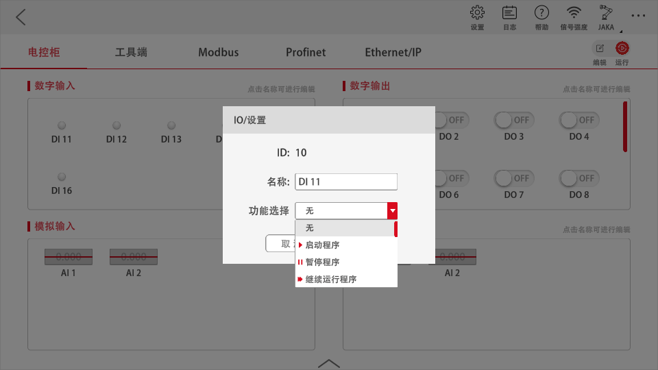
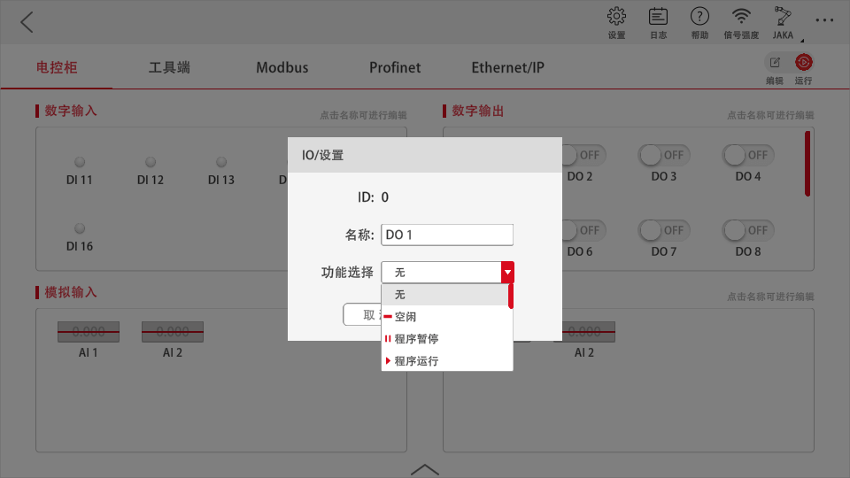

# 功能IO

## 功能IO介绍

在I/O界面中可以对DI进行功能设置，在功能选择框下拉选择该DI所想设置的功能，点击“确认”，当该DI信号被触发时，则启动该功能。目前DI信号支持功能有：启动程序、暂停程序、继续运行程序、停止程序、打开电源、关闭电源、机器人上使能、机器人下使能、一级缩减模式、二级缩减模式、防护停止、回初始位置、清除故障、进入拖拽和退出拖拽功能。功能触发条件，如下表所示：

| **功能名称** | **触发方式** |
| ------------------ | ------------------ |
| 启动程序           | 上升沿信号         |
| 暂停程序           | 上升沿信号         |
| 继续运行程序       | 上升沿信号         |
| 停止程序           | 上升沿信号         |
| 打开电源           | 上升沿信号         |
| 关闭电源           | 上升沿信号         |
| 机器人上使能       | 上升沿信号         |
| 机器人下使能       | 上升沿信号         |
| 一级缩减模式       | 低电平信号         |
| 二级缩减模式       | 低电平信号         |
| 防护停止           | 低电平信号         |
| 回初始位置         | 上升沿信号         |
| 清除故障           | 上升沿信号         |
| 进入拖拽           | 上升沿信号         |
| 退出拖拽           | 上升沿信号         |

注：

清除故障只清除碰撞报警，其他异常报警无法清除。

二级缩减倍率应小于一级缩减倍率，在【设置】→【安全设置】→【防护系统】中进行设置缩减倍率。

NPN为输入24V OFF，PNP为输入24V ON。

在I/O界面中可以对DO进行功能设置，在功能选择框下拉设置DO所绑定的系统预定义的状态量，点击确认后，该DO信号将实时反映所绑定的系统状态量的状态。目前DO信号支持绑定的状态有：空闲、程序暂停、程序运行、错误、已上电、已使能、运动中、静止、已开机、系统急停按钮状态、机器人缩减状态、系统保护性停止状态、安全位置等。

不同状态下的信号状态如下表：

| **机器人状态** | **信号状态** |
| -------------------- | ------------------ |
| 空闲                 | 高电平信号         |
| 程序暂停             | 高电平信号         |
| 程序运行             | 高电平信号         |
| 错误                 | 高电平信号         |
| 已上电               | 高电平信号         |
| 已使能               | 高电平信号         |
| 运动中               | 高电平信号         |
| 静止                 | 高电平信号         |
| 已开机               | 高电平信号         |
| 系统急停按钮状态     | 高电平信号         |
| 机器人缩减状态       | 高电平信号         |
| 系统保护性停止状态   | 高电平信号         |
| 安全位置             | 高电平信号         |

注：

空闲状态为机器人未运行程序状态，与机器人本体状态无关。

错误状态为机器人触发碰撞报警状态。

运动中状态为机器人处于运动（运行程序运动，手动控制，二次开发控制运动等等）状态便会触发，与程序状态无关。

静止状态为机器人处于静止（程序暂停，未运行程序，程序结束，等待信号等等）状态，与程序状态无关。

已开机状态为控制柜处于上电开机状态，与机器人本体状态无关。

机器人缩减状态为机器人是否触发二级缩减模式状态。

安全位置状态DO为用户在安全设置中姿态设置自定义配置的位置，当机器人处于此位置时，会触发此信号。  

功能DI示意图  

功能DO示意图  

