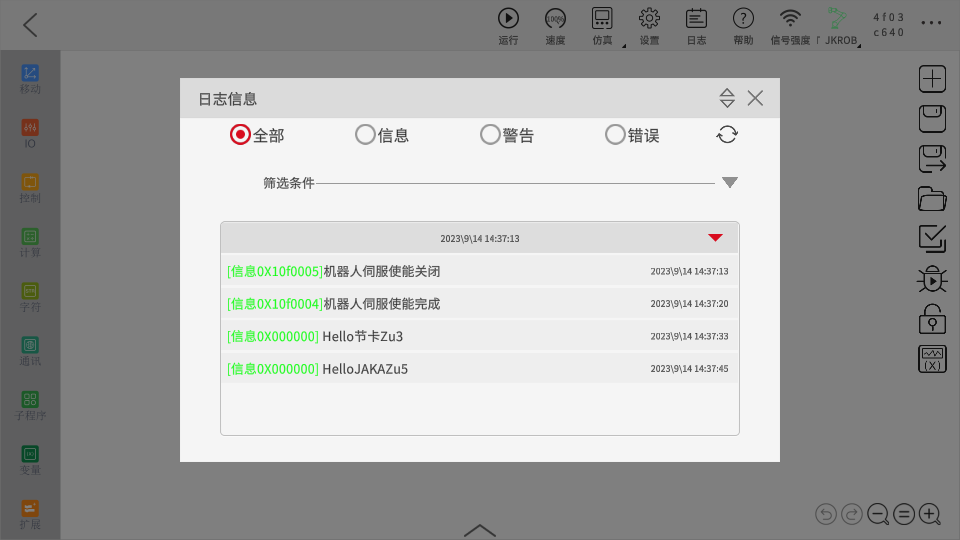
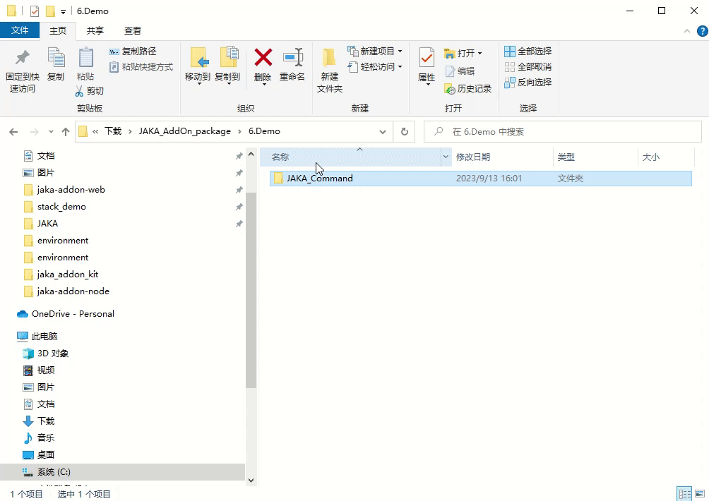
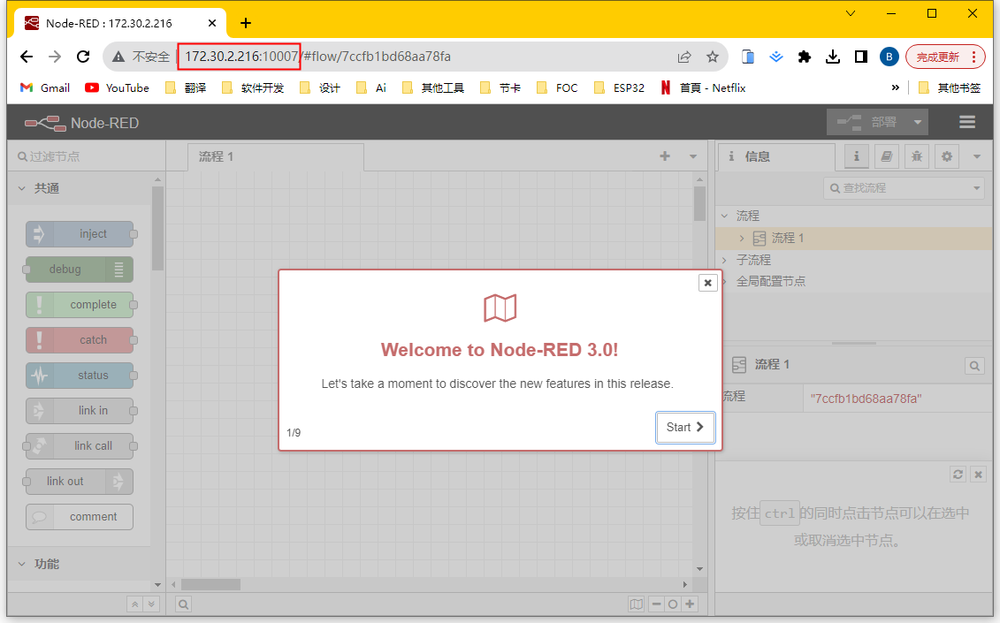
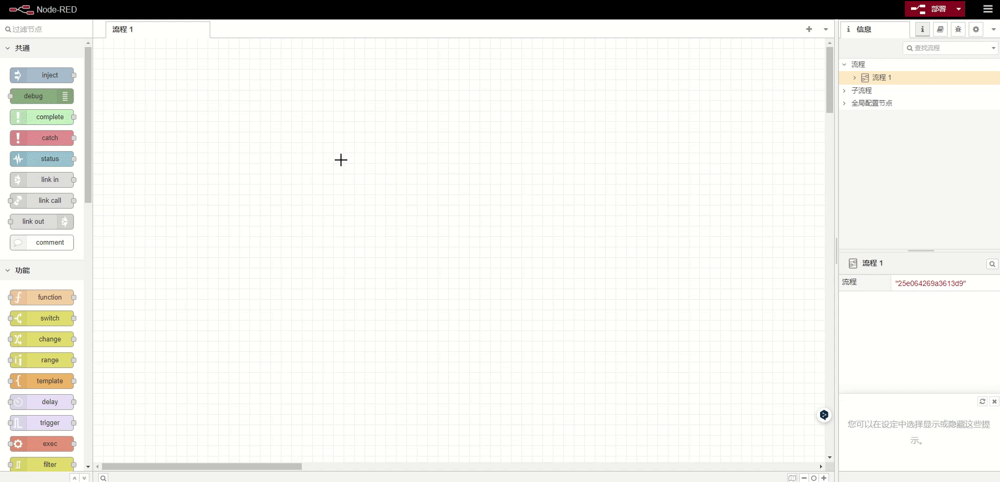
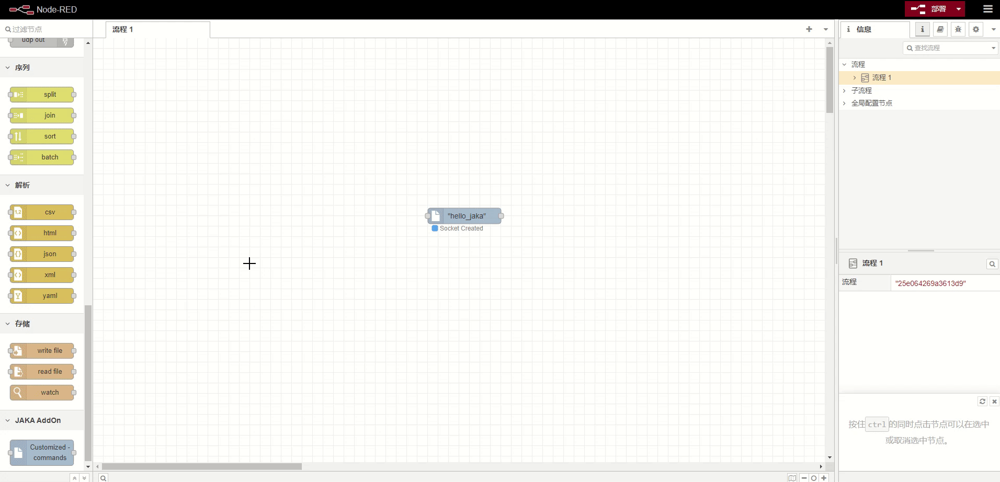
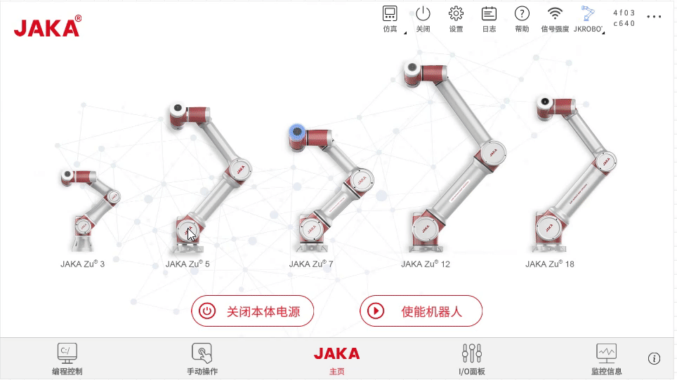

# カスタムコマンドの基礎
**JAKA_Commandの作成を通じて、カスタムコマンド型のAddOnの開発プロセスと基本を学びます。**

## 概要
&emsp;&emsp;このチュートリアルでは、指令ブロックの内容に基づいて、異なる内容をAppログに出力するカスタムコマンド型のAddOnを作成します。

<div align="center"></div>

## JAKA_Commandの作成
### ステップ1: AddOnパッケージの作成  
&emsp;&emsp;まず、.ini形式の設定ファイルとデータを保存するJSONファイルを含む基本的なAddOnファイルを作成する必要があります。手動で作成するか、AddOn開発パッケージリポジトリの["*Template*"](https://github.com/JakaCobot/jaka_addon_kit)ディレクトリからAddOnのテンプレートを変更できます。
::: tip ディレクトリ構造
|——JAKA_Command  
&emsp;&emsp;&emsp;|——AddOn.json   
&emsp;&emsp;&emsp;|——JAKA_Command_config.ini  
:::

* **AddOn.json**   
&emsp;&emsp;JSONファイルの内容は空でかまいません。後続のステップでデータが自動的に書き込まれます。
* **JAKA_Command_config.ini**   
&emsp;&emsp;[設定ファイル](/ja/guide/addOn/iniConfig.html)の内容は以下の通りです:
    ``` ini
    [AddOnInfo]
    convention = 3.0
    name = JAKA_Command
    description = "ログに情報を出力する"
    version = 1.0
    type = 1
    portal = 10006
    url = http://localhost/myAddOnUi
    languagetype = node-red
    service = AddOn.json
    serviceenabled = 1
    ```

### ステップ2: パッケージ化とアップロード
&emsp;&emsp;次に、AddOnをパッケージ化し、コマンドブロックの開発のためにコントローラにアップロードします。パッケージの形式は`.tar.gz`である必要があります。Windowsでは、7zなどのツールを使用して二次的な圧縮を行うことができます。    
<div align="center"></div>
&emsp;&emsp;App内の添付マネージャーページでAddOnをアップロードします。    
<div align="center"></div>

### ステップ3: カスタムコマンドの開発

&emsp;&emsp;AddOnを実行し、実行中のポートを確認します。

<div align="center"></div>

&emsp;&emsp;`IP:Port`で開発者インターフェースにアクセスします。

<div align="center"></div>

&emsp;&emsp;`Customized Commands`ノードを使用してカスタムコマンドブロックを作成します。*基本構成*ページでコマンドブロックの外観とプロパティを定義し、*スクリプト生成*ページでコマンドブロックの動作を定義します。   
- スクリプトの構文については、[JAKAプログラミングスクリプト](/ja/guide/jks.html)を参照してください。
- `Customized Commands`ノードの使用方法については、[カスタムコマンドの作成ノード](/ja/guide/addOn/Commands_Tool.html)を参照してください。

<div align="center"></div>

 
&emsp;&emsp;Appでカスタムコマンドを保存する際は、httpのGETリクエストを使用してスクリプトを取得するため、`http in`および`http response`ノードを使用してフローを完了する必要があります。

<div align="center"></div>

:::tip 注意！
`http in`ノードのURLは、カスタムコマンドブロックの名前と一致している必要があります！
:::

### ステップ4: 実行
&emsp;&emsp;Node-REDでフローをデプロイした後、Appでカスタムコマンドブロックを使用できます。

<div align="center"></div>


## デバッグ方法

