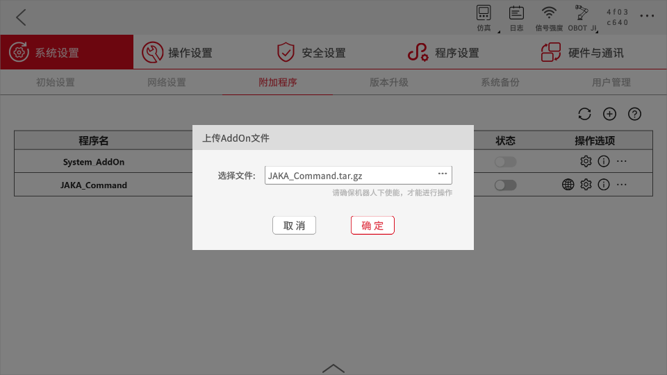

# カスタムコマンドの基礎
**JAKA_Commandの作成を通じて、カスタムコマンド型のAddOnの開発プロセスと基本を学びます。**

## 概要
&emsp;&emsp;このチュートリアルでは、指令ブロックの内容に基づいて、異なる内容をAppログに出力するカスタムコマンド型のAddOnを作成します。

<div align="center"></div>

## JAKA_Commandの作成
### ステップ1: AddOnパッケージの作成  
&emsp;&emsp;まず、.ini形式の設定ファイルとデータを保存するJSONファイルを含む基本的なAddOnファイルを作成する必要があります。手動で作成するか、AddOn開発パッケージリポジトリの["*Template*"](https://github.com/JakaCobot/jaka_addon_kit)ディレクトリからAddOnのテンプレートを変更できます。
::: tip ディレクトリ構造
|——JAKA_Command  
&emsp;&emsp;&emsp;|——AddOn.json   
&emsp;&emsp;&emsp;|——JAKA_Command_config.ini  
:::

* **AddOn.json**   
&emsp;&emsp;JSONファイルの内容は空でかまいません。後続のステップでデータが自動的に書き込まれます。
* **JAKA_Command_config.ini**   
&emsp;&emsp;[設定ファイル](/ja/guide/addOn/iniConfig.html)の内容は以下の通りです:
    ``` ini
    [AddOnInfo]
    convention = 3.0
    name = JAKA_Command
    description = "ログに情報を出力する"
    version = 1.0
    type = 1
    portal = 10006
    url = http://localhost/myAddOnUi
    languagetype = node-red
    service = AddOn.json
    serviceenabled = 1
    ```

### ステップ2: パッケージ化とアップロード
&emsp;&emsp;次に、AddOnをパッケージ化し、コマンドブロックの開発のためにコントローラにアップロードします。パッケージの形式は`.tar.gz`である必要があります。Windowsでは、7zなどのツールを使用して二次的な圧縮を行うことができます。    
<div align="center"></div>
&emsp;&emsp;App内の添付マネージャーページでAddOnをアップロードします。    
<div align="center"></div>

### ステップ3: カスタムコマンドの開発

1. **AddOnを実行し、ポートを確認**
   <div align="center"></div>

2. **開発者インターフェースにアクセス**
   `IP:Port`を使用して開発者インターフェースにアクセスします。
   
   <div align="center"></div>

3. **Customized Commandsノードをデプロイ**
   左のツールバーで`Customized Commands`ノードを見つけ、キャンバスにドラッグして、デプロイをクリックします。

4. **コマンドブロック生成ツールを開く**
   `Customized Commands`ノードをダブルクリックして、コマンドブロック生成ツールページを開きます。
    <div align="center">
    <video width="1000" controls autoplay >
    <source src="../../../../resource/ch/AddOn/JAKA_Command/open_coustomer_node.mp4" type="video/mp4">
    </video>
    </div>

5. **コマンドブロックの名前と色を変更**
   コマンドブロックの名前を*hello_jaka*に変更し、色を緑に設定します。

6. **デフォルトの属性を使用**
   *基本設定*ページでは、コマンドブロックのスタイルと属性を定義します。変更せずにデフォルトの属性を使用します。

7. **デフォルトのスクリプトを使用**
   *スクリプト生成*ページでコマンドブロックの動作を定義します。変更せずにデフォルトのスクリプトを使用します。
   <div align="center"></div>

   - JAKAスクリプトの構文については、[JAKAプログラミングスクリプト](/guide/jks.html)を参照してください。
   - `Customized Commands`ノードの詳しい使用方法については、[カスタムコマンド作成ノード](/guide/addOn/Commands_Tool.html)を参照してください。

8. **HTTPプロセスを完了**
   Appでカスタムコマンドを保存するとき、スクリプトはHTTP GETリクエストを介して取得されます。そのため、`http in`および`http response`ノードを使用してプロセスを完了します。

<div align="center"></div>

:::tip 注意！
`http in`ノードのURLは、カスタムコマンドブロックの名前と一致している必要があります！
:::

### ステップ4: 実行
&emsp;&emsp;Node-REDでフローをデプロイした後、Appでカスタムコマンドブロックを使用できます。

<div align="center"></div>


## デバッグ方法

